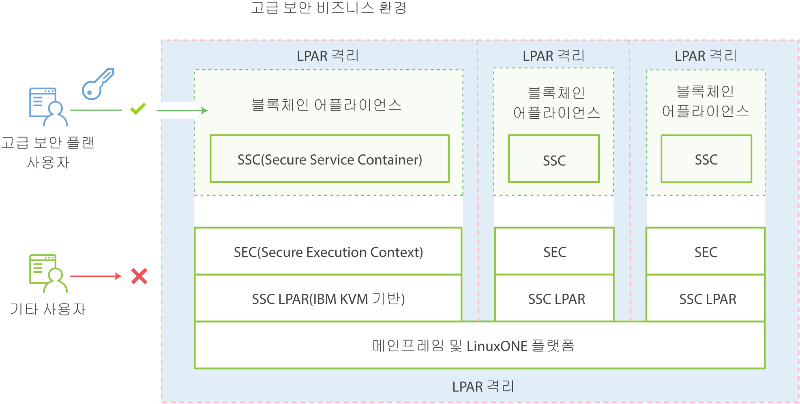

---

copyright:
  years: 2017
lastupdated: "2017-03-15"
---

{:new_window: target="_blank"}
{:shortdesc: .shortdesc}
{:codeblock: .codeblock}
{:screen: .screen}
{:pre: .pre}

# IBM Secure Service Container
{: #etn_ssc}

**HSBN vNext Beta** 플랜 및 HSBN 플랜은 블록체인 서비스 호스팅에 대한 기본 인프라를 제공하는 IBM Secure Service Container에
어플라이언스로서 배치됩니다. 어플라이언스는 운영 체제, Docker 컨테이너, 미들웨어 및 자체 작동하는 소프트웨어 컴포넌트를 결합하며, 최적화된 보안의 코어 서비스 및 인프라를 제공합니다.
{:shortdesc}

다음 아키텍처 다이어그램은 IBM Secure Service Container 및 블록체인 어플라이언스를 구성하는 방법을 보여줍니다.

*그림 1. IBM Secure Service Container 및 블록체인 어플라이언스의 개요*

IBM Secure Service Container는 민감하고 통제된 데이터를 처리할 수 있도록 블록체인 서비스에 z Systems LinuxONE 플랫폼의 고급 암호화, 보안 및 신뢰성을 제공합니다. 블록체인은 IBM Secure Service Container의 일련의 기능을 통해 보호됩니다(캡슐화된 운영 체제, 암호화된 어플라이언스 디스크, 변조 방지, 보호된 메모리 및 EAL5+ 인증과 일치하도록 구성 가능한 강력한 LPAR 격리). 

## 핵심 보안 기능
IBM Secure Service Container는 블록체인 서비스에 대해 다음의 최적화된 보안 기능을 제공합니다.  

### 시스템 관리자로부터 보호
>플랫폼 또는 시스템 관리자조차도 어플라이언스 코드에 액세스할 수 없습니다. 데이터 액세스가 어플라이언스에 의해 제어되므로, 인가되지 않은 액세스는 사용되지 않습니다. 이는 운용 중이며 휴지 중인 모든 데이터의 서명 및 암호화 조합을 통해 지원됩니다. 메모리에 대한 모든 액세스도 제거됩니다. 펌웨어는 보안 부트 아키텍처로 이를 지원합니다.

>블록체인을 IBM Secure Service Container에서 보호하는 경우, 시스템 관리자의 제한사항은 다음과 같습니다.
>* 노드에 액세스할 수 없음
>* 블록체인 네트워크를 볼 수 없음

### 변조 방지  
>IBM Secure Service Container는 LPAR 메모리 액세스를 제공하는 모든 외부 인터페이스를 사용하지 않도록 설정합니다. 이미지 부트 로더는 다르게 변조되거나 교환될 수 없도록 보장하기 위해 서명됩니다.

### 암호화된 어플라이언스 디스크
>디스크에 저장된 모든 코드와 데이터는 항상 Linux 암호화 계층을 사용하여 암호화됩니다.   
- 캡슐화된 운영 체제
- 보안 IP
- 임베디드 모니터링 및 자체 복구  
