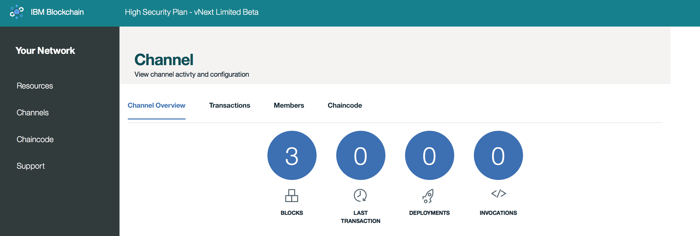
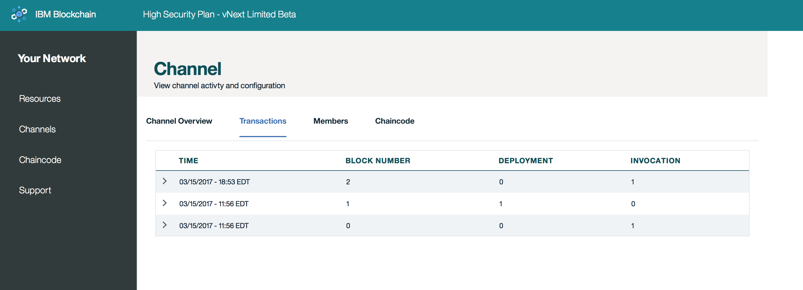

---

copyright:
  years: 2017

---

{:new_window: target="_blank"}
{:shortdesc: .shortdesc}
{:codeblock: .codeblock}
{:screen: .screen}
{:pre: .pre}

# Canais
{: #v10_dashboard}
Última atualização: 16 de março de 2017
{: .last-updated}

Os canais são um mecanismo muito poderoso para particionamento e isolamento de dados e eles fornecem a base principal
para privacidade de dados. Cada rede deve ter pelo menos um canal para que as transações ocorram.  
{:shortdesc}

É possível separar sua rede em canais, em que cada canal representa um subconjunto de membros que estão
autorizados a ver os dados para os chaincodes instanciados nesse canal; se você não estiver em um canal, não
poderá ver os dados. Cada canal possui um livro razão exclusivo, e os usuários devem ser autenticados adequadamente para executar operações de leitura/gravação nesses dados. Além disso, listas de controle de acesso podem ser implementadas para restringir determinados membros e usuários (por exemplo, Membro A restringido para somente leitura).

Imagine que você está em uma rede com seis membros. Você pode ter um canal do tipo consórcio no qual todos os seis membros transacionam e mantêm um livro razão para um ativo comum. Essas transações e o estado dos ativos envolvidos estariam disponíveis para todos os membros. No entanto, para determinadas transações bilaterais ou multilaterais que requerem a privacidade da rede em geral,
é possível criar canais separados e, assim, ocultar esses dados.  

Também há métodos para a interação entre canais no caso de cenários de negócios mais complexos. Um aplicativo
pode ser codificado para consultar os valores de uma chave ou chave composta no Canal A e, em seguida, usar os valores retornados
para fatorar uma transação no canal B. Consulte a [documentação do Hyperledger Fabric](http://hyperledger-fabric.readthedocs.io/en/latest/arch-deep-dive.html) para obter informações adicionais sobre canais, políticas e transações entre canais.

A **Figura 2** mostra a tela do painel inicial exibindo uma visão geral de todos os canais para seu Bluemix Org:

*Figura 2. Canais*

Nessa tela é possível criar um canal ou selecionar um canal específico para visualizar detalhes mais precisos sobre o livro razão,
os chaincodes e a associação.  

A **Figura 3** mostra a tela *Criar um Canal*:

*Figura 3. Criar Canal*

Escolha um nome refletivo do objetivo de negócios do canal e convide qualquer combinação de seus membros de rede selecionando
seu **Nome da Empresa** e, em seguida, clicando no botão **Incluir Membro**.  

A **Figura 4** mostra a visão geral de um canal específico. Ela exibe informações sobre o livro razão, tais como altura do bloco
e o histórico de transação:

*Figura 4. Visão Geral do Canal*

A **Figura 5** mostra o histórico de transação de um canal específico. Ela exibe os registros de data e hora para cada transação e
o ID do chaincode da transação correspondente:

*Figura 5. Transações do Canal*

A **Figura 6** mostra o registro de associação de um canal específico. Ela exibe Nomes de Empresa e o e-mail correspondente para
um administrador do sistema:

*Figura 6. Membros do Canal*

A **Figura 7** mostra o registro de chaincode de um canal específico. Ela exibe informações exclusivas para cada chaincode, como
o ID do chaincode, a versão, os argumentos de instanciação e os peers:  

*Figura 7. Chaincode do Canal*

O valor **PEERS** é simplesmente o número de peers no canal que têm o contêiner de chaincode em execução. Consulte a seção
**Chaincode** abaixo para obter informações adicionais sobre a instanciação.  
