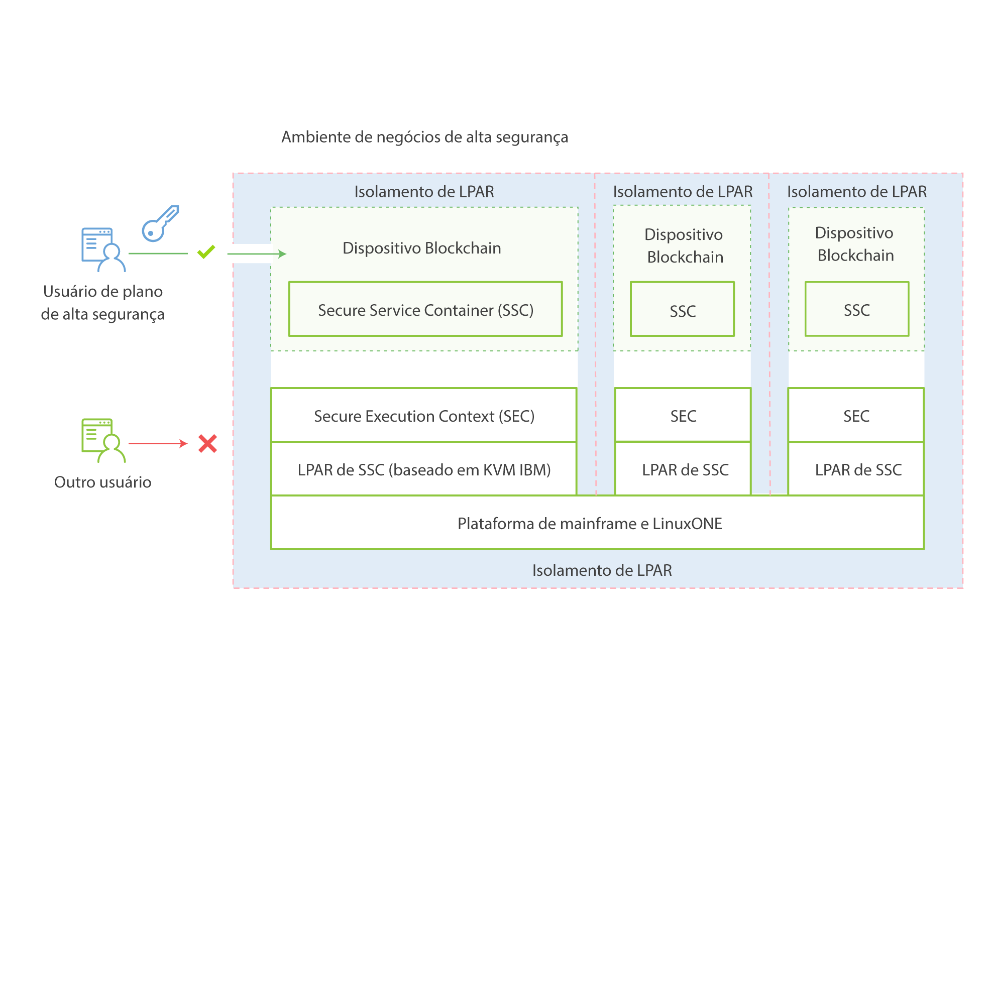

---

copyright:
  years: 2017
lastupdated: "2017-03-15"
---

{:new_window: target="_blank"}
{:shortdesc: .shortdesc}
{:codeblock: .codeblock}
{:screen: .screen}
{:pre: .pre}

# IBM Secure Service Container
{: #etn_ssc}

O plano **HSBN vNext Beta** e o plano HSBN são implementados como um dispositivo no IBM Secure Service Container, que fornece a infraestrutura base para hospedar serviços de blockchain. O dispositivo combina sistemas operacionais, contêineres do Docker, middleware e componentes de software que trabalham de forma
autônoma e fornece serviços principais e infraestrutura com segurança otimizada.
{:shortdesc}

O diagrama de arquitetura a seguir ilustra como o IBM Secure Service Container e os dispositivos de blockchain são organizados:

*Figura 1. Visão geral do IBM Secure Service Container e de dispositivos de blockchain*

O IBM Secure Service Container traz a criptografia avançada, a segurança e a confiabilidade da plataforma z Systems LinuxONE para serviços de blockchain para
manipular dados sensíveis e regulares. O Blockchain é protegido por uma série de recursos do IBM Secure Service Container: sistema operacional encapsulado, discos
de dispositivo criptografados, proteção contra violação, memória protegida e forte isolamento de LPAR que podem ser configurados para correspondência de certificação de EAL5+.

## Recursos de segurança de chave
O IBM Secure Service Container fornece as funções de segurança otimizada a seguir para serviços de blockchain:  

### Proteção a partir de Administradores de sistema
>O código do dispositivo não pode ser acessado até mesmo por Administradores de plataforma ou de sistema.  O acesso a dados é controlado pelo dispositivo; portanto, o acesso não autorizado é desativado.  Esta é
suportada por meio de uma combinação de assinar e criptografar todos os dados em andamento e inativos. Todo o acesso à memória também é removido. O firmware suporta isso com uma arquitetura de inicialização segura.

>Os administradores do sistema têm as limitações a seguir quando o blockchain está protegido pelo IBM Secure Service Container:
>* não é possível acessar nós
>* não é possível visualizar a rede de blockchain

### Proteção contra violação  
>O IBM Secure Service Container desativa todas as interfaces externas que fornecem acesso de memória de LPAR. Um carregador de inicialização de imagem é sinalizado para assegurar que ela não seja violada
ou trocada com uma diferente.

### Discos de dispositivo criptografados
>Todos os códigos e dados armazenados em disco são criptografados em todos os momentos usando a camada de criptografia do Linux:  
- Sistema operacional encapsulado
- IP protegido
- Monitoramento integrado e com capacidade de recuperação automática  
