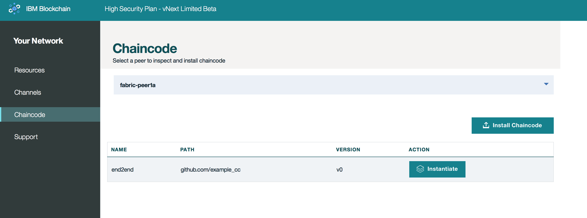

---

copyright:
  years: 2017

---

{:new_window: target="_blank"}
{:shortdesc: .shortdesc}
{:codeblock: .codeblock}
{:screen: .screen}
{:pre: .pre}

# 链代码
{: #v10_dashboard}
上次更新时间：2017 年 3 月 16 日
{: .last-updated}

链代码是一款软件（目前以 Go 或 Java 编写），其可封装用于创建和修改资产的业务逻辑和事务处理指示。
其在 Docker 容器中运行，该容器与需要与之交互的任何同级相关联。  
{:shortdesc}

链代码首先安装在同级文件系统上，然后在通道上进行实例化。实例化步骤包括初始化键值对和部署链代码容器。
想要与链代码交互的任何同级都必须在其文件系统上安装源代码且具有运行中的链代码容器。
但是，如果同级想要在多个通道上使用相同的链代码应用程序，那么它仅需要容器的单个实例即可。
  

**图 8** 显示链代码安装概述：

*图 8. 链代码安装概述*

* 使用下拉菜单并选择要将链代码安装到的同级。  
* 单击屏幕右侧的**安装链代码**按钮；这将打开新面板。

**图 9** 显示链代码安装窗口：

*图 9. 链代码安装窗口*

* 填写“链代码标识”和“链代码版本”的字段。认识命名方案，因为这些字符串将在客户端应用程序中使用，以与特定链代码交互。
* 单击浏览按钮并在本地文件系统中进行导航，以浏览至存储链代码源的位置。选择要安装在同级上的一个或多个文件。**注**：建议仅上传以 Go 或 Java 编写的链代码。  

在同级的文件系统上安装链代码后，还必须在通道上实例化该链代码。此实例化步骤会调用 `init` 函数以执行任何必要的链代码初始化。通常，这涉及设置组成链代码初始全局状态的键值对。

**图 10** 显示链代码实例化窗口： 

*图 10. 链代码实例化窗口*

请注意，键值对以字符串设置 - `["a","b","200","250"]` - 有窗口可供选择要在其上进行实例化的通道。此示例显示安装在 `fabric-peer1a` 上且在通道 `mychannel` 上实例化的链代码 `end2end`：

安装/实例化组合是一项强大的功能，因为它允许同级跨多个通道与相同的链代码容器进行交互。唯一的先决条件是要在同级的文件系统上安装实际的链代码源。因此，如果一部分常用链代码跨多个通道使用，那么同级仅需要单个链代码容器即可在所有通道分类帐上执行读/写操作。随着网络规模和链代码应用程序变得更为复杂，这种轻量型方法证明对计算性能和吞吐量大有益处。    
