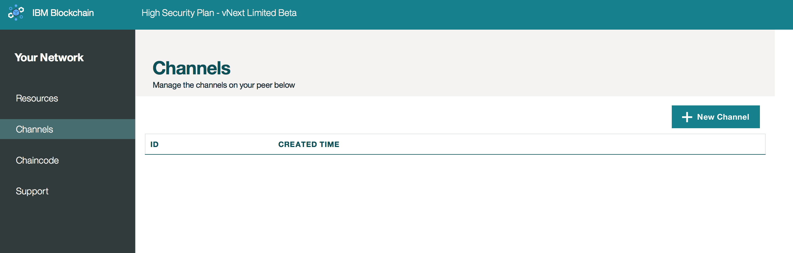

---

copyright:
  years: 2017

---

{:new_window: target="_blank"}
{:shortdesc: .shortdesc}
{:codeblock: .codeblock}
{:screen: .screen}
{:pre: .pre}

# 通道
{: #v10_dashboard}
上次更新时间：2017 年 3 月 16 日
{: .last-updated}

通道是用于分区和隔离数据的一种极其强大的机制，它们为数据隐私提供主要基础。
每个网络都必须至少有一个通道，以便进行事务处理。  
{:shortdesc}

您将网络分隔为通道，其中每个通道代表一小部分成员，这些成员有权查看该通道上已实例化的链代码数据；如果您不在该通道上，则看不到数据。
每个通道具有唯一的分类帐，用户必须经过正确的认证才能对此数据执行读/写操作。此外，可以实施访问控制表，以限制特定成员和用户（例如成员 A 限制为只读）。

想象一下您所在的网络有六个成员...  您可能有一个联盟类型的通道，其中所有六名成员都可处理和维护共同资产的分类帐。
这些事务处理和所涉及资产的状态对所有成员都可用。
但是，对于一般需要从网络获取隐私的特定双边或多边事务处理来说，您可以创建单独的通道，从而隐藏此数据。
  

如果是更为复杂的业务情况，还有用于通道到通道交互的方法。可以对应用程序进行编码，以查询通道 A 上的键或组合键的值，然后将返回的值作为相关因素，用在通道 B 上的事务处理中。有关通道、策略和跨通道事务处理的更多信息，请参阅 [Hyperledger Fabric 文档](http://hyperledger-fabric.readthedocs.io/en/latest/arch-deep-dive.html)。

**图 2** 显示初始仪表板屏幕，其中显示您 Bluemix 组织的所有通道的概述：

*图 2. 通道*

通过此屏幕，您可以创建通道，或者选择特定通道以查看有关分类帐、链代码和成员资格的更精确的详细信息。
  

**图 3** 显示*创建通道*屏幕：

*图 3. 创建通道*

选择代表通道业务目标的名称，并通过选择网络成员的**公司名称**然后单击**添加成员**按钮，来邀请网络成员的任何组合。  

**图 4** 显示特定通道概述。该图显示分类帐信息，如区块高度和事务处理历史记录：

*图 4. 通道概述*

**图 5** 显示特定通道的事务处理历史记录。该图显示每个事务处理的时间戳记和事务处理的相应链代码标识：

*图 5. 通道事务处理*

**图 6** 显示特定通道的成员资格注册表。该图显示系统管理员的公司名称和相应的电子邮件：

*图 6. 通道成员*

**图 7** 显示特定通道的链代码注册表。该图显示每个链代码的特有信息，如链代码标识、版本、实例化自变量和同级：
  

*图 7. 通道链代码*

**PEERS** 值就是通道上具有运行中链代码容器的同级数。有关实例化的更多信息，请参阅下面的**链代码**一节。  
