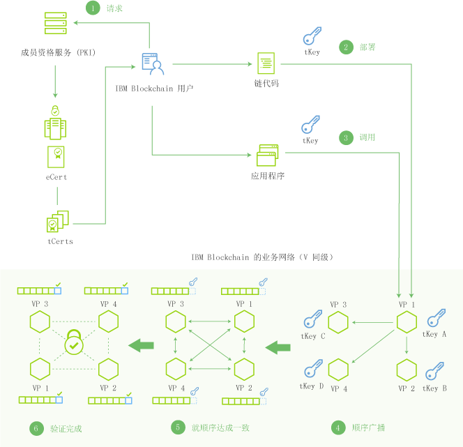

---

copyright:
  years: 2016, 2017
lastupdated: "2017-03-09"
---

{:new_window: target="_blank"}
{:shortdesc: .shortdesc}
{:codeblock: .codeblock}
{:screen: .screen}
{:pre: .pre}

# 网络格局
{: #etn_overview}

IBM Blockchain on Bluemix“入门模板开发者”套餐和“高安全性业务网络”套餐都采用的是 Hyperledger Fabric V0.6 提供的功能，并且包含实用拜占庭容错 (PBFT) 共识协议和 Hyperledger Fabric Client (HFC) SDK for Node.js。这两个套餐都是由四个网络节点和一个认证中心组成的。认证中心管理“成员资格服务”，此服务通过发布数字证书来管理身份、网络许可权和机密交易。
{:shortdesc}

这两个套餐中提供了以下区块链功能：

* PBFT 共识协议管理写入共享分类帐的所有交易的顺序。尽管在四个节点构成的 PBFT 区块链网络中有一个拜占庭（故障）节点，但此网络仍能够达成共识。有关 PBFT 共识测试详细信息，请参阅[测试共识和可用性](etn_pbft.html)。
* HFC SDK for Node.js 支持客户机端 Node.js 应用程序与区块链网络进行交互。客户机端应用程序可以通过成员资格服务安全地登记用户，发出交易以及通过使用 tCert 以加密方式交换资产。有关成员资格服务和用户隐私的更多信息，请参阅 [HFC SDK for Node.js](etn_sdk.html) 部分和 Hyperledger Fabric [协议规范](https://github.com/hyperledger/fabric/blob/v0.6/docs/protocol-spec.md)。
* 您可以通过 [Bluemix 监视仪表板](ibmblockchainmonitor.html)来访问有关区块链网络环境的详细信息。  

 
## 术语

使用以下术语以及后续的图，基于 Hyperledger Fabric V0.6，可了解 IBM Blockchain 网络中的组件背景信息：

**成员**：用于参与区块链网络的身份。有不同类的成员，包括用户、同级、验证者和审计员。

**成员资格服务**：与获取和管理成员身份相关的服务。成员资格服务由认证中心进行管理。  

**注册**：将新成员身份添加到网络的行为。成员可以由具有“registrar”特权的用户动态添加到网络。还会为成员分配角色和属性，以控制成员在网络上的访问权和权限。角色和属性都不能动态分配；您必须改为编辑 membersrvc.yaml 文件。

**登记****：通过允许新成员访问区块链网络来完成注册过程。登记可以由新成员从 registrar 获取密钥后执行（频带外），也可以由具有委派的权限能代表新成员行事的中间人来执行。  

**交易员**：通过节点连接到区块链网络的网络参与者，可使用 SDK 或 API 从客户机提交交易。

**交易**：交易员发出的要在区块链网络上执行某个功能的请求。交易类型为部署、调用和查询，这通过在 Fabric 的 API 合同中规定的链代码功能来实现。

**分类帐**：以加密方式链接的区块序列，其中包含交易和当前全局状态。除了来自先前交易的数据外，分类帐还包含当前运行的链代码应用程序的数据。

**全局状态**：交易执行链代码时，链代码用于存储其状态的键/值数据库。

**链代码**：嵌入式逻辑，用于对特定类型网络交易的规则进行编码。开发者可编写链代码应用程序并将其部署到网络。然后，最终用户通过与网络同级（即节点）进行交互的客户机端应用程序来调用链代码。链代码可运行网络交易，如果通过验证，那么交易会附加到共享分类帐并修改全局状态。

**验证同级**：一种网络节点，用于运行网络的共识协议，以验证交易和维护分类帐。已验证的交易会以区块形式附加到分类帐。如果某个交易未达成共识，那么会从区块中将其清除，而不会写入分类帐。验证同级 (VP) 有权部署、调用和查询链代码。

**非验证同级**：一种用作代理的网络节点，用于将交易员连接到验证同级。非验证同级 (NVP) 会将调用请求转发至其连接的验证同级 (VP)。此外，NVP 还会托管事件流服务器和 REST 服务。

**共识**：一种协议，用于维护区块链网络交易（部署和调用）的顺序。验证节点通过实现共识协议来联合工作以核准交易。共识可确保一组定额的节点就共享分类帐上的交易顺序达成一致。通过解决此顺序的任何差异，共识可确保所有节点都在完全相同的区块链分类帐上运行。请参阅[共识](etn_pbft.html)主题，以获取更多信息和测试用例。  

**经许可的网络**：一种区块链网络，其中每个节点需要在网络上保持一个成员身份，并且每个节点仅有权访问其许可权允许的交易。  

 
## 网络体系结构

图 1 及其后续描述说明了 IBM Blockchain 网络体系结构，以及成员服务、交易、共识和附加到分类帐的数据流：

 图 1.

以下步骤详细描述了图 1 中的网络流：

1. 已注册用户通过 PKI（成员资格服务）在网络上登记，并收到一张长期登记证书 (eCert) 和一批交易证书 (tCert)。
2. 用户将链代码部署到网络。链代码（智能合同）对业务逻辑或规则进行编码，以管理特定类型的交易。每个交易（部署、调用或查询）都需要唯一的 tCert，并且必须使用用户的专用密钥进行签名。用户从分配的 tCert 派生其专用密钥。
3. 用户调用智能合同，这将触发合同自行执行其编码的逻辑。
4. 交易提交到网络同级。同级收到交易请求后，会立即将请求提交给网络的主同级（图 1 中的 VP1）。主同级将对交易区块排序，并将此顺序广播到其伙伴同级。
5. 同级使用网络共识协议 (PBFT) 就所提交的交易的顺序达成一致。这种集体对交易进行排序的过程称为共识。  
6. 一旦同级已经达成共识，就会执行交易请求，并且区块会附加到共享分类帐。  

<!---Both the developer and high-security networks unlock several features in the Hyperledger fabric which robustly enhance security, confidentiality and privacy.  The only fundamental difference between the two is their operating/hosting environment.  The developer network runs in a shared multi-tenant environment on Softlayer, whereas the high-security network exists as an isolated single-tenant running in a secure services container.  Each network leverages the same capabilities from the fabric, including a PBFT consensus protocol and the enhanced Node.js SDK.~~

~~The High-Security business network runs in an isolated and highly secured environment, distinguishing it from other cloud-hosted offerings. The operating system, fabric, and nodes all exist in a secure services container (SSC), providing your enterprise with the security and impregnability that customers have come to expect from system Z technology.  The SSC delivers performance optimization in - peer to peer communication, availability, scalability, hardware encryption, tamper-proof crypto keys, and securely encrypted VMs.  See the [Secure Services Container](etn_ssc.html) section for more details on the security features provided through the SSC.  Additionally, the high security network unlocks numerous features of the Hyperledger fabric (unavailable in the developer service), which robustly enhance security, confidentiality and privacy.  The configuration is such that you are able to test and affirm these features.~~  
{:shortdesc}

~~The high security plan augments the developer plan by delivering several enhancements that help meet the security requirements and concerns of an enterprise-level participant:~~--->

<!---The environment (LinuxONE on z) consists of a four-peer network implementing PBFT with Membership Services enabled, running in an application container.  The application container protects blockchain software, chaincode, and data running within the system. The blockchain software within the secure boot can be signed, attested, and encrypted; and once installed in the application container, is tamper-resistant.  Root users of the platform and system administrators cannot access or see z secure container contents.  In addition, the LinuxOne on z provides you with FIPS compliance, high Evaluation Assurance Level protection, a highly auditable operating environment, and crypto optimization--->
