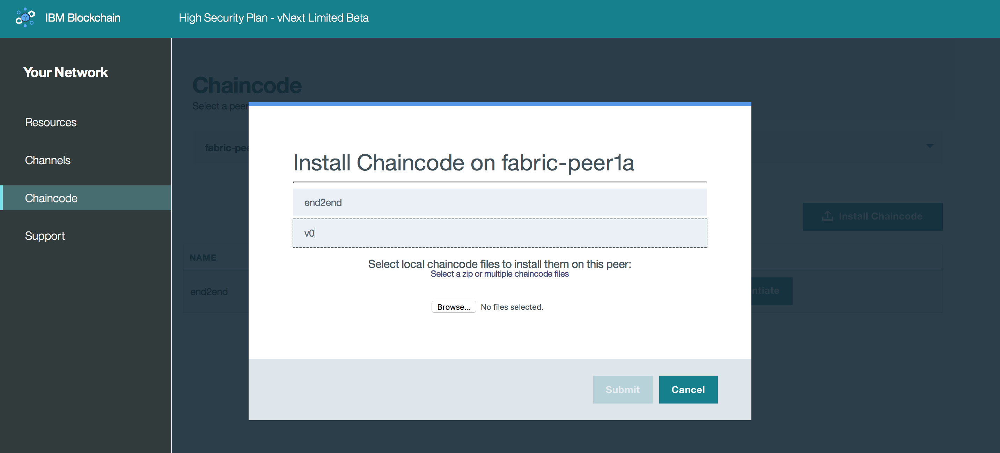

---

copyright:
  years: 2017

---

{:new_window: target="_blank"}
{:shortdesc: .shortdesc}
{:codeblock: .codeblock}
{:screen: .screen}
{:pre: .pre}

# 鏈碼
{: #v10_dashboard}
前次更新：2017 年 3 月 16 日
{: .last-updated}

鏈碼是軟體（目前以 Go 或 Java 撰寫），可封裝用於建立及修改資產的商業邏輯及交易式指示。它會在與任何需要與其互動的對等節點相關聯的 Docker 容器中執行。  
{:shortdesc}

鏈碼會先安裝在對等節點的檔案系統上，然後在通道上進行實例化。實例化步驟包含起始設定鍵值組以及部署鏈碼容器。任何想要與鏈碼互動的對等節點都必須將原始碼安裝在其檔案系統及執行中鏈碼容器上。不過，如果對等節點想要在多個通道上使用相同的鏈碼應用程式，則只需要容器的單一實例。  

**圖 8** 顯示鏈碼安裝概觀：

*圖 8. 鏈碼安裝概觀*

* 使用下拉功能表，然後選取要安裝鏈碼的對等節點。  
* 按一下畫面右側的**安裝鏈碼**按鈕；這會開啟新的畫面。

**圖 9** 顯示鏈碼安裝視窗：

*圖 9. 鏈碼安裝視窗*

* 填寫 ChaincodeID 及「鏈碼版本」的欄位。因為這些字串將會用於用戶端應用程式以與特定鏈碼互動，所以請記住命名方法。
* 按一下「瀏覽」按鈕，並導覽至儲存鏈碼來源的本端檔案系統。請選取要安裝在對等節點上的一個以上檔案。**附註**：建議只上傳使用 Go 或 Java 所撰寫的鏈碼。  

在對等節點的檔案系統上安裝鏈碼之後，接著必須在通道上將其實例化。此實例化步驟會呼叫 `init` 函數，以對鏈碼執行任何必要的起始設定。這通常會包括設定包含鏈碼起始廣域狀態的鍵值組。

**圖 10** 顯示鏈碼實例化視窗： 

*圖 10. 鏈碼實例化視窗*

請注意，鍵值組是使用 `["a","b","200","250"]` 字串所設定，而且有視窗可選取要在其上實例化的通道。此範例所顯示鏈碼的名稱為 `end2end`、安裝在 `fabric-peer1a`，並在名為 `mychannel` 的通道上進行實例化：

安裝/實例化組合是一項強大的功能，因為它容許對等節點跨多個通道與相同的鏈碼容器互動。唯一的必要條件是要在對等節點的檔案系統上安裝實際鏈碼原始檔。因此，如果共用鏈碼的一部分將用於數個通道，則對等節點只需要單一鏈碼容器，就可以對所有通道分類帳執行讀寫。這個輕量型方式證明有利於運算效能及傳輸量，因為網路規模及鏈碼應用程式變得更加詳細闡述。    
