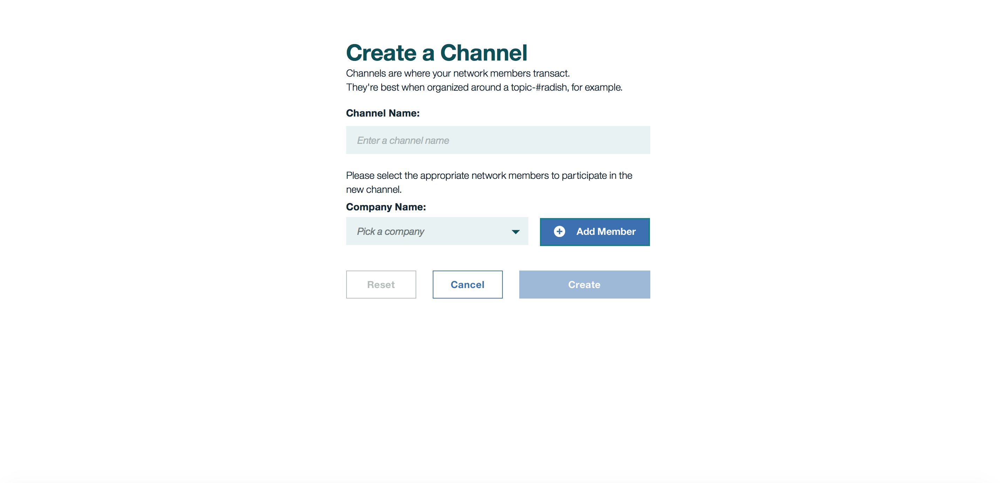

---

copyright:
  years: 2017

---

{:new_window: target="_blank"}
{:shortdesc: .shortdesc}
{:codeblock: .codeblock}
{:screen: .screen}
{:pre: .pre}

# 通道
{: #v10_dashboard}
前次更新：2017 年 3 月 16 日
{: .last-updated}

通道是可分割及隔離資料的功能特別強大的機制，並且提供資料隱私權的主要基礎。每個網路都必須至少要有一個通道，才能進行交易。  
{:shortdesc}

您可以將網路隔離為數個通道，而每一個通道都代表獲授權查看該通道上所實例化的鏈碼資料的一小組成員；如果您不在通道上，則看不到資料。每一個通道都會有唯一的分類帳，而且使用者必須經過適當地鑑別，才能對此資料執行讀寫作業。此外，還可以實作存取控制清單來限制特定成員及使用者（例如，限制「成員 A」只能進行讀取）。

假設您所在的網路有六個成員。您可能會有聯盟類型的通道，其中六個成員都會交易並維護共用資產的分類帳。所有成員都可以使用這些交易及所含資產的狀態。不過，針對大型網路中需要隱私權的特定雙方或多方交易，您可以建立不同的通道，進而隱藏此資料。  

在更複雜的商業情境中，也會有進行通道間互動的方法。應用程式可以進行編碼來查詢「通道 A」上金鑰或複合金鑰的值，然後將所傳回的值作為因素計入「通道 B」上的交易。如需通道、原則及跨通道交易的相關資訊，請參閱 [Hyperledger Fabric 文件](http://hyperledger-fabric.readthedocs.io/en/latest/arch-deep-dive.html)。

**圖 2** 顯示起始儀表板畫面，其中顯示 Bluemix 組織的所有通道的概觀：

*圖 2. 通道*

從此畫面中，您可以建立通道，或選取特定通道來檢視分類帳、鏈碼及成員資格的更精確詳細資料。  

**圖 3** 顯示*建立通道*畫面：

*圖 3. 建立通道*

選擇可反映通道商業目標的名稱，並邀請任何網路成員組合，方法是選取其**公司名稱**，然後按一下**新增成員**按鈕。  

**圖 4** 顯示特定通道的概觀。它會顯示分類帳資訊（例如區塊高度及交易歷程）：

*圖 4. 通道概觀*

**圖 5** 顯示特定通道的交易歷程。它會顯示每一個交易的時間戳記以及交易的對應鏈碼 ID：

*圖 5. 通道交易*

**圖 6** 顯示特定通道的成員資格登錄。它會顯示「公司名稱」以及系統管理者的對應電子郵件：

*圖 6. 通道成員*

**圖 7** 顯示特定通道的鏈碼登錄。它會顯示每一個鏈碼的唯一資訊（例如鏈碼 ID、版本、實例化引數及對等節點）：  

*圖 7. 通道鏈碼*

**PEERS** 值就是通道上執行鏈碼容器的對等節點數目。如需實例化的相關資訊，請參閱下面的**鏈碼**小節。  
