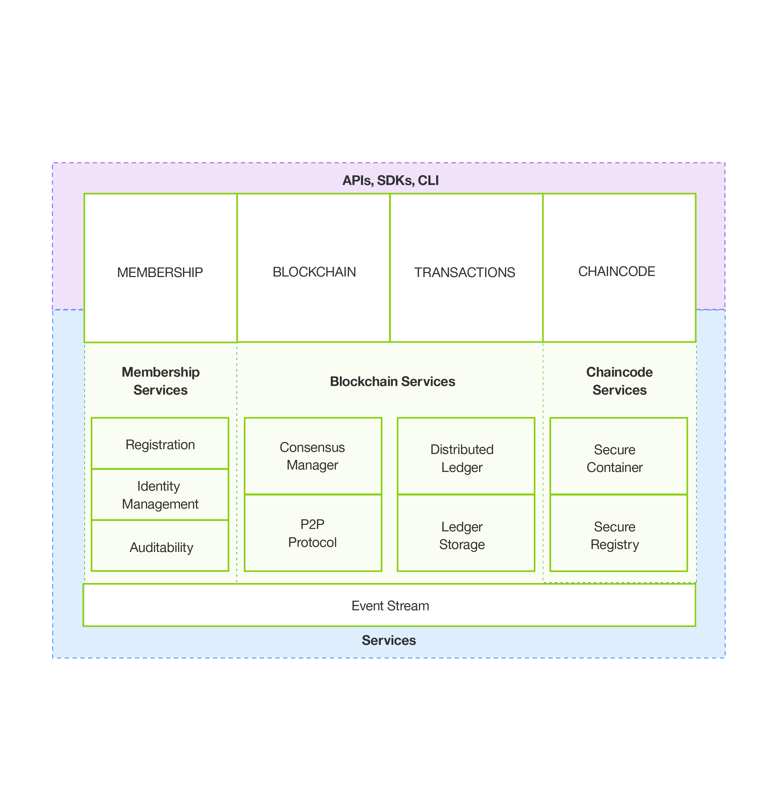

---

copyright:
  years: 2016

---

{:new_window: target="_blank"}
{:shortdesc: .shortdesc}
{:codeblock: .codeblock}
{:screen: .screen}
{:pre: .pre}

# 关于区块链
{: #ibmblockchain_overview}
上次更新时间：2016 年 11 月 3 日
{: .last-updated}

## 什么是区块链？
{: #what}

区块链是一项针对新一代交易性应用程序的技术，可在简化业务流程的同时建立信任、责任和透明度。区块链网络最早是由比特币引入的，但其实际使用范围已远远超出加密货币交换。通过区块链，IBM 将重新构想最基础的业务交换，并打开一扇通往数据交互新世界的大门。

区块链预计能大大降低跨企业业务流程的成本和复杂性。通过其分布式分类帐，能更轻松地创建经济高效的业务网络，在这些网络中可以跟踪和交换几乎任何有价值的信息，而无需中心控制点。区块链已经在各种业务应用程序中表现出广阔的发展前景。举例来说，通过区块链网络，证券交易在几分钟内就能进行结算，而不需要若干天。区块链还将帮助公司简化货物流和付款流程，并通过与 OEM 和监管人公开共享生产日志，使制造商能够减少产品召回的次数。  
 

## 关键术语
{: #keyterms}
以下术语对于全面了解区块链概念非常有用：

**交易员**：通过节点连接到区块链网络的网络参与者，可使用 SDK 或 API 从客户机提交交易。

**交易**：交易员发出的要在区块链网络上执行某个功能的请求。交易类型为部署、调用和查询，这通过在 Fabric 的 API 合同中规定的链代码功能来实现。

**分类帐**：以加密方式链接的区块序列，其中包含交易和当前全局状态。除了来自先前交易的数据外，分类帐还包含当前运行的链代码应用程序的数据。

**全局状态**：交易执行链代码时，链代码用于存储其状态的键/值数据库。

**链代码**：嵌入式逻辑，用于对特定类型网络交易的规则进行编码。开发者可编写链代码应用程序并将其部署到网络。然后，最终用户通过与网络同级（即节点）进行交互的客户机端应用程序来调用链代码。链代码可运行网络交易，如果通过验证，那么交易会附加到共享分类帐并修改全局状态。

**验证同级**：一种网络节点，用于运行网络的共识协议，以验证交易和维护分类帐。已验证的交易会以区块形式附加到分类帐。如果某个交易未达成共识，那么会从区块中将其清除，而不会写入分类帐。验证同级 (VP) 有权部署、调用和查询链代码。

**非验证同级**：一种用作代理的网络节点，用于将交易员连接到验证同级。非验证同级 (NVP) 会将调用请求转发至其连接的验证同级 (VP)。此外，NVP 还会托管事件流服务器和 REST 服务。

**共识**：一种协议，用于维护区块链网络交易（部署和调用）的顺序。验证节点通过实现共识协议来联合工作以核准交易。共识可确保一组定额的节点就共享分类帐上的交易顺序达成一致。通过解决此顺序的任何差异，共识可确保所有节点都在完全相同的区块链分类帐上运行。请参阅[共识](etn_pbft.html)主题，以获取更多信息和测试用例。  

**经许可的网络**：一种区块链网络，其中每个节点需要在网络上保持一个成员身份，并且每个节点仅有权访问其许可权允许的交易。  

## 关键概念
{: #keyconcepts}

**概述**：区块链是特定类型的网络，通过该网络，成员可跟踪和交换数字化资产。共享分类帐包含由所有网络交易构成的单个记录，并在所有网络成员上进行复制。链代码应用程序包含自行执行的合同以及通过 SDK 或 API 与网络进行交互的客户机端应用程序。

属于一个区块链网络的两个或更多交易方就管理交易的智能合同条款（例如，收到资产“a”时，资产“b”即到期）默认达成一致。一旦部署到区块链后，就可以调用合同中的函数（即，可以触发交易）。随后的调用由主导节点进行排序，并广播到验证同级以达成共识。验证后，交易会执行并以区块方式记录到分类帐。随后，分类帐会通过复制分发到所有网络节点。交易一旦附加到分类帐，就不能再更改或删除；撤销或更改已核准交易的结果的唯一方法是提交后续交易。

**网络**：区块链网络的特征如下所示：

- 一种分布式分散点对点网络，具有表示网络参与者（例如，银行、政府机构、制造商和证券公司）的节点。
- 一组同级，用于在交易落实到共享分类帐之前，先通过共识协议来验证这些交易。

**共享分类帐**：共享分类帐是区块链网络上的单个事实来源或已验证交易的整个历史记录。跨节点的共享分类帐中的任何差异都可通过共识进行解决。分类帐具有以下特性：
- 记录网络上的所有已验证交易。
- 在所有网络参与者中共享。
- 已复制，以便每个参与者都有自己的副本。
- 已许可，以便参与者只能查看自己的交易。

**示例**：图 1 描绘的是示例股票区块链网络和共享分类帐： *图 1. 共享分类帐示例*

图 1 显示的是股票市场中的典型网络参与者：资产管理人（银行）、前台、运营部、证券登记 (CSD) 和结算方（结算/CCP）：
1. 使用客户机应用程序，管理人可调用链代码来买卖大量证券。  
2. 交易可以通过任何网络节点进行触发，但始终会转发到主（主导）验证节点，由其对交易排序。主节点将排序后的交易按建议的顺序广播到所有验证同级，以达成共识或一致。
3. 如果交易顺序达成一致，那么这些交易会执行并附加到每个验证节点上的分类帐中。随后，分类帐会复制到所有网络节点。  

 
## 网络和应用程序体系结构
{: #architecture}

图 2 描绘的是经许可的区块链网络示例，此网络采用分布式分散点对点体系结构以及一个管理用户角色和许可权的认证中心：
*图 2. 经许可的区块链网络：数据流和网络访问权通过成员角色进行管理*

以下描述对应于图 2 中所示的体系结构和流程，不表示顺序过程：

**A：**区块链用户向经许可的区块链网络提交交易。交易可以是部署、调用或查询，并通过利用 SDK 的客户机端应用程序发出，或直接通过 REST API 发出。  

**B：**可信业务网络向监管人和审计人（例如，美国股票市场中的 SEC）提供访问权。  

**C：**区块链网络操作员管理成员许可权，例如将监管人 (B) 登记为“auditor”，将区块链用户 (A) 登记为“client”。auditor 可能会限制为只能查询交易，而 client 可能有权部署、调用和查询特定类型的链代码。

**D：**区块链开发者编写链代码（智能合同）以及用于调用智能合同的客户机端应用程序。区块链开发者可以通过 REST 接口将链代码直接部署到网络。要在链代码中包含传统数据源中的凭证，开发者可以使用频带外连接来访问数据 (G)。

**E：**区块链用户通过同级节点 (A) 连接到网络。继续处理任何交易之前，该节点会先从认证中心检索该用户的登记和交易证书。用户必须拥有这些数字证书，才能在经许可的网络上进行交易。

**F：**尝试驱动链代码的用户可能需要验证其在传统数据源 (G) 上的凭证。要确认用户的权限，链代码可以使用频带外连接通过传统处理平台来访问此数据。

图 3 显示的是 IBM Blockchain 核心组件。成员资格服务、区块链服务和链代码服务是逻辑结构，而不是将组件物理分区成不同的流程、地址空间或虚拟机：
*图 3. Hyperledger Fabric 参考体系结构*

**成员资格服务**：成员资格服务通过认证中心同级在经许可的区块链网络上管理用户身份。成员资格服务通过组合公共密钥基础架构 (PKI) 和分散化（共识）这两个元素，提供了多种不同的角色。相反，非经许可的网络不会提供特定于成员的权限或多种不同角色。

经许可的区块链需要实体注册长期身份凭证（登记证书），这可根据实体类型加以区分。对于用户，登记证书授权交易认证中心 (TCA) 发出匿名凭证；这些证书为用户提交的交易授权。交易证书在区块链上持久存储，并支持已授权审计员对原本不可链接的交易进行关联。

**区块链服务**：区块链服务使用基于 HTTP/2 构建的点对点协议来管理共享分类帐。数据结构进行了高度优化，以提供最高效的散列算法来维护共享分类帐的复制。PBFT 实现为共识协议。    

**链代码服务**：链代码服务提供了一种安全的轻量级方法，可在验证节点上通过沙箱执行链代码。该环境是“锁定”的安全容器，具有一组已签名基本映像，其中包含用于 Go、Java 和 Node.js 的安全操作系统和链代码语言、运行时以及 SDK 层。可以根据需要启用其他语言。

请参阅 Hyperledger Fabric 0.5 的[协议规范](https://github.com/hyperledger/fabric/blob/v0.6/docs/protocol-spec.md#fabric)，以了解有关 IBM 的区块链实现的更多信息。
