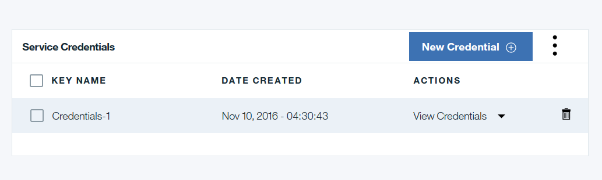

---

copyright:
years: 2016

---

{:new_window: target="_blank"}
{:shortdesc: .shortdesc}
{:codeblock: .codeblock}
{:screen: .screen}
{:pre: .pre}

# 您需要了解的内容
{: #etn_overview}
上次更新时间：2016 年 11 月 10 日
{: .last-updated}

**注意：**使用 IBM Blockchain on Bluemix 套餐（“入门模板开发者”(Beta) 或“高安全性业务网络”(GA) 之前，必须查看以下信息：
  

## IBM 支持声明

IBM 一直以来都在创新方面颇具领导能力，在最新的 IBM Blockchain 产品中亦是如此。Blockchain 是一种快速处理技术，预计将影响从金融到物流的多个行业。IBM 客户和业务合作伙伴通过各种早期采用程序，已经在影响着未来区块链的方向。IBM Blockchain on Bluemix 就是这样一种程序。**就像任何新技术一样，IBM Blockchain on Bluemix 用户应该准备好进行快速而基本的更改**。  
{:shortdesc}

IBM Blockchain 背后的体系结构是 Linux Foundation 的 Hyperledger 项目。Hyperledger Fabric 是正在主动开发的开放式源代码项目，目前处于*孵化*状态。每一个开放式源代码社区贡献都会使得 Hyperledger Fabric 更加强健，但是会带来采用挑战。在*孵化*周期内，客户机可以使用 Hyperledger Fabric V0.6 进行网络测试和模拟，但是 **IBM 提醒不要直接在 Hyperledger Fabric V0.6（或更早版本）区块链网络上运行有价值的金融资产**。  
 

## 开放式源代码声明

IBM Blockchain on Bluemix（包括“入门模板开发者”套餐和“高安全性业务网络”套餐）使用 Linux Foundation 的 Hyperledger Fabric V0.6.1 开放式源代码。Hyperledger 项目成员（包括 IBM）将向 Fabric 提供代码，然后代码将由社区进行审查、核实和测试。
Hyperledger Fabric V0.6.1 目前处于*孵化*状态；有关*孵化*状态的详细信息，以及有关 Hyperledger 项目的整个生命周期的详细信息，请访问以下站点：https://github.com/hyperledger/hyperledger/wiki/Project-Lifecycle。
  

## 链代码支持声明

IBM Blockchain 不支持非确定性链代码，这会对任何区块链网络上的数据一致性和完整性产生风险。将新链代码部署到 IBM Blockchain on Bluemix 网络时，请查看有关[非确定性链代码](nondeterministic.html)的详细信息。

除了[非确定性链代码](nondeterministic.html)之外，IBM Blockchain 网络上不支持以下编码实践：

1. 使用具有迭代的相关联数组（顺序在 Go 中为随机的）。
2. 从 KVS 表中读取项目列表（不保证顺序）。
3. 编写线程不安全链代码（可能会并行调用查询和呼叫调用）。
4. 在链代码中将全局内存或高速缓存存储器替换为分类帐状态变量。
5. 从链代码中直接访问外部服务，如数据库。
6. 使用可能引入非确定性的库或全局变量（如使用“random”或“time”）。
7. 使用 GetRows 进行迭代。  

请参阅示例库以获取支持的链代码示例；目录中包含用 Go 和 Java 编写的样本。
  

## 迁移注意事项

为了使在 Hyperledger Fabric V0.5（开发者预览）上开发的代码可在 Bluemix 后端（基于 Hyperledger Fabric V0.6.1 构建）上正常运行，有多项编程更改需要实现。请参阅 Hyperledger Fabric 文档中的[迁移注意事项](http://hyperledger-fabric.readthedocs.io/en/v0.6/v0.6_migration/)部分，以获取有关新功能和代码更改的更多详细信息。  

## HSBN 已知问题

1. 使用利用 Hyperledger Fabric V0.6.1 的“高安全性业务网络”时，如果有大约 50 个以上的链代码部署，建议在开发阶段定期重置该网络。重置网络可除去已部署的链代码以及已收集的数据。对于已经被迭代开发阶段内进行的改进所取代的较旧链代码，可借机除去这些代码。如果您处于开发后阶段，那么应该监视链代码部署数，以便留出容量用于最重要的链代码。
2. 执行网络和同级的状态查询时，收到不定时发生的“503 服务不可用”和“502 网关错误”错误。
3. 在 vp1 的日志中，可能有“Server.Serve 未能完成安全握手”消息。这是非致命错误，与网络运行无关。
4. **服务凭证**可能无法自动填充；在这种情况下，请如下所示生成凭证：

 a) 在“服务仪表板”中，单击**服务凭证**选项卡：

  

 b) 在**服务凭证**选项卡中，单击**新建凭证**的按钮。

  

c) 这将显示标题为**添加新凭证**的新窗口；单击此窗口底部的**添加**按钮：

  

 d) 现在，屏幕应该看起来类似以下示例。单击**查看凭证**将显示包含 HSBN 实例的服务凭证的 JSON 有效内容。  

  

## 获取帮助

有关 IBM Blockchain on Bluemix 网络的支持和帮助，请参阅[获取帮助](ibmblockchain_support.html)。
