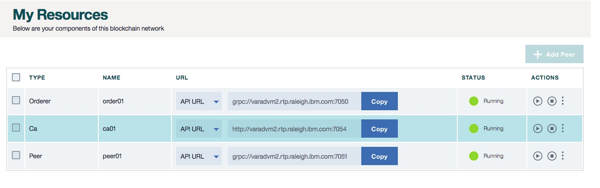

---

copyright:
  years: 2017
lastupdated: "2017-04-12"
---

{:new_window: target="_blank"}
{:shortdesc: .shortdesc}
{:codeblock: .codeblock}
{:screen: .screen}
{:pre: .pre}

# Monitor
{: #v10_dashboard}

The HSBN vNext Beta monitor provides an overview of your blockchain environment, including performance data, deployed chaincodes and network resources. Use the monitor to manage your network components.
{:shortdesc}

The monitor exposes four distinct screens:
* A "Resouces" screen containing data about Certificate Authority, peers and ordering nodes.
* A "Channels" screen for creating new channels and viewing ledger, chaincode and membership info for existing channels.
* A "Chaincode" screen for easy installation and instantiation of chaincodes across your network.
* A "Support" screen with links and suggestions for obtaining help and debugging problems.

## Resources
{: #dashboard_resources}

This screen contains important network details and real-time status information for your blockchain components.  These 
components include your peer, CA, and ordering node.  Each component has four distinct 
headers - **Name**, **URL**, **Status** and **Actions**. 
{:shortdesc}

**Figure 1** shows the initial dashboard screen displaying your network components:

*Figure 1. My Resources*

#### Name

The "Name" header displays the formal system-level name for your component.  We see that our components are 
named `order01`, `peer01` and `ca01`.  

#### URL

The "URL" header displays the API endpoint for each component.  These endpoints are required in order to 
target specific network components from a client-side application, and their definitions will typically 
live in a JSON-modeled configuration file that accompanies the app.  If you are customizing an application 
that requires endorsement from peers that are not part of your Org, then you will need to retrieve these 
IP addresses from the relevant admin(s) in an out-of-band operation.  Clients must be able to connect to 
any peers from which they need a response.

#### Status

The "Status" header displays the current network state of each component (e.g. Running or Stopped).

#### Actions

The "Actions" header provides buttons to start or stop your components.  It also contains a dropdown 
box that links out to your component logs.  The logs expose the remote procedure calls occurring 
between the various network components and prove useful for debugging and troubleshooting.  Experiment 
by stopping a peer and attempting to target it with a transaction; you will see gRPC connectivity errors.  Now restart the peer and attempt the transaction again; you will see a successful connection.  You can 
also leave a peer down for an extended period of time as your channel(s) continue to transact.  When the 
peer is brought back up you will notice a synchronization of the ledger through gossip protocol.  Once 
the peer has fully synchronized the ledger, you are able to perform normal invokes and queries.  

#### Service Credentials

At the top right of this screen you will notice a Service Credentials tab.  Click this tab to expose a 
JSON file containing the low-level networking information for each of your components 
(e.g. enrollID/enrollSecret for your CA).  This is the entirety of the configuration info that you will 
need for an application.  Note, however, that this file only contains your peer IP.  If you need to target 
additional peers then you will need to obtain these endpoints.   

## Channels
{: #dashboard_channels}

Channels are an incredibly powerful mechanism for partitioning and isolating data, and they provide the primary foundation 
for data privacy.  Every network must have at least one channel in order for transactions to take place.  
{:shortdesc}

You segregate your network into channels, where each channel represents a subset of members that are 
authorized to see the data for the chaincodes instantiated on that channel; if you're not on a channel, you can't see 
the data.  Each channel has a unique ledger, and users must be properly authenticated in order to perform read/write operations against this data.  Additionally, access control lists can be implemented to restrict certain members and users (e.g. Member A restricted to read-only).

Imagine you are on a network with six members...  You might have a consortium-type channel where all six members transact 
and maintain a ledger for a common asset.  These transactions and the state of the involved assets would be available to 
all members.  However, for certain bilateral or multilateral transactions that require privacy from the network at large, 
you can create separate channels and thereby conceal this data.  

There are also methods for channel to channel interaction in the case of more complex business scenarios.  An application 
can be coded to query for the value(s) of a key or composite key on Channel A and then use the returned values to factor 
into a transaction on Channel B.  See the [Hyperledger Fabric documentation](http://hyperledger-fabric.readthedocs.io/en/latest/arch-deep-dive.html) for more information on channels, policies and cross-channel transactions.

**Figure 2** shows the initial dashboard screen displaying an overview of all channels for your Bluemix Org:

*Figure 2. Channels*

From this screen you can create a channel, or select a specific channel to view more precise details about ledger, 
chaincodes and membership.  

**Figure 3** shows the *Create a Channel* screen:

*Figure 3. Create Channel*

Choose a name reflective of the channel's business objective and invite any combination of your network members by selecting 
their **Company Name** and then clicking the **Add Member** button.  

**Figure 4** shows a specific channel's overview.  It displays ledger information such as block height 
and transaction history:

*Figure 4. Channel Overview*

**Figure 5** shows a specific channel's transaction history.  It displays timestamps for each transaction and the 
transaction's corresponding chaincode ID:

*Figure 5. Channel Transactions*

**Figure 6** shows a specific channel's membership registry.  It displays Company Names and the corresponding email for 
a system administrator:

*Figure 6. Channel Members*

**Figure 7** shows a specific channel's chaincode registry.  It displays unique information for each chaincode, such 
as chaincode ID, version, instantiation arguments and peers:  

*Figure 7. Channel Chaincode*

The **PEERS** value is simply the number of peers on the channel who have the chaincode container running.  See the 
**Chaincode** section below for more information on instantiation.  

## Chaincode
{: #dashboard_chaincode}

Chaincode is software (currently written in Go or Java) that encapsulates the business logic and transactional instructions 
for creating and modifying assets.  It runs in a docker container associated with any peer that needs to interact with it.  
{:shortdesc}

Chaincode is first installed on a peer's filesystem and then instantiated on a channel.  The instantiation step involves 
the initialization of key value pairs and the deployment of the chaincode container.  Any peer wishing to interact with a 
chaincode must have the source code installed on its filesystem and a running chaincode container.  However, if a peer 
wishes to use the same chaincode application on multiple channels, it needs only a single instance of the container.  

**Figure 8** shows the chaincode installation overview:

*Figure 8. Chaincode Install Overview*

* Use the drop-down menu and select a peer to install chaincode onto.  
* Click the **Install Chaincode** button on the right side of your screen; this will open a new panel.

**Figure 9** shows the chaincode install window:

*Figure 9. Chaincode Install Window*

* Fill in the fields for ChaincodeID and Chaincode Version.  Be cognizant of naming schemes, as these strings will be used in client apps in order to interact with particular chaincodes.
* Click the browse button and navigate through your local filesystem to wherever your chaincode source is stored.  Select one or more files to install on your peer.  **Note**: It is recommended to only upload chaincode written in Go or Java.  

Once a chaincode has been installed on a peer's file system it must then be instantiated on a channel.  This instantiation step calls the `init` function to perform any necessary initialization of the chaincode.  Oftentimes this will involve setting the key value pairs that comprise a chaincode's initial world state.

**Figure 10** shows the chaincode instantiate window: 

*Figure 10. Chaincode Instantiate Window*

Note that the key value pairs are being set with the string - `["a","b","200","250"]` - and that there is a window to select the channel to instantiate on.  This example shows a chaincode named `end2end` installed on `fabric-peer1a` and instantiated on a channel named `mychannel`:

The install/instantiate combination is a powerful feature because it allows for a peer to interact with the same chaincode container across multiple channels.  The only prerequisite is for the actual chaincode source to be installed on the peer's file system.  As such, if a piece of common chaincode is being used across dozens of channels, a peer would need only a single chaincode container to perform read/writes on all the channel ledgers.  This lightweight approach proves beneficial to computational performance and throughput as networks scale and chaincode applications become more elaborate.    

## Support
{: #dashboard_support}

Use the links and resources on this page to access troubleshooting and support forums.  If you are unable to debug your 
issue or ascertain an answer to your question, please click the **Open a Bluemix support ticket** link, and you will be 
redirected to a screen that guides you through the process.  
{:shortdesc}

**Figure 11** shows the Support panel:

*Figure 11. Blockchain Support*
