---

copyright:

  years: 2016

---


# Getting started with {{site.data.keyword.cdn_short}} (BETA)

Content Delivery Networks (CDNs) use content caching servers local to consumers to reduce content load time. CDN enhances user experience and lowers bandwidth usage as well as processing on the content providing servers.

You can use the {{site.data.keyword.cdn_full}} (CDN) service with your Bluemix&reg; application or virtual server applications. The service supports only applications that use HTTP protocol. Applications that use HTTPS protocol are not supported at the moment. 

The IBM CDN service is available at IBM Bluemix > Catalog > Services > Network > IBM CDN.

**Note:**  
> Before you begin with configuring the IBM CDN service for a Bluemix application, you must have an application already deployed. If you need to create a Bluemix application, see: IBM Bluemix > Dashboard > CREATE APP.  

> You must add a custom domain name for your Bluemix application. For steps to add a custom domain name, see: [To add a custom domain name](index.html#customdomain)  

>The custom domain name must be externally visible. Example: www.myapp.com. Use the following command to verify the availability of the custom domain name:  

>```
>dig www.myapp.com
>```

### To add a custom domain name: 
{: #customdomain}

**Note:** You must add a custom domain name for your Bluemix applications. 

1. Select IBM Bluemix > Dashboard > Applications.
2. Select your application tile.
3. Select the **Edit routes and App Access** icon.  
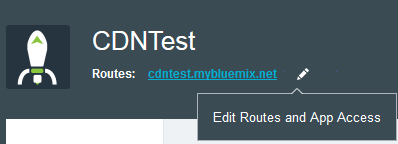
4. Select **Add Custom Domain**.  
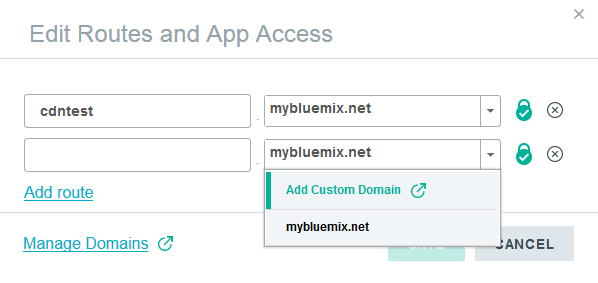  
The **Manage Organizations** page is displayed.
5. Select **DOMAINS** > **ADD DOMAIN**, enter the custom domain name, and select **SAVE**.  
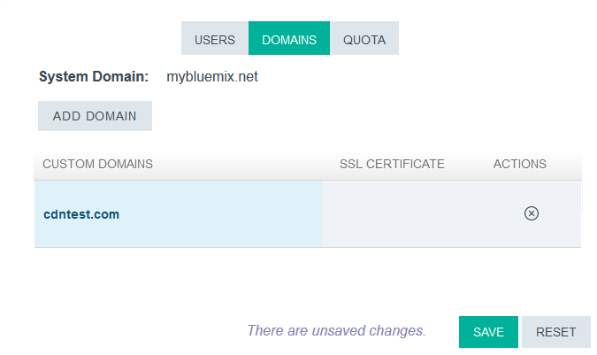  
6. Select Dashboard > Applications > Application tile > Edit Routes icon.  

7. Select the custom domain name from the drop-down, enter **www** in the host field, and select **SAVE**.  
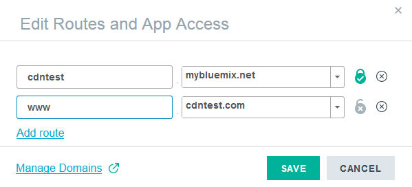  

You will now see the custom domain name along with your application route.  
  

### To create an IBM CDN service instance:
1. Open IBM Bluemix > Catalog > Services > Network. You will see the available network services.
2. Select **IBM CDN**. You will see the CDN service description, available plans, and pricing details. 
3. Select a suitable plan. 
4. Select options in the **Add Service** section:
	* **Space:**
	* **Service Name:**
5. Select **CREATE**. The service instance is created. You will see the **Monitoring and Maintenance** page.  
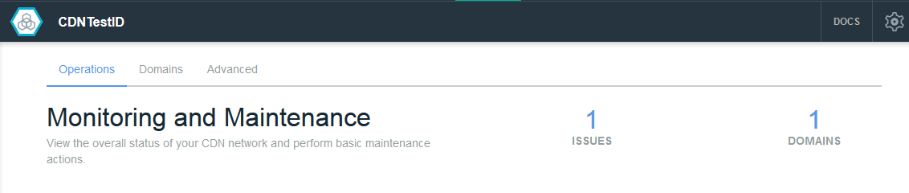  
	

**Note:** You can access the IBM CDN service configuration pages anytime by selecting IBM Bluemix > Dashboard > Services > Service instance tile.  

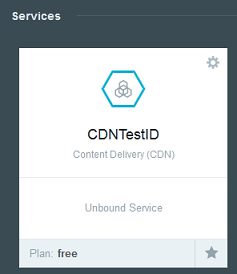  

### To add IBM CDN service to an application:
{: #add_cdn}

1. Select IBM Bluemix > Dashboard > Services > Service instance tile> **DOMAINS** tab. You will see the **Domain and URL Management** page.  
  
2. Select **ADD APP URL**.  
 
3. Enter your application URL. This URL is your externally visible domain name.  
4. Enter the origin route. This route is the Bluemix application route or IP address.  
**Note:** For a virtual server application, specify the origin server's IP address.  
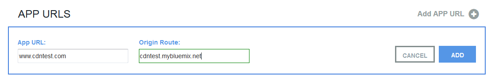
5. Select **ADD**. The CDN service is provisioned in the backend. A CNAME for your application is displayed.  
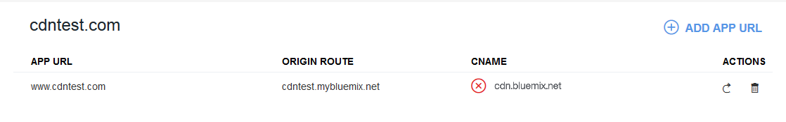
6. Replace the CNAME target for your domain in your DNS provider record with the CNAME displayed.  
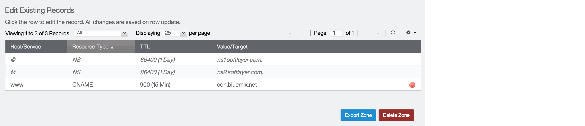

	**Important:** If you do not update the CNAME target in your DNS provider record, your application will not be accessible through the externally visible URL. The IBM CDN service will continue to report an error until the CNAME target is updated.

	**Note:** Keep a record of the original CNAME target. If you stop the IBM CDN service, you will need to modify the CNAME to the previous state where it was pointing to the Bluemix route of your application.

Requests to your domain will now be routed by using the IBM CDN infrastructure.

### To stop the IBM CDN service for an application:  

1. Select IBM Bluemix > Dashboard > Services > Service instance tile > **Domains** tab. You will see the list of your applications that use the CDN service.  
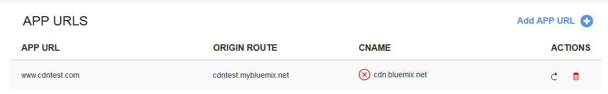
2. Select the trash icon to disable CDN service for the application. You will see a confirmation message.  
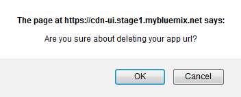
3. Select **OK**. The CDN service is stopped.
4. Replace the CNAME target for your domain in your DNS provider record with the original CNAME target.


###Purge Cache

Select IBM Bluemix > Dashboard > Services > Service instance tile > **Operations** tab to view the purge cache option.  
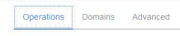

The purge cache configuration option is displayed only after you configure domains. See [To add IBM CDN service to an application](index.html#add_cdn) for steps to configure a domain.

Use the purge cache option to remove all or selected objects from the CDN cache. You will need to use this option every time you push a new version of your Bluemix application or change content of an existing application. You can purge your CDN cache in two ways:

* Purge all cached web objects in the domain: Select the domain from the **Domain** drop-down, select the **Purge entire cache** check-box, and select **PURGE**.  

* Purge specific objects under the domain:  
	1. Select the domain from the **Domain** drop-down.  
	2. Enter one or more (separated by a comma) list of object paths relative from the domain root in the **Full File Path:** text box. Example: /images/logo.jpg or /video/qa.mp4, audio/training.mp3.  
	3. Select **PURGE**.

**Note:** It can take up to 5 minutes for the purge to be propagated across all cache instances around the globe.

### Time-to-live

Select IBM Bluemix > Dashboard > Services > Service instance tile > **Advanced** tab to view the TTL configuration option.  
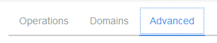  

Use the TTL option to configure a time limit of content expiry. On expiry, the cache will be populated again on the next request to serve the object from the application server.  

The default TTL value is 3600 seconds. To change the TTL value, select **Edit** in the **Cache TTL Defaults** section, enter the required TTL value (in seconds), and select **SAVE**. 

### IBM CDN Command Line Interface

You can create and delete the IBM CDN service by using the command line interface. 

Before you begin, install the Cloud Foundry CLI. See [Cloud Foundry command line interface](https://www.{DomainName}/docs/cli/downloads.html) for details.

* To create the IBM CDN service, use the following command:

	```
	cf create-service CDN free <name of instance>
	```

* To delete the IBM CDN service, use the following command:

	```
	cf delete-service <name of instance>
	```


