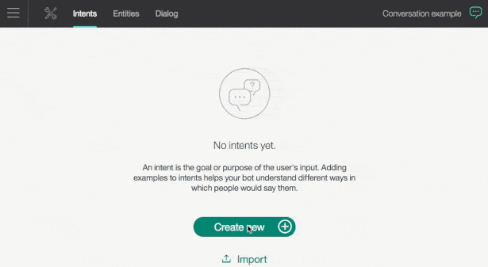
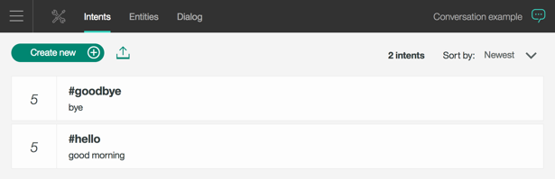
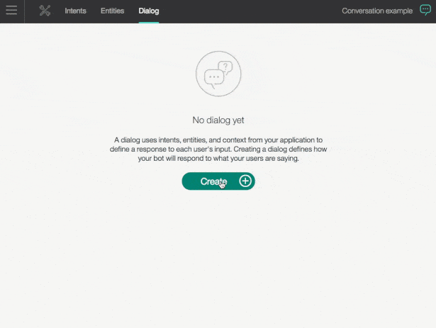
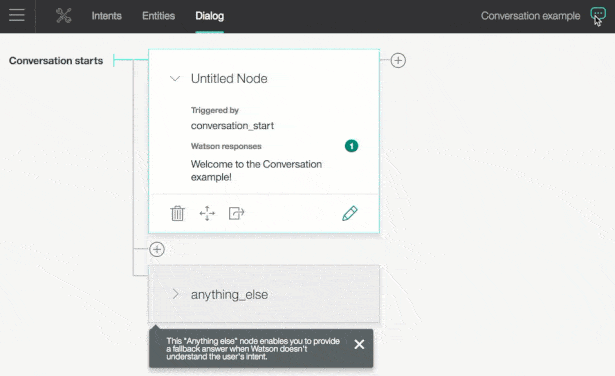
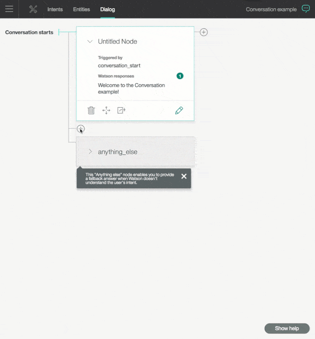
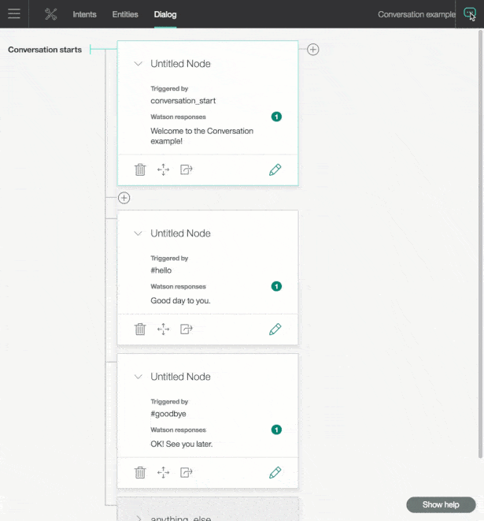

---

copyright:
  years: 2015, 2017
lastupdated: "2017-05-10"

---

{: shortdesc: .shortdesc}
{: new_window: target="_blank"}
{: tip: .tip}
{: pre: .pre}
{: codeblock: .codeblock}
{: screen: .screen}
{: javascript: .ph data-hd-programlang='javascript'}
{: java: .ph data-hd-programlang='java'}
{: python: .ph data-hd-programlang='python'}
{: swift: .ph data-hd-programlang='swift'}

# Getting started tutorial
{: #gettingstarted}

In this short tutorial, we introduce the {{site.data.keyword.conversationshort}} tool and go through the process of creating your first conversation.
{: shortdesc}

## Step 1: Log in, create the service instance, and launch the tool

1.  Go to the [{{site.data.keyword.conversationshort}} service](https://console.{DomainName}/catalog/services/conversation/) and either sign up for a free {{site.data.keyword.Bluemix_notm}} account or log in.
1.  After you log in, type `conversation-tutorial` in the **Service name** field of the {{site.data.keyword.conversationshort}} page, click **Create**, and then click **Launch tool**.

## Step 2: Create a workspace
{: #create-workspace}

Your first step in the {{site.data.keyword.conversationshort}} tool is to create a workspace.

A *workspace* is a container for the artifacts that define the conversation flow for an application.

1.  In the {{site.data.keyword.conversationshort}} tool, click **Create**.
1.  Give your workspace the name `Conversation example` and click **Create**. Youʼll land on the **Intents** tab of your new workspace.

## Step 3: Create intents
{: #create-intents}

An *intent* represents the purpose of a user's input. You can think of intents as the actions your users might want to perform with your application.

For this example, we're going to keep things simple and define only two intents: one for saying hello, and one for saying goodbye.

1.  Make sure you're on the Intents tab. (You should already be there, if you just created the workspace.)
1.  Click **Create new**.
1.  Name the intent `hello`.
1.  Type `hello` as a **User example** and press Enter.

    *Examples* tell the {{site.data.keyword.conversationshort}} service what kinds of user input you want to match the intent. The more examples that you provide, the more accurate the service can be at recognizing user intents.
1.  Add four more examples and click **Create** to finish creating the #hello intent:
    - `good morning`
    - `greetings`
    - `hi`
    - `howdy`

   
1.  Create another intent named #goodbye with these five examples:
    - `bye`
    - `farewell`
    - `goodbye`
    - `I'm done`
    - `see you later`

### Result

You created two intents, #hello and #goodbye, and provided example user input to train {{site.data.keyword.watson}} to recognize these intents in your users' input.

## Step 4: Build a dialog
{: #build-dialog}

A *dialog* defines the flow of your conversation in the form of a logic tree. Each node of the tree has a condition that triggers it, based on user input.

We'll create a simple dialog that handles our #hello and #goodbye intents, each with a single node.

### Adding a start node

1.  In the {{site.data.keyword.conversationshort}} tool, click the **Dialog** tab.
1.  Click **Create**. You'll see one node.
1.  Type `conversation_start` in the **Enter a condition** field of this node. Then, select the **conversation_start (create new condition)**.
1.  Add the response, `Welcome to the Conversation example!`. Click anywhere outside the dialog node to save your changes.

    

    The dialog editor also added a node with the condition `anything_else`, which handles user input that doesn't match any other nodes. Don't worry about this node for now.

### Result

You created a dialog node that is triggered by the condition `conversation-start`, which is a special condition that indicates that the user started a new conversation. Your node specifies that when a new conversation starts, the system should respond with the welcome message.

### Testing the start node

You can test your dialog at any time to verify the dialog. Let's test it now.

- Click the  icon to open the "Try it out" pane. You should see your welcome message.

    

### Adding nodes to handle intents

Now let's add nodes to handle our intents between the `conversation_start` node and the `anything_else` node.

1.  Click the **+** icon below the `conversation_start` node, which creates a node that is evaluated when `conversation_start` is false.
1.  Type `#hello` in the **Enter a condition** field of this node. Then, select the **#hello (create new condition)** option.
1.  Add the response, `Good day to you.`.
1.  Click the **+** icon below this new `#hello` node to create another node. This time, specify `#goodbye` as the condition, and `OK! See you later.` as the response.

    

### Testing intent recognition

You built a simple dialog to recognize and respond to both hello and goodbye inputs. Let's see how well it works.

1.  Click the  icon to open the "Try it out" pane. There's that reassuring welcome message.
1.  At the bottom of the pane, type `Hello` and press Enter. The output indicates that the #hello intent was recognized, and the appropriate response (`Good day to you.`) appears.
1.  Try the following input:
    - `goodbye`
    - `howdy`
    - `see ya`
    - `good morning`
    - `sayonara`

    

{{site.data.keyword.watson}} can recognize your intents even when your input doesn't exactly match the examples that you included. The dialog uses intents to identify the purpose of the user's input regardless of the precise wording that is used, and then responds in the way you specify.

### Result

That's it. You created a simple conversation with two intents and a dialog to recognize them.

## Step 5: Download the completed workspace
{: #download-workspace}

You can <a target="_blank" href="https://watson-developer-cloud.github.io/doc-tutorial-downloads/conversation/conversation-getting-started.json" download="conversation-getting-started.json">download</a> the finished example workspace. [Import the workspace ](https://www.ibm.com/watson/developercloud/doc/conversation/create-workspace.html#importing-exporting-and-copying-workspaces){: new_window} into the {{site.data.keyword.conversationshort}} tool to compare against what you created.

## Next steps
{: #next-steps}

This tutorial is built around a simple example. For a real application, you'll need to define some more interesting intents, some entities, and a more complex dialog.

- Try the advanced [tutorial ](https://www.ibm.com/watson/developercloud/doc/conversation/tutorial.html){: new_window} to add entities and clarify a user's purpose.
- See [Developing your application ](https://www.ibm.com/watson/developercloud/doc/conversation/develop-app.html){: new_window} to integrate this dialog into an application.
