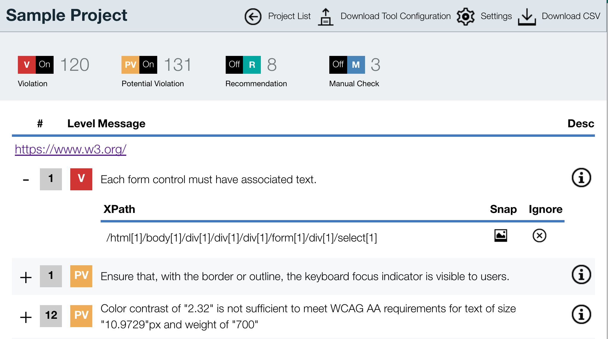

---

copyright:
  years: 2015, 2016
lastupdated: "2016-04-18"
---

{:shortdesc: .shortdesc}
{:new_window: target="_blank"}
{:codeblock: .codeblock}

# Getting started with Automated Accessibility Tester (Experimental)

IBM® Automated Accessibility Tester for Bluemix™ provides development teams
with the ability to add accessibility-compliance checking into their
automated deployment processes that leverage Selenium. The service also helps these
teams manage issues throughout the lifecycle of the application.

The Automated Accessibility Tester's SDK provides a wrapper to the Selenium SDK's 
RemoteWebDriver that allows you to perform accessibility compliance scans of any
browser state during your automated Selenium testing. The checking process is as follows:
* Your testing environment initializes the test process (can be JUnit or another testing framework)
* The test process specifies the desired browser capabilities using the Selenium SDK and
  passes these to the Automated Accessibility Tester SDK to complete initialization.
* The test process uses the created Selenium driver to exercise the web application.
* At any given state, the test process can call the Automated Accessibility Tester SDK to scan 
  the current UI displayed in the browser controlled by Selenium.
  * The SDK will send the results to the Automated Accessibility Tester service to be persisted
   in the database.
  * The service will correlate results against previously identified results for the same
    URL

The Automated Accessibility Tester currently provides two rule set options:
* Web Content Accessibility Guidelines v2.0 AA (WCAG 2.0 AA)
* IBM Accessibility Rule Set - Includes all of the rules of the WCAG 2.0 AA set
  and additional rules designed by IBM for new web standards such as ARIA and HTML5.

To add the Automated Accessibility Tester to your space and bind it to an application,
refer to [Adding a service to your application](https://new-console.ng.bluemix.net/docs/manageapps/mngapps.html).

### About Selenium

Selenium is a collection of tools for browser automation. There are two primary frameworks,
Selenium IDE and Selenium WebDriver. For this service, we focus on Selenium WebDriver.
Selenium WebDriver allows developers and testers to write code that identifies UI elements
using clearly specified identifiers for these elements: HTML id, CSS selector, link text, etc. 
Selenium then allows you to simulate a click or keypresses targeted on the selected element.
This method is meant to create robust, browser-based regression automation scale and 
distribute scripts across many environments.

Users of the Automated Accessibility Tester are responsible for investigating how Selenium
can meet their testing needs, and for writing any Selenium code/scripts that are needed to simulate 
their UI. The Automated Accessibility Tester can then add automated accessibility testing
to these processes.

### The Automated Accessibility Tester SDK for Selenium
The Java Automated Accessibility Tester's SDK for Selenium provides support for performing 
compliance checking from Java Selenium WebDriver test applications. When the test
code has driven the UI to a desired state of a dynamic web page, the SDK can perform
automated of accessibility testing of that state.

To install the Automated Accessibility Tester SDK:
- Download the Selenium WebDriver SDK and include it in your project
  - See the Java WebDriver Language Bindings at http://www.seleniumhq.org/download/ 
- Download the [aat.jar](https://ecs-dashboard.mybluemix.net/priv/dist/aat.jar) and include it
in your project
- Access the web console of the Automated Accessibility Tester and view the settings of your project, then
download the "Tool Configuration" and place it in your test framework's working directory.

### Using the Automated Accessibility Tester SDK for Selenium

Instantiate a WebDriver (e.g., using Chrome):
```
DesiredCapabilities capabilities = DesiredCapabilities.chrome();
ChromeOptions options = new ChromeOptions();
capabilities.setCapability(ChromeOptions.CAPABILITY, options);
ComplianceConfig config = new ComplianceConfig(new String[] { "IBM_DCP080115" });
// Hidden content will be hidden by default. If you want hidden content included in your reports:
// config.setFilterHidden(false);
driver = ComplianceDriverRemote.init(config, capabilities);
```

Call Selenium normally to get to the page that should be scanned:
```
driver.get("http://www.ibm.com");
``` 

The SDK provides three ways to scan an application state, which will send results to
the Automated Accessibility Tester service
* Scan only the main frame of the page:
``` 
ComplianceResults results = driver.getCompliance();
```
* Scan each frame individually:
```
// Scan each frame individually
long iNumFrames = driver.getNumFrames();
for (int i=0; i<iNumFrames; ++i) {
    ComplianceResults results = driver.getCompliance(i);
} ```
* Scan all frames:
```
ComplianceResults results = driver.getComplianceFrames();```
  
After the scanning is complete, you can view the results in the web console of your
Bluemix™ application. If you wish to trigger an event based on the results in your test code:
```
// Obtain a count of each violation level
Map<eLevel, Integer> counts = results.summarize();

//  Obtain information about a line item:
for (ComplianceResult result : results) {
    System.out.println(result.getViolationLevel()+": "+result.getComponent())
}
```

### Using the Automated Accessibility Tester web console

After binding the Digital Content Tester with your application, you will find the web
console in the Services section of your Application's Dashboard. 

#### Managing Projects

The initial screen of the web console displays a list of existing projects. Each scan session
must record results in the Accessibility Tester database against a project. Projects can be used to organize scanning of
separate components or releases.

To create a project, follow the "Add Project" link on the Projects page, and provide a Project Name. 

In the Project Settings, you can rename or delete the project. You can also find the 
Tool Configuration for use with the SDK.

#### Project Data
Once a project is created, you can start populating the project with results using the Automated
Accessibility Tester SDK (see above). 



When the project is populated with content, you will be able to see a list of identified issues.
Each issue is assigned a status of "Open", "Ignored", or "Closed".
If an issue has not been seen before, the Automated Accessibility Tester will assign a status
of "Open". If a test is run against the same page, and the issue is no longer seen on the page,
it will change the status to "Closed". Otherwise, the Automated Accessibility Tester will
try to preserve the previously set status.

### Using the Digital Content Checker REST service

To bind the service to your application and see how to access VCAP_SERVICES,
see [Adding a service to your application](https://new-console.ng.bluemix.net/docs/manageapps/mngapps.html).

VCAP_SERVICES will contain content similar to the following:

```
{
  "ecs-dashboard": [
    {
      "name": "Automated Accessibility Tester-ss",
      "label": "ecs-dashboard",
      "plan": "ecs-dashboard-free",
      "credentials": {
        "userid": "00000000-0000-0000-0000-000000000000",
        "password": "00000000-0000-0000-0000-000000000000",
        "url": "https://ecs-dashboard.mybluemix.net:443/api",
        "instanceId": "00000000-0000-0000-0000-000000000000"
      }
    }
  ]
}
```
Using these parameters, you can fetch project and scan data using one of the
interfaces documented in the [REST API](https://ecs-dashboard.mybluemix.net/docs/swagger_aat.html).


># Related Links {:class="linklist"}
>## SDK {:id="sdk"}
>* [aat.jar](https://ecs-dashboard.mybluemix.net/priv/dist/aat.jar)
>
># Related Links {:class="linklist"}
>## API Reference {:id="api"}
>* [API Documentation](https://ecs-dashboard.mybluemix.net/docs/swagger_aat.html) 
>
># Related Links {:class="linklist"}
>## Related Links {:id="general"}  
>* [Selenium](http://seleniumhq.org)
>* [IBM Accessibility Web Checklist](http://www-03.ibm.com/able/guidelines/web/accessweb.html)
>* [Web Content Accessibility Guidelines](http://www.w3.org/TR/WCAG20/)
>* [IBM Accessibility](http://www.ibm.com/able)
>
>{:elementKind="article" id="rellinks"}
