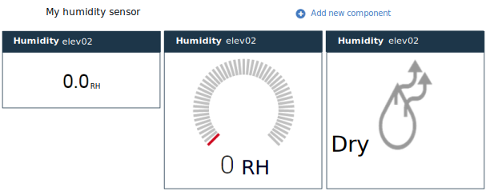

---

copyright:
  years: 2015,2016

---

{:shortdesc: .shortdesc}

# Managing dashboards and templates {: #managing-dashboards}

The real-time data from your IoT devices is displayed in customizable dashboards. You can manually create dashboards that display real-time metrics, show graphs, and display other information for one or more devices. Dashboards can also contain filtered lists of devices and links to other dashboards.
{: shortdesc}

In addition to manually created dashboards, {{site.data.keyword.iotrtinsights_short}} comes with a predefined device alerts dashboard at **Dashboards > Overview** and dynamically creates device dashboards based on the message schemas that you create.

## Dashboards {: #dashboards}

Administrators can create new dashboards and modify existing ones to display the device data of interest.  
To create a dashboard:
1.	Go to **Dashboards > Browse Dashboards**.
2.	Click **Add new dashboard**.
3.	Give the dashboard a name and select attributes, such as icon and background. Also select whether to make this dashboard editable to {{site.data.keyword.iotrtinsights_short}} operator users.
4.	Click .
5.	Click the new dashboard tile to open the empty dashboard.
6.	To add widgets to the dashboard:  
 1.	Click **Add new component** to add an initial dashboard widget.
 2.	Select a component to add, then select further component attributes, and, if needed, select display properties.  
 For example, to display the numerical value of a specific data point for a device, select `Device` and then select the device to add. In the dashboard editor, under Visualization, select a data point to display. Then position the newly added widget in the dashboard grid.
 3.	Click  to add the widget to the dashboard.
7.	The dashboard updates with the newly added widgets, and displays the real-time data that is defined by the selected data point.

**Tip:** To create a dashboard that lists all your devices, do the following:  
1. Go to **Dashboards > Browse Dashboards** and click **Add new dashboard**.
2. Give the dashboard a descriptive name, such as `All devices`, and click .
3. In the dashboards panel, click the dashboard and then click **Add new component**.
4. Select the **Container** component and select **Filtered devices** to create a list of all your devices.
5. Click .  

Your devices are listed in the new dashboard. Click a device icon to open the device dashboard and see the real-time data for the device.

### Dashboard widgets {: #dashboard-widgets}
The dashboards are made up from widgets that display real-time data from one or more devices. The behavior of the widget depends on its type, the data point that is displayed, and the way the data point is configured in the schema.  
For example, if you add a device widget for a 'raw' data point, the widget displays the raw data as a string only.

If, however, you configure the data point with a min and max value, you have the option to display a widget as a gauge.

You can also assign a Sensor type for the data point to enable a special type of visualization widget to better illustrate the type of sensor data that is displayed. For example, you can select the sensor type `Light on/off` to enable a `Plain light indicator (on/off)` visualization widget.

You also have the option to include several widgets for the same datapoint in the same dashboard to show both the raw numerical value and humidity side by side.     
*Three visualization options for the same data point.*

Widget | Type and visualization
------------- | -------------
Device | Data - Real-time value of data points for the device. If the data point is configured to include a minimum and maximum value, the visualization options include showing the datapoint as a gauge. Furthermore, if the datapoint is configured with a sensor type, additional visualization options are available.
Chart | Graph - Plot real-time values of data points for one or more devices.
Dashboard | Link to a dashboard or a template.
Text | Text box - Formatted text.
Container | Types of container widgets:<ul><li>All dashboards – A linked list of all dashboards.</li><li>Filtered devices – A list of all devices, or filtered by name or location.</li><li>Filtered devices with alerts – A list of all devices with alerts, or filtered by name or location.</li><li>Alerts for device – A list of alerts for a device that is selected in a Filtered devices with alerts container.</li></ul>
Special | Types of special widgets:<ul><li>Map – A map that locates the selected device.</li><li>Additional device information – More information about the selected device.</li></ul>

The following table summarizes the visualization options that are available to device widgets if the data point selected is configured with a sensor type attribute in the message schema.

Data point sensor type | Visualization options | Details | Supported data type
------------- | ------------- | -------------
No selection | Plain value | - | String/Integer/Float
Light on/off | Plain light indicator (on/off) | 0=off | Integer
Switch on/off | Plain switch indicator (on/off) | 0=off | Integer
Temperature sensor | Generic temperature gauge | N/A | Integer/Float
Temperature control | Generic temperature gauge | N/A | Integer/Float
Pressure sensor | Plain pressure gauge | N/A | Integer/Float
Battery levels | Plain battery widget (low/high) | 0=good | Integer
Brightness | Brightness indicator (dark/bright) | 0=dark | Integer
Window open/close | Plain window state (open/closed) | 0=closed | Integer
Door open/close | Plain door state (open/closed) | 0=closed | Integer
Humidity sensor | Humidity state (dry/wet) | 0=dry | Integer
Power consumption | Plain power gauge | N/A | Integer/Float
Energy meter | Plain value | N/A | Integer/Float
Percentage | Plain percentage (0-100) | N/A | Integer/Float
Voltage | Plain voltage gauge | N/A | Integer/Float
Current | Plain current gauge | N/A | Integer/Float
Longitude | Device location on Special > Map widget (Latitude widget also required) | **Important:** The data point used for the longitude value must be assigned the sensor type Longitude in the message schema. | Float
Latitude | Device location on Special > Map widget (Longitude widget also required) | **Important:** The data point used for the latitude value must be assigned the sensor type Latitude in the message schema. | Float  

## Default dashboard layouts
{{site.data.keyword.iotrtinsights_short}} comes with predefined dashboards: an alerts dashboard and device dashboards.

The following tables describe the widgets and layout of the predefined dashboards.
### Alerts Dashboard (Dashboards > Overview)
This dashboard is included with the product and provides a list of devices that have open alerts. You can select a device to see details about the alerts, and you can click the device icon to open a device dashboard to display the real-time data for the device.

<table>
<thead>
<tr>
<th colspan="3">Alerts Dashboard</th>
</tr>
</thead>
<tbody>
<tr>
<td>Container: Devices with alerts</td>
<td>Container: Alerts for device</td>
<td>Special: Additional device information</td>
</tr>
<tr>
<td></td>
<td></td>
<td>Special: Map</td>
</tr>
</tbody>
</table>

*Alerts Dashboard layout*

### Device dashboards
Clicking a device icon in a device list opens a device dashboard for the device. When a data point is added to the message schema, it is also added as a widget in the device template, which dynamically creates the device dashboard. Administrators can manually add or remove widgets.

<table>
<thead>
<tr>
<th colspan="3">Device dashboard</th>
</tr>
</thead>
<tbody>
<tr>
<td>Device: Datapoint 1</td>
<td>Device: Datapoint 2</td>
<td>Device: Datapoint 3</td>
</tr>
<tr>
<td>Device: Datapoint N</td>
<td></td>
<td></td>
</tr>
</tbody>
</table>

*Predefined device dashboard layout*

### Dashboard example: List of all devices
The following dashboard includes a list of all devices and provides device information when you select a device from the list.

<table>
<thead>
<tr>
<th colspan="3">List of all devices dashboard</th>
</tr>
</thead>
<tbody>
<tr>
<td>Container: Filtered devices (no filter parameters set)</td>
<td>Special: Additional device information</td>
<td></td>
</tr>
</tbody>
</table>

*List of all devices dashboard layout*

## Templates {: #templates}
Templates control the layout of the predefined dashboards for a specific device type. Administrators can modify these predefined templates to suit your needs. For example, a predefined template only includes the generic data points. You can add graphs and other components as needed.

For example, a user can access predefined device dashboard to see basic device data, and then follow a link to a manually created template that might contain a complete set of real-time graphs. You create a template much like you create a dashboard.  

To modify a predefined template:
1.	Go to **Dashboards > Manage Templates**.
2.	In the Manage Templates panel, find the template tile, and click ** > Change layout** to open the template for editing.  
3.	Add widgets to the template.
 1.	Click **Add new template component** to add an initial template widget.
 2.	Select a component to add, then select further component attributes, and, if needed, select display properties.  
 3.	Click  to add the widget to the template.
4.	Edit existing widgets.
 1.	Hover over a template widget, and click .
 2.	Modify the component and its attributes, and reposition the widget as needed.
 3.	Click  to update the widget.  

The template updates with your changes.

## Resetting predefined dashboards and templates {: #resetting-dashboards}
If you modify a predefined template, the template is no longer dynamically updated from message schema updates, and you need to reset the dashboard or template to restore the original layout and widgets.
To reset predefined dashboards and templates:
1.	Go to **Dashboards > Manage Templates** or to **Dashboards > Browse Dashboards**.
2.	Find the predefined template or dashboard tile and click ** > Reset layout** to delete and then recreate the template.  

The template or dashboard is recreated with the default widget set.
