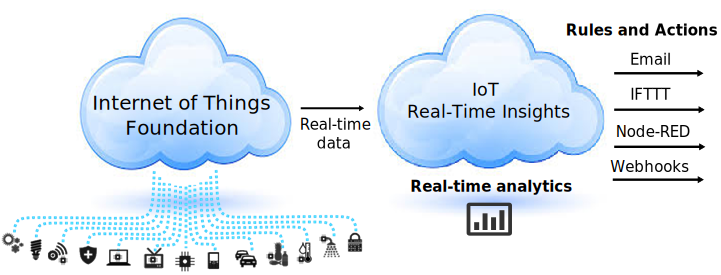

{:shortdesc: .shortdesc}

# Getting started with IoT Real-Time Insights  {: #getting-started-with-iot-real-time-insights}

IBM&reg; IoT Real-Time Insights enables you to perform analytics on real-time data from your IoT devices to gain insights about their health and the overall state of your operations.
{: shortdesc}

## IoT Real-Time Insights overview {: #overview}
IoT Real-Time Insights provides a real-time analytics engine and analytics authoring capability that enables the contextualization and monitoring of IoT device data, speeds understanding of current conditions, and improves decision-making and responses to emerging issues.  It uses a simple rules-based composition model and an extensible framework to help you leverage Internet of Things data, combine it with master asset data, analyze situations in context, and automate responses to improve operations, availability, and service levels.

IoT Real-Time Insights connects to the Bluemix Internet of Things (IoT Foundation) service for real-time device data feeds. The incoming data is interpreted through a virtual data model that can be augmented with asset master data from an asset management system, such as IBM Maximo&reg; Asset Management.

In addition, user defined rules are applied to the real-time streaming data to identify conditions that need attention. The action engine lets you define automated responses to the detected conditions, such as sending a text message or email or creating a work order in Maximo Asset Management.  

And finally, real-time data is also displayed in a configurable dashboard for an at-a-glance view of the location, data, metrics, and alerts for your IoT devices.

# Up and running {: #up-and-running}
IoT Real-Time Insights requires the Internet of Things service (IoT Foundation) to connect your analytics engine to your devices.  You can use an existing IoT Foundation service or create a new one. To quickly get up and running your can deploy the Internet of Things phone application and its associated IoT Foundation service to your organization, see step 2 below. 

1. Deploy the IoT Real-Time Insights service to your Bluemix organization.
  1. From your Bluemix account Dashboard, click **Use services or APIs**.
  2. Locate the Internet of Things section of the service catalog and select **IoT Real-Time Insights**.
  3. On the IoT Real-Time Insights page, verify the Add Service selections:  
    - Space - Verify that you are deploying the service in the same space that you deployed the IoT Foundation service.
    - App - Leave unbound.
    - Service name - Optionally change the service name to something that is easy to remember. This name is displayed in the IoT Real-Time Insights tile in the Bluemix dashboard.
    - Selected plan - Select Free or a purchase plan that is suitable for your needs.  
    > **Important:** With the free IoT Real-Time Insights plan, you can deploy only one instance of the service per organization.
  4. Click **Use** to deploy IoT Real-Time Insights to your Bluemix services.
2. Optional: Use your phone as an IoT device with IoT Real-Time Insights.  
Use the Internet of Things phone application to quickly set up your smart phone to act as an IoT device that you can use to verify your IoT Real-Time Insights environment and begin to define real-time analytics on the data.For more information about the Internet of Things Phone application, see the [Internet of Things phone application](https://github.com/ibm-messaging/IoT-html5-phone) project.

  To create the application and connect your phone to the Internet of Things Foundation:
  1. Click the button below to start the deployment process:   
    
  > **Note:** Deploying the Internet of Things phone application also deploys an IoT Foundation service (*iot-phone-iotf-service*) that automatically binds to the phone application. Add this IoT Foundation as a data source to test the Internet of Things phone application. It also creates a Cloudant NoSQL DB service (*iot-phone-cloudant-cloudantNoSQLDB*) that is used by the application.

  2. Click **Approve** if you are prompted to self approve access for IBM Single Sign On Service (OAuth Consent).  
  >**Tip:** If you don't have a Bluemix account you can sign up to activate your free Bluemix trial.
  2. Change the APP NAME field to something easy to remember; we'll call this *phone application* throughout the rest of these instructions. This name will be displayed in an application tile in your Bluemix dashboard and is part of the URL that you will use when connecting your phone to IoT Foundation.
  2. Click **Deploy**.
  2. After the deployment process is complete and you see a 'Success' message, return to your Bluemix dashboard.  
  The *phone application* tile and the *iot-phone-iotf-service* tile are added to your account.
  1. From the Bluemix dashboard, click the *phone application* tile.
  2. From your phone, open a browser and go to the Routes URL that is displayed beneath the application name. When prompted, enter a device ID of your choosing to identify your phone as a device in the IoT Foundation and IoT Real-Time Insights dashboards.
  3. Click **Connect** to connect your phone to the Internet of Things Foundation *iot-phone-iotf-service*.  
  The view refreshes to display the data that is sent from your phone to your IoT Foundation.
2. Create and configure an Internet of Things service.  
> **Tip:** If you deployed the Internet of Things phone application, the  *iot-phone-iotf-service* is already created and you can skip this step.  

  1. Log in to the Bluemix organization and select the space where you want to deploy IoT Real-Time Insights.
  2. From the Bluemix Dashboard, click **Use services or APIs**.
  3. Locate the Internet of Things section of the service catalog and select **Internet of Things**.
  4. On the Internet of Things Foundation page, verify the Add Service selections and click **Use** to add IoT Foundation to your Bluemix services.  
  After the IoT Foundation service is deployed, you are brought to the service management page.
3. Locate the connection API keys.  
If you created a new IoT Foundation service, you must now create API keys to connect the two services. If you are using an existing service, you can use the existing keys.  
  1. From the Bluemix dashboard, click the Internet of Things tile.  
  >**Note:**  If you are using the Internet of Things phone application, click the the *iot-phone-iotf-service* tile.  

  1. Click **Launch dashboard** to open the Internet of Things Foundation dashboard.
  2. Navigate to **Access > API Keys**.
  3. Click **Generate API Key**.
  3. Make a note of the API Key, Authentication Token, and the Organization ID that is displayed at the top of the IoT Foundation dashboard.  
  You use this information in IoT Real-Time Insights to connect the services.
4. Connect your IoT Foundation service and IoT Real-Time Insights service.
  1. From the Bluemix dashboard, click the IoT Real-Time Insights tile.  
  2. In the service page, click **Add a data source**.
  2. In the IoT Real-Time Insights console Connect to Data Source page, click **Add New Data Source**.
  3. Give the data source a descriptive name and provide the following information that you collected earlier:
    - Organization ID
    - API Key
    - Authentication Token
  4. Click  to create the data source and connect to it.
4. Start using IoT Real-Time Insights.  
You can now start using IoT Real-Time Insights by adding users, connecting your devices, configuring dashboards to view relevant device data, and setting up alerts.

># Related Links {:class="linklist"}
>## Tutorials and samples {:id="samples"}
>* [Internet of Things phone application](https://github.com/ibm-messaging/IoT-html5-phone)
>* [developerWorks Internet of Things Recipes](https://developer.ibm.com/recipes/)
>* [Creating apps with the Internet of Things starter application](https://www.ng.bluemix.net/docs/starters/IoT/iot500.html#iot500)
>
># Related Links {:class="linklist"}
>## Related links {:id="general"}
>* [Getting started with Internet of Things Foundation](https://www.ng.bluemix.net/docs/services/IoT/index.html)  
>
>{:elementKind="article" id="rellinks"}
