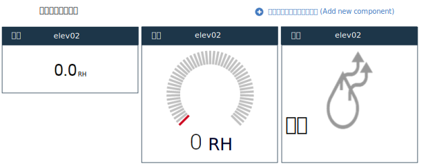

---

copyright:
  years: 2015,2016

---

{:shortdesc: .shortdesc}

# ダッシュボードおよびテンプレートの管理
{: #managing-dashboards}

カスタマイズ可能なダッシュボードに、IoT デバイスからのリアルタイム・データが表示されます。リアルタイム・メトリック、グラフ、および 1 つ以上のデバイスに関する他の情報を表示するダッシュボードを手動で作成できます。ダッシュボードには、フィルターに掛けられたデバイス・リストや他のダッシュボードへのリンクを含めることもできます。
{: shortdesc}

手動で作成されたダッシュボードに加え、{{site.data.keyword.iotrtinsights_short}} には、定義済みのデバイス・アラート・ダッシュボードが付属しています。これは、**「ダッシュボード (Dashboards)」>「概要」**にあります。また、作成したメッセージ・スキーマに基づいてデバイス・ダッシュボードが動的に作成されます。

## ダッシュボード {: #dashboards}

管理者は、新規ダッシュボードを作成したり、関心のあるデバイス・データを表示するように既存のダッシュボードを変更したりすることができます。  
ダッシュボードを作成するには、以下のようにします。
1.	**「ダッシュボード (Dashboards)」>「ダッシュボードの参照 (Browse Dashboards)」**に移動します。
2.	**「新規ダッシュボードの追加 (Add new dashboard)」**をクリックします。
3.	ダッシュボードに名前を付け、アイコンや背景などの属性を選択します。また、{{site.data.keyword.iotrtinsights_short}} オペレーター・ユーザーがこのダッシュボードを編集できるようにするかどうかを選択します。
4.	 をクリックします。
5.	新しいダッシュボードのタイルをクリックして、空のダッシュボードを開きます。
6.	ウィジェットをダッシュボードに追加するには、以下のようにします。  
 1.	**「新規コンポーネントの追加 (Add new component)」**をクリックして、初期ダッシュボード・ウィジェットを追加します。
 2.	追加するコンポーネントを選択してから、追加コンポーネント属性を選択し、必要に応じて表示プロパティーを選択します。
 例えば、デバイスの特定のデータ・ポイントの数値を表示する場合は、`「デバイス (Device)」`を選択してから、追加するデバイスを選択します。ダッシュボード・エディターの「可視化 (Visualization)」で、表示するデータ・ポイントを選択します。次に、新たに追加したウィジェットをダッシュボード・グリッドに配置します。
 3.	 をクリックして、ウィジェットをダッシュボードに追加します。
7.	ダッシュボードが新たに追加されたウィジェットで更新され、選択したデータ・ポイントで定義されているリアルタイム・データが表示されます。

>**ヒント:** すべてのデバイスをリストするダッシュボードを作成するには、以下を実行します。  
1. **「ダッシュボード (Dashboards)」>「ダッシュボードの参照 (Browse Dashboards)」**に移動し、**「新規ダッシュボードの追加 (Add new dashboard)」**をクリックします。
2. ダッシュボードに記述名 (`「すべてのデバイス」`など) を付け、 をクリックします。
3. ダッシュボード・パネルでダッシュボードをクリックしてから、**「新規コンポーネントの追加 (Add new component)」**をクリックします。
4. **「コンテナー」**コンポーネントを選択し、**「フィルターに掛けられたデバイス (Filtered devices)」**を選択して、すべてのデバイスのリストを作成します。
5.  をクリックします。  

>新しいダッシュボードにデバイスがリストされます。デバイスのアイコンをクリックしてデバイス・ダッシュボードを開き、そのデバイスのリアルタイム・データを表示します。
### ダッシュボード・ウィジェット {: #dashboard-widgets}
ダッシュボードは、1 つ以上のデバイスからのリアルタイム・データを表示するウィジェットで構成されます。ウィジェットの動作は、そのタイプ、表示されるデータ・ポイント、およびスキーマでのデータ・ポイントの構成によって異なります。  
例えば、「ロー」データ・ポイントのデバイス・ウィジェットを追加した場合、そのウィジェットには、ロー・データがストリングとしてのみ表示されます。

一方、最小値と最大値を指定してデータ・ポイントを構成した場合、ウィジェットをゲージとして表示することを選択できます。

また、データ・ポイントに対してセンサー・タイプを割り当てて、可視化ウィジェットの特殊タイプを有効にし、表示されるセンサー・データのタイプをより良く示すことができます。例えば、センサー・タイプとして`「点灯/消灯 (Light on/off)」`を選択することで、`「簡潔な点灯/消灯インディケーター (Plain light indicator (on/off))」`可視化ウィジェットを有効にすることができます。

同じダッシュボードに同じデータ・ポイントの複数のウィジェットを含め、ロー数値と湿度を並べて表示することも選択できます。  
*同じデータ・ポイントに対する 3 つの可視化オプション。*

ウィジェット | タイプと可視化
------------- | -------------
デバイス (Device) | データ - デバイスのデータ・ポイントのリアルタイム値。最小値と最大値を組み込むようにデータ・ポイントを構成した場合、可視化オプションには、ゲージとしてのデータ・ポイントの表示があります。さらに、センサー・タイプを使用してデータ・ポイントを構成した場合、追加の可視化オプションが使用可能です。
グラフ (Chart) | グラフ (Graph) - 1 つ以上のデバイスのデータ・ポイントのリアルタイム値をプロットします。
ダッシュボード | ダッシュボードまたはテンプレートにリンクします。
テキスト (Text) | テキスト・ボックス (Text box) - フォーマット設定されたテキスト。
コンテナー | コンテナー・ウィジェットのタイプ:<ul><li>すべてのダッシュボード (All dashboards) – すべてのダッシュボードのリンク・リスト。</li><li>フィルターに掛けられたデバイス (Filtered devices) – すべてのデバイス、あるいは名前または場所でフィルターに掛けられたデバイスのリスト。</li><li>アラート付きのフィルターに掛けられたデバイス (Filtered devices with alerts) – アラート付きの、すべてのデバイス、あるいは名前または場所でフィルターに掛けられたデバイスのリスト。</li><li>デバイスのアラート (Alerts for device) – 「アラート付きのフィルターに掛けられたデバイス (Filtered devices with alerts)」コンテナーで選択したデバイスのアラートのリスト。</li></ul>
特殊 (Special) | 特殊ウィジェットのタイプ:<ul><li>マップ (Map) – 選択したデバイスの場所を示すマップ。</li><li>追加デバイス情報 (Additional device information) – 選択したデバイスに関する追加情報。</li></ul>

以下の表では、メッセージ・スキーマでセンサー・タイプ属性を使用して、選択したデータ・ポイントを構成した場合に、デバイス・ウィジェットで使用可能な可視化オプションを要約します。

データ・ポイントのセンサー・タイプ | 可視化オプション | 詳細 | サポートされるデータ型
------------- | ------------- | -------------
選択なし | 未加工の値 | - | ストリング (String)/整数 (Integer)/浮動小数点 (Float)
点灯/消灯 (Light on/off) | 簡潔な点灯/消灯インディケーター | 0=消灯 | 整数 (Integer)
スイッチ・オン/オフ (Switch on/off) | 簡潔なスイッチ・インディケーター (オン/オフ) | 0=オフ | 整数 (Integer)
温度センサー (Temperature sensor) | 一般的な温度ゲージ | N/A | 整数 (Integer)/浮動小数点 (Float)
温度制御 (Temperature control) | 一般的な温度ゲージ | N/A | 整数 (Integer)/浮動小数点 (Float)
圧力センサー (Pressure sensor) | 簡潔な圧力ゲージ | N/A | 整数 (Integer)/浮動小数点 (Float)
バッテリー・レベル (Battery levels) | 簡潔なバッテリー・ウィジェット (低/高) | 0=良好 | 整数 (Integer)
輝度 (Brightness) | 輝度インディケーター (暗/明) | 0=暗 | 整数 (Integer)
ウィンドウ開閉 (Window open/close) | 簡潔なウィンドウの状態 (開/閉) | 0=閉 | 整数 (Integer)
ドア開閉 (Door open/close) | 簡潔なドアの状態 (開/閉) | 0=閉 | 整数 (Integer)
湿度センサー (Humidity sensor) | 湿度の状態 (乾燥/多湿) | 0=乾燥 | 整数 (Integer)
電力使用量 (Power consumption) | 簡潔な電力ゲージ | N/A | 整数 (Integer)/浮動小数点 (Float)
エネルギー・メーター (Energy meter) | 未加工の値 | N/A | 整数 (Integer)/浮動小数点 (Float)
パーセント (Percentage) | 簡潔なパーセント (0 から 100) | N/A | 整数 (Integer)/浮動小数点 (Float)
電圧 (Voltage) | 簡潔な電圧ゲージ | N/A | 整数 (Integer)/浮動小数点 (Float)
電流 (Current) | 簡潔な電流ゲージ | N/A | 整数 (Integer)/浮動小数点 (Float)
経度 (Longitude) | 「特殊 (Special)」>「マップ (Map)」ウィジェットでのデバイスの場所 (「緯度 (Latitude)」ウィジェットも必要) | **重要:** 経度値に使用するデータ・ポイントには、メッセージ・スキーマでセンサー・タイプ「経度 (Longitude)」が割り当てられている必要があります。 | 浮動小数点 (Float)
緯度 (Latitude) | 「特殊 (Special)」>「マップ (Map)」ウィジェットでのデバイスの場所 (「経度 (Longitude)」ウィジェットも必要) | **重要:** 緯度値に使用するデータ・ポイントには、メッセージ・スキーマでセンサー・タイプ「緯度 (Latitude)」が割り当てられている必要があります。 | 浮動小数点 (Float)  

## デフォルトのダッシュボード・レイアウト
{{site.data.keyword.iotrtinsights_short}} には、定義済みのダッシュボード (アラート・ダッシュボードとデバイス・ダッシュボード) が付属しています。

以下の表では、定義済みのダッシュボードのウィジェットとレイアウトについて説明します。
### アラート・ダッシュボード (「ダッシュボード (Dashboards)」>「概要」)
このダッシュボードは本製品に付属しており、未解決のアラートがあるデバイスのリストを示します。アラートに関する詳細を表示するデバイスを選択できます。また、デバイスのアイコンをクリックして、デバイス・ダッシュボードを開き、そのデバイスのリアルタイム・データを表示できます。

<table>
<thead>
<tr>
<th colspan="3">アラート・ダッシュボード</th>
</tr>
</thead>
<tbody>
<tr>
<td style="width:30%">コンテナー: アラートのあるデバイス (Devices with alerts)</td>
<td style="width:30%">コンテナー: デバイスのアラート (Alerts for device)</td>
<td style="width:30%">特殊 (Special): 追加デバイス情報 (Additional device information)</td>
</tr>
<tr>
<td style="width:30%"></td>
<td style="width:30%"></td>
<td style="width:30%">特殊 (Special): マップ (Map)</td>
</tr>
</tbody>
</table>

*アラート・ダッシュボードのレイアウト*

### デバイス・ダッシュボード
デバイス・リスト内のデバイスのアイコンをクリックすると、そのデバイスのデバイス・ダッシュボードが開きます。データ・ポイントがメッセージ・スキーマに追加されると、そのデータ・ポイントは、デバイス・テンプレート内のウィジェットとしても追加されます。これにより、デバイス・ダッシュボードが動的に作成されます。管理者は、ウィジェットを手動で追加または削除できます。

<table>
<thead>
<tr>
<th colspan="3">デバイス・ダッシュボード</th>
</tr>
</thead>
<tbody>
<tr>
<td style="width:30%">デバイス (Device): データ・ポイント 1 (Datapoint 1)</td>
<td style="width:30%">デバイス (Device): データ・ポイント 2 (Datapoint 2)</td>
<td style="width:30%">デバイス (Device): データ・ポイント 3 (Datapoint 3)</td>
</tr>
<tr>
<td style="width:30%">デバイス (Device): データ・ポイント N (Datapoint N)</td>
<td style="width:30%"></td>
<td style="width:30%"></td>
</tr>
</tbody>
</table>

*定義済みのデバイス・ダッシュボードのレイアウト*

### ダッシュボードの例: すべてのデバイスのリスト (List of all devices)
以下のダッシュボードには、すべてのデバイスのリストが含まれています。リストからデバイスを選択すると、デバイス情報が示されます。

<table>
<thead>
<tr>
<th colspan="3">「すべてのデバイスのリスト (List of all devices)」ダッシュボード</th>
</tr>
</thead>
<tbody>
<tr>
<td style="width:30%">コンテナー: フィルターに掛けられたデバイス (Filtered devices) (フィルター・パラメーターの設定なし)</td>
<td style="width:30%">特殊 (Special): 追加デバイス情報 (Additional device information)</td>
<td style="width:30%"></td>
</tr>
</tbody>
</table>

*「すべてのデバイスのリスト (List of all devices)」ダッシュボードのレイアウト*

## テンプレート {: #templates}
テンプレートは、特定のデバイス・タイプに関する定義済みのダッシュボードのレイアウトを制御します。管理者は、ニーズに合わせて定義済みのテンプレートを変更できます。例えば、定義済みのテンプレートには、一般的なデータ・ポイントのみが含まれています。必要に応じて、グラフや他のコンポーネントを追加できます。

例えば、ユーザーが定義済みのデバイス・ダッシュボードにアクセスして基本的なデバイス・データを表示し、包括的なリアルタイム・グラフ・セットが含まれている手動作成のテンプレートへのリンクを辿るようにすることができます。テンプレートの作成は、ダッシュボードの作成とよく似ています。  

定義済みのテンプレートを変更するには、以下のようにします。
1.	**「ダッシュボード (Dashboards)」>「テンプレートの管理 (Manage Templates)」**に移動します。
2.	「テンプレートの管理 (Manage Templates)」パネルで、テンプレート・タイルを見つけ、**>「レイアウトの変更 (Change layout)」**をクリックして、テンプレートを編集用に開きます。  
3.	ウィジェットをテンプレートに追加します。
 1.	**「新規テンプレート・コンポーネントの追加 (Add new template component)」**をクリックして、初期テンプレート・ウィジェットを追加します。
 2.	追加するコンポーネントを選択してから、追加コンポーネント属性を選択し、必要に応じて表示プロパティーを選択します。  
 3.	 をクリックして、ウィジェットをテンプレートに追加します。
4.	既存のウィジェットを編集します。
 1.	テンプレート・ウィジェットの上にカーソルを移動し、 をクリックします。
 2.	コンポーネントおよびその属性を変更します。また、必要に応じて、ウィジェットの位置を変更します。
 3.	 をクリックして、ウィジェットを更新します。  

テンプレートが行った変更で更新されます。

<!-- Administrators can also manually add templates for specific device types. These templates can then be linked to from the predefined templates.  -->

<!-- To create a template:
1.	Go to **Dashboards > Manage templates**.
2.	Click **Add new template**.
3.	Give the template a name, select a device type and attributes such as icon and background.
4.	Click .
5.	The empty template opens.
6.	Add widgets to the template.  
For a list of widgets, see below.
 1.	Click **Add new component** to add an initial template widget.
 2.	Select a component to add, then select further component attributes and, if needed, select display properties.
 For example, ... Then position the newly added widget in the dashboard grid.
 3.	Click  to add the widget to the template.
7.	The template updates with the newly added widgets.

### Template widgets
Widget | Type and visualization
------------- | -------------
Device | Data - Real-time value of data points for the device. For a description of the available widget options, see [Dashboard widgets](#dashboard-widgets "Dashboard widgets") above.
Chart | Graph - Plot real-time values of data points for one or more devices.
Dashboard | Link to a dashboard or a template.
Text | Text box - Formatted text
Container | Types of containers:<ul><li>All dashboards – A linked list of all dashboards</li><li>Filtered devices – A list of all devices, or filtered by name or location</li><li>Filtered devices with alerts – A list of all devices with alerts, or filtered by name or location</li><li>Alerts for device – A list of alerts for a device that is selected in a Filtered devices with alerts container</li></ul>
Special | Types of special:<ul><li>Map – A map that locates the selected device</li><li>Additional device information – More information about the selected device</li></ul>

### Template example: Selected set of graphs
One way of using device templates is to expand on the predefined device template by creating specialized templates for a device type, and then linking these from the predefined template by using a Dashboard widget.

<table>
<thead>
<tr>
<th colspan="3">Descriptive graphs template</th>
</tr>
</thead>
<tbody>
<tr>
<td style="width:30%">Device: ID</td>
<td style="width:30%">Graph: One data point</td>
<td style="width:30%">Graph: Another data point</td>
</tr>
<tr>
<td style="width:30%">Special: Additional device information</td>
<td style="width:30%">Text: Short description of how to  interpret the device data in the graphs.</td>
<td></td>
</tr>
</tbody>
</table>

*Descriptive graphs template*

Link to this template from a predefined device template:

<table>
<thead>
<tr>
<th colspan="3">Predefined device dashboard layout with link to template</th>
</tr>
</thead>
<tbody>
<tr>
<td style="width:30%">Device: Datapoint 1</td>
<td style="width:30%">Device: Datapoint 2</td>
<td style="width:30%">Device: Datapoint 3</td>
</tr>
<tr>
<td style="width:30%">Device: Datapoint N</td>
<td style="width:30%"><b>Dashboard: Descriptive graphs template</b></td>
<td style="width:30%"></td>
</tr>
</tbody>
</table>

*Predefined device dashboard layout with link to template* -->

## 定義済みのダッシュボードおよびテンプレートのリセット
{: #resetting-dashboards}
定義済みのテンプレートを変更した場合、そのテンプレートは、メッセージ・スキーマを更新しても動的に更新されなくなります。また、元のレイアウトおよびウィジェットを復元するには、ダッシュボードまたはテンプレートをリセットする必要があります。
定義済みのダッシュボードおよびテンプレートをリセットするには、以下のようにします。
1.	**「ダッシュボード (Dashboards)」>「テンプレートの管理 (Manage Templates)」**または**「ダッシュボード (Dashboards)」>「ダッシュボードの参照 (Browse Dashboards)」**に移動します。
2.	定義済みのテンプレートまたはダッシュボードのタイルを見つけ、**>「レイアウトのリセット (Reset layout)」**をクリックして、テンプレートを削除してから再作成します。  

テンプレートまたはダッシュボードは、デフォルト・ウィジェット・セットを使用して再作成されます。
