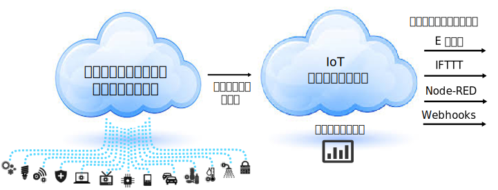

---

copyright:
  years: 2015,2016

---

{:new_window: target="_blank"}
{:shortdesc: .shortdesc}

# {{site.data.keyword.iotrtinsights_short}} の製品情報
{: #iotrtinsights_overview}
*最終更新日: 2016 年 2 月 11 日*

{{site.data.keyword.iotrtinsights_short}} は、リアルタイム分析エンジンおよび分析オーサリング機能を備えています。これにより、IoT デバイスのデータのコンテキスト化およびモニターが実現し、現在の状態の把握がスピードアップし、意思決定と発生した問題への対応が改善されます。
{:shortdesc}

## {{site.data.keyword.iotrtinsights_full}}
{: #iotrtinsights_concept}
{{site.data.keyword.iotrtinsights_short}} はシンプルなルール・ベースの構成モデルおよび拡張可能なフレームワークを使用して、モノのインターネットのデータを利用し、そのデータをマスター資産データと結合し、コンテキストに合ったシチュエーションを分析し、対応を自動化して、運用、可用性、およびサービス・レベルを改善できるようにします。

{{site.data.keyword.iotrtinsights_short}} は、リアルタイム・デバイス・データ・フィードのために {{site.data.keyword.bluemix}} モノのインターネット ({{site.data.keyword.iot_short}}) サービスに接続します。着信データは、IBM Maximo&reg; Asset Management などの資産管理システムからの資産マスター・データで拡張できる仮想データ・モデルを使用して解釈されます。

また、確認する必要がある状態を識別するために、ユーザー定義のルールがリアルタイム・ストリーミング・データに適用されます。アクション・エンジンでは、検出された状態への自動化された対応 (E メールの送信、IFTTT レシピのトリガー、Node-RED ワークフローの実行、Webhook を使用した各種 Web サービスへの接続など) を定義できます。  

最後に、リアルタイム・データは、IoT デバイスの場所、データ、メトリック、およびアラートを一目で確認できるように、構成可能なダッシュボードにも表示されます。

