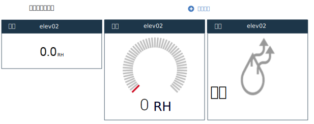

---

copyright:
  years: 2015,2016

---

{:shortdesc: .shortdesc}

# 管理儀表板及範本{: #managing-dashboards}

來自 IoT 裝置的即時資料會顯示在可自訂的儀表板中。您可以手動建立儀表板，以顯示即時度量、顯示圖形，以及顯示一台以上裝置的其他資訊。儀表板也可以包含已過濾的裝置清單以及其他儀表板的鏈結。
{: shortdesc}

除了手動建立的儀表板之外，{{site.data.keyword.iotrtinsights_short}} 在**儀表板 > 概觀**中也有預先定義的裝置警示儀表板，並且會根據您建立的訊息綱目動態地建立裝置儀表板。

## 儀表板 {: #dashboards}

管理者可以建立新的儀表板，以及修改現有的儀表板來顯示感興趣的裝置資料。  
若要建立儀表板，請執行下列動作：
1.	移至**儀表板 > 瀏覽儀表板**。
2.	按一下**新增儀表板**。
3.	提供儀表板名稱，然後選取屬性（例如圖示及背景）。也請選取是否讓 {{site.data.keyword.iotrtinsights_short}} 操作員使用者可以編輯這個儀表板。
4.	按一下 。
5.	按一下新儀表板磚，以開啟空的儀表板。
6.	若要將小組件新增至儀表板，請執行下列動作：  
 1.	按一下**新增元件**，以新增起始儀表板小組件。
 2.	選取要新增的元件，然後選取進一步的元件屬性，並視必要選取顯示內容。
例如，若要顯示裝置之特定資料點的數值，請選取`裝置`，然後選取要新增的裝置。在儀表板編輯器的「視覺化」下，選取要顯示的資料點。然後，將新增的小組件放到儀表板網格中。
 3.	按一下 ，以將小組件新增至儀表板。
7.	儀表板會使用新增的小組件進行更新，並顯示由所選取資料點定義的即時資料。

>**提示：**若要建立列出所有裝置的儀表板，請執行下列動作：  
1. 移至**儀表板 > 瀏覽儀表板**，然後按一下**新增儀表板**。
2. 提供儀表板的敘述性名稱（例如 `All devices`），然後按一下 。
3. 在儀表板畫面中，按一下儀表板，然後按一下**新增元件**。
4. 選取**儲存器**元件，然後選取**已過濾的裝置**來建立所有裝置的清單。
5. 按一下 。  

>您的裝置會列在新的儀表板中。按一下裝置圖示即可開啟裝置儀表板，並查看裝置的即時資料。

### 儀表板小組件 {: #dashboard-widgets}
儀表板是由小組件所構成，而小組件會顯示來自一台以上裝置的即時資料。小組件的行為取決於其類型、顯示的資料點，以及綱目中的資料點配置方式。  
例如，如果您新增「原始」資料點的裝置小組件，則小組件只會將原始資料顯示為字串。

不過，如果您配置具有最小值及最大值的資料點，則可以選擇將小組件顯示為量規。

您也可以指派資料點的「感應器」類型來啟用特殊類型的視覺化小組件，以更適當地說明所顯示感應器資料的類型。例如，您可以選取感應器類型`燈光（開/關）`來啟用`一般燈光指示器（開/關）`視覺化小組件。

您也可以選擇包括相同儀表板中相同資料點的數個小組件，來並列顯示原始數值及濕度。  
*相同資料點的三個視覺化選項。*

小組件 | 類型及視覺化
------------- | -------------
裝置 | 資料 - 裝置的即時資料點值。如果資料點配置成包括最小值及最大值，則視覺化選項包括將資料點顯示為量規。甚至，如果資料點已配置感應器類型，則可以使用其他視覺化選項。
圖表 | 圖形 - 繪製一台以上裝置的即時資料點值。
儀表板 | 鏈結至儀表板或範本。
文字 | 文字框 - 格式化文字。
儲存器 | 儲存器小組件的類型：<ul><li>所有儀表板 – 所有儀表板的已鏈結清單。</li><li>已過濾的裝置 – 所有裝置的清單，或依名稱或位置進行過濾。</li><li>已過濾的裝置（含警示）– 所有裝置（含警示）的清單，或依名稱或位置進行過濾。</li><li>裝置的警示 –「已過濾的裝置（含警示）」儲存器中所選取裝置的警示清單。</li></ul>
特殊 | 特殊小組件的類型：<ul><li>地圖 – 指出所選取裝置位置的地圖。</li><li>其他裝置資訊 – 所選取裝置的相關資訊。</li></ul>

下表彙總所選取資料點已配置訊息綱目中的感應器類型屬性時，裝置小組件可用的視覺化選項。

資料點感應器類型 | 視覺化選項 | 詳細資料 | 支援的資料類型
------------- | ------------- | -------------
沒有選項 | 一般值 | - | String/Integer/Float
燈光（開/關） | 一般燈光指示器（開/關） | 0=關 | Integer
開關（開/關） | 一般開關指示器（開/關） | 0=關 | Integer
溫度感應器 | 一般溫度量規 | N/A | Integer/Float
溫度控制 | 一般溫度量規 | N/A | Integer/Float
壓力感應器 | 一般壓力量規 | N/A | Integer/Float
電池電量 | 一般電池小組件（低/高） | 0=良好 | Integer
亮度 | 亮度指示器（暗/亮） | 0=暗 | Integer
窗戶開啟/關閉 | 一般窗戶狀態（開啟/已關閉） | 0=已關閉 | Integer
門開啟/關閉 | 一般門狀態（開啟/已關閉） | 0=已關閉 | Integer
濕度感應器 | 濕度狀態（乾/溼） | 0=乾 | Integer
耗電量 | 一般電源量規 | N/A | Integer/Float
能源計量器 | 一般值 | N/A | Integer/Float
百分比 | 一般百分比 (0-100) | N/A | Integer/Float
電壓 | 一般電壓量規 | N/A | Integer/Float
電流 | 一般電流量規 | N/A | Integer/Float
經度 | 「特殊 > 地圖」小組件上的裝置位置（也需要「緯度」小組件） | **重要事項：**必須將訊息綱目中的感應器類型「經度」指派給用於經度值的資料點。 | Float
緯度 | 「特殊 > 地圖」小組件上的裝置位置（也需要「經度」小組件） | **重要事項：**必須將訊息綱目中的感應器類型「緯度」指派給用於緯度值的資料點。 | Float  

## 預設儀表板佈置
{{site.data.keyword.iotrtinsights_short}} 隨附預先定義的儀表板：警示儀表板及裝置儀表板。

下列各表說明預先定義儀表板的小組件及佈置。
### 警示儀表板（儀表板 > 概觀）
此儀表板隨附於產品中，並且提供具有開啟警示的裝置清單。您可以選取某台裝置來查看警示的詳細資料，也可以按一下裝置圖示來開啟裝置儀表板，以顯示裝置的即時資料。

<table>
<thead>
<tr>
<th colspan="3">警示儀表板</th>
</tr>
</thead>
<tbody>
<tr>
<td style="width:30%">儲存器：裝置（含警示）</td>
<td style="width:30%">儲存器：裝置的警示</td>
<td style="width:30%">特殊：其他裝置資訊</td>
</tr>
<tr>
<td style="width:30%"></td>
<td style="width:30%"></td>
<td style="width:30%">特殊：地圖</td>
</tr>
</tbody>
</table>

*警示儀表板佈置*

### 裝置儀表板
按一下裝置清單中的裝置圖示，會開啟裝置的裝置儀表板。資料點在新增至訊息綱目時，也會新增為裝置範本中的小組件，來動態建立裝置儀表板。管理者可以手動新增或移除小組件。

<table>
<thead>
<tr>
<th colspan="3">裝置儀表板</th>
</tr>
</thead>
<tbody>
<tr>
<td style="width:30%">裝置：資料點 1</td>
<td style="width:30%">裝置：資料點 2</td>
<td style="width:30%">裝置：資料點 3</td>
</tr>
<tr>
<td style="width:30%">裝置：資料點 N</td>
<td style="width:30%"></td>
<td style="width:30%"></td>
</tr>
</tbody>
</table>

*預先定義的裝置儀表板佈置*

### 儀表板範例：所有裝置清單
下列儀表板包括所有裝置的清單，並在您從清單中選取裝置時提供裝置資訊。

<table>
<thead>
<tr>
<th colspan="3">所有裝置儀表板清單</th>
</tr>
</thead>
<tbody>
<tr>
<td style="width:30%">儲存器：已過濾的裝置（未設定任何過濾參數）</td>
<td style="width:30%">特殊：其他裝置資訊</td>
<td style="width:30%"></td>
</tr>
</tbody>
</table>

*所有裝置儀表板佈置清單*

## 範本 {: #templates}
範本可控制特定裝置類型之預先定義儀表板的佈置。管理者可以修改這些預先定義範本，使其符合您的需求。例如，預先定義範本僅包括一般資料點。您可以視需要新增圖形及其他元件。

例如，使用者可以存取預先定義裝置儀表板來查看基本裝置資料，然後遵循連往可能包含一組完整即時圖形之手動建立範本的鏈結。建立範本的方式與建立儀表板的方式十分類似。  

若要修改預先定義範本，請執行下列動作：
1.	移至**儀表板 > 管理範本**。
2.	在「管理範本」畫面中，尋找範本磚，然後按一下 ** > 變更佈置**，以開啟範本來進行編輯。  
3.	將小組件新增至範本。
 1.	按一下**新增範本元件**，以新增起始範本小組件。
 2.	選取要新增的元件，然後選取進一步元件屬性，必要的話請選取顯示內容。  
 3.	按一下 ，以將小組件新增至範本。
4.	編輯現有小組件。
 1.	移至範本小組件上方，然後按一下 。
 2.	修改元件及其屬性，然後視需要重新定位小組件。
 3.	按一下 ，以更新小組件。  

範本會使用您的變更進行更新。

<!-- Administrators can also manually add templates for specific device types. These templates can then be linked to from the predefined templates.  -->

<!-- To create a template:
1.	Go to **Dashboards > Manage templates**.
2.	Click **Add new template**.
3.	Give the template a name, select a device type and attributes such as icon and background.
4.	Click .
5.	The empty template opens.
6.	Add widgets to the template.  
For a list of widgets, see below.
 1.	Click **Add new component** to add an initial template widget.
 2.	Select a component to add, then select further component attributes and, if needed, select display properties.
 For example, ... Then position the newly added widget in the dashboard grid.
 3.	Click  to add the widget to the template.
7.	The template updates with the newly added widgets.

### Template widgets
Widget | Type and visualization
------------- | -------------
Device | Data - Real-time value of data points for the device. For a description of the available widget options, see [Dashboard widgets](#dashboard-widgets "Dashboard widgets") above.
Chart | Graph - Plot real-time values of data points for one or more devices.
Dashboard | Link to a dashboard or a template.
Text | Text box - Formatted text
Container | Types of containers:<ul><li>All dashboards – A linked list of all dashboards</li><li>Filtered devices – A list of all devices, or filtered by name or location</li><li>Filtered devices with alerts – A list of all devices with alerts, or filtered by name or location</li><li>Alerts for device – A list of alerts for a device that is selected in a Filtered devices with alerts container</li></ul>
Special | Types of special:<ul><li>Map – A map that locates the selected device</li><li>Additional device information – More information about the selected device</li></ul>

### Template example: Selected set of graphs
One way of using device templates is to expand on the predefined device template by creating specialized templates for a device type, and then linking these from the predefined template by using a Dashboard widget.

<table>
<thead>
<tr>
<th colspan="3">Descriptive graphs template</th>
</tr>
</thead>
<tbody>
<tr>
<td style="width:30%">Device: ID</td>
<td style="width:30%">Graph: One data point</td>
<td style="width:30%">Graph: Another data point</td>
</tr>
<tr>
<td style="width:30%">Special: Additional device information</td>
<td style="width:30%">Text: Short description of how to  interpret the device data in the graphs.</td>
<td></td>
</tr>
</tbody>
</table>

*Descriptive graphs template*

Link to this template from a predefined device template:

<table>
<thead>
<tr>
<th colspan="3">Predefined device dashboard layout with link to template</th>
</tr>
</thead>
<tbody>
<tr>
<td style="width:30%">Device: Datapoint 1</td>
<td style="width:30%">Device: Datapoint 2</td>
<td style="width:30%">Device: Datapoint 3</td>
</tr>
<tr>
<td style="width:30%">Device: Datapoint N</td>
<td style="width:30%"><b>Dashboard: Descriptive graphs template</b></td>
<td style="width:30%"></td>
</tr>
</tbody>
</table>

*Predefined device dashboard layout with link to template* -->

## 重設預先定義的儀表板及範本 {: #resetting-dashboards}
如果您修改預先定義的範本，則不會再從訊息綱目更新項目中動態地更新範本，而且您需要重設儀表板或範本來還原原始佈置及小組件。
若要重設預先定義的儀表板及範本，請執行下列動作：
1.	移至**儀表板 > 管理範本**，或移至**儀表板 > 瀏覽儀表板**。
2.	尋找預先定義的範本或儀表板磚，然後按一下 ** > 重設佈置**，以刪除後重建範本。  

範本或儀表板會使用預設小組件集進行重建。
