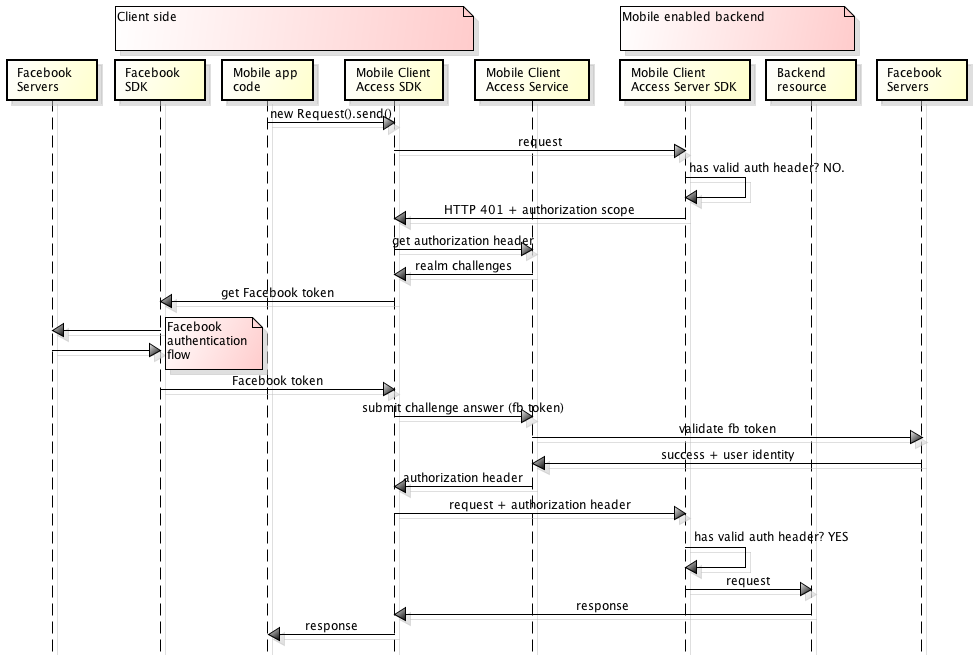

---

copyright:
  years: 2015, 2016, 2017
lastupdated: "2017-03-15"

---
{:new_window: target="_blank"}
{:shortdesc: .shortdesc}
{:screen: .screen}
{:codeblock: .codeblock}

The {{site.data.keyword.amafull}} service is replaced with the {{site.data.keyword.appid_full}} service.

# Authenticating users with Facebook credentials
{: #facebook-auth-overview}

You can configure the {{site.data.keyword.amafull}} service to protect resources by using Facebook as an identity provider. Your mobile or web application users can use their Facebook credentials for authentication.

{:shortdesc}

**Important**: You do not need to separately install the client SDK provided by Facebook. The Facebook SDK installs automatically by dependency managers when you configure the {{site.data.keyword.amashort}} Facebook client SDK.

## {{site.data.keyword.amashort}} request flow
{: #mca-facebook-sequence}

### Mobile client request flow

See the following diagram to understand how {{site.data.keyword.amashort}} integrates with Facebook for authentication, from a mobile client app.

* Use the {{site.data.keyword.amashort}} client SDK to make a request to your back-end resources that are protected with the {{site.data.keyword.amashort}} server SDK.
* The {{site.data.keyword.amashort}} server SDK detects an unauthorized request and returns HTTP 401 code and authorization scope.
* The {{site.data.keyword.amashort}} client SDK automatically detects the HTTP 401 code and starts the authentication process.
* The {{site.data.keyword.amashort}} client SDK  contacts the {{site.data.keyword.amashort}} service and requests an authorization header.
* The {{site.data.keyword.amashort}} service asks the client to authenticate with Facebook first by supplying an authentication challenge.
* The {{site.data.keyword.amashort}} client SDK uses the Facebook SDK to start the authentication process. After successful authentication, the Facebook SDK returns a Facebook access token.
* The Facebook access token is considered an authentication challenge answer. The token is sent to the {{site.data.keyword.amashort}} service.
* The service validates the authentication challenge answer with Facebook servers.
* If validation is successful, the {{site.data.keyword.amashort}} service generates an authorization header and returns it to the {{site.data.keyword.amashort}} client SDK. Authorization header contains two tokens: an access token that contains access permissions information, and ID token that contains information about current user, device, and application.
* From this point on, all requests that are made through the {{site.data.keyword.amashort}} client SDK  have a newly obtained authorization header.
* The {{site.data.keyword.amashort}} client SDK  automatically resends the original request that triggered the authorization flow.
* The {{site.data.keyword.amashort}} server SDK extracts authorization header from request, validates it with {{site.data.keyword.amashort}} service, and grants access to a back-end resource.

### {{site.data.keyword.amashort}} Web application request flow
{: #mca-facebook-web-sequence}

The {{site.data.keyword.amashort}} Web application request flow is similar to the mobile client flow. However, {{site.data.keyword.amashort}} protects the web application, rather than a {{site.data.keyword.Bluemix_notm}} back-end resource.

  * The initial request is sent by the web application (from a log-in form, for example).
  * The final redirect is to the protected area of the web application itself, rather than back-end protected resource.

## Creating an application on the Facebook for Developers website
{: #facebook-appID}

To start using Facebook as identity provider, create an application on the Facebook for Developers website. During this process, a Facebook App ID is created. This is a unique identifier used by Facebook in order to know which application is attempting to connect.

You need this value to configure Facebook authentication for your mobile or web app.

1. Access the [Facebook for Developers ](https://developers.facebook.com){: new_window} site.

1. Open the **My Apps** pull-down list and select **Add a New App**.

1. Enter the **Display Name** and **Contact Email values** values, and choose a **Category** from the pull-down list.

1. Click **Create a New App ID**.

1. A security check may appear. Perform the requested action.

1. The **Product Setup** page appears. Copy the **App ID** that is displayed.

## Next steps
{: #next-steps}

* [Enabling Facebook authentication for Android apps](facebook-auth-android.html)
* [Enabling Facebook authentication for iOS apps (Swift SDK)](facebook-auth-ios-swift-sdk.html)
* [Enabling Facebook authentication for Cordova apps](facebook-auth-cordova.html)
