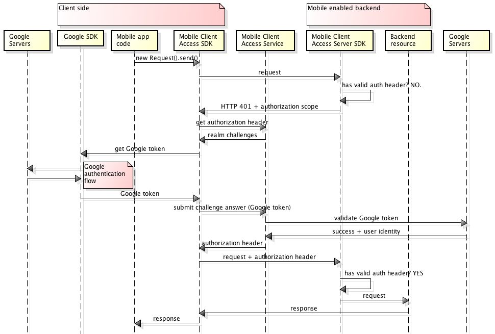

---

copyright:
  years: 2015, 2016
lastupdated: "2016-11-03"

---
{:screen:  .screen}
{:shortdesc: .shortdesc}
{:codeblock: .codeblock}

# Authenticating users with Google credentials
{: #google-auth}

You can configure the {{site.data.keyword.amafull}} service to protect resources, using Google as an identity provider. Your mobile or Web application users can then use their Google credentials for authentication.
{:shortdesc}

**Important:** You do not need to separately install the client SDK provided by Google. The Google SDK installs automatically by dependency managers when you configure the {{site.data.keyword.amashort}} client SDK.

## {{site.data.keyword.amashort}} request flow
{: #google-auth-overview}

### Client request flow

See the following diagram to understand how {{site.data.keyword.amashort}} integrates with Google for authentication.

* Use the {{site.data.keyword.amashort}} SDK to make a request to your back-end resources that are protected  with the {{site.data.keyword.amashort}} server SDK.
* The {{site.data.keyword.amashort}} server SDK detects the unauthorized request and returns an HTTP 401 code and authorization scope.
* The {{site.data.keyword.amashort}} client SDK automatically detects the HTTP 401 code and starts the authentication process.
* The {{site.data.keyword.amashort}} client SDK  contacts the {{site.data.keyword.amashort}} service and requests an authorization header.
* The {{site.data.keyword.amashort}} service asks the client to authenticate with Google first by supplying an authentication challenge.
* The {{site.data.keyword.amashort}} client SDK uses the Google SDK to start the authentication process. After successful authentication, the Google SDK returns a Google access token.
* The Google access token is considered an authentication challenge answer. The token is sent to the {{site.data.keyword.amashort}} service.
* The service validates the authentication challenge answer with Google servers.
* If validation is successful, the {{site.data.keyword.amashort}} service generates an authorization header and returns it to the {{site.data.keyword.amashort}} client SDK. The authorization header contains two tokens: an access token that contains access permissions information, and ID token that contains information about the current user, device, and application.
* From this point on, all requests that are made through the {{site.data.keyword.amashort}} client SDK  have a newly obtained authorization header.
* The {{site.data.keyword.amashort}} client SDK automatically resends the original request that triggered the authorization flow.
* The {{site.data.keyword.amashort}} server SDK extracts the authorization header from the request, validates it with the {{site.data.keyword.amashort}} service, and grants access to a back-end resource.

### {{site.data.keyword.amashort}} web application request flow
{: #mca-google-web-sequence}
The {{site.data.keyword.amashort}} web application request flow is similar to the mobile client flow. However, {{site.data.keyword.amashort}} protects the web application, rather than a {{site.data.keyword.Bluemix_notm}} back-end resource.

  * The initial request is sent by the web application (from a log-in form, for example).
  * The final redirect is to the protected area of the web application itself, rather than back-end protected resource.

## Next steps
{: #google-auth-nextsteps}

* [Enabling Google authentication for Android apps](google-auth-android.html)
* [Enabling Google authentication for iOS apps (Swift SDK)](google-auth-ios-swift-sdk.html)
* [Enabling Google authentication for iOS apps (Objective-C SDK)](google-auth-ios.html)
* [Enabling Google authentication for Cordova apps](google-auth-cordova.html)
