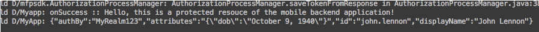

---

copyright:
  years: 2015, 2016, 2017
lastupdated: "2017-01-15"

---


{:new_window: target="_blank"}
{:shortdesc: .shortdesc}
{:screen: .screen}
{:codeblock: .codeblock}
{:pre: .pre}


# Angepasste Authentifizierung für {{site.data.keyword.amashort}}-Android-App konfigurieren
{: #custom-android}


Konfigurieren Sie Ihre Android-Anwendung mit angepasster Authentifizierung zur Verwendung des {{site.data.keyword.amashort}}-Client-SDK und verbinden Sie Ihre Anwendung mit {{site.data.keyword.Bluemix}}.

## Vorbereitungen
{: #before-you-begin}
Voraussetzungen:

* Eine Ressource, die durch eine Instanz des {{site.data.keyword.amashort}}-Service geschützt wird, die zur Verwendung eines angepassten Identitätsproviders konfiguriert ist (siehe die Veröffentlichung zur [Konfiguration der angepassten Authentifizierung](custom-auth-config-mca.html)).  
* Der Wert für die Tenant-ID. Öffnen Sie den Service im {{site.data.keyword.amashort}}-Dashboard. Klicken Sie auf die Schaltfläche **Mobile Systemerweiterungen**. Im Feld **App-GUID/TenantId** wird der Wert `tenantId` (auch als `appGUID` bezeichnet) angezeigt. Sie benötigen diesen Wert für die Initialisierung von Authorization Manager.
* Der Realname. Dies ist der Wert, den Sie im Feld **Realmname** des Abschnitts **Angepasst** auf der Registerkarte **Management** des {{site.data.keyword.amashort}}-Dashboards angegeben haben.
* Die URL der Back-End-Anwendung (**App-Route**). Sie benötigen diese Werte zum Senden von Anforderungen an die geschützten Endpunkte der Back-End-Anwendung.
* Die {{site.data.keyword.Bluemix_notm}}-**Region**. Ihre aktuelle {{site.data.keyword.Bluemix_notm}}-Region finden Sie im Header neben dem Symbol **Avatar** . Der Regionswert, der angezeigt wird, sollte einer der folgenden sein: `USA (Süden)`, `Vereinigtes Königreich` oder `Sydney`. Außerdem sollte er den im WebView-JavaScript-Code erforderlichen SDK-Werten entsprechen: `BMSClient.REGION_US_SOUTH`, `BMSClient.REGION_SYDNEY` oder `BMSClient.REGION_UK`. Sie benötigen diesen Wert für die Initialisierung des {{site.data.keyword.amashort}}-Clients.

Weitere Informationen finden Sie über die folgenden Links:
 * [Einführung in {{site.data.keyword.amashort}}](getting-started.html)
 * [Android-SDK einrichten](getting-started-android.html)
 * [Angepassten Identitätsprovider verwenden](custom-auth.html)
 * [Angepassten Identitätsprovider erstellen](custom-auth-identity-provider.html)
 * [{{site.data.keyword.amashort}} für die angepasste Authentifizierung konfigurieren](custom-auth-config-mca.html)


## {{site.data.keyword.amashort}}-Client-SDK initialisieren
{: #custom-android-initialize}
Wenn eine Android-App mit dem {{site.data.keyword.amashort}}-Android-SDK instrumentiert ist, können Sie diesen Abschnitt überspringen.
1. Öffnen Sie in Android Studio in Ihrem Android-Projekt die Datei `build.gradle` Ihres App-Moduls (nicht die Datei `build.gradle` des Projekts).

1. Suchen Sie in der Datei `build.gradle` den Abschnitt `dependencies` und prüfen Sie, ob die folgende Abhängigkeit vorhanden ist:

	```Gradle
	dependencies {
		compile group: 'com.ibm.mobilefirstplatform.clientsdk.android',
        name:'core',
        version: '2.+',
        ext: 'aar',
        transitive: true
    	// andere Abhängigkeiten
	}
	```
	{: codeblock}

1. Synchronisieren Sie Ihr Projekt mit Gradle. Klicken Sie auf **Tools > Android > Sync Project with Gradle Files**.

1. Öffnen Sie die Datei `AndroidManifest.xml` Ihres Android-Projekts.
Fügen Sie die Internetzugriffsberechtigung unter dem Element `<manifest>` hinzu:

	```XML
	<uses-permission android:name="android.permission.INTERNET" />
	```
	{: codeblock}

1. Initialisieren Sie das SDK.  
	Eine gängige, wenngleich nicht verbindliche, Position für den Initialisierungscode ist die Methode `onCreate` der Hauptaktivität in Ihrer Android-Anwendung.

	```Java
	BMSClient.getInstance().initialize(getApplicationContext(), BMSClient.REGION_UK);
	```
	{: codeblock}

Ersetzen Sie `BMSClient.REGION_UK` durch die {{site.data.keyword.amashort}}-Region. Weitere Informationen zum Abrufen dieser Werte finden Sie unter [Vorbereitungen](#before-you-begin).


## Schnittstelle 'AuthenticationListener'
{: #custom-android-authlistener}

Das {{site.data.keyword.amashort}}-Client-SDK stellt die Schnittstelle `AuthenticationListener` bereit, mit deren Hilfe Sie einen angepassten Authentifizierungsablauf implementieren können. Die Schnittstelle `AuthenticationListener` macht drei Methoden verfügbar, die in verschiedenen Phasen des Authentifizierungsprozesses aufgerufen werden.

### Methode 'onAuthenticationChallengeReceived'
{: #custom-onAuth}
Rufen Sie diese Methode auf, wenn eine angepasste Authentifizierungsanforderung (Challenge) aus dem {{site.data.keyword.amashort}}-Service empfangen wird.

```Java
void onAuthenticationChallengeReceived(AuthenticationContext authContext, JSONObject challenge, Context context);
```
{: codeblock}


#### Argumente
{: #custom-android-onAuth-arg}

* `AuthenticationContext`: Wird vom {{site.data.keyword.amashort}}-Client-SDK bereitgestellt, sodass Sie Antworten auf Authentifizierungsanforderungen oder Fehler bei der Erfassung von Berechtigungsnachweisen zurückmelden können.  Dadurch können Sie zum Beispiel reagieren, wenn ein Benutzer die Authentifizierung abbricht.
* `JSONObject`: Enthält eine angepasste Authentifizierungsanforderung, wie sie durch einen angepassten Identitätsprovider zurückgegeben wird.
* `Context`: Eine Referenz auf den Android-Kontext, der beim Senden der Anforderung verwendet wurde. In der Regel stellt dieses Argument eine Android-Aktivität dar.

Durch Aufrufen der Methode `onAuthenticationChallengeReceived` delegiert das {{site.data.keyword.amashort}}-Client-SDK die Steuerung an den Entwickler.  Der Service wartet auf Berechtigungsnachweise. Der Entwickler muss Berechtigungsnachweise erfassen durch eine der Methoden der Schnittstelle `AuthenticationContext` an das {{site.data.keyword.amashort}}-Client-SDK zurückmelden.

### Methode 'onAuthenticationSuccess'
{: #custom-android-authlistener-onsuccess}
Rufen Sie diese Methode nach einer erfolgreichen Authentifizierung auf. Die Argumente sind der Android-Kontext und ein optionales JSONObject- Objekt, das erweiterte Informationen zu dem Authentifizierungserfolg enthält.
```Java
void onAuthenticationSuccess(Context context, JSONObject info);
```
{: codeblock}

### Methode 'onAuthenticationFailure'
{: #custom-android-authlistener-onfail}
Rufen Sie diese Methode auf, wenn eine Authentifizierung fehlgeschlagen ist. Die Argumente sind der Android-Kontext und ein optionales Objekt `JSONObject`, das erweiterte Informationen zu dem Authentifizierungsfehler enthält.
```Java
void onAuthenticationFailure(Context context, JSONObject info);
```
{: codeblock}

## Schnittstelle 'AuthenticationContext'
{: #custom-android-authcontext}

Die Schnittstelle `AuthenticationContext` wird als Argument für die Methode `onAuthenticationChallengeReceived` einer angepassten Schnittstelle `AuthenticationListener` bereitgestellt. Sie müssen Berechtigungsnachweise erfassen und durch die Methoden der Schnittstelle `AuthenticationContext` an das {{site.data.keyword.amashort}}-Client-SDK zurückgeben oder einen Fehler melden. Verwenden Sie eine der folgenden Methoden.

```Java
void submitAuthenticationChallengeAnswer(JSONObject answer);
```
{: codeblock}

```Java
void submitAuthenticationFailure (JSONObject info);
```
{: codeblock}

## Beispielimplementierung einer angepassten Schnittstelle 'AuthenticationListener'
{: #custom-android-samplecustom}

Dieses Beispiel für 'AuthenticationListener' ist für die Ausführung mit einem angepassten Identitätsprovider gedacht. Sie können dieses Beispiel aus dem [Github-Repository ](https://github.com/ibm-bluemix-mobile-services/bms-mca-custom-identity-provider-sample "Symbol für externen Link"){: new_window} herunterladen.

```Java
package com.ibm.helloworld;
import android.content.Context;
import android.util.Log;
import com.ibm.mobilefirstplatform.clientsdk.android.security.mca.api.AuthenticationContext;
import com.ibm.mobilefirstplatform.clientsdk.android.security.mca.api.AuthenticationListener;
import org.json.JSONException;
import org.json.JSONObject;

public class CustomAuthenticationListener implements AuthenticationListener {
	@Override
	public void onAuthenticationChallengeReceived (AuthenticationContext authContext,
											JSONObject challenge, Context context) {

		log("onAuthenticationChallengeResceived :: " + challenge.toString());

		// In diesem Beispiel gibt AuthenticationListener sofort einen fest codierten
		// Satz von Berechtigungsnachweisen zurück. In einem realen Szenario würde der
		// Entwickler hier ein Anmeldefenster anzeigen, Berechtigungsnachweise erfassen
		// und die API authContext.submitAuthenticationChallengeAnswer() aufrufen.

		JSONObject challengeResponse = new JSONObject();
		try {
			challengeResponse.put("username", "john.lennon");
			challengeResponse.put("password", "12345");
			authContext.submitAuthenticationChallengeAnswer(challengeResponse);
		} catch (JSONException e){

			// Im Fall eines Fehlers beim Erfassen von Berechtigungsnachweisen müssen
			// Sie dies an AuthenticationContext zurückmelden. Andernfalls verbleibt
		// das Mobile Client Access-Client-SDK unbegrenzte Zeit in einem
		// Wartestatus für Berechtigungsnachweise.

			log("This should never happen...");
			authContext.submitAuthenticationFailure(null);
		}
	}

	@Override
	public void onAuthenticationSuccess (Context context, JSONObject info) {
		log("onAuthenticationSuccess :: " + info.toString());
	}

	@Override
	public void onAuthenticationFailure (Context context, JSONObject info) {
		log("onAuthenticationFailure :: " + info.toString());
	}

	private void log(String text){
		Log.d("CustomAuthListener", text);
	}
}
```
{: codeblock}

## Angepasste Schnittstelle 'AuthenticationListener' registrieren
{: #custom-android-register}

Nach dem Erstellen einer angepassten Schnittstelle 'AuthenticationListener' registrieren Sie sie in `BMSClient`, bevor Sie mit der Verwendung des Listeners beginnen. Fügen Sie Ihrer Anwendung den folgenden Code hinzu. Dieser Code muss aufgerufen werden, bevor Sie Anforderungen an Ihre geschützten Ressourcen senden.

```Java
MCAAuthorizationManager mcaAuthorizationManager = 
      MCAAuthorizationManager.createInstance(this.getApplicationContext(),"<MCAServiceTenantId>");
mcaAuthorizationManager.registerAuthenticationListener(realmName, new CustomAuthenticationListener());
BMSClient.getInstance().setAuthorizationManager(mcaAuthorizationManager);

```
{: codeblock}


Gehen Sie im Code wie folgt vor:
* Ersetzen Sie `MCAServiceTenantId` durch den Wert für die **Tenant-ID** (siehe [Vorbereitungen](##before-you-begin)).
* Verwenden Sie den Wert für `realmName`, den Sie im {{site.data.keyword.amashort}}-Dashboard angegeben haben (siehe [Angepasste Authentifizierung konfigurieren](custom-auth-config-mca.html)).


## Authentifizierung testen
{: #custom-android-testing}
Nach der Initialisierung des Client-SDK und der Registrierung der angepassten Schnittstelle 'AuthenticationListener' können Sie mit dem Senden von Anforderungen an Ihre mobile Back-End-Anwendung beginnen.

### Vorbereitungen für den Test
{: #custom-android-testing-before}
Sie müssen eine Anwendung am Endpunkt `/protected` haben, die über eine Ressource verfügt, die durch {{site.data.keyword.amashort}} geschützt ist.


1. Senden Sie eine Anforderung an den geschützten Endpunkt (`{applicationRoute}/protected`) Ihrer mobilen Back-End-Anwendung über Ihren Browser, zum Beispiel `http://my-mobile-backend.mybluemix.net/protected`. Informationen zum Abrufen des Wertes für `{applicationRoute}` finden Sie unter [Vorbereitungen](#before-you-begin).

1. Der Endpunkt `/protected` einer mobilen Back-End-Anwendung, die mit der {{site.data.keyword.mobilefirstbp}}-Boilerplate erstellt wurde, wird mit {{site.data.keyword.amashort}} geschützt. Auf den Endpunkt können nur mobile Anwendungen zugreifen, die mit dem {{site.data.keyword.amashort}}-Client-SDK instrumentiert sind. Daher wird eine Nachricht `Unauthorized` (Nicht autorisiert) in Ihrem Browser angezeigt.

1. Verwenden Sie Ihre Android-Anwendung, um eine Anforderung an denselben geschützten Endpunkt zu senden, der die `{applicationRoute}` enthält. Fügen Sie den folgenden Code hinzu, nachdem Sie `BMSClient` initialisiert und Ihre angepasste Schnittstelle 'AuthenticationListener' registriert haben.

	```Java
	Request request = new Request("{applicationRoute}/protected", Request.GET);
	request.send(this, new ResponseListener() {
		@Override
		public void onSuccess (Response response) {
			Log.d("Myapp", "onSuccess :: " + response.getResponseText());
			Log.d("MyApp",  MCAAuthorizationManager.getInstance().getUserIdentity().toString());
		}
		@Override
		public void onFailure (Response response, Throwable t, JSONObject extendedInfo) {
			if (null != t) {
				Log.d("Myapp", "onFailure :: " + t.getMessage());
			} else if (null != extendedInfo) {
				Log.d("Myapp", "onFailure :: " + extendedInfo.toString());
			} else {
				Log.d("Myapp", "onFailure :: " + response.getResponseText());
			}
		}
	});
	```
	{: codeblock}

1. 	Wenn Ihre Anforderung erfolgreich ist, wird die folgende Ausgabe im LogCat-Tool angezeigt:

	

 Durch Hinzufügen des folgenden Codes können Sie auch die Abmeldefunktion (logout) hinzufügen:

 ```Java
 MCAAuthorizationManager.getInstance().logout(getApplicationContext(), listener);
 ```
 {: codeblock}


 Wenn Sie diesen Code aufrufen, nachdem sich ein Benutzer angemeldet hat, wird der Benutzer abgemeldet. Wenn der Benutzer versucht, sich wieder anzumelden, muss er auf die vom Server empfangene Anforderung erneut reagieren.

 Der Wert für `listener`, der an die Abmeldefunktion übergeben wird, kann `null` sein.
