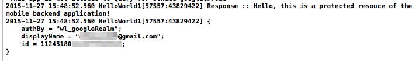

---

copyright:
  years: 2015, 2016, 2017
lastupdated: "2017-03-15"

---
{:new_window: target="_blank"}
{:shortdesc: .shortdesc}
{:screen: .screen}
{:codeblock: .codeblock}
{:pre: .pre}

El servicio {{site.data.keyword.amafull}} se sustituye por el servicio {{site.data.keyword.appid_full}}.

# Habilitación de la autenticación de Google para apps de Cordova
{: #google-auth-cordova}

Para integrar las aplicaciones de Cordova de {{site.data.keyword.amafull}} para la autenticación de Google, debe realizar cambios en el código de la plataforma nativo de la aplicación de Cordova (Java u Objective-C) y en Cordova WebView (Javascript). Debe configurar cada plataforma por separado. Utilice el entorno de desarrollo nativo para realizar cambios en el código nativo; por ejemplo, en Android Studio o Xcode.

## Antes de empezar
{: #before-you-begin}

Debe tener lo siguiente:

* Un proyecto Cordova que esté instrumentado con el SDK de cliente {{site.data.keyword.amashort}}.  Para obtener más información, consulte [Configuración del plugin de Cordova](https://console.{DomainName}/docs/services/mobileaccess/getting-started-cordova.html).  
* Una instancia de una aplicación {{site.data.keyword.Bluemix_notm}} que esté protegida por el servicio {{site.data.keyword.amashort}}. Para obtener más información sobre la creación de un servicio de programa de fondo {{site.data.keyword.Bluemix_notm}}, consulte [Cómo empezar](index.html).
* La ruta de la aplicación. Es el URL de la aplicación de programa de fondo.
* Su **TenantID**. Abra el servicio en el panel de control de {{site.data.keyword.Bluemix_notm}}. Pulse **Opciones móviles**. El valor `tenantId` (también conocido como `appGUID`) se muestra en el campo **GUID de app / TenantId**. Necesitará este valor para inicializar el gestor de autorización.
*  Busque la región en la que se aloja su aplicación {{site.data.keyword.Bluemix_notm}}. Encontrará su región de Bluemix actual en la cabecera, junto al icono **Avatar** . El valor de región debe ser uno de los siguientes: **EE.UU. sur**, **Sídney** o **Reino Unido**. Los valores constantes de SDK exactos que se corresponden con estos nombres se indican en los ejemplos de código.
* (opcional) Familiarícese con las secciones siguientes:
   * [Habilitación de la autenticación de Google para apps de Android](https://console.{DomainName}/docs/services/mobileaccess/google-auth-android.html)
   * [Habilitación de la autenticación de Google para apps de iOS](https://console.{DomainName}/docs/services/mobileaccess/google-auth-ios-swift-sdk.html)


## Configuración de la plataforma Android
{: #google-auth-cordova-android}

Los pasos necesarios para configurar la plataforma Android de una aplicación de Cordova para la autenticación de Google son muy parecidos a los pasos necesarios para las aplicaciones nativas. Consulte [Habilitación de la autenticación de Google para apps de Android](https://console.{DomainName}/docs/services/mobileaccess/google-auth-android.html) y configure lo siguiente:

   * [Creación de un proyecto en Google Developer Console](https://console.{DomainName}/docs/services/mobileaccess/google-auth-android.html#create-google-project). Muestra cómo configurar el servicio de autenticación en el sitio web de Google Developers.
   * [Configuración de MCA para la autenticación de Google](https://console.{DomainName}/docs/services/mobileaccess/google-auth-android.html#google-auth-android-config). Muestra cómo configurar {{site.data.keyword.amashort}} para utilizar la autorización de Google.

### Configure el SDK de cliente {{site.data.keyword.amashort}} para Android Cordova

1. En la carpeta del proyecto de Android, abra el archivo `build.gradle` para el módulo de aplicación (**no** el archivo `build.gradle` del proyecto).
	Busque la sección de dependencias y añada una nueva dependencia de compilación para el SDK del cliente:

	```Gradle
	dependencies {
		compile group: 'com.ibm.mobilefirstplatform.clientsdk.android',
        name:'googleauthentication',
        version: '2.+',
        ext: 'aar',
        transitive: true
    	// otras dependencias
	}
	```
	{: codeblock}

1. Sincronice el proyecto con Gradle pulsando **Tools > Android > Sync Project with Gradle Files**.

1. La API `GoogleAuthenticationManager` debe registrarse en código nativo. Añada este código al método `onCreate` de la actividad principal:

	```Java
	String tenantId = "<tenantId>";
	MCAAuthorizationManager mcaAuthorizationManager = MCAAuthorizationManager.createInstance(this.getApplicationContext(),tenantId);
	BMSClient.getInstance().setAuthorizationManager(mcaAuthorizationManager);
	GoogleAuthenticationManager.getInstance().registerDefaultAuthenticationListener(this);
	```
	{: codeblock}

1. Añada el código siguiente a la actividad:

	```Java
	@Override
	protected void onActivityResult(int requestCode, int resultCode, Intent data) {
		super.onActivityResult(requestCode, resultCode, data);
		GoogleAuthenticationManager.getInstance()
			.onActivityResultCalled(requestCode, resultCode, data);
	}
	```
	{: codeblock}

## Configuración de la plataforma iOS
{: #google-auth-cordova-ios}

Los pasos necesarios para configurar la plataforma iOS de una aplicación de Cordova para la integración de la autenticación de Google son muy parecidos a los pasos para las aplicaciones nativas. La principal diferencia es que la CLI actualmente no admite el gestor de dependencias de CocoaPods. Debe añadir manualmente los archivos necesarios para la integración con la autenticación de Google. Para obtener más información, consulte [Habilitación de la autenticación de Google en apps de iOS (Swift SDK)](https://console.{DomainName}/docs/services/mobileaccess/google-auth-ios-swift-sdk.html). Siga los pasos siguientes:

   * [Preparación de la app para el inicio de sesión de Google](https://console.{DomainName}/docs/services/mobileaccess/google-auth-ios-swift-sdk.html#google-sign-in-ios): Prepara el inicio de sesión de Google para la autenticación de las aplicaciones iOS de {{site.data.keyword.amashort}}.

   * [Configuración de MCA para la autenticación de Google](https://console.{DomainName}/docs/services/mobileaccess/google-auth-ios-swift-sdk.html#google-auth-ios-config): Configura el servicio {{site.data.keyword.amashort}} para que funcione con el inicio de sesión de Google.

   * [Configuración del SDK de cliente MCA para iOS](https://console.{DomainName}/docs/services/mobileaccess/google-auth-ios-swift-sdk.html#google-auth-ios-sdk): Configura el cliente {{site.data.keyword.amashort}} para que funciones con el inicio de sesión de Google.


### Habilitación de Keychain Sharing para iOS
{: #enable_keychain}

Habilite `Keychain Sharing`. Vaya al separador `Capacidades` y `active` `Keychain Sharing` en el proyecto Xcode.


### Inicialización del gestor de autorización en el código iOS

Inicialice el gestor de autorización de {{site.data.keyword.amashort}} en Objective-C en el archivo `AppDelgate.m`.

```
#import "<your_module_name>-Swift.h"

- (BOOL)application:(UIApplication *)application didFinishLaunchingWithOptions:(NSDictionary *)launchOptions

{
	[CDVBMSClient initMCAAuthorizationManagerManagerWithTenantId:@"<tenantId>"];

	[[GoogleAuthenticationManager sharedInstance] register];

	self.viewController = [[MainViewController alloc] init];

	[[GoogleAuthenticationManager sharedInstance] onFinishLaunchingWithApplication:application withOptions:launchOptions];

	return [super application:application didFinishLaunchingWithOptions:launchOptions];
}

- (BOOL)application: (UIApplication *)application openURL: (NSURL *)url
					sourceApplication: (NSString *)sourceApplication annotation: (id)annotation {
	return [[GoogleAuthenticationManager sharedInstance] onOpenURLWithApplication:application url:url 
	sourceApplication:sourceApplication annotation:annotation];
}
```
{: codeblock}


####Nota:
{: #note notoc}

* Sustituya `<your_module_name>` por el nombre de módulo del proyecto. Por ejemplo, si el nombre del módulo es `Cordova`, la línea de importación debe ser `#import "Cordova-Swift.h"` Para encontrar el nombre del módulo vaya al separador `Crear configuración`, `Paquete` > `Nombre del módulo del producto`.
* Sustituya `<tenantId>` por su id de arrendatario (consulte [Antes de empezar](#before-you-begin)).


## Inicialización del SDK del cliente de {{site.data.keyword.amashort}} en Cordova WebView
{: #google-auth-cordova-initialize}

Para todas las plataformas, utilice el siguiente código Javascript en la aplicación de Cordova para inicializar el SDK del cliente de {{site.data.keyword.amashort}}.

```JavaScript
BMSClient.initialize("<applicationBluemixRegion>");
```
{: codeblock}

Sustituya `<applicationBluemixRegion>` por su región (consulte [Antes de empezar](#before-you-begin)).

## Prueba de autenticación
{: #google-auth-cordova-test}

Después de inicializar el SDK del cliente, puede empezar a realizar solicitudes a la aplicación de programa de fondo móvil.

### Antes de empezar
{: #google-auth-cordova-testing-before}

Debe disponer de una aplicación de programa de fondo protegida por {{site.data.keyword.amashort}} en el punto final `/protected`. Si tiene que configurar un punto final `/protected`, consulte [Protección de recursos](https://console.{DomainName}/docs/services/mobileaccess/protecting-resources.html).

1. Intente enviar una solicitud al punto final protegido de su aplicación de fondo móvil en su navegador de escritorio abriendo `{applicationRoute}/protected`, por ejemplo `http://my-mobile-backend.mybluemix.net/protected`.

1. El punto final `/protected` de una aplicación móvil de fondo creada con MobileFirst Services Boilerplate está protegido con {{site.data.keyword.amashort}}; por tanto, solo se puede acceder al mismo mediante aplicaciones móviles instrumentadas con el SDK del cliente {{site.data.keyword.amashort}}. Como resultado, verá `Unauthorized` en el navegador de escritorio.

1. Utilice la aplicación de Cordova para realizar una solicitud al mismo punto final utilizando el URL completo (por ejemplo, `http://my-mobile-backend.mybluemix.net/protected`). Añada el siguiente código después de inicializar `BMSClient`.

	```JavaScript
	var success = function(data){
    	console.log("success", data);
    }
	var failure = function(error)
    	{console.log("failure", error);
    }
	var request = new BMSRequest("<your-application-route>", BMSRequest.GET);
	request.send(success, failure);
	```
	{: codeblock}

1. Ejecute la aplicación. Se visualiza una pantalla de inicio de sesión de Google.

	

	

	Esta pantalla puede ser ligeramente diferente si no tiene instalada la app de Facebook en su dispositivo, o bien si no ha iniciado sesión en Facebook.

1. Si pulsa **Aceptar** está autorizando que {{site.data.keyword.amashort}} utilice su identidad de usuario de Google para fines de autenticación.

1. Su solicitud debería realizarse correctamente. Según la plataforma que utilice, verá la salida siguiente en la consola LogCat/Xcode:

	

	
