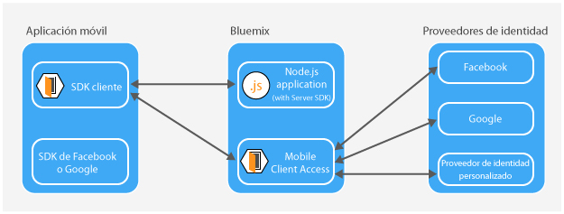

---

copyright:
  years: 2015, 2016, 2017
lastupdated: "2017-01-15"

---

{:new_window: target="_blank"}
{:shortdesc: .shortdesc}
{:screen: .screen}
{:codeblock: .codeblock}
{:pre: .pre}

# Acerca de {{site.data.keyword.amashort}}
{: #mca-overview}

El servicio de {{site.data.keyword.amafull}} proporciona autenticación para aplicaciones móviles y web que acceden a recursos alojados en {{site.data.keyword.Bluemix_notm}}.

Puede utilizar el servicio de {{site.data.keyword.amashort}} para proteger las aplicaciones de Node.js y Liberty for Java&trade; que estén alojadas en {{site.data.keyword.Bluemix_notm}} con varios tipos de autenticación. Al instrumentar las aplicaciones móviles con el SDK de {{site.data.keyword.amashort}}, puede utilizar las prestaciones de autenticación que proporciona el servicio de {{site.data.keyword.amashort}}. Utilice el panel de control de {{site.data.keyword.amashort}} para configurar los diversos tipos de autenticación y ver los datos que se recopilan y se envían desde el SDK del lado de cliente.

**Nota**: el servicio de {{site.data.keyword.amashort}} anteriormente se conocía como Advanced Mobile Access.

## Componentes
{: #components}

* **Panel de control de {{site.data.keyword.amashort}}**: configure diversos tipos de aplicaciones

* **SDK del cliente de {{site.data.keyword.amashort}}**: prepare las aplicaciones móviles para que utilicen la funcionalidad {{site.data.keyword.amashort}}. Las plataformas admitidas son: iOS 8+, Android 4+, Cordova y aplicaciones web.

* **SDK del servidor de {{site.data.keyword.amashort}}**: proteja los recursos que se alojan en {{site.data.keyword.Bluemix_notm}}. Los tiempos de ejecución que se admiten actualmente son Node.js y Liberty for Java&trade;.

## Tipos de autenticación
{: #authtypes}
Puede utilizar los siguientes tipos de autenticación en la app móvil:

* **Facebook**: utilice Facebook como proveedor de identidad. Los usuarios inician sesión en la app móvil o web con las credenciales de Facebook.

* **Google**: utilice Google como proveedor de identidad. Los usuarios inician sesión en la app móvil o web con las credenciales de Google+.

* **Personalizada**: cree un proveedor de identidad. Controlará totalmente qué tipo de información se recopila y valida.

## Visión general de la arquitectura
{: #architecture}

* Proteja los recursos de nube (aplicaciones Node.js) con el SDK del servidor de {{site.data.keyword.amashort}}.

* Utilice la clase `Request` que proporciona el SDK del cliente de {{site.data.keyword.amashort}} para la comunicación con los recursos de nube protegidos.

* El SDK del servidor de {{site.data.keyword.amashort}} detecta una solicitud no autorizada y devuelve un error de autorización HTTP 401.

* El SDK del cliente de {{site.data.keyword.amashort}} detecta el error de autorización HTTP 401 e inicia automáticamente el proceso de autenticación con el servicio de {{site.data.keyword.amashort}}.

* Se ha intentado la autenticación de Facebook, Google o Personalizada.

* Después de una autenticación satisfactoria, {{site.data.keyword.amashort}} devuelve una señal de autorización.

* El SDK del cliente de {{site.data.keyword.amashort}} añade automáticamente la señal de autorización a la solicitud original y vuelve a enviar la solicitud al recurso de nube.

* El SDK del servidor de {{site.data.keyword.amashort}} extrae la señal de acceso de la solicitud y la valida con el servicio de {{site.data.keyword.amashort}}.

* Se otorga el acceso.  La respuesta se devuelve a la aplicación móvil.

## Flujo de solicitudes
{: #flow}
En el diagrama siguiente se describe el flujo de una solicitud, desde el SDK del cliente a los proveedores de identidad y programa de fondo móvil.

* Utilice el SDK de {{site.data.keyword.amashort}} para realizar una solicitud a los recursos de fondo que están protegidos por el SDK del servidor de {{site.data.keyword.amashort}}.
* El SDK del servidor de {{site.data.keyword.amashort}} detecta una solicitud no autorizada y devuelve HTTP 401 y un ámbito de autorización.
* El SDK del cliente de {{site.data.keyword.amashort}} detecta automáticamente el código HTTP 401 e inicia el proceso de autenticación.
* El SDK del cliente de {{site.data.keyword.amashort}} contacta con el servicio de {{site.data.keyword.amashort}} y solicita que emita una cabecera de autorización.
* El servicio de {{site.data.keyword.amashort}} solicita a la app del cliente que realice la autenticación primero proporcionando el cambio de autenticación según el tipo de autenticación configurado actualmente.
* Según el tipo de autenticación, el SDK del cliente de {{site.data.keyword.amashort}}:
   * Autenticación de Facebook o Google: procesa automáticamente el cambio de autenticación
   * Autenticación personalizada: obtiene las credenciales basadas en la lógica que proporcione el desarrollador.
* Si se configura la autenticación de Facebook o Google, el SDK del cliente de {{site.data.keyword.amashort}} utiliza el SDK asociado para obtener las señales de acceso de Facebook o Google. Estas señales sirven de respuesta al cambio de autenticación.
* Si se configura la autenticación Personalizada, el desarrollador debe obtener la respuesta al cambio de autenticación y suministrarla al SDK del cliente de {{site.data.keyword.amashort}}.
* Después de obtenerse la respuesta al cambio de autenticación, se envía al servicio de {{site.data.keyword.amashort}}.
* El servicio valida la respuesta al cambio de autenticación con el proveedor de identidad correspondiente (Facebook/Google/Custom).
* Si la validación es satisfactoria, el servicio de {{site.data.keyword.amashort}} genera una cabecera de autorización y la devuelve al SDK del cliente de {{site.data.keyword.amashort}}. La cabecera de autorización contiene dos señales: una señal de acceso con información sobre permisos de acceso y una señal de ID que incluye información sobre la aplicación, el dispositivo y el usuario actuales.
* A partir de este momento, todas las solicitudes realizadas con el SDK del cliente de {{site.data.keyword.amashort}} tendrán una cabecera de autorización nueva.
* El SDK del cliente de {{site.data.keyword.amashort}} vuelve a enviar automáticamente la solicitud original que activó el flujo de autorización.
* El SDK del servidor de {{site.data.keyword.amashort}} extrae la cabecera de autorización de la solicitud, valida la cabecera con el servicio de {{site.data.keyword.amashort}} y otorga acceso a un recurso de fondo.

## Obtener ayuda y soporte para {{site.data.keyword.amashort}}
{: #gettinghelp}

Si tiene problemas o preguntas a la hora de utilizar {{site.data.keyword.amashort}}, obtendrá ayuda en la información que encuentre o planteando preguntas en el foro. También puede abrir una incidencia de soporte. 

Si utiliza el foro para hacer preguntas, etiquete su pregunta para que los equipos de desarrolladores de {{site.data.keyword.Bluemix_notm}} la puedan ver.

* Si tiene preguntas técnicas sobre el desarrollo o despliegue de una app con {{site.data.keyword.amashort}}, publique la pregunta en [Stack Overflow ](http://stackoverflow.com/search?q={{site.data.keyword.amashort}}+ibm-bluemix "Icono de enlace externo"){: new_window} y etiquete la pregunta con "ibm-bluemix" y "{{site.data.keyword.amashort}}".
* Para preguntas referidas al servicio e instrucciones de cómo empezar, utilice el foro de [IBM developerWorks ](https://developer.ibm.com/answers/search.html?f=&type=question&redirect=search%2Fsearch&sort=relevance&q=mobile+client+access%20%2B[bluemix] "Icono de enlace externo"){: new_window}.

. 

Consulte [Obtención de ayuda](https://www.{DomainName}/docs/support/index.html#getting-help) para obtener más detalles sobre el uso de los foros.

Para obtener información sobre cómo abrir una incidencia de soporte de IBM o sobre los niveles de soporte y la gravedad de las incidencias, consulte [Cómo obtener soporte](https://www.{DomainName}/docs/support/index.html#contacting-support).

