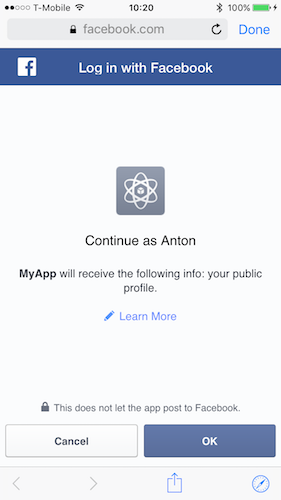

---

copyright:
  years: 2015, 2016, 2017
lastupdated: "2017-01-15"

---

{:new_window: target="_blank"}
{:shortdesc: .shortdesc}
{:screen: .screen}
{:codeblock: .codeblock}
{:pre: .pre}


# Activation de l'authentification Facebook pour les applications Cordova
{: #facebook-auth-cordova}

Pour configurer les applications Cordova d'{{site.data.keyword.amafull}} pour l'intégration d'authentification Facebook, configurez chaque plateforme séparément. L'application Cordova doit déjà être instrumentée avec le SDK de {{site.data.keyword.amashort}}.

La plateforme native et le code Javascript de Cordova WebView requièrent des modifications afin d'activer l'authentification Facebook.

Utilisez l'environnement de développement natif pour modifier le code natif, par exemple, dans Android Studio ou Xcode.
{:shortdesc}

## Avant de commencer
{: #facebook-auth-before}

Vous devez disposer des éléments suivants :
* Un projet Cordova (Android ou iOS) instrumenté avec le SDK client de {{site.data.keyword.amashort}}, voir [Configuration du plug-in Cordova](getting-started-cordova.html#getting-started-cordova-plugin).
* Une instance d'une application {{site.data.keyword.Bluemix_notm}} protégée par le service {{site.data.keyword.amashort}}. Pour plus d'informations sur la création d'un service de back end {{site.data.keyword.Bluemix_notm}}, voir [Initiation](index.html).
* Route de votre application. Il s'agit de l'URL de votre application back end.
* Valeur de votre `tenantId`. Ouvrez votre tableau de bord de service {{site.data.keyword.amashort}}. Cliquez sur **Options pour application mobile**. La valeur `tenantId` (qui porte également le nom d'`appGUID`) est affichée dans la zone **App GUID / TenantId**. Vous aurez besoin de ces valeurs pour l'initialisation du logiciel SDK et l'envoi de demandes au service de back-end.
*  Trouvez la région où votre service {{site.data.keyword.Bluemix_notm}} est hébergé. Vous pouvez trouver votre région {{site.data.keyword.Bluemix_notm}} actuelle dans l'en-tête, en regard de l'icône **Avatar** dans la barre de menus. La valeur de région doit être l'une des suivantes : **US South**, **Sydney** ou **UK**. Les valeurs des constantes SDK exactes qui correspondent à ces noms sont indiquées dans les exemples de code.
* Un ID d'application et une application Facebook. Pour plus d'informations, voir [Acquisition d'un ID d'application Facebook sur le site Web Facebook for Developer](facebook-auth-overview.html#facebook-appID).


## Configuration de la plateforme Android
{: #facebook-auth-cordova-android}

Les étapes requises pour configurer l'intégration de l'authentification Facebook dans la plateforme Android d'une application Cordova sont très semblables à celles qui sont requises pour les applications natives Android. Pour plus d'informations, voir [Activation de l'authentification Facebook dans les applis Android](facebook-auth-android.html). Exécutez les étapes suivantes :

* [Configuration de l'application Facebook pour la plateforme Android](facebook-auth-android.html#facebook-auth-android-config). Cette fonctionnalité configure l'authentification Facebook sur le site de développeurs Facebook pour les applications Android.
* [Configuration de MCA pour l'authentification Facebook](facebook-auth-android.html#facebook-auth-android-mca). Cette fonctionnalité configure votre service {{site.data.keyword.amashort}} sur le serveur {{site.data.keyword.Bluemix}} pour l'authentification Facebook Android.


### Configuration du SDK client Facebook de {{site.data.keyword.amashort}} pour la plateforme Android
{: #configure_android}

Le SDK du client Facebook de {{site.data.keyword.amashort}} doit être ajouté par Gradle dans votre projet d'application Android natif.

1. Dans votre dossier de projet Android, ouvrez le fichier `build.gradle` pour votre module d'application (et **non pas** le projet `build.gradle`). Localisez la section des dépendances et ajoutez une nouvelle dépendance de compilation pour le SDK client :

	```Gradle
	dependencies {
		compile group: 'com.ibm.mobilefirstplatform.clientsdk.android',
        name:'facebookauthentication',
        version: '2.+',
        ext: 'aar',
        transitive: true
    	// autres dépendances
	}
	```
	{: codeblock}

2. Cliquez sur **Tools (Outils) > Android > Sync Project with Gradle Files (Synchroniser le projet avec les fichiers Gradle)** pour synchroniser votre projet avec Gradle.

3. Ouvrez le fichier `android/res/values/strings.xml` et ajoutez une chaîne `<facebook_app_id>` contenant l'ID de votre application Facebook.

	```XML
	<resources>
		<string name="app_name">HelloCordova</string>
		<string name="launcher_name">@string/app_name</string>
		<string name="activity_name">@string/launcher_name</string>
		<string name="facebook_app_id">"<facebook_app_id>"</string>
	</resources>
	```
	{: codeblock}

4. Dans le fichier `AndroidManifest.xml` de votre projet Android (`android/manifests/AndroidManifest.xml`) :

	* Ajoutez les métadonnées requises pour le SDK Facebook à l'élément <application> :

    ```XML
    <application .......>
    <meta-data
			android:name="com.facebook.sdk.ApplicationId"
			android:value="@string/facebook_app_id"/>

    <activity ...../>
    <activity ...../>
    </application>
    ```
    {: codeblock}

   * Ajoutez un élément Facebook activity sous vos activités existantes :

    ```XML
    <application .....>
        <activity ...../>
		<activity ...../>

        <activity   android:name="com.facebook.FacebookActivity"
	              android:configChanges="keyboard|keyboardHidden|screenLayout|screenSize|orientation"
	              android:theme="@android:style/Theme.Translucent.NoTitleBar"
	              android:label="@string/app_name"
        />
    </application>
    ```
    {: codeblock}

5. Ajoutez le code suivant à votre code Activity Java.

	```Java
	@Override
	protected void onActivityResult(int requestCode, int resultCode, Intent data) {
	   super.onActivityResult(requestCode, resultCode, data);
		FacebookAuthenticationManager.getInstance()
	      .onActivityResultCalled(requestCode, resultCode, data);
	}
	```
	{: codeblock}

### Initialisez le Gestionnaire d'autorisations dans votre code Android natif
{: #initialize_android}

L'API `FacebookAuthenticationManager` doit toujours être enregistrée dans le code natif. Ajoutez ce code à la méthode d'activité principale `onCreate` à l'aide du `<tenantId>` (voir [Avant de commencer](#before-you-begin)).

```
String tenantId = "<tenantId>";
MCAAuthorizationManager mcaAuthorizationManager = MCAAuthorizationManager.createInstance(this.getApplicationContext(),tenantId);
BMSClient.getInstance().setAuthorizationManager(mcaAuthorizationManager);
FacebookAuthenticationManager.getInstance().registerDefaultAuthenticationListener(this);
```
{: codeblock}


## Configuration de la plateforme iOS
{: #facebook-auth-cordova-ios}

Les étapes requises pour configurer l'intégration de l'authentification Facebook sur la plateforme iOS d'une application Cordova sont similaires à
celles requises pour les applications Swift natives iOS (des fichiers d'en-tête sont nécessaires pour utiliser le code Objective-C avec le SDK Swift). La différence principale est que l'interface de ligne de commande Cordova ne prend actuellement pas en charge le gestionnaire de dépendances CocoaPods. Vous devez ajouter manuellement les fichiers requis pour l'intégration du client {{site.data.keyword.amashort}} à l'authentification Facebook. Pour plus d'informations, voir [Activation de l'authentification Facebook pour les applis iOS (SDK Swift)](facebook-auth-ios-swift-sdk.html). Exécutez les étapes suivantes :

* [Configuration de l'application Facebook pour la plateforme iOS](facebook-auth-ios-swift-sdk.html#facebook-auth-ios-config). Cette fonctionnalité configure le service d'authentification Facebook sur le site de développeurs Facebook.
* [Configuration de MCA pour l'authentification Facebook](facebook-auth-ios-swift-sdk.html#facebook-auth-ios-configmca). Cette fonctionnalité configure votre service {{site.data.keyword.amashort}} sur le serveur {{site.data.keyword.Bluemix}}.
* [Configuration du SDK client Facebook MCA pour iOS](facebook-auth-ios-swift-sdk.html#facebook-auth-ios-sdk). Cette option installe le SDK Swift d'iOS {{site.data.keyword.amashort}} pour l'autorisation Facebook à l'aide de CocoaPods.


### Activez le partage de chaîne de certificats pour iOS
{: #enable_keychain}

Activez le partage de chaîne de certificats, `Keychain Sharing`. Accédez à l'onglet `Capabilities` et basculez `Keychain Sharing` sur `On` dans votre projet Xcode.

### Initialisez le Gestionnaire d'autorisations {{site.data.keyword.amashort}} dans Objective-C
{: #initialize_objc}

Le Gestionnaire d'autorisations doit être initialisé dans le code Objective-C natif du fichier `app-delegate.m `, en fonction de votre version de Xcode.

```
	#import "<your_module_name>-Swift.h"

	- (BOOL)application:(UIApplication*)application didFinishLaunchingWithOptions:(NSDictionary*)launchOptions

	{

	    [CDVBMSClient initMCAAuthorizationManagerManagerWithTenantId:@"<tenantId>"];

	    [[FacebookAuthenticationManager sharedInstance] register];

	    self.viewController = [[MainViewController alloc] init];

	    [[FacebookAuthenticationManager sharedInstance] onFinishLaunchingWithApplication:application withOptions:launchOptions];


	    return [super application:application didFinishLaunchingWithOptions:launchOptions];
	}


	- (BOOL)application: (UIApplication *)application openURL: (NSURL *)url sourceApplication: (NSString *)sourceApplication annotation: (id)annotation {

	   return [[FacebookAuthenticationManager sharedInstance] onOpenURLWithApplication:application 
	   		url:url sourceApplication:sourceApplication annotation:annotation];
	}

```
{: codeblock}

**Remarque :** le nom du fichier d'en-têtes importé est composé du nom de votre module concaténé à la chaîne `-Swift.h`, par exemple, si le nom de votre module est `Cordova` alors la ligne d'importation est `#import "Cordova-Swift.h"`. Pour trouver le nom du module, allez à
`Build Settings` > `Packaging` > `Product Module Name`.

Remplacez `<tenantId>` par l'DI de votre locataire (voir [Avant de commencer](#facebook-auth-before)).


##Initialisation du SDK client {{site.data.keyword.amashort}} dans le WebView Cordova
{: #initialize_webview}

Pour toutes les plateformes, utilisez le code JavaScript suivant dans votre WebView Javascript Cordova pour initialiser le SDK client de {{site.data.keyword.amashort}}.

```javascript
BMSClient.initialize(<applicationBluemixRegion>);
```
{: codeblock}

Remplacez `<applicationBluemixRegion>` par votre région (voir [Avant de commencer](#facebook-auth-before)).

## Test de l'authentification
{: #facebook-auth-cordova-test}

Une fois que le SDK client est initialisé et que le gestionnaire d'authentification Facebook est enregistré, vous pouvez commencer à envoyer des requêtes à
votre service back end mobile.

### Avant de commencer
{: #testing_auth_before}

Vous devez utiliser le conteneur boilerplate {{site.data.keyword.mobilefirstbp}} et disposer au préalable d'une ressource protégée par {{site.data.keyword.amashort}} sur le noeud final `/protected`. Pour plus d'informations, voir [Protection des ressources](protecting-resources.html).

1. Essayez d'envoyer depuis votre navigateur une requête à un noeud final protégé de votre application back end mobile. Ouvrez l'URL suivante :
`{applicationRoute}/protected`. Exemple : `http://my-mobile-backend.mybluemix.net/protected`.

	La valeur du noeud final `/protected` doit être tout noeud final protégé d'un service back end mobile, créée avec le conteneur boilerplate MobileFirst Services Starter et est
protégée par {{site.data.keyword.amashort}}. Un message signalant l'interdiction d'accéder au site (`Unauthorized`) est renvoyé au navigateur. Ce message est renvoyé car ce noeud final n'est accessible qu'aux applications mobiles instrumentées avec le SDK client de {{site.data.keyword.amashort}}.

1. A l'aide de votre application Cordova, envoyez une demande au même noeud final. Ajoutez le code ci-dessous après avoir initialisé `BMSClient` :

	```JavaScript
	var success = function(data){
    	console.log("success", data);
    }
	var failure = function(error){
    	console.log("failure", error);
    }
	var request = new BMSRequest("<applicationRoute}/protected>", BMSRequest.GET);
	request.send(success, failure);
	```
	{: codeblock}

1. Lancez votre application. Un écran de connexion Facebook s'affiche :

	 &nbsp;&nbsp;&nbsp;&nbsp;&nbsp;&nbsp;&nbsp;&nbsp;&nbsp;	

	Cet écran peut être légèrement différent si l'appli Facebook n'est pas installée sur votre appareil, ou si vous n'y êtes pas connecté.

1. Cliquez sur **OK** pour autoriser {{site.data.keyword.amashort}} à utiliser votre ID utilisateur Facebook pour l'authentification.

1. 	Lorsque votre demande aboutit, la sortie suivante figure dans l'utilitaire LogCat ou la console Xcode :

	

	
