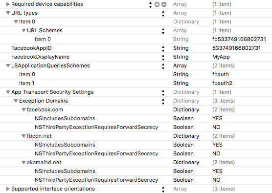

---

copyright:
  years: 2015, 2016
lastupdated: "2016-11-03"

---
{:shortdesc: .shortdesc}

# Abilitazione dell'autenticazione Facebook per le tue applicazioni iOS (SDK Objective-C)
{: #facebook-auth-ios}

Per utilizzare Facebook come un provider di identità nelle tue applicazioni iOS {{site.data.keyword.amafull}}, aggiungi e configura la piattaforma iOS per la tua applicazione Facebook.

{:shortdesc}

**Nota:** mentre la SDK Objective-C SDK rimane completamente supportata ed è ancora considerata la SDK primaria per i servizi mobili {{site.data.keyword.Bluemix}}, è pianificato di abbandonarla più avanti questo anno in favore della nuova SDK Swift (consulta [Configurazione dell'SDK Swift iOS](facebook-auth-ios-swift-sdk.html)).

## Prima di cominciare
{: #before-you-begin}

È necessario disporre di:
* Un progetto iOS configurato per lavorare con CocoaPods.  Per ulteriori informazioni, vedi **Installa CocoaPods** in  [Configurazione dell'SDK iOS](https://console.{DomainName}/docs/services/mobileaccess/getting-started-ios.html).  
   **Nota:** non è necessario installare l'SDK {{site.data.keyword.amashort}} core prima di procedere.
* Un'istanza di un'applicazione  {{site.data.keyword.Bluemix_notm}} che è protetta da un servizio {{site.data.keyword.amashort}}. Per ulteriori informazioni su come creare un back-end {{site.data.keyword.Bluemix_notm}}, consulta [Introduzione](index.html).
* Il tuo valore **AppGUID**. Apri il tuo servizio nel dashboard {{site.data.keyword.amashort}}. Fai clic sul pulsante **Opzioni per dispositivi mobili**. Il valore `appGUID` (noto anche come `tenantId`)  viene visualizzato nel campo **GUID applicazione / TenantId**. Avrai bisogno di questo valore per inizializzare il gestore autorizzazione.
* Un'applicazione Facebook e l'ID applicazione. Per ulteriori informazioni, vedi [Creazione di un'applicazione nel sito web Facebook for Developers](https://console.{DomainName}/docs/services/mobileaccess/facebook-auth-overview.html#facebook-appID).

## Configurazione della tua applicazione Facebook per la piattaforma iOS
{: #facebook-auth-ios-config}
Sul sito Facebook for Developers:

1. Accedi al tuo account in  [Facebook for Developers](https://developers.facebook.com). 

1. Assicurati che la piattaforma iOS sia stata aggiunta alla tua applicazione. Quando aggiungi o configuri la piattaforma iOS devi fornire il **bundleId** della tua applicazione iOS. Per trovare il **bundleId** della tua applicazione iOS, cerca il **Bundle Identifier**
nel file `info.plist` o nella scheda **General** del progetto Xcode.

1. Fai clic su **Save Settings**.

	**Suggerimento:**: valuta l'abilitazione del suffisso di schema URL o di SSO (Single Sign On) se intendi utilizzare tali funzioni.

1. Fai clic su **Save Settings**.

## Configurazione di {{site.data.keyword.amashort}} per l'autenticazione Facebook
{: #facebook-auth-ios-configmca}

Dopo che hai configurato l'ID applicazione Facebook e la tua applicazione Facebook perché serva client iOS, puoi abilitare l'autenticazione Facebook in {{site.data.keyword.amashort}}.

1. Apri il tuo servizio nel dashboard {{site.data.keyword.amashort}}.
1. Dalla scheda **Manage**, attiva **Authorization**.
	1. Espandi la sezione **Facebook**.
	1. Aggiungi l'**ID applicazione Facebook** e fai clic su **Salva**.

## Configurazione dell'SDK client Facebook {{site.data.keyword.amashort}} per iOS
{: #facebook-auth-ios-sdk}

### Installazione di CocoaPods
{: #facebook-auth-cocoapods}

L'SDK client {{site.data.keyword.amashort}} è distribuito con CocoaPods, un gestore dipendenze per i progetti iOS. CocoaPods scarica automaticamente le risorse utente dai repository e le rende disponibili alla tua applicazione iOS.

1. Apri il terminale ed esegui il comando `pod --version`. Se già hai CocoaPods installato, viene visualizzato il numero versione. Puoi passare direttamente alla sezione successiva di questa esercitazione.

1. Installa CocoaPods eseguendo `sudo gem install cocoapods`. Fai riferimento al [sito web CocoaPods](https://cocoapods.org/) nel caso ti occorrano ulteriori indicazioni.

### Installazione dell'SDK client Facebook {{site.data.keyword.amashort}} con CocoaPods
{: #facebook-auth-install-cocoapods}

1. Nel tuo progetto iOS, modifica il `Podfile` e la seguente riga:

	```
	pod 'IMFFacebookAuthentication'
	```
{: codeblock}

1. Salva il `Podfile` ed esegui il comando `pod install` dalla riga di comando. CocoaPods installa le dipendenze. Vengono visualizzati lo stato di avanzamento e quali componenti sono stati aggiunti.
 **Importante**: devi ora aprire il tuo progetto utilizzando il file `xcworkspace` che viene generato da CocoaPods. Di norma, il
nome è `{il-tuo-nome-progetto}.xcworkspace`.  

1. Esegui `open {il-tuo-nome-progetto}.xcworkspace` dalla riga di comando per aprire il tuo spazio di lavoro del progetto iOS.

### Configurazione del tuo progetto iOS per l'autenticazione Facebook
{: #facebook-auth-ios-configproject}

1. Trova il file `info.plist`, che di solito si trova nella cartella `Supporting files` nel tuo progetto Xcode.

1. Configura l'integrazione Facebook aggiungendo le seguenti proprietà al tuo file `info.plist`:

	

Puoi anche aggiornare il file `info.plist` facendo clic con il pulsante destro del mouse su di esso, selezionando **Open as > Source Code** e aggiungendo il seguente XML:

```XML
<key>CFBundleURLTypes</key>
<array>
	<dict>
		<key>CFBundleURLSchemes</key>
		<array>
			<string>fb{your-facebook-application-id}</string>
		</array>
	</dict>
</array>
<key>FacebookAppID</key>
<string>{your-facebook-application-id}</string>
<key>FacebookDisplayName</key>
<string>MyApp</string>
<key>LSApplicationQueriesSchemes</key>
<array>
	<string>fbauth</string>
	<string>fbauth2</string>
</array>
<key>NSAppTransportSecurity</key>
<dict>
    <key>NSExceptionDomains</key>
    <dict>
        <key>facebook.com</key>
        <dict>
            <key>NSIncludesSubdomains</key>
            <true/>
            <key>NSThirdPartyExceptionRequiresForwardSecrecy</key>
            <false/>
        </dict>
        <key>fbcdn.net</key>
        <dict>
            <key>NSIncludesSubdomains</key>
            <true/>
            <key>NSThirdPartyExceptionRequiresForwardSecrecy</key>
            <false/>
        </dict>
        <key>akamaihd.net</key>
        <dict>
            <key>NSIncludesSubdomains</key>
            <true/>
            <key>NSThirdPartyExceptionRequiresForwardSecrecy</key>
            <false/>
        </dict>
    </dict>
</dict>
```
{: codeblock}

Aggiorna le proprietà schema URL e `FacebookappID` con il tuo **ID applicazione Facebook**.

 **Importante**: assicurati di non sovrascrivere alcuna proprietà esistente nel file `info.plist`. Se hai delle proprietà che si sovrappongono, devi unirle manualmente. Per ulteriori informazioni, vedi [Configure Xcode Project](https://developers.facebook.com/docs/ios/getting-started/) e [Preparing Your Apps for iOS9](https://developers.facebook.com/docs/ios/ios9).


## Inizializzazione dell'SDK client {{site.data.keyword.amashort}}
{: #facebook-auth-ios-initalize}

Inizializza l'SDK client passando la rotta della tua applicazione (`applicationRoute`) e il GUID applicazione (`applicationGUID`).

Un punto comune, seppure non obbligatorio, dove inserire il codice di inizializzazione è nel metodo `application:didFinishLaunchingWithOptions` del tuo delegato dell'applicazione.


1. Importa il framework richiesto nella classe che desideri utilizzi l'SDK client {{site.data.keyword.amashort}} aggiungendo le seguenti intestazioni:

	####Objective-C
	{: #framework-objc}

	```Objective-C
	#import <IMFCore/IMFCore.h>
	#import <IMFFacebookAuthentication/IMFFacebookAuthenticationHandler.h>
	#import <FacebookSDK/FacebookSDK.h>
	```	

	####Swift
	{: #bridgingheader-swift}

	L'SDK client {{site.data.keyword.amashort}} è implementato utilizzando Objective-C, pertanto potresti dover aggiungere un'intestazione di collegamento al tuo progetto swift.

	1. Fai clic con il pulsante destro del mouse sul tuo progetto in Xcode e seleziona **New File...**
		1. Nella categoria **iOS Source**, scegli `Header file`.
		1. Denominalo `BridgingHeader.h`.
		1. Aggiungi le importazioni alla tua intestazione di collegamento:

			```Objective-C
			#import <IMFCore/IMFCore.h>
			#import <IMFFacebookAuthentication/IMFFacebookAuthenticationHandler.h>
			#import <FacebookSDK/FacebookSDK.h>
			```

	1. Fai clic sul tuo progetto in Xcode e seleziona la scheda **Build Settings**.
		1. Cerca **Objective-C Bridging Header**.
		1. Imposta il valore sull'ubicazione del tuo file `BridgingHeader.h`, ad esempio: `$(SRCROOT)/MyApp/BridgingHeader.h`.
		1. Assicurati che la tua intestazione di collegamento venga rilevata da Xcode compilando il tuo progetto. Non dovresti vedere alcun messaggio di errore.

2. Inizializza l'SDK client.	Per informazioni su come ottenere `applicationRoute` e `applicationGUID`, vedi [Prima di cominciare](#before-you-begin).

	####Objective-C
	{: #approute-objc}

	```Objective-C
	[[IMFClient sharedInstance]
			initializeWithBackendRoute:@"applicationRoute"
			backendGUID:@"applicationGUID"];
	```

	####Swift
	{: #approute-swift}

	```Swift
	IMFClient.sharedInstance().initializeWithBackendRoute("applicationRoute",
	 							backendGUID: "applicationGUID")
	```

1. Inizializza `AuthorizationManager` trasmettendo al servizio  {{site.data.keyword.amashort}} il parametro `tenantId`. Vedi [Prima di cominciare](#before-you-begin).

	####Objective-C
	{: #authman-objc}

	```Objective-C
     [[IMFAuthorizationManager sharedInstance]  initializeWithTenantId: @"tenantId"];
	```

	####Swift
	{: #authman-swift}

	```Swift
  IMFAuthorizationManager.sharedInstance().initializeWithTenantId("tenantId")
	```

1. Segnala all'SDK Facebook l'attivazione dell'applicazione e registra il gestore autenticazione Facebook aggiungendo il seguente codice al
metodo `application:didFinishLaunchingWithOptions` nel tuo delegato dell'applicazione. Aggiungi questo codice dopo che hai inizializzato l'istanza IMFClient.

	####Objective-C
	{: #activate-objc}

	```Objective-C
		[FBAppEvents activateApp];
		[[IMFFacebookAuthenticationHandler sharedInstance] registerWithDefaultDelegate];
	```

	####Swift
	{: #activate-swift}

	```Swift
		FBAppEvents.activateApp()
		IMFFacebookAuthenticationHandler.sharedInstance().registerWithDefaultDelegate()
	```

1. Aggiungi il seguente codice al tuo delegato dell'applicazione.

	####Objective-C
	{: #appdelegate-objc}

	```Objective-C
	- (BOOL)application:(UIApplication *)application openURL:(NSURL *)url
			sourceApplication:(NSString *)sourceApplication annotation:(id)annotation {

		return [FBAppCall handleOpenURL:url sourceApplication:sourceApplication];
	}
	```

	####Swift
	{: #appdelegate-swift}

	```Swift
	func application(application: UIApplication, openURL url: NSURL,
					sourceApplication: String?, annotation: AnyObject) -> Bool {

		return FBAppCall.handleOpenURL(url, sourceApplication: sourceApplication)

	}
```


## Verifica dell'autenticazione
{: #facebook-auth-ios-testing}
Dopo che l'SDK client è stato inizializzato e il gestore autenticazione Facebook è stato registrato, puoi iniziare a effettuare richieste al tuo backend mobile.

### Prima di cominciare
{: #facebook-auth-ios-testing-before}
Devi utilizzare il contenitore tipo {{site.data.keyword.mobilefirstbp}} e disporre già di una risorsa protetta da {{site.data.keyword.amashort}} all'endpoint `/protected`. Se devi configurare un endpoint `/protected`, consulta [Protezione delle risorse](https://console.{DomainName}/docs/services/mobileaccess/protecting-resources.html).

1. Prova a inviare una richiesta all'endpoint protetto del backend mobile appena creato nel tuo browser. Apri il seguente URL: `{applicationRoute}/protected`.
Ad esempio: `http://my-mobile-backend.mybluemix.net/protected`
<br/>L'endpoint `/protected` di un backend mobile creato con il contenitore tipo MobileFirst Services Starter è protetto con {{site.data.keyword.amashort}}. Nel tuo browser viene restituito un messaggio `Unauthorized`. Questo messaggio viene restituito perché a questo endpoint possono accedere solo le applicazioni mobili strumentate con l'SDK client{{site.data.keyword.amashort}}.

1. Utilizza la tua applicazione iOS per effettuare una richiesta allo stesso endpoint.

	####Objective-C
	{: #requestpath-objc}

	```Objective-C
	NSString *requestPath = [NSString stringWithFormat:@"%@/protected",
								[[IMFClient sharedInstance] backendRoute]];

	IMFResourceRequest *request =  [IMFResourceRequest
				requestWithPath:requestPath
				method:@"GET"];

	[request sendWithCompletionHandler:^(IMFResponse *response, NSError *error) {
		if (error){
			NSLog(@"Error :: %@", [error description]);
		} else {
			NSLog(@"Response :: %@", [response responseText]);
			NSLog(@"%@", [[IMFAuthorizationManager sharedInstance] userIdentity]);
		}
	}];
	```

	####Swift
	{: #requestpath-swift}

	```Swift
	let requestPath = IMFClient.sharedInstance().backendRoute + "/protected"

	let request = IMFResourceRequest(path: requestPath, method: "GET");
	request.sendWithCompletionHandler { (response, error) -> Void in
		if (nil != error){
			NSLog("Error :: %@", error.description)
		} else {
			NSLog("Response :: %@", response.responseText)
			NSLog("%@", IMFAuthorizationManager.sharedInstance().userIdentity)
		}
	};
 ```

1. Esegui la tua applicazione. Viene visualizzata una schermata di accesso Facebook.

	

	Questa schermata può avere un aspetto lievemente differente se sul tuo dispositivo non è installata l'applicazione Facebook o se non sei attualmente collegato a Facebook.

1. Fai clic su **OK** per autorizzare {{site.data.keyword.amashort}} a usare la tua identità utente Facebook per scopi di autenticazione.

1. 	Quando la tua richiesta ha esito positivo, nella console Xcode viene visualizzato il seguente output:
	

	Puoi anche aggiungere la funzionalità di disconnessione aggiungendo il seguente codice:

	####Objective-C
	{: #logout-objc}

	```Objective-C
	[[IMFFacebookAuthenticationHandler sharedInstance] logout : callBack]
	```
{: codeblock}

	####Swift
	{: #logout-swift}

	```Swift
	IMFFacebookAuthenticationHandler.sharedInstance().logout(callBack)
	```
{: codeblock}

	Se richiami questo codice dopo che un utente ha eseguito l'accesso con Facebook e l'utente prova ad eseguire nuovamente l'accesso, gli viene richiesto di autorizzare {{site.data.keyword.amashort}} a utilizzare Facebook per scopi di autenticazione.

	Per passare da un utente all'altro, è necessario richiamare questo codice e l'utente deve eseguire la disconnessione da Facebook nel suo browser.

  Passare `callBack` alla funzione di disconnessione è facoltativo. Puoi anche passare `nil`.
