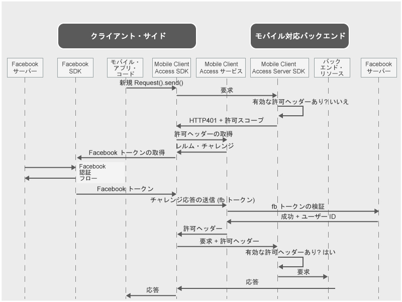

---

copyright:
  years: 2015, 2016, 2017
lastupdated: "2017-01-15"

---
{:new_window: target="_blank"}
{:shortdesc: .shortdesc}
{:screen: .screen}
{:codeblock: .codeblock}

# Facebook 資格情報を使用したユーザーの認証
{: #facebook-auth-overview}

Facebook を ID プロバイダーとして使用してリソースを保護するように、{{site.data.keyword.amafull}} サービスを構成できます。モバイル・アプリケーションまたは Web アプリケーションのユーザーは、ユーザー自身の Facebook 資格情報を認証に使用できます。

{:shortdesc}

**重要**: Facebook が提供する Client SDK を別個にインストールする必要はありません。Facebook SDK は、{{site.data.keyword.amashort}} Facebook Client SDK を構成するときに、依存関係マネージャーによって自動的にインストールされます。

## {{site.data.keyword.amashort}} の要求フロー
{: #mca-facebook-sequence}

### モバイル・クライアント要求フロー

{{site.data.keyword.amashort}} がモバイル・クライアント・アプリからの認証のためにどのように Facebook と統合するのかを理解するために、次のダイアグラムを参照してください。

* {{site.data.keyword.amashort}} Client SDK を使用して、{{site.data.keyword.amashort}} Server SDK によって保護されているバックエンド・リソースへの要求を実行します。
* {{site.data.keyword.amashort}} Server SDK が無許可の要求を検出し、HTTP 401 コードと許可スコープを返します。
* {{site.data.keyword.amashort}} Client SDK は自動的に HTTP 401 コードを検出し、認証プロセスを開始します。
* {{site.data.keyword.amashort}} Client SDK は {{site.data.keyword.amashort}} サービスに連絡し、許可ヘッダーを要求します。
* {{site.data.keyword.amashort}} サービスは、まず認証チャレンジを提供することで、Facebook で認証を行うようクライアントに要求します。
* {{site.data.keyword.amashort}} Client SDK は Facebook SDK を使用して認証プロセスを開始します。認証が成功した後、Facebook SDK は Facebook アクセス・トークンを返します。
* Facebook アクセス・トークンは認証チャレンジ応答とみなされます。このトークンは、{{site.data.keyword.amashort}} サービスに送信されます。
* 当該サービスが Facebook サーバーを使用してこの認証チャレンジ応答を検証します。
* 検証が成功した場合、{{site.data.keyword.amashort}} サービスは認証ヘッダーを生成し、それを {{site.data.keyword.amashort}} Client SDK に戻します。認証ヘッダーには 2 つのトークンが含まれます。アクセス許可情報を含むアクセス・トークンと、現行のユーザー、デバイス、およびアプリケーションについての情報を含む ID トークンです。
* この時点から、{{site.data.keyword.amashort}} Client SDK を介して実行されるすべての要求には、新しく取得した許可ヘッダーが含まれます。
* {{site.data.keyword.amashort}} Client SDK は、認証フローをトリガーしたオリジナルの要求を自動的に再送します。
* {{site.data.keyword.amashort}} Server SDK は要求から認証ヘッダーを抽出し、{{site.data.keyword.amashort}} サービスを使用してそれを検証してから、バックエンド・リソースに対するアクセスを認可します。

### {{site.data.keyword.amashort}} Web アプリケーション要求フロー
{: #mca-facebook-web-sequence}

{{site.data.keyword.amashort}} Web アプリケーション要求フローは、モバイル・クライアントのフローに似ています。ただし、{{site.data.keyword.amashort}} は、{{site.data.keyword.Bluemix_notm}} バックエンド・リソースではなくて Web アプリケーションを保護します。

  * 最初の要求は Web アプリケーションによって (例えばログイン・フォームから) 送信されます。
  * 最終のリダイレクトは、バックエンド保護リソースではなく Web アプリケーション自体の保護領域へのリダイレクトです。

## Facebook for Developers Web サイトでのアプリケーションの作成
{: #facebook-appID}

Facebook を ID プロバイダーとして使用し始めるには、Facebook for Developers Web サイトでアプリケーションを作成する必要があります。このプロセス時に、Facebook App ID が作成されます。これは、どのアプリケーションが接続を試行しているかを認識するために Facebook によって使用される固有 ID です。

モバイル・アプリまたは Web アプリ用に Facebook 認証を構成する際にこの値が必要になります。

1. [Facebook for Developers ](https://developers.facebook.com "外部リンク・アイコン"){: new_window} サイトにアクセスします。

1. **「My Apps」**プルダウン・リストを開き、**「Add a New App」**を選択します。

1. **「Display Name」**および**「Contact Email values」**の値を入力し、プルダウン・リストから**「Category」**を選択します。

1. **「Create a New App ID」**をクリックします。

1. セキュリティー検査が表示されることがあります。要求されたアクションを実行します。

1. **「Product Setup」**ページが表示されます。表示される**「アプリ ID (App ID)」**をコピーします。

## 次のステップ
{: #next-steps}

* [Android アプリ用の Facebook 認証の使用可能化](facebook-auth-android.html)
* [iOS アプリ用の Facebook 認証の使用可能化 (Swift SDK)](facebook-auth-ios-swift-sdk.html)
* [Cordova アプリ用の Facebook 認証の使用可能化](facebook-auth-cordova.html)
