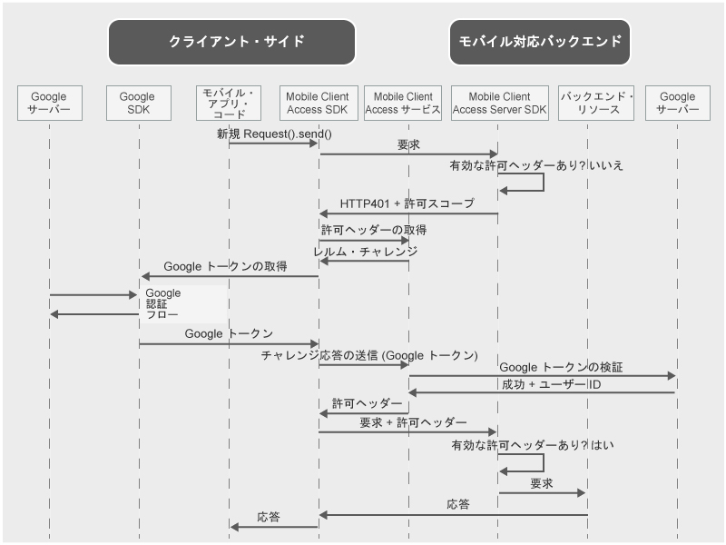

---

copyright:
  years: 2015, 2016, 2017
lastupdated: "2017-04-06"

---
{:new_window: target="_blank"}
{:shortdesc: .shortdesc}
{:screen: .screen}
{:codeblock: .codeblock}
{:pre: .pre}

**重要: {{site.data.keyword.amafull}} サービスは {{site.data.keyword.appid_full}} サービス**に置き換えられます。

# Google 資格情報を使用したユーザーの認証
{: #google-auth}

Google を ID プロバイダーとして使用してリソースを保護するように {{site.data.keyword.amafull}} サービスを構成できます。それにより、モバイル・アプリケーション・ユーザーまたは Web アプリケーション・ユーザーは、Google の資格情報を認証に使用できるようになります。
{:shortdesc}

**重要:** Google が提供する Client SDK を別個にインストールする必要はありません。Google SDK は、{{site.data.keyword.amashort}} Client SDK を構成するときに、依存関係マネージャーによって自動的にインストールされます。

## {{site.data.keyword.amashort}} の要求フロー
{: #google-auth-overview}

### クライアント要求フロー

{{site.data.keyword.amashort}} が認証のためにどのように Google と統合するかを理解するために、次のダイアグラムを参照してください。

* {{site.data.keyword.amashort}} SDK を使用して、{{site.data.keyword.amashort}} Server SDK によって保護されているバックエンド・リソースへ要求を出します。
* {{site.data.keyword.amashort}} Server SDK は無許可の要求を検出し、HTTP 401 コードと許可範囲を返します。
* {{site.data.keyword.amashort}} Client SDK は自動的に HTTP 401 コードを検出し、認証プロセスを開始します。
* {{site.data.keyword.amashort}} Client SDK は {{site.data.keyword.amashort}} サービスに連絡し、許可ヘッダーを要求します。
* {{site.data.keyword.amashort}} サービスは、認証チャレンジを提供して、最初に Google での認証を行うようクライアントに要求します。
* {{site.data.keyword.amashort}} Client SDK は、Google SDK を使用して認証プロセスを開始します。認証が正常に行われると、Google SDK は Google アクセス・トークンを返します。
* Google アクセス・トークンは、認証チャレンジ応答と見なされます。このトークンは、{{site.data.keyword.amashort}} サービスに送信されます。
* サービスは、Google サーバーを使用してその認証チャレンジ応答を検証します。
* 検証が成功した場合、{{site.data.keyword.amashort}} サービスは認証ヘッダーを生成し、それを {{site.data.keyword.amashort}} Client SDK に戻します。許可ヘッダーには、アクセス許可情報を含むアクセス・トークンと、現行のユーザー、デバイス、およびアプリケーションに関する情報を含む ID トークンの、2 つのトークンが含まれています。
* この時点から、{{site.data.keyword.amashort}} Client SDK を介して実行されるすべての要求には、新しく取得した許可ヘッダーが含まれます。
* {{site.data.keyword.amashort}} Client SDK は、認証フローをトリガーしたオリジナルの要求を自動的に再送します。
* {{site.data.keyword.amashort}} Server SDK は、要求から許可ヘッダーを抽出し、{{site.data.keyword.amashort}} サービスを使用してそれを検証し、バックエンド・リソースへのアクセスを認可します。

### Mobile Client Access Web アプリケーション要求フロー
{: #mca-google-web-sequence}
{{site.data.keyword.amashort}} Web アプリケーション要求フローは、モバイル・クライアントのフローに似ています。ただし、{{site.data.keyword.amashort}} は、{{site.data.keyword.Bluemix_notm}} バックエンド・リソースではなくて Web アプリケーションを保護します。

  * 最初の要求は Web アプリケーションによって (例えばログイン・フォームから) 送信されます。
  * 最終のリダイレクトは、バックエンド保護リソースではなく Web アプリケーション自体の保護領域へのリダイレクトです。

## 次のステップ
{: #google-auth-nextsteps}

* [Android アプリ用の Google 認証の使用可能化](google-auth-android.html)
* [iOS アプリ用の Google 認証の使用可能化 (Swift SDK)](google-auth-ios-swift-sdk.html)
* [Cordova アプリ用の Google 認証の使用可能化](google-auth-cordova.html)
