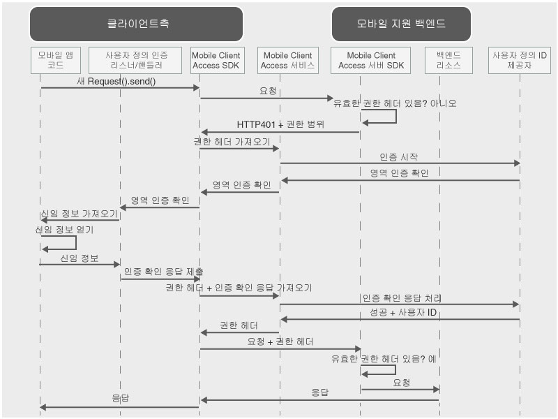

---

copyright:
  years: 2015, 2016, 2017
lastupdated: "2017-01-15"

---

{:new_window: target="_blank"}
{:shortdesc: .shortdesc}
{:screen: .screen}
{:codeblock: .codeblock}
{:pre: .pre}

# 사용자 정의 ID 제공자로 사용자 인증
{: #custom-id}


{{site.data.keyword.amafull}} 서비스를 사용하고 신임 정보 수집 및 유효성 검증을 위한 자체 로직을 구현하는 사용자 정의 ID 제공자를 작성하십시오. 사용자 정의 ID 제공자는 RESTful 인터페이스를 표시하는 웹 애플리케이션입니다. 온프레미스 또는 {{site.data.keyword.Bluemix}}에서 사용자 정의 ID 제공자를 호스팅할 수 있습니다. 유일한 요구사항은 {{site.data.keyword.amashort}} 서비스와 통신할 수 있도록 사용자 정의 ID 제공자를 공용 인터넷에서 액세스할 수 있어야 합니다. 

## {{site.data.keyword.amashort}} 사용자 정의 ID 요청 플로우
{: #custom-id-ovr}


### {{site.data.keyword.amashort}} 클라이언트 요청 플로우
 다음 다이어그램은 {{site.data.keyword.amashort}}가 사용자 정의 ID 제공자를 통합하는 방법을 보여줍니다. 



* {{site.data.keyword.amashort}} SDK를 사용하여 {{site.data.keyword.amashort}} 서버 SDK로 보호되는 백엔드 리소스를 요청합니다.
* {{site.data.keyword.amashort}} 서버 SDK가 권한이 없는 요청을 발견하고 HTTP 401 및 권한 범위를 리턴합니다.
* {{site.data.keyword.amashort}} 클라이언트 SDK가 자동으로 HTTP 401을 발견하고 인증 프로세스를 시작합니다.
* {{site.data.keyword.amashort}} 클라이언트 SDK가 {{site.data.keyword.amashort}} 서비스에 연결하여 권한 헤더를 요청합니다. 
* {{site.data.keyword.amashort}} 서비스가 인증 프로세스를 시작하기 위해 사용자 정의 ID 제공자와 통신합니다. 
* 사용자 정의 ID 제공자가 인증 확인을 {{site.data.keyword.amashort}} 서비스로 리턴합니다. 
* {{site.data.keyword.amashort}} 서비스가 인증 확인을 {{site.data.keyword.amashort}} 클라이언트 SDK로 리턴합니다.
* {{site.data.keyword.amashort}} 클라이언트 SDK가 사용자가 작성한 사용자 정의 클래스에 인증을 위임합니다. 사용자는 신임 정보를 수집하여 {{site.data.keyword.amashort}} 클라이언트 SDK에 다시 제공해야 합니다.
* 개발자가 {{site.data.keyword.amashort}} SDK에 신임 정보를 제공하면 신임 정보가 {{site.data.keyword.amashort}} 서비스에 인증 확인 응답으로 전송됩니다. 
* {{site.data.keyword.amashort}} 서비스가 사용자 정의 ID 제공자로 인증 확인 응답의 유효성을 검증합니다. 
* 유효성 검증에 성공하면 {{site.data.keyword.amashort}} 서비스가 권한 헤더를 생성하고 이를 {{site.data.keyword.amashort}} 클라이언트 SDK로 리턴합니다. 권한 헤더에는 액세스 권한 정보가 포함된 액세스 토큰과 현재 사용자, 디바이스 및 애플리케이션에 대한 정보가 포함된 ID 토큰이라는 두 개의 토큰이 포함되어 있습니다. 
* 이 시점부터 {{site.data.keyword.amashort}} 클라이언트 SDK로 작성된 모든 요청에는 새로 얻은 권한 헤더가 포함됩니다.
* {{site.data.keyword.amashort}} 클라이언트 SDK가 권한 플로우를 트리거한 원래 요청을 자동으로 재전송합니다.
* {{site.data.keyword.amashort}} 서버 SDK가 요청에서 권한 헤더를 추출하고 {{site.data.keyword.amashort}} 서비스를 사용하여 해당 권한 헤더의 유효성을 검증하고 백엔드 리소스에 대한 액세스를 부여합니다.

### {{site.data.keyword.amashort}} 웹 애플리케이션 요청 플로우
{: #mca-custom-web-sequence}

{{site.data.keyword.amashort}} 웹 애플리케이션 요청 플로우는 모바일 클라이언트 플로우와 유사합니다. 그러나 {{site.data.keyword.amashort}}는 {{site.data.keyword.Bluemix_notm}} 백엔드 리소스 대신 웹 애플리케이션을 보호합니다. 

  * 초기 요청은 웹 애플리케이션에서 전송합니다(예: 로그인 양식에서).
  * 최종 경로는 백엔드 보호 리소스가 아니라 웹 애플리케이션 자체의 보호 영역으로 재지정됩니다.

## 사용자 정의 ID 제공자 이해
{: #custom-id-about}

사용자 정의 ID 제공자를 사용하여 클라이언트로 전송할 사용자 정의 인증 확인을 제공하고, 인증 플로우를 완전히 사용자 정의할 수 있습니다.

사용자 정의 ID 제공자를 작성하는 경우 다음을 수행할 수 있습니다. 

1. {{site.data.keyword.amashort}} 서비스가 모바일 또는 웹 클라이언트 애플리케이션으로 전송할 인증 확인을 사용자 정의하십시오. 인증 확인은 사용자 정의 데이터가 포함된 JSON 오브젝트입니다. 클라이언트는 인증 플로우를 사용자 정의하는 데 이 사용자 정의 데이터를 사용할 수 있습니다. 

  사용자 정의 인증 확인의 예

	```JavaScript
	{
		status: "challenge",
		challenge: {
			message:"Enter username and password",
			retriesLeft: 2,
			minUsernameLenth: 8
		}
	}
	```
	{: codeblock}

1. 여러 단계 및 여러 양식 인증을 포함하여 클라이언트에서 사용자 정의 신임 정보 콜렉션 플로우를 구현하십시오. 사용자 정의 인증 확인과 마찬가지로, 사용자 정의 인증 확인 응답의 구조를 디자인해야 합니다. 

  클라이언트에서 전송한 사용자 정의 인증 확인 응답의 예: 

	```JavaScript
	{
		username:"bob.smith",
		password:"abcd1234",
		pincode:"1234"
	}
	```
	{: codeblock}

1. 제공된 인증 확인 응답의 유효성을 검증하는 사용자 정의 로직을 구현하십시오. 

1. 필요한 사용자 정의 특성이 포함된 사용자 정의 사용자 ID 오브젝트를 정의하십시오. 다음은 인증 성공 후에 클라이언트에서 확보한 사용자 정의 사용자 ID 오브젝트의 예입니다. 

	```JavaScript
	{
		username:"bob.smith",
		displayName:"Bob Smith",
		attributes:{
			age: 30,
			accountNumber: 12345,
			lastLogin: "Sept 1st, 2015"
		}
	}
	```
	{: codeblock}

### 사용자 정의 ID 제공자의 샘플 구현
{: #custom-sample}

사용자 정의 ID 제공자를 개발하는 경우 사용자 정의 ID 제공자의 다음 Node.js 샘플 구현을 참조로 사용하십시오. GitHub 저장소에서 전체 애플리케이션 코드를 다운로드하십시오. 

 * [단순 샘플 ](https://github.com/ibm-bluemix-mobile-services/bms-mca-custom-identity-provider-sample){: new_window}
 * [고급 샘플 ](https://github.com/ibm-bluemix-mobile-services/bms-mca-custom-identity-provider-with-user-management){: new_window}

## {{site.data.keyword.amashort}} 서버와 사용자 정의 ID 제공자 간의 일반 통신
{: #custom-id-comm}

1. {{site.data.keyword.amashort}} 서비스에서 `startAuthorization` 요청을 사용자 정의 ID 제공자에 전송합니다. 
1. 사용자 정의 ID 제공자가 클라이언트로 전송할 사용자 정의 인증 확인에 대해 응답합니다. 
1. {{site.data.keyword.amashort}} 서비스는 사용자 정의 ID 제공자에서 수신한 사용자 정의 인증 확인을 클라이언트에 전송하고, 결국 클라이언트로부터 인증 확인 응답을 수신합니다. 
1. {{site.data.keyword.amashort}} 서비스가 `handleChallengeAnswer` 요청을 인증 확인 응답과 함께 사용자 정의 ID 제공자로 전송합니다. 
1. 사용자 정의 ID 제공자가 인증 확인 응답을 확인하고 사용자 ID 정보를 포함하는 성공 응답을 전송합니다. 
1. 선택적으로, 사용자 정의 ID 제공자가 클라이언트에서 인증 확인 응답을 수신한 후 추가 인증 확인을 제공할 수 있습니다. 여러 단계 인증 프로세스의 경우 여러 개의 인증 확인을 전송할 수 있습니다. 

## Stateful 대 Stateless
{: #custom-id-state}

기본적으로 사용자 정의 ID 제공자는 Stateless 애플리케이션으로 간주됩니다. 경우에 따라, 사용자 정의 ID 제공자는 인증 프로세스와 관련된 상태를 저장해야 할 수 있습니다. 예제 유스 케이스는 사용자 정의 ID 제공자가 다음 단계를 진행하기 전에 첫 번째 인증 단계의 결과를 저장해야 하는 여러 단계 인증입니다. Stateful 기능을 지원하려면 사용자 정의 ID 제공자가 stateID를 생성하고 {{site.data.keyword.amashort}} 서비스에 대한 응답으로 이를 제공해야 합니다. {{site.data.keyword.amashort}} 서비스는 클라이언트 인증 프로세스에 속한 후속 요청에 stateID를 전달해야 합니다. 

## 사용자 정의 영역
{: #custom-id-custom}

사용자 정의 ID 제공자는 하나의 사용자 정의 인증 영역을 지원합니다. 수신되는 인증 확인을 처리하려면, 클라이언트 애플리케이션에서 `AuthenticationDelegate`/ `AuthenticationListener`의 인스턴스를 작성하고 등록하십시오. {{site.data.keyword.amashort}} 대시보드에서 사용자 정의 ID 제공자를 구성할 때 사용자 정의 인증 영역 이름을 정의하십시오. 영역은 수신 요청의 특정 {{site.data.keyword.amashort}} 서비스 인스턴스를 식별합니다. 

## 다음 단계
{: #next-steps}

* [사용자 정의 ID 제공자 작성](custom-auth-identity-provider.html)
* [사용자 정의 인증용 {{site.data.keyword.amashort}} 구성](custom-auth-config-mca.html)
* [Android용 사용자 정의 인증 구성](custom-auth-android.html)
* [iOS(Swift SDK)용 사용자 정의 인증 구성](custom-auth-ios-swift-sdk.html)
* [Cordova용 사용자 정의 인증 구성](custom-auth-cordova.html)
