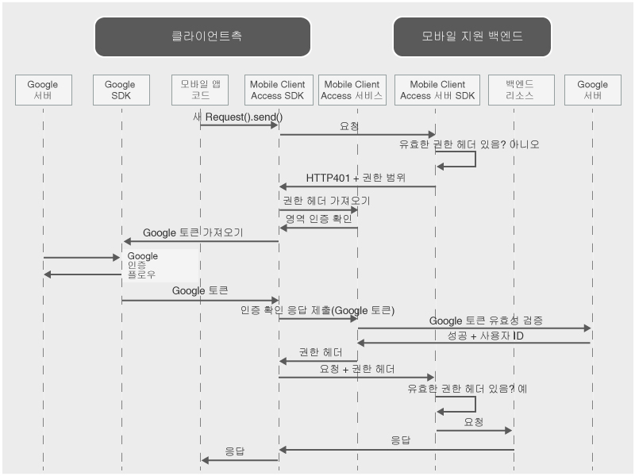

---

copyright:
  years: 2015, 2016, 2017
lastupdated: "2017-03-15"

---
{:new_window: target="_blank"}
{:shortdesc: .shortdesc}
{:screen: .screen}
{:codeblock: .codeblock}
{:pre: .pre}

{{site.data.keyword.amafull}} 서비스가 {{site.data.keyword.appid_full}} 서비스로 대체되었습니다.

# Google 신임 정보로 사용자 인증
{: #google-auth}

ID 제공자로 Google을 사용하여 리소스를 보호하도록 {{site.data.keyword.amafull}} 서비스를 구성할 수 있습니다. 그러면 모바일 또는 웹 애플리케이션 사용자가 인증을 위해 Google 신임 정보를 사용할 수 있습니다.
{:shortdesc}

**중요:** Google에서 제공하는 클라이언트 SDK를 별도로 설치할 필요가 없습니다. {{site.data.keyword.amashort}} 클라이언트 SDK를 구성할 때 종속성 관리자가 Google SDK를 자동으로 설치합니다.

## {{site.data.keyword.amashort}} 요청 플로우
{: #google-auth-overview}

### 클라이언트 요청 플로우

인증을 위해 Google과 {{site.data.keyword.amashort}}의 통합 방식을 이해하려면 다음 다이어그램을 참조하십시오.

* {{site.data.keyword.amashort}} SDK를 사용하여 {{site.data.keyword.amashort}} 서버 SDK로 보호되는 백엔드 리소스를 요청합니다.
* {{site.data.keyword.amashort}} 서버 SDK가 권한이 없는 요청을 발견하고 HTTP 401 코드 및 권한 범위를 리턴합니다.
* {{site.data.keyword.amashort}} 클라이언트 SDK가 자동으로 HTTP 401 코드를 자동으로 발견하고 인증 프로세스를 시작합니다.
* {{site.data.keyword.amashort}} 클라이언트 SDK가 {{site.data.keyword.amashort}} 서비스에 연결하여 권한 헤더를 요청합니다.
* {{site.data.keyword.amashort}} 서비스는 인증 확인 방식을 제공함으로써 Google을 사용하여 먼저 인증하도록 클라이언트에 요청합니다. 
* {{site.data.keyword.amashort}} 클라이언트 SDK가 Google SDK를 사용하여 인증 프로세스를 시작합니다. 인증에 성공하면 Google SDK는 Google 액세스 토큰을 리턴합니다. 
* Google 액세스 토큰은 인증 확인 응답으로 간주됩니다. 토큰이 {{site.data.keyword.amashort}} 서비스로 전송됩니다. 
* 서비스는 Google 서버를 사용하여 인증 확인 응답의 유효성을 검증합니다. 
* 유효성 검증에 성공하면 {{site.data.keyword.amashort}} 서비스가 권한 헤더를 생성하고 이를 {{site.data.keyword.amashort}} 클라이언트 SDK로 리턴합니다. 권한 헤더에는 액세스 권한 정보를 포함하는 액세스 토큰과 현재 사용자, 디바이스 및 애플리케이션에 대한 정보를 포함하는 ID 토큰이 포함되어 있습니다. 
* 이 시점부터 {{site.data.keyword.amashort}} 클라이언트 SDK를 통해 작성된 모든 요청에는 새로 얻은 권한 헤더가 포함됩니다.
* {{site.data.keyword.amashort}} 클라이언트 SDK가 권한 플로우를 트리거한 원래 요청을 자동으로 재전송합니다.
* {{site.data.keyword.amashort}} 서버 SDK가 요청에서 권한 헤더를 추출하고 {{site.data.keyword.amashort}} 서비스를 사용하여 해당 권한 헤더의 유효성을 검증하고 백엔드 리소스에 대한 액세스를 부여합니다.

### {{site.data.keyword.amashort}} 웹 애플리케이션 요청 플로우
{: #mca-google-web-sequence}
{{site.data.keyword.amashort}} 웹 애플리케이션 요청 플로우는 모바일 클라이언트 플로우와 유사합니다. 그러나 {{site.data.keyword.amashort}}는 {{site.data.keyword.Bluemix_notm}} 백엔드 리소스 대신 웹 애플리케이션을 보호합니다. 

  * 초기 요청은 웹 애플리케이션에서 전송합니다(예: 로그인 양식에서).
  * 최종 경로는 백엔드 보호 리소스보다 웹 애플리케이션 자체의 보호 영역으로 재지정됩니다.

## 다음 단계
{: #google-auth-nextsteps}

* [Android 앱에서 Google 인증 사용](google-auth-android.html)
* [iOS 앱에서 Google 인증 사용(Swift SDK)](google-auth-ios-swift-sdk.html)
* [Cordova 앱에서 Google 인증 사용](google-auth-cordova.html)
