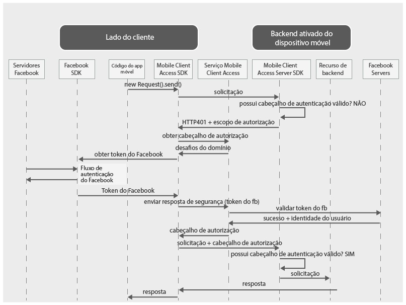

---

copyright:
  years: 2015, 2016, 2017
lastupdated: "2017-03-15"

---
{:new_window: target="_blank"}
{:shortdesc: .shortdesc}
{:screen: .screen}
{:codeblock: .codeblock}

O serviço {{site.data.keyword.amafull}} foi substituído pelo serviço {{site.data.keyword.appid_full}}.

# Autenticando usuários com as credenciais do Facebook
{: #facebook-auth-overview}

É possível configurar o serviço {{site.data.keyword.amafull}} para proteger recursos usando o Facebook como um provedor de
identidade. Seus usuários de aplicativo móvel ou da web podem usar suas credenciais do Facebook para autenticação.

{:shortdesc}

**Importante**: não é necessário instalar separadamente o client SDK fornecido pelo Facebook. O Facebook SDK é instalado automaticamente por gerenciadores de dependência quando você configura o {{site.data.keyword.amashort}} Facebook client SDK.

## Fluxo de solicitação do {{site.data.keyword.amashort}}
{: #mca-facebook-sequence}

### Fluxo de solicitação do cliente móvel

Veja o diagrama a seguir para entender como o {{site.data.keyword.amashort}} integra-se ao Facebook para autenticação a partir de um app cliente móvel.

* Use o SDK do cliente {{site.data.keyword.amashort}} para fazer uma solicitação aos seus recursos de backend que são protegidos
com o SDK do servidor {{site.data.keyword.amashort}}.
* O {{site.data.keyword.amashort}} server SDK detecta uma solicitação não autorizada e retorna o código HTTP 401 e o escopo de autorização.
* O {{site.data.keyword.amashort}} client SDK detecta automaticamente o código HTTP 401 e inicia o processo de autenticação.
* O SDK do cliente {{site.data.keyword.amashort}} entra em contato com o serviço {{site.data.keyword.amashort}} e solicita
um cabeçalho de autorização.
* O serviço {{site.data.keyword.amashort}} solicita ao cliente para se autenticar com o Facebook primeiro fornecendo um desafio de autenticação.
* O {{site.data.keyword.amashort}} client SDK usa o Facebook SDK para iniciar o processo de autenticação. Após a autenticação bem-sucedida, o SDK do Facebook retorna um token de acesso do Facebook.
* O token de acesso do Facebook é considerado uma resposta do desafio de autenticação. O token é enviado para o serviço {{site.data.keyword.amashort}}.
* O serviço valida a resposta do desafio de autenticação com servidores do Facebook.
* Se a validação for bem-sucedida, o serviço {{site.data.keyword.amashort}} irá gerar um cabeçalho de autorização e o retornará para o {{site.data.keyword.amashort}} client SDK. O cabeçalho de autorização contém dois tokens: um token de acesso contendo informações de permissões de acesso e um token de ID contendo informações sobre o usuário atual, o dispositivo e o aplicativo.
* Desse ponto em diante, todas as solicitações feitas por meio do {{site.data.keyword.amashort}} client SDK terão um cabeçalho de autorização recém-obtido.
* O {{site.data.keyword.amashort}} client SDK reenvia automaticamente a solicitação original que acionou o fluxo de autorização.
* O SDK do servidor {{site.data.keyword.amashort}} extrai um cabeçalho de autorização da solicitação, valida-o com o serviço {{site.data.keyword.amashort}} e concede acesso a um recurso de backend.

### {{site.data.keyword.amashort}} Fluxo de
solicitação de aplicativo da Web
{: #mca-facebook-web-sequence}

O aplicativo da Web {{site.data.keyword.amashort}}
fluxo de pedido é semelhante ao fluxo do cliente móvel. Entretanto, o {{site.data.keyword.amashort}} protege o aplicativo da web, em vez de um recurso de backend do {{site.data.keyword.Bluemix_notm}}.

  * A solicitação inicial é enviada pelo aplicativo da web (a partir de um formulário de login, por exemplo).
  * O redirecionamento final é para a área protegida do próprio aplicativo da web, em vez do recurso protegido de backend.

## Criando um app no site Facebook for Developers
{: #facebook-appID}

Para começar a usar o Facebook como provedor de
identidade, crie um app no website Facebook for
Developers. Durante esse processo, um ID do
app Facebook é criado. Este é um identificador exclusivo usado pelo Facebook para saber qual aplicativo está tentando se conectar.

Você precisa desse valor para configurar a autenticação do Facebook para o seu aplicativo móvel ou da web.

1. Acesse o site [Facebook for Developers ](https://developers.facebook.com){: new_window}.

1. Abra a lista suspensa **Meus Aplicativos** e selecione **Incluir um novo aplicativo**.

1. Insira os valores **Nome de exibição** e **Valores de e-mail de contato** e escolha uma
**Categoria** a partir da lista suspensa.

1. Clique em **Criar um novo ID do app**.

1. Uma verificação de segurança pode aparecer. Execute a ação solicitada.

1. A página **Configuração do produto** aparece. Copie o **ID do app** exibido.

## Próximas Etapas
{: #next-steps}

* [Ativando a autenticação do Facebook para apps Android](facebook-auth-android.html)
* [Ativando a autenticação do Facebook para apps iOS (Swift SDK)](facebook-auth-ios-swift-sdk.html)
* [Ativando a autenticação do Facebook para apps Cordova](facebook-auth-cordova.html)
