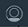

---

copyright:
  years: 2016, 2017
lastupdated: "2017-01-15"

---

{:new_window: target="_blank"}
{:shortdesc: .shortdesc}
{:screen: .screen}
{:codeblock: .codeblock}
{:pre: .pre}


# Configurando o iOS Swift SDK
{: #getting-started-ios}

Instrumente seu aplicativo iOS Swift com o SDK {{site.data.keyword.amashort}}, inicialize o SDK e faça
solicitações aos recursos protegidos e não protegidos.

{:shortdesc}


## Antes de iniciar
{: #before-you-begin}
Você deve ter:

* Uma instância de um aplicativo
{{site.data.keyword.Bluemix_notm}}.
* Uma instância de um serviço
{{site.data.keyword.amafull}}.
* Seu **TenantID**. Abra o seu serviço no painel do {{site.data.keyword.amashort}}. Clique em **Opções de dispositivo móvel**. Os valores
`tenantId` (também conhecido como
`appGUID`) são exibidos no campo **App
GUID / TenantId**. Você precisará desse
valor para inicializar o {{site.data.keyword.amashort}}
Authorization Manager.
* Sua **Rota do aplicativo**. Esta é a
URL do seu aplicativo backend. Você precisa desse valor para
enviar solicitações para seus terminais protegidos.
* A {{site.data.keyword.Bluemix_notm}}
**Região**.  É possível encontrar a sua região
{{site.data.keyword.Bluemix_notm}} atual no cabeçalho,
próximo ao ícone **Avatar**
. O valor da região que aparece deve ser um dos
seguintes: `US South`,
`Sydney`
ou `United Kingdom`, e corresponder aos
valores de SDK requeridos no código code SDK:
`BMSClient.Region.usSouth`,
`BMSClient.Region.unitedKingdom` ou
`BMSClient.Region.sydney`.  Você precisará desse
valor para inicializar o SDK
{{site.data.keyword.amashort}}.
* Um projeto do Xcode. Para obter mais informações sobre como configurar seu ambiente de desenvolvimento iOS, veja o [website Apple Developer ](https://developer.apple.com/support/xcode/ "Ícone de link externo"){: new_window}.


## Instalando o {{site.data.keyword.amashort}} client SDK
{: #install-mca-sdk-ios}
O {{site.data.keyword.amashort}} SDK é distribuído com CocoaPods, um gerenciador de dependências para projetos iOS. O CocoaPods faz download automaticamente dos artefatos de repositórios e os disponibiliza para seu aplicativo iOS.


### Instalar o CocoaPods
{: #install-cocoapods}

1. Em uma janela do terminal, execute o comando **pod --version**. Se já tiver o CocoaPods instalado, o número da
versão será exibido e será possível pular para a próxima seção para instalar o SDK.

1. Se você não tiver o CocoaPods instalado, execute:

```
sudo gem install cocoapods
```
{: codeblock}

Para obter mais informações, veja o [website CocoaPods ](https://cocoapods.org/ "Ícone de link externo"){: new_window}.

### Instalar o {{site.data.keyword.amashort}} client SDK com o CocoaPods
{: #install-sdk-cocoapods}

1. Em uma janela do terminal, navegue para o diretório-raiz do seu projeto iOS.

1. Se ainda não tiver inicializado sua área de trabalho para CocoaPods, execute o comando `pod init`.<br/>
O CocoaPods cria um arquivo `Podfile` para você, que fica onde você define as dependências de seu projeto iOS.

1. Edite o arquivo `Podfile` e inclua a linha a seguir nos destinos necessários:

	```
  use_frameworks!
  pod 'BMSSecurity'
	```
	{: codeblock}

  **Dica:** é possível incluir `use_frameworks!` em
seu destino Xcode em vez de tê-lo no Podfile.

1. Salve o arquivo `Podfile` e execute `pod install` a partir da linha de comandos. O CocoaPods instala as
dependências relevantes e exibe as dependências e pods incluídos.<br/>

   **Importante**: o CocoaPods gera um arquivo `xcworkspace`.  Deve-se abrir esse arquivo para trabalhar em seu projeto futuro.

1. Abra sua área de trabalho do projeto iOS. Abra o arquivo `xcworkspace` que foi gerado por CocoaPods. Por exemplo, para
`{your-project-name}.xcworkspace`, execute

	`open {your-project-name}.xcworkspace`

### Ativar Compartilhamento Keychain para iOS
{: #enable_keychain}

Ative `Compartilhamento Keychain`. Acesse
a guia `Recursos` e mude
`Compartilhamento Keychain` para
`On` em seu projeto Xcode.

## Inicializando o {{site.data.keyword.amashort}} client SDK
{: #init-mca-sdk-ios}

 Inicialize o SDK passando o parâmetro `tenantId`. Um local comum, mas não obrigatório, para colocar o código de inicialização é o método `application:didFinishLaunchingWithOptions` de delegado do seu aplicativo.

1. Importe as estruturas necessárias na classe em que deseja usar o {{site.data.keyword.amashort}} client SDK.

 ```Swift
 import BMSCore
 import BMSSecurity
 ```

1. Inicialize o {{site.data.keyword.amashort}} client SDK.

 ```Swift 	let tenantId = "<serviceTenantID>" 	let regionName = <applicationBluemixRegion>

	func application(_ application: UIApplication, didFinishLaunchingWithOptions launchOptions: 		[UIApplicationLaunchOptionsKey: Any]?) -> Bool {

	let mcaAuthManager = MCAAuthorizationManager.sharedInstance
    mcaAuthManager.initialize(tenantId: tenantId, bluemixRegion: regionName)
      // possible values for regionName: BMSClient.Region.usSouth, BMSClient.Region.unitedKingdom, BMSClient.Region.sydney
	BMSClient.sharedInstance.authorizationManager = mcaAuthManager	
	return true
	}
  ```
  {: codeblock}

* Substitua o `tenantId` pelo valor que obteve a partir de **Opções de dispositivo móvel**.
* Substitua `<applicationBluemixRegion>` pela região em que seu aplicativo {{site.data.keyword.Bluemix_notm}} está hospedado.

Para obter informações sobre esses valores, consulte
[Antes de iniciar](#before-you-begin).


## Fazendo uma solicitação para seu aplicativo backend móvel
{: #request}

Após o SDK do cliente {{site.data.keyword.amashort}} ser inicializado, será possível começar a fazer solicitações ao seu aplicativo
backend móvel.

1. Tente enviar uma solicitação a um terminal protegido em seu aplicativo backend móvel em seu navegador. Abra a URL a seguir:
`{applicationRoute}/protected` substituindo o `{applicationRoute}` pelo valor **applicationRoute**
que você recuperou a partir das **Opções de dispositivo móvel** (veja [Inicializando o SDK do Cliente do Mobile
Client Access](#init-mca-sdk-ios)). Por exemplo:

	`http://my-mobile-backend.mybluemix.net/protected
	`

	Uma mensagem `Unauthorized` é retornada em seu navegador porque esse terminal pode ser acessado somente por aplicativos móveis instrumentados com o {{site.data.keyword.amashort}} client SDK.

1. Use seu aplicativo iOS para fazer uma solicitação ao mesmo terminal. Inclua o código a seguir depois de inicializar `BMSClient`:

 ```Swift
	let customResourceURL = "<your protected resource absolute path>"
	let request = Request(url: customResourceURL, method: HttpMethod.GET)

	let callBack:BMSCompletionHandler = {(response: Response?, error: Error?) in
 if error == nil {
       	    print ("response:\(response?.responseText), no error")
 } else {
       	    print ("error: \(error)")
    	}
	}
	request.send(completionHandler: callBack)
 ```
 {: codeblock}

1.  Quando sua solicitação for bem-sucedida, a saída a seguir aparecerá no console Xcode:

 ```
 response:Optional("Hello, this is a protected resource of the mobile backend application!"), no error
 ```
{: screen}

## Próximas etapas
{: #next-steps}
Quando você se conectou ao terminal protegido, nenhuma credencial foi necessária. Para requerer que os usuários efetuem login em seu aplicativo, deve-se configurar a autenticação do Facebook, do Google ou customizada.

  * [Facebook
](facebook-auth-ios-swift-sdk.html)
  * [Google](google-auth-ios-swift-sdk.html)
  * [Customizado
](custom-auth-ios-swift-sdk.html)
