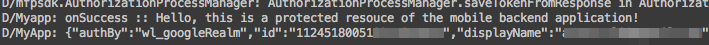

---

copyright:
  years: 2015, 2016, 2017
lastupdated: "2017-01-15"

---
{:new_window: target="_blank"}
{:shortdesc: .shortdesc}
{:screen: .screen}
{:codeblock: .codeblock}
{:pre: .pre}

# Ativando a autenticação do Google para apps Cordova
{: #google-auth-cordova}

Para integrar seus aplicativos Cordova {{site.data.keyword.amafull}}
para autenticação do Google, deve-se fazer
mudanças no código da plataforma nativa do aplicativo Cordova (Java
ou Objective-C), bem como no Cordova WebView (Javascript). Cada plataforma deve ser configurada separadamente. Use o ambiente de desenvolvimento nativo para fazer mudanças no código nativo, por exemplo, no Android Studio ou no Xcode.

## Antes de Começar
{: #before-you-begin}

Você deve ter:

* Um projeto do Cordova que seja instrumentado com o {{site.data.keyword.amashort}} client SDK.  Para obter mais informações, veja [Configurando o plug-in do Cordova](https://console.{DomainName}/docs/services/mobileaccess/getting-started-cordova.html).  
* Uma instância de um aplicativo {{site.data.keyword.Bluemix_notm}} que seja protegida pelo serviço {{site.data.keyword.amashort}}. Para obter mais informações sobre como criar um serviço de
backend do {{site.data.keyword.Bluemix_notm}}, consulte
[Introdução](index.html).
* Sua rota do aplicativo. Esta é a URL do seu aplicativo
backend.
* Seu **TenantID**. Abra o seu serviço no painel do {{site.data.keyword.Bluemix_notm}}. Clique em **Opções de dispositivo móvel**. O valor `tenantId` (também conhecido como
`appGUID`) é exibido no campo **App
GUID / TenantId**. Você precisará desse valor para
inicializar o Gerenciador de Autorização.
*  Localize a região na qual o seu aplicativo {{site.data.keyword.Bluemix_notm}} está hospedado. É possível encontrar a sua região do Bluemix atual no cabeçalho,
próximo ao ícone **Avatar**
. O valor da região deve ser um destes: **US South**, **Sydney** ou **UK**. Os valores constantes de
SDK exatos que correspondem a esses nomes são indicados nos exemplos de código.
* (opcional) Familiarize-se com as seções a seguir:
   * [Ativando a autenticação do Google para apps Android](https://console.{DomainName}/docs/services/mobileaccess/google-auth-android.html)
   * [Ativando a autenticação do Google para apps iOS](https://console.{DomainName}/docs/services/mobileaccess/google-auth-ios-swift-sdk.html)


## Configurando a plataforma Android
{: #google-auth-cordova-android}

As etapas necessárias para configurar a plataforma Android
de um aplicativo Cordova para autenticação do Google são muito
semelhantes às etapas necessárias para aplicativos nativos. Veja
[Ativando
a autenticação do Google em apps Android](https://console.{DomainName}/docs/services/mobileaccess/google-auth-android.html) e configure o seguinte:

   * [
Criando um projeto no Google Developer Console](https://console.{DomainName}/docs/services/mobileaccess/google-auth-android.html#create-google-project). Isso
mostra como configurar o serviço de autenticação no site do
Google Developers.
   * [Configurando
MCA para autenticação do Google](https://console.{DomainName}/docs/services/mobileaccess/google-auth-android.html#google-auth-android-config). Isso mostra como
configurar o {{site.data.keyword.amashort}} para usar a
autorização do Google.

### Configure o SDK do cliente {{site.data.keyword.amashort}} para Android Cordova.

1. Na pasta do projeto Android, abra o arquivo `build.gradle`
para o módulo do aplicativo (**não** o arquivo
`build.gradle` do projeto).
	Localize a seção de dependências e inclua uma nova dependência de compilação para o Client SDK:

	```Gradle
	dependencies {
		compile group: 'com.ibm.mobilefirstplatform.clientsdk.android',    
        name:'googleauthentication',
        version: '2.+',
        ext: 'aar',
        transitive: true
    	// other dependencies  
	}
	```
	{: codeblock}

1. Sincronize seu projeto com o Gradle clicando em **Ferramentas > Android > Sincronizar projeto com arquivos Gradle**.

1. A API do `GoogleAuthenticationManager` ainda deve ser registrada no código nativo. Inclua
este código no método `onCreate` de atividade principal:

	```Java
	String tenantId = "<tenantId>";
	MCAAuthorizationManager mcaAuthorizationManager = MCAAuthorizationManager.createInstance(this.getApplicationContext(),tenantId);
	BMSClient.getInstance().setAuthorizationManager(mcaAuthorizationManager);
	GoogleAuthenticationManager.getInstance().registerDefaultAuthenticationListener(this);
	```
	{: codeblock}

1. Inclua o código a seguir em sua Atividade:

	```Java
	@Override
	protected void onActivityResult(int requestCode, int resultCode, Intent data) {
		super.onActivityResult(requestCode, resultCode, data);
		GoogleAuthenticationManager.getInstance()
			.onActivityResultCalled(requestCode, resultCode, data);
	}
	```
	{: codeblock}

## Configurando a plataforma iOS
{: #google-auth-cordova-ios}

As etapas necessárias para configurar a plataforma iOS do aplicativo Cordova para integração de autenticação do Google são semelhantes às etapas para aplicativos nativos. A principal diferença é que o Cordova CLI atualmente não suporta o gerenciador de dependência CocoaPods. Deve-se incluir manualmente os arquivos necessários para integração com a autenticação do Google. Para mais informações, consulte
[
Ativando a autenticação do Google para apps iOS (Swift SDK)](https://console.{DomainName}/docs/services/mobileaccess/google-auth-ios-swift-sdk.html). Execute as etapas a seguir:

   * [
Preparando seu app para o Google Sign-In](https://console.{DomainName}/docs/services/mobileaccess/google-auth-ios-swift-sdk.html#google-sign-in-ios): Prepara o
Google Sign-In para autenticação de aplicativos iOS {{site.data.keyword.amashort}}.

   * [Configurando
MCA para autenticação do Google](https://console.{DomainName}/docs/services/mobileaccess/google-auth-ios-swift-sdk.html#google-auth-ios-config): Configura
seu serviço
{{site.data.keyword.amashort}} para trabalhar com o Google
Sign-In.

   * [
Configurando o SDK do cliente MCA para iOS](https://console.{DomainName}/docs/services/mobileaccess/google-auth-ios-swift-sdk.html#google-auth-ios-sdk): Configura o cliente
{{site.data.keyword.amashort}} para trabalhar
com o Google Sign-In.


### Ativar Compartilhamento Keychain para iOS
{: #enable_keychain}

Ative `Compartilhamento Keychain`. Acesse
a guia `Recursos` e mude
`Compartilhamento Keychain` para
`On` em seu projeto Xcode.


### Inicializando o Gerenciador de Autorização em seu
código iOS

Inicialize o {{site.data.keyword.amashort}}
Authorization Manager no Objective-C no arquivo
`AppDelgate.m`.

```
#import "<your_module_name>-Swift.h"

- (BOOL)application:(UIApplication *)application didFinishLaunchingWithOptions:(NSDictionary *)launchOptions

{
	[CDVBMSClient initMCAAuthorizationManagerManagerWithTenantId:@"<tenantId>"];

	[[GoogleAuthenticationManager sharedInstance] register];

	self.viewController = [[MainViewController alloc] init];

	[[GoogleAuthenticationManager sharedInstance] onFinishLaunchingWithApplication:application withOptions:launchOptions];

	return [super application:application didFinishLaunchingWithOptions:launchOptions];
}

- (BOOL)application: (UIApplication *)application openURL: (NSURL *)url sourceApplication: (NSString *)sourceApplication annotation: (id)annotation {
	return [[GoogleAuthenticationManager sharedInstance] onOpenURLWithApplication:application url:url 
	sourceApplication:sourceApplication annotation:annotation];
}
```
{: codeblock}

**Nota:**

* Substitua `<your_module_name>`
pelo nome do módulo do seu projeto. Por exemplo, se o nome do
seu módulo
for `Cordova`, a linha de importação
deve ser `#import "Cordova-Swift.h"` Localize
o nome do módulo e acesse a guia `Construir
configurações`, `Pacote` >
`Nome do módulo de produto`.
* Substitua o `<tenantId>` pelo
seu ID do locatário (consulte
[Antes de iniciar](#before-you-begin)).


## Inicializando o {{site.data.keyword.amashort}}
cliente SDK em seu Cordova WebView
{: #google-auth-cordova-initialize}

Para todas as plataformas, use o código Javascript a
seguir em seu aplicativo Cordova para inicializar o
cliente SDK {{site.data.keyword.amashort}}.

```JavaScript
BMSClient.initialize("<applicationBluemixRegion>");
```
{: codeblock}

Substitua `<applicationBluemixRegion>` pela sua região (consulte [Antes de iniciar](#before-you-begin)).

## Testando a Autenticação
{: #google-auth-cordova-test}

Após o SDK do cliente ser inicializado, será possível começar a fazer solicitações ao seu aplicativo backend móvel.

### Antes de Começar
{: #google-auth-cordova-testing-before}

Deve-se ter um aplicativo backend protegido pelo {{site.data.keyword.amashort}} no terminal `/protected`. Se for necessário configurar um terminal `/protected`, consulte [Protegendo recursos](https://console.{DomainName}/docs/services/mobileaccess/protecting-resources.html).

1. Tente enviar uma solicitação para um terminal protegido de seu aplicativo backend móvel no navegador da área de trabalho, abrindo `{applicationRoute}/protected`, por exemplo, `http://my-mobile-backend.mybluemix.net/protected`.

1. O terminal `/protected` de um aplicativo backend móvel criado com o Modelo MobileFirst Services é protegido com o {{site.data.keyword.amashort}}, portanto, só é possível acessá-lo por aplicativos móveis instrumentados com o {{site.data.keyword.amashort}} client SDK. Como resultado, você verá `Unauthorized` no navegador de sua área de trabalho.

1. Use seu aplicativo Cordova para fazer uma solicitação
para o mesmo terminal, usando a URL completa (por exemplo,
`http://my-mobile-backend.mybluemix.net/protected`). Inclua o código a seguir após inicializar `BMSClient`.

	```JavaScript
	var success = function(data){
    	console.log("success", data);
    }
	var failure = function(error)
    	{console.log("failure", error);
    }
	var request = new BMSRequest("<your-application-route>", BMSRequest.GET);
	request.send(success, failure);
	```
	{: codeblock}

1. Execute o aplicativo. A tela de login do Google é exibida.

	

	

	Essa tela pode parecer ligeiramente diferente se você não tiver o app Facebook instalado em seu dispositivo ou se não estiver com login efetuado atualmente no Facebook.

1. Ao clicar em **OK**, você estará autorizando o {{site.data.keyword.amashort}} a usar sua identidade do usuário do Google para fins de autenticação.

1. Sua solicitação deve ser bem-sucedida. Dependendo da plataforma usada, você verá a saída a seguir no console LogCat/Xcode:

	

	
