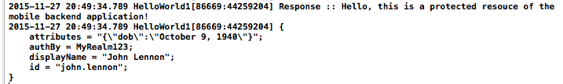

---

copyright:
  years: 2015, 2016
lastupdated: "2016-11-03"

---

# 配置適用於 {{site.data.keyword.amashort}} Cordova 應用程式的自訂鑑別
{: #custom-cordova}

檢測 Cordova 應用程式，以使用自訂鑑別，並檢測 {{site.data.keyword.amafull}} 用戶端 SDK，以存取受保護的應用程式。

## 開始之前
{: #before-you-begin}
* 配置為使用自訂身分提供者之 {{site.data.keyword.amashort}} 服務實例所保護的資源（請參閱[配置自訂鑑別](https://console.stage1.ng.bluemix.net/docs/services/mobileaccess/custom-auth-config-mca.html)）。  
* **租戶 ID** 值。在 {{site.data.keyword.amashort}} 儀表板中，開啟服務。按一下**行動選項**按鈕。`tenantId`（也稱為 `appGUID`）值會顯示在**應用程式 GUID/租戶 ID** 欄位中。您需要此值來起始設定「授權管理程式」。
* **領域**名稱。這是您在 {{site.data.keyword.amashort}} 儀表板的**管理**標籤上，**自訂**區段內的**領域名稱**欄位中指定的值。
* {{site.data.keyword.Bluemix_notm}} **地區**。您可以在**虛擬人像**圖示  旁邊的標頭中，找到您目前的 {{site.data.keyword.Bluemix_notm}} 地區。出現的地區值應該是下列其中一項：`US South`、`United Kingdom` 或 `Sydney`。程式碼範例中有提供相對應之 SDK 常數的確切語法。

如需相關資訊，請參閱下列資訊：
 * [配置 {{site.data.keyword.amashort}} 以進行自訂鑑別](https://console.{DomainName}/docs/services/mobileaccess/custom-auth-config-mca.html)。這會為您示範如何設定 {{site.data.keyword.amashort}} 服務，以進行自訂鑑別。您要在這裡定義**領域**值。
 * [設定 Cordova SDK](https://console.{DomainName}/docs/services/mobileaccess/getting-started-cordova.html)。設定 Cordova 用戶端應用程式的相關資訊。
 * [使用自訂身分提供者](https://console.{DomainName}/docs/services/mobileaccess/custom-auth.html)。如何使用自訂身分提供者來鑑別使用者。
 * [建立自訂身分提供者](https://console.{DomainName}/docs/services/mobileaccess/custom-auth-identity-provider.html)。自訂身分提供者如何運作的部分範例。 

## 配置 Cordova WebView 程式碼
### 在 Cordova WebView 中起始設定 {{site.data.keyword.amashort}} 用戶端 SDK
{: #custom-cordova-sdk}
在 `index.js` 檔案中傳遞 `<applicationBluemixRegion>` 參數，以起始設定 SDK。

```JavaScript
BMSClient.initialize("<applicationBluemixRegion>");
```

將 `<applicationBluemixRegion>` 取代為您的地區（請參閱[開始之前](#before-you-begin)）。 
 

### 鑑別接聽器介面
{: #custom-cordva-auth}

{{site.data.keyword.amashort}} 用戶端 SDK 提供鑑別接聽器介面，以實作自訂鑑別流程。您必須新增下列方法，在鑑別處理程序的不同階段呼叫。

```JavaScript
var customAuthenticationListener = {
	onAuthenticationChallengeReceived: function(authenticationContext, challenge) {...},
	onAuthenticationSuccess: function(info){...},
	onAuthenticationFailure: function(info){...}
}
```

每個方法會處理鑑別處理程序的不同階段。

### onAuthenticationChallengeReceived 方法
{: #onAuthenticationChallengeReceived}
從 {{site.data.keyword.amashort}} 服務收到自訂鑑別盤查時，會呼叫此方法。
```JavaScript
onAuthenticationChallengeReceived: function(authenticationContext, challenge) {...}
```

* `authenticationContext`：由 {{site.data.keyword.amashort}} 用戶端 SDK 所提供，讓開發人員可以在認證收集期間回報鑑別盤查回答或失敗（例如取消鑑別要求的使用者）。
* `challenge`：JSON 物件，包含自訂身分提供者所傳回的自訂鑑別盤查。

透過呼叫 `onAuthenticationChallengeReceived` 方法，{{site.data.keyword.amashort}} 用戶端 SDK 會將控制權委派給開發人員。{{site.data.keyword.amashort}} 會等待認證。開發人員必須收集認證，並使用下列其中一個 `authContext` 介面方法，將它們回報給 {{site.data.keyword.amashort}} 用戶端 SDK。

```JavaScript
onAuthenticationSuccess: function(info){...}
```

在成功鑑別之後，會呼叫此方法。引數包括選用的 JSON 物件，其中包含有關鑑別成功的延伸資訊。

```JavaScript
onAuthenticationFailure: function(info){...}
```

在鑑別失敗之後，會呼叫此方法。引數包括選用的 JSON 物件，其中包含有關鑑別失敗的延伸資訊。

### authenticationContext
{: #custom-cordova-authcontext}

`authenticationContext` 值提供作為自訂鑑別接聽器的 `onAuthenticationChallengeReceived` 方法的引數。開發人員必須收集認證，並使用 `authenticationContext` 方法將認證傳回給 {{site.data.keyword.amashort}} 用戶端 SDK 或報告失敗。請使用下列其中一個方法：

```JavaScript
authenticationContext.submitAuthenticationChallengeAnswer(challengeAnswer);

authenticationContext.submitAuthenticationFailure(info);
```
下列程式碼示範客戶授權接聽器要如何收集認證、處理盤查，以及提供鑑別回應。

## 自訂鑑別接聽器工作流程的實作範例
{: #custom-cordova-authlisten-sample}

此鑑別接聽器範例設計成使用自訂身分提供者。您可以從[此 Github 儲存庫](https://github.com/ibm-bluemix-mobile-services/bms-mca-custom-identity-provider-sample)下載自訂身分提供者。

```JavaScript
var customAuthenticationListener = {
	onAuthenticationChallengeReceived: function(authenticationContext, challenge) {
		console.log("onAuthenticationChallengeReceived :: ", challenge);

		// In this sample the authentication listener immediatelly returns a hardcoded
		// set of credentials. In a real life scenario this is where developer would
		// show a login screen, collect credentials and invoke
		// authenticationContext.submitAuthenticationChallengeAnswer() API

		var challengeResponse = {
			username: "john.lennon",
			password: "12345"
		}

		authenticationContext.submitAuthenticationChallengeAnswer(challengeResponse);

		// In case there was a failure collecting credentials you need to report
		// it back to the authenticationContext. Otherwise Mobile Client
		// Access client SDK will remain in a waiting-for-credentials state
		// forever

	},

	onAuthenticationSuccess: function(info){
		console.log("onAuthenticationSuccess :: ", info);
	},

	onAuthenticationFailure: function(info){
		console.log("onAuthenticationFailure :: ", info);
	}
}
```

## 在 Cordova WebView 中登錄自訂鑑別接聽器
{: #custom-cordova-authreg}

建立自訂鑑別接聽器之後，必須先向 `BMSClient` 登錄，才能開始使用。將下列程式碼新增至應用程式。請在將任何要求傳送至受保護資源之前先呼叫此程式碼。

```Java
BMSClient.registerAuthenticationListener(<realmName>, customAuthenticationListener);
```
使用 {{site.data.keyword.amashort}} 儀表板中所指定的 `realmName`。

## 在原生程式碼中設定授權管理程式

「{{site.data.keyword.amashort}} 授權管理程式」必須登錄在您的原生平台程式碼中。

**Android**（新增至主要活動中的 `onCreate`）

```
String tenantId = "<tenantId>";
MCAAuthorizationManager.createInstance(this.getApplicationContext(),tenantId);
BMSClient.getInstance().setAuthorizationManager(mcaAuthorizationManager);
```

**iOS Objective-C**（新增至 `AppDelegate.m`）

根據您的 Xcode 版本來登錄「授權管理程式」。

```
#import "<your_module_name>-Swift.h"

- (BOOL)application:(UIApplication*)application didFinishLaunchingWithOptions:(NSDictionary*)launchOptions

{  
	
    //[CDVBMSClient initMCAAuthorizationManagerManagerWithTenantId:@"<tenantId>"];
 }
```

附註：將 `your_module_name` 取代為您專案的模組名稱，例如，如果模組名稱為 `Cordova`，則應為 `#import "Cordova-Swift.h"`。若要尋找模組名稱，請移至**建置設定 > 包裝 > 產品模組名稱**。

**附註：**將 `tenantId` 取代為您的租戶 ID（位在 {{site.data.keyword.amashort}} 服務儀表板上的**行動選項**按鈕中）。


## 針對 iOS 啟用金鑰鏈共用

移至 `Capabilities` 標籤，並將 Xcode 專案中的 `Keychain Sharing` 切換為 `On`，以啟用 `Keychain Sharing`。 


## 測試鑑別
{: #custom-cordova-test}
起始設定用戶端 SDK 並登錄自訂 `AuthenticationListener` 之後，即可開始對行動後端應用程式提出要求。

### 開始之前
{: #custom-cordova-testing-before}
您必須具有使用 {{site.data.keyword.mobilefirstbp}} 樣板所建立的應用程式，並在 `/protected` 端點具有 {{site.data.keyword.amashort}} 所保護的資源。


1. 開啟 `{applicationRoute}/protected`（例如 `http://my-mobile-backend.mybluemix.net/protected`），以在瀏覽器中將要求傳送給行動後端應用程式的受保護端點。
使用 {{site.data.keyword.mobilefirstbp}} 樣板所建立之行動後端應用程式的 `/protected` 端點是透過 {{site.data.keyword.amashort}} 進行保護。只有使用 {{site.data.keyword.amashort}} 用戶端 SDK 來檢測的行動應用程式可以存取這個端點。因此，會在瀏覽器中顯示 `Unauthorized` 訊息。

1. 使用 Cordova 應用程式以對相同的端點提出要求。起始設定 `BMSClient` 並登錄自訂 AuthenticationListener 之後，請新增下列程式碼。

	```JavaScript
	var success = function(data){
    	console.log("success", data);
    }
	var failure = function(error)
    	{console.log("failure", error);
    }
	var request = new BMSRequest("<your-application-route>", BMSRequest.GET);
	request.send(success, failure);
	```
	
	將 `<your-application-route>` 取代為您的後端應用程式 URL（請參閱[開始之前](#before-you-begin)）。 

1. 	當要求成功時，在 `LogCat` 或 Xcode 主控台中會有下列輸出：

	

	
