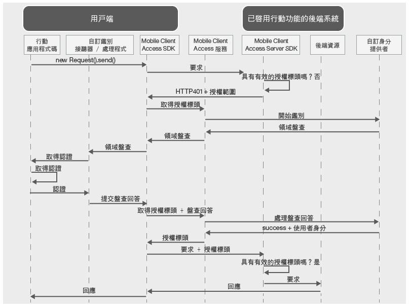

---

copyright:
  years: 2015, 2016, 2017
lastupdated: "2017-01-15"

---

{:new_window: target="_blank"}
{:shortdesc: .shortdesc}
{:screen: .screen}
{:codeblock: .codeblock}
{:pre: .pre}

# 使用自訂身分提供者鑑別使用者
{: #custom-id}


建立使用 {{site.data.keyword.amafull}} 服務的自訂身分提供者，並實作您自己的邏輯來收集及驗證認證。自訂身分提供者是可公開 RESTful 介面的 Web 應用程式。您可以在內部部署或在 {{site.data.keyword.Bluemix}} 上管理自訂身分提供者。唯一的需求是必須可從公用網際網路存取自訂身分提供者，讓它與 {{site.data.keyword.amashort}} 服務通訊。

## {{site.data.keyword.amashort}} 自訂身分要求流程
{: #custom-id-ovr}


### {{site.data.keyword.amashort}} 用戶端要求流程
  下圖示範 {{site.data.keyword.amashort}} 如何整合自訂身分提供者。



* 使用 {{site.data.keyword.amashort}} SDK，對使用 {{site.data.keyword.amashort}} 伺服器 SDK 保護的後端資源提出要求。
* {{site.data.keyword.amashort}} 伺服器 SDK 偵測到未獲授權的要求，並傳回 HTTP 401 及授權範圍。
* {{site.data.keyword.amashort}} 用戶端 SDK 自動偵測到 HTTP 401，並啟動鑑別處理程序。
* {{site.data.keyword.amashort}} 用戶端 SDK 聯絡 {{site.data.keyword.amashort}} 服務，並要求授權標頭。
* {{site.data.keyword.amashort}} 服務與自訂身分提供者通訊，以啟動鑑別處理程序。
* 自訂身分提供者將鑑別盤查傳回給 {{site.data.keyword.amashort}} 服務。
* {{site.data.keyword.amashort}} 服務將鑑別盤查傳回給 {{site.data.keyword.amashort}} 用戶端 SDK。
* {{site.data.keyword.amashort}} 用戶端 SDK 將鑑別委派給您建立的自訂類別。您負責收集認證，並將認證提供回 {{site.data.keyword.amashort}} 用戶端 SDK。
* 開發人員將認證提供給 {{site.data.keyword.amashort}} SDK 之後，認證將會傳送給 {{site.data.keyword.amashort}} 服務以作為鑑別盤查回答。
* {{site.data.keyword.amashort}} 服務向自訂身分提供者驗證鑑別盤查回答。
* 如果驗證成功，則 {{site.data.keyword.amashort}} 服務會產生授權標頭，並將它傳回給 {{site.data.keyword.amashort}} 用戶端 SDK。授權標頭包含兩個記號：包含存取權資訊的存取記號，以及包含現行使用者、裝置及應用程式相關資訊的 ID 記號。
* 從此時起，使用 {{site.data.keyword.amashort}} 用戶端 SDK 所提出的所有要求都會有新取得的授權標頭。
* {{site.data.keyword.amashort}} 用戶端 SDK 自動重新傳送已觸發授權流程的原始要求。
* {{site.data.keyword.amashort}} 伺服器 SDK 從要求擷取授權標頭、向 {{site.data.keyword.amashort}} 服務驗證授權標頭，然後授與對後端資源的存取權。

### {{site.data.keyword.amashort}} Web 應用程式要求流程
{: #mca-custom-web-sequence}

{{site.data.keyword.amashort}} Web 應用程式要求流程類似行動用戶端流程。不過，{{site.data.keyword.amashort}} 會保護 Web 應用程式，而不是 {{site.data.keyword.Bluemix_notm}} 後端資源。

  * 起始要求是由 Web 應用程式傳送（例如，從登入表單）。
  * 最終重新導向是重新導向至 Web 應用程式本身的受保護區域，而不是後端的受保護資源。

## 瞭解自訂身分提供者
{: #custom-id-about}

您可以使用自訂身分提供者，來提供要傳送給用戶端的自訂鑑別盤查。您可以完全自訂鑑別流程。

當您建立自訂身分提供者時，可以執行下列動作：

1. 自訂要由 {{site.data.keyword.amashort}} 服務傳送給行動或 Web 用戶端應用程式的鑑別盤查。鑑別盤查是包含任何自訂資料的 JSON 物件。用戶端可以使用此自訂資料來自訂鑑別流程。

  自訂鑑別盤查的範例：

	```JavaScript
	{
		status: "challenge",
		challenge: {
			message:"Enter username and password",
			retriesLeft: 2,
			minUsernameLenth: 8
		}
	}
	```
	{: codeblock}

1. 在用戶端上實作任何自訂認證收集流程（包括多步驟及多表單鑑別）。與自訂鑑別盤查類似，您必須設計自訂鑑別盤查回答的結構。

  用戶端所傳送之自訂鑑別盤查回答的範例如下：

	```JavaScript
	{
		username:"bob.smith",
		password:"abcd1234",
		pincode:"1234"
	}
	```
	{: codeblock}

1. 實作驗證所提供鑑別盤查回答用的自訂邏輯。

1. 定義包含所有必要自訂內容的自訂使用者身分物件。以下是成功鑑別之後，用戶端所取得之自訂使用者身分物件的範例：

	```JavaScript
	{
		username:"bob.smith",
		displayName:"Bob Smith",
		attributes:{
			age: 30,
			accountNumber: 12345,
			lastLogin: "Sept 1st, 2015"
		}
	}
	```
	{: codeblock}

### 自訂身分提供者範例實作
{: #custom-sample}

在您開發自訂身分提供者時，使用自訂身分提供者的下列任何 Node.js 範例實作作為參照。請從 GitHub 儲存庫下載完整應用程式碼。

 * [簡式範例 ](https://github.com/ibm-bluemix-mobile-services/bms-mca-custom-identity-provider-sample "外部鏈結圖示"){: new_window}
 * [進階範例 ](https://github.com/ibm-bluemix-mobile-services/bms-mca-custom-identity-provider-with-user-management "外部鏈結圖示"){: new_window}

## {{site.data.keyword.amashort}} 伺服器與自訂身分提供者之間的一般通訊
{: #custom-id-comm}

1. {{site.data.keyword.amashort}} 服務將 `startAuthorization` 要求傳送給自訂身分提供者。
1. 自訂身分提供者使用要傳送給用戶端的自訂鑑別盤查來進行回應。
1. {{site.data.keyword.amashort}} 服務將從自訂身分提供者收到的自訂鑑別盤查傳送給用戶端，最後則接收來自用戶端的鑑別盤查回答。
1. {{site.data.keyword.amashort}} 服務將包含鑑別盤查回答的 `handleChallengeAnswer` 要求傳送給自訂身分提供者。
1. 自訂身分提供者驗證鑑別盤查回答，並使用包含使用者身分資訊的 success 回應進行回應。
1. 自訂身分提供者在收到來自用戶端的盤查回答之後，可能會選擇性地提供其他盤查。傳送多個盤查可容許多步驟的鑑別處理程序。

## 有狀態與無狀態
{: #custom-id-state}

自訂身分提供者預設會視為無狀態應用程式。在部分情況下，自訂身分提供者可能需要儲存與鑑別處理程序相關的狀態。多步驟鑑別便是一個範例使用案例。在多步驟鑑別中，自訂身分提供者需要先儲存第一個鑑別步驟的結果，再繼續執行下一步。為了支援有狀態功能，自訂身分提供者必須產生 stateID，並在對 {{site.data.keyword.amashort}} 服務的回應中提供它。{{site.data.keyword.amashort}} 服務必須在屬於用戶端鑑別處理程序的後續要求中傳遞 stateID。

## 自訂領域
{: #custom-id-custom}

自訂身分提供者支援一個自訂鑑別領域。若要處理送入的鑑別盤查，請在用戶端應用程式中建立並登錄 `AuthenticationDelegate`/`AuthenticationListener` 實例。在 {{site.data.keyword.amashort}} 儀表板中配置自訂身分提供者時，請定義自訂鑑別領域名稱。領域可識別送入要求的特定 {{site.data.keyword.amashort}} 服務實例。

## 後續步驟
{: #next-steps}

* [建立自訂身分提供者](custom-auth-identity-provider.html)
* [配置 {{site.data.keyword.amashort}} 進行自訂鑑別](custom-auth-config-mca.html)
* [配置適用於 Android 的自訂鑑別](custom-auth-android.html)
* [配置適用於 iOS 的自訂鑑別 (Swift SDK)](custom-auth-ios-swift-sdk.html)
* [配置適用於 Cordova 的自訂鑑別](custom-auth-cordova.html)
