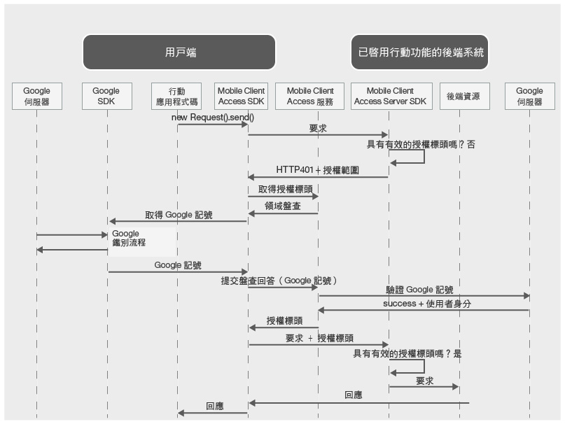

---

copyright:
  years: 2015, 2016, 2017
lastupdated: "2017-01-15"

---
{:new_window: target="_blank"}
{:shortdesc: .shortdesc}
{:screen: .screen}
{:codeblock: .codeblock}
{:pre: .pre}

# 使用 Google 認證鑑別使用者
{: #google-auth}

您可以配置 {{site.data.keyword.amafull}} 服務以使用 Google 作為身分提供者來保護資源。然後，您的行動或 Web 應用程式使用者可以使用其 Google 認證進行鑑別。
{:shortdesc}

**重要事項：**您不需要個別安裝 Google 所提供的用戶端 SDK。當您配置 {{site.data.keyword.amashort}} 用戶端 SDK 時，相依關係管理程式會自動安裝 Google SDK。

## {{site.data.keyword.amashort}} 要求流程
{: #google-auth-overview}

### 用戶端要求流程

請參閱下圖，以瞭解 {{site.data.keyword.amashort}} 如何與 Google 整合來進行鑑別。

* 使用 {{site.data.keyword.amashort}} SDK，對使用 {{site.data.keyword.amashort}} 伺服器 SDK 保護的後端資源提出要求。
* {{site.data.keyword.amashort}} 伺服器 SDK 偵測到未獲授權的要求，並傳回 HTTP 401 代碼及授權範圍。
* {{site.data.keyword.amashort}} 用戶端 SDK 自動偵測到 HTTP 401 代碼，並啟動鑑別處理程序。
* {{site.data.keyword.amashort}} 用戶端 SDK 聯絡 {{site.data.keyword.amashort}} 服務，並要求授權標頭。
* {{site.data.keyword.amashort}} 服務提供鑑別盤查，以要求先向 Google 鑑別用戶端。
* {{site.data.keyword.amashort}} 用戶端 SDK 使用 Google SDK 來啟動鑑別處理程序。成功鑑別之後，Google SDK 傳回 Google 存取記號。
* Google 存取記號視為鑑別盤查回答。記號會傳送給 {{site.data.keyword.amashort}} 服務。
* 服務向 Google 伺服器驗證鑑別盤查回答。
* 如果驗證成功，則 {{site.data.keyword.amashort}} 服務會產生授權標頭，並將它傳回給 {{site.data.keyword.amashort}} 用戶端 SDK。授權標頭包含兩個記號：包含存取權資訊的存取記號，以及包含現行使用者、裝置及應用程式相關資訊的 ID 記號。
* 從此時起，透過 {{site.data.keyword.amashort}} 用戶端 SDK 所提出的所有要求都會有新取得的授權標頭。
* {{site.data.keyword.amashort}} 用戶端 SDK 自動重新傳送已觸發授權流程的原始要求。
* {{site.data.keyword.amashort}} 伺服器 SDK 從要求擷取授權標頭、向 {{site.data.keyword.amashort}} 服務驗證授權標頭，然後授與對後端資源的存取權。

### {{site.data.keyword.amashort}} Web 應用程式要求流程
{: #mca-google-web-sequence}
{{site.data.keyword.amashort}} Web 應用程式要求流程類似於行動用戶端流程。不過，{{site.data.keyword.amashort}} 會保護 Web 應用程式，而不是 {{site.data.keyword.Bluemix_notm}} 後端資源。

  * 起始要求是由 Web 應用程式傳送（例如，從登入表單中）。
  * 最終重新導向是重新導向至 Web 應用程式本身的受保護區域，而不是後端的受保護資源。

## 後續步驟
{: #google-auth-nextsteps}

* [啟用 Android 應用程式的 Google 鑑別](google-auth-android.html)
* [啟用 iOS 應用程式的 Google 鑑別 (Swift SDK)](google-auth-ios-swift-sdk.html)
* [啟用 Cordova 應用程式的 Google 鑑別](google-auth-cordova.html)
