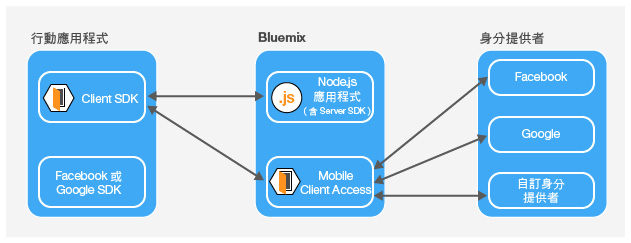

---

copyright:
  years: 2015, 2016, 2017
lastupdated: "2017-01-15"

---

{:new_window: target="_blank"}
{:shortdesc: .shortdesc}
{:screen: .screen}
{:codeblock: .codeblock}
{:pre: .pre}

# 關於 {{site.data.keyword.amashort}}
{: #mca-overview}

{{site.data.keyword.amafull}} 服務會針對存取 {{site.data.keyword.Bluemix_notm}} 所管理之雲端資源的行動和 Web 應用程式提供鑑別。

您可以使用 {{site.data.keyword.amashort}} 服務，透過各種鑑別類型保護 {{site.data.keyword.Bluemix_notm}} 上所管理的 Node.js 及 Liberty for Java&trade; 應用程式。您可以使用 {{site.data.keyword.amashort}} SDK 檢測行動應用程式，以使用 {{site.data.keyword.amashort}} 服務所提供的鑑別功能。請使用 {{site.data.keyword.amashort}} 儀表板來配置各種鑑別類型，以及查看用戶端 SDK 所收集及傳送的資料。

**附註**：{{site.data.keyword.amashort}} 服務先前稱為 Advanced Mobile Access。

## 元件
{: #components}

* **{{site.data.keyword.amashort}} 儀表板**：配置各種鑑別類型

* **{{site.data.keyword.amashort}} 用戶端 SDK**：檢測行動應用程式以使用 {{site.data.keyword.amashort}} 功能。支援的平台如下：iOS 8+、Android 4+、Cordova 及 Web 應用程式。

* **{{site.data.keyword.amashort}} 伺服器 SDK**：保護 {{site.data.keyword.Bluemix_notm}} 上所管理的資源。目前支援的運行環境為 Node.js 及 Liberty for Java&trade;。

## 鑑別類型
{: #authtypes}
您可以在行動應用程式中使用下列類型的鑑別：

* **Facebook**：使用 Facebook 作為身分提供者。您的使用者利用其 Facebook 認證來登入行動或 Web 應用程式。

* **Google**：使用 Google 作為身分提供者。您的使用者利用其 Google+ 認證來登入行動 Web 應用程式。

* **自訂**：建立專屬身分提供者。您可完全控制收集及驗證的資訊類型。

## 架構概觀
{: #architecture}

* 使用 {{site.data.keyword.amashort}} 伺服器 SDK 來保護雲端資源（Node.js 應用程式）。

* 使用 {{site.data.keyword.amashort}} 用戶端 SDK 所提供的 `Request` 類別，以與受保護的雲端資源通訊。

* {{site.data.keyword.amashort}} 伺服器 SDK 偵測到未獲授權的要求，並傳回「HTTP 401 授權」盤查。

* {{site.data.keyword.amashort}} 用戶端 SDK 偵測到「HTTP 401 授權」盤查，並使用 {{site.data.keyword.amashort}} 服務自動啟動鑑別處理程序。

* 嘗試進行 Facebook、Google 或「自訂」鑑別。

* 成功鑑別之後，{{site.data.keyword.amashort}} 會傳回授權記號。

* {{site.data.keyword.amashort}} 用戶端 SDK 將授權記號自動新增至原始要求，並將要求重新傳送至雲端資源。

* {{site.data.keyword.amashort}} 伺服器 SDK 從要求擷取存取記號，並向 {{site.data.keyword.amashort}} 服務驗證它。

* 授與存取權。回應會傳回給行動應用程式。

## 要求流程
{: #flow}
下圖說明要求如何從用戶端 SDK 流向行動後端應用程式及身分提供者。

* 使用 {{site.data.keyword.amashort}} SDK，對使用 {{site.data.keyword.amashort}} 伺服器 SDK 保護的後端資源提出要求。
* {{site.data.keyword.amashort}} 伺服器 SDK 偵測到未獲授權的要求，並傳回 HTTP 401 + 授權範圍。
* {{site.data.keyword.amashort}} 用戶端 SDK 自動偵測到 HTTP 401，並啟動鑑別處理程序。
* {{site.data.keyword.amashort}} 用戶端 SDK 會聯絡 {{site.data.keyword.amashort}} 服務，並要求發出授權標頭。
* {{site.data.keyword.amashort}} 服務會根據目前配置的鑑別類型來提供鑑別盤查，以要求先鑑別用戶端應用程式。
* 根據鑑別類型，{{site.data.keyword.amashort}} 用戶端 SDK：
   * Facebook 或 Google 鑑別：自動處理鑑別盤查
   * 自訂鑑別：根據開發人員所提供的邏輯來取得認證。
* 如果已配置 Facebook 或 Google 鑑別，則 {{site.data.keyword.amashort}} 用戶端 SDK 會使用相關聯的 SDK 來取得 Facebook 或 Google 存取記號。這些記號會作為鑑別盤查回應。
* 如果已配置「自訂」鑑別，則開發人員必須取得鑑別盤查回答，並將它提供給 {{site.data.keyword.amashort}} 用戶端 SDK。
* 取得鑑別盤查回答之後，將它傳送至 {{site.data.keyword.amashort}} 服務。
* 服務向相關身分提供者（Facebook/Google/自訂）驗證鑑別盤查回答。
* 如果驗證成功，則 {{site.data.keyword.amashort}} 服務會產生授權標頭，並將標頭傳回給 {{site.data.keyword.amashort}} 用戶端 SDK。授權標頭包含兩個記號：包含存取權資訊的存取記號，以及包含現行使用者、裝置或應用程式相關資訊的 ID 記號。
* 從此時起，使用 {{site.data.keyword.amashort}} 用戶端 SDK 所提出的所有要求都會有新取得的授權標頭。
* {{site.data.keyword.amashort}} 用戶端 SDK 自動重新傳送已觸發授權流程的原始要求。
* {{site.data.keyword.amashort}} 伺服器 SDK 從要求擷取授權標頭、向 {{site.data.keyword.amashort}} 服務驗證授權標頭，然後授與對後端資源的存取權。

## 取得 {{site.data.keyword.amashort}} 的協助及支援
{: #gettinghelp}

如果您使用 {{site.data.keyword.amashort}} 時有問題或疑問，可以搜尋資訊或透過討論區提問來取得協助。您也可以開啟支援問題單。 

使用討論區提問時，請標記您的問題，以便 {{site.data.keyword.Bluemix_notm}} 開發團隊能看到它。

* 如果您有使用 {{site.data.keyword.amashort}} 開發或部署應用程式的相關技術問題，請將問題張貼在 [Stack Overflow ](http://stackoverflow.com/search?q={{site.data.keyword.amashort}}+ibm-bluemix "外部鏈結圖示"){: new_window} 並使用 "ibm-bluemix" 及 "{{site.data.keyword.amashort}}" 來標記您的問題。
* 若是服務及開始使用指示的相關問題，請使用 [IBM developerWorks ](https://developer.ibm.com/answers/search.html?f=&type=question&redirect=search%2Fsearch&sort=relevance&q=mobile+client+access%20%2B[bluemix] "外部鏈結圖示"){: new_window}。

討論區。 

如需使用討論區的詳細資料，請參閱[取得協助](https://www.{DomainName}/docs/support/index.html#getting-help)。

如需開啟 IBM 支援問題單的相關資訊，或支援層次與問題單嚴重性的相關資訊，請參閱[與支援中心聯絡](https://www.{DomainName}/docs/support/index.html#contacting-support)。

