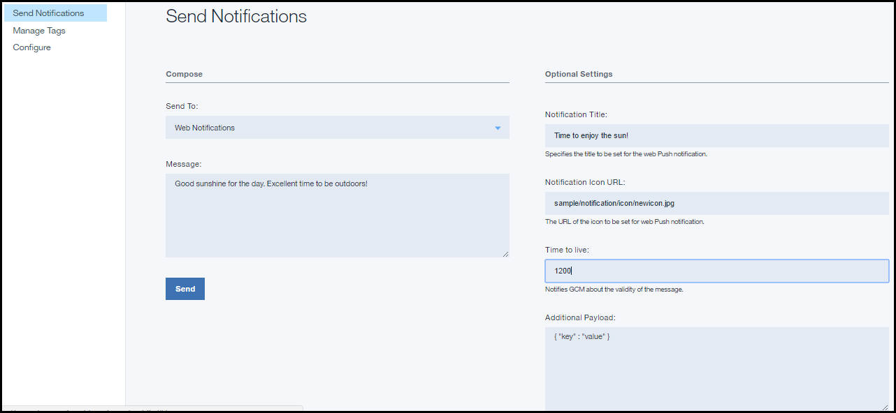

---

copyright:
years: 2015, 2017

---

{:new_window: target="_blank"}
{:shortdesc: .shortdesc}
{:screen:.screen}
{:codeblock:.codeblock}

# Enabling web applications to receive push notifications
{: #web_notifications}
Last updated: 12 April 2017
{: .last-updated}

You can enable Google Chrome, Mozilla Firefox and Safari web applications to receive {{site.data.keyword.mobilepushshort}}. Ensure that you have gone through [Configuring credentials for a notification provider](t__main_push_config_provider.html) before proceeding with the steps.

## Installing the web browser client SDK for {{site.data.keyword.mobilepushshort}}
{: #web_install}

This topic describes how to install and use the client JavaScript Push SDK to further develop your Web applications.

### Initializing in the Web application
{: #web_initialise_web_app}

For installing the Javascript SDK in Google Chrome Web application, complete the steps:

Download the `BMSPushSDK.js`, `BMSPushServiceWorker.js` and `manifest_Website.json` files from the [Bluemix Web push SDK](https://codeload.github.com/ibm-bluemix-mobile-services/bms-clientsdk-javascript-webpush/zip/master){: new_window}.

1. Edit the `manifest_Website.json` file.
	- For Google Chrome browser, change `name` to your site's name. For example, `www.dailynewsupdates.com`. Change the `gcm_sender_id` to your Firebase Cloud Messaging (FCM) or Google Cloud Messaging (GCM) sender_ID. For more information, see [Configuring credentials for a notification provider](t__main_push_config_provider.html). The gcm_sender_id value contains only numbers.

		```
			{
	"name": "YOUR_WEBSITE_NAME", 
	"gcm_sender_id": "GCM_Sender_Id"
			}
		```
    		{: codeblock}
 
	- For the Mozilla Firefox browser, add the following values in `manifest_Website.json` file. Provide an appropriate `name`. This would be the name of your website.

		```
			{ 
	"name": "YOUR_WEBSITE_NAME"
			}
		```
    		{: codeblock}

2. Change the `manifest_Website.json` file name to `manifest.json`.
3. Add the `BMSPushSDK.js`, `BMSPushServiceWorker.js` and `manifest.json` to the  root directory of your website.
3. Include the `manifest.json` in `<head>` tag of your html file.
	```
		<link rel="manifest" href="manifest.json">
	```
    	{: codeblock}
4. Include Bluemix Web push SDK in your web application.
	```
		<script src="BMSPushSDK.js" async></script>
	```
    	{: codeblock}

**Note**: Ensure that the code is deployed and that the sample link is accessed using `https`, and not `http`. 

## Initializing the Web Push SDK 
{: #web_initialize}

Initialize the push SDK with Bluemix {{site.data.keyword.mobilepushshort}} service `app GUID` and `app Region`.  

To get your app GUID, select the **Configuration** option in the navigation pane for your initialized push services and click **Mobile Options**. Modify the code snippet to use your Bluemix push notifications service appGUID parameter.

The `App Region` specifies the location where the {{site.data.keyword.mobilepushshort}} service is hosted. You can use one of the three values:

 - For US Dallas:	 `.ng.bluemix.net`
 - For UK:			 `.eu-gb.bluemix.net`
 - For Sydney:		 `.au-syd.bluemix.net`

```
	var bmsPush = new BMSPush();
 	function callback(response) {
 	alert(response.response)
 	}
  	var initParams = {
  	"appGUID":"push app GUID",
  	"appRegion":"Region where service hosted",
   	"clientSecret":"clientSecret of your push service"
   	"websitePushIDSafari": "Optional parameter for Safari Push Notifications only. The value should match the website Push ID provided during the server side configuration."
    }
  	bmsPush.initialize(initParams, callback)
```
	{: codeblock}

**Note**: If your FCM credentials are changed for Web push SDK, the message delivery might fail for the Chrome browser. Ensure that you invoke `bmsPush.unRegisterDevice` to avoid failure.

You might see configuration related errors if you provide a wrong parameter. For more information, see [Troubleshooting](troubleshooting.html).

## Registering the web application
{: #web_register}

Use the **register()** API to register the device with {{site.data.keyword.mobilepushshort}} service. Use any of the following options, based on your browser.

- For registering from Google Chrome, add the Firebase Cloud Messaging (FCM) or Google Cloud Messaging (GCM) API Key and Web Site URL in the Bluemix {{site.data.keyword.mobilepushshort}} service web configuration dashboard. For more information, see [Configuring credentials for a notification provider](t__main_push_config_provider.html) under Chrome setup.

- For registering from Mozilla Firefox, add website URL in the Bluemix {{site.data.keyword.mobilepushshort}} service web configuration dashboard under Firefox setup.

Use the following code snippet to register in Bluemix {{site.data.keyword.mobilepushshort}} service.

```
	var bmsPush = new BMSPush();
	function callback(response) {
     alert(response.response)
  }
  var initParams = {
  "appGUID":"push app GUID",
  "appRegion":"Region where service hosted",
  "clientSecret":"clientSecret of your push service"
  "websitePushIDSafari": "Optional parameter for Safari Push Notifications only. The value should match the website Push ID provided during the server side configuration."
  }
  bmsPush.initialize(params, callback)
  bmsPush.register(function(response) {
    alert(response.response)
  })
```
    {: codeblock}


## Sending basic notifications to web browsers
{: #web_browsers}

After you have developed your applications, you can send a push notification. 

1. Select **Send Notifications**, and compose a message by choosing **Web Notifications** as the **Send To** option. 
2. Type the message that needs to be delivered in the **Message** field.
3. You can choose to provide optional settings:
  - **Notification Title**: This is the text that would be displayed as message alert heading.
  - **Notification Icon URL**: If your message needs to be delivered with an app notification icon, provide the link to your icon in the field.
  - **Time to live**: Notifies the server on the validity of the messages.
4. For web notifications sent to Safari browser, there are some additional information required:
  - **Action**: This is the label of the action button.
  - **URL Arguments**: The URL arguments that need to be used with this notification. Ensure that this is provided in the form of a JSON array. 
 
The following image shows the web notifications option in the dashboard.

  


### Next steps
{: #next_steps_tags}

After you have successfully set up basic notifications, you can choose to configure tag-based notifications and advanced options.

Add these {{site.data.keyword.mobilepushshort}} service features to your app. To use tag-based notifications, see [Tag-based Notifications](c_tag_basednotifications.html). To use advanced notifications options, see [Advanced notifications](t_advance_badge_sound_payload.html).


