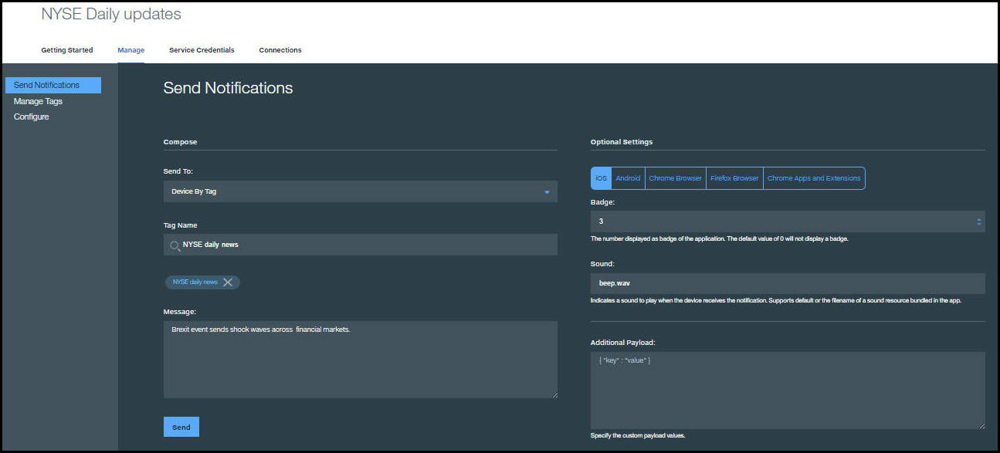

---

copyright:
 years: 2015, 2016

---

# Enabling Cordova applications to receive push notifications
{: #cordova_enable}

Cordova is a platform for building hybrid applications with JavaScript, CSS, and HTML. The {{site.data.keyword.mobilepushshort}} supports development of Cordova-based iOS and Android applications.

Enable Cordova applications to receive push notifications and send push notifications to your devices.


## Installing the Cordova Push plug-in
{: #cordova_install}

Install and use the client Push plug-in to further develop your Cordova applications. This also installs the Cordova Core plug-in, which initializes your connection to Bluemix.

### Before you begin

1. Download the latest Android Studio SDK and Xcode versions.
1. Set up your emulator. For Android Studio, use an emulator that supports Google Play API.
1. Install the Git command-line tool. For Windows, make sure you select the **Run Git from the Window Command Prompt** option. For information about how to download and install this tool, see [Git](https://git-scm.com/downloads).

1. Install the Node.js and Node Package Manager (NPM) tool. The NPM command-line tool is bundled with Node.js. For information about how to download and install Node.js, see [Node.js](https://nodejs.org/en/download/).
1. From the command line, install the Cordova command-line tools by using the **npm install -g cordova** command. This is required to use the Cordova Push plug-in. For information about how to install Cordova and set up your Cordova app, see [Cordova Apache](https://cordova.apache.org/#getstarted).

	**Note**: To view the Cordova Push plug-in readme file, go to [https://github.com/ibm-bluemix-mobile-services/bms-clientsdk-cordova-plugin-push](https://github.com/ibm-bluemix-mobile-services/bms-clientsdk-cordova-plugin-push)


1. Change to the folder that you want to create your Cordova app in and run the following command to create a Cordova application. If you have an existing Cordova app, go to step 3.

```
cordova create your_app_name
cd your_app_name
```
1. Optional: (Optional) Edit the **config.xml** file and change the application name in the <name> element to one that you choose, rather than the default HelloCordova name.

	**Note**: Make sure you specify the correct Bundle ID. If you do not, the following error messages are displayed in Xcode.
	* The executable was signed with invalid entitlements.
	* The entitlements specified in your application’s Code Signing Entitlements file do not match those specified in your provisioning profile.

	To fix this issue, specify the correct Bundle ID in Xcode or in your Cordova app **config.xml**  file.

1. Add the minimum supported API or the deployment target declaration to the config.xml file for your Cordova application. The minSdkVersion value must be higher than 15. The targetSdkVersion value must always reflect the latest Android SDK that is available from Google.
	* **Android** - With your editor, open the config.xml file and update the
```<platform name="android">``` element with minimum and target SDK versions:

	```
	<!-- add deployment target declaration -->
	<platform name="android">  
			  <preference name="android-minSdkVersion" value="15" />
			  <preference name="android-targetSdkVersion" value="23" />
			</platform>
	```
   * **iOS** - Update the <platform name="ios"> element with a deployment target declaration:

	```
	<platform name="ios">
	    <preference name="deployment-target" value="8.0" />
	    <!-- other properties -->
	</ platform>
	```

1. From the Cordova command-line interface (CLI), add your platforms: iOS, Android, or both by using the following commands.

	```
	cordova platform add ios@3.9.0
	cordova platform add android
	```
1. From your Cordova application root directory, enter the following command to install the Cordova Push plug-in: **cordova plugin add ibm-mfp-push**.

	Depending on the platforms that you added, you see something similar to the following:

	```
	Installing "ibm-mfp-push" for android
	Installing "ibm-mfp-push" for ios
	```
1. From *your-app-root-folder*, verify that the Cordova Core and Push plug-in were installed successfully by using the following command: **cordova plugin list**.

	Depending on the platforms that you added, you see something similar to the following:

	```
	ibm-mfp-core 1.0.0 "MFPCore"
	ibm-mfp-push 1.0.0 “MFPPush"
	```
1. (iOS only) - Configure your iOS development environment.
	a. Open your your-app-name.xcodeproj file in *your-app-name***/platforms/ios** directory with Xcode.

	b. Add the Bridging Header. Go to **Build settings > Swift Compiler - Code Generation > Objective-C Bridging Header** and add the following path: *your-project-name***/Plugins/ibm-mfp-core/Bridging-Header.h**

	c. Add the Frameworks parameter. Go to **Build Settings > Linking > Runpath Search Paths** and add the following parameter:
	```
	@executable_path/Frameworks
	```
	d. Uncomment the following Push import statements in your bridging header. Go to *your-project-name***/Plugins/ibm-mfp-core/Bridging-Header.h**

	```
	//#import <IMFPush/IMFPush.h>
	//#import <IMFPush/IMFPushClient.h>
	//#import <IMFPush/IMFResponse+IMFPushCategory.h>
	```
	e. Build and run your application with Xcode.
1. (Android only)- Build your Android project by using the following command:
**cordova build android**.

	**Note**: Before opening your project in Android Studio, you must first build your Cordova application through the Cordova CLI. Otherwise, you will encounter build errors.


## Initializing the Cordova plug-in
{: #cordova_initialize}

Before you can use the Push Notification Service Cordova plug-in, you need to initialize it by passing the application route and application GUID. After initializing the plug-in, you can connect to the server app that you have created in the Bluemix dashboard. The Cordova plug-in is the wrapper for the Android and iOS client SDKs to enable a Cordova app to communicate with Bluemix services.

1. Initialize the BMSClient by copying and pasting the following code snippet into your main JavaScript file (typically located under the **www/js** directory).

	```
	BMSClient.initialize("https://myapp.mybluemix.net","abcd1234-abcd-1234-abcd-abcd1234abcd");
	```
1. Modify the code snippet to use your Bluemix Route and appGUID parameters. Click the **Mobile Options** link in your Bluemix Application Dashboard to get the application Route and App GUID. Use the Route and App GUID values as your parameters in your ```BMSClient.initialize``` code snippet.

	**Note**: If you have created a Cordova app using the Cordova CLI, for example, Cordova create app-name command, put this Javascript code in the **index.js** file, after the ```app.receivedEvent``` function within the o```nDeviceReady: function()``` function to initialize the BMS client.

```
onDeviceReady: function() {
    app.receivedEvent('deviceready');
    BMSClient.initialize("https://myapp.mybluemix.net","abcd1234-abcd-1234-abcd-abcd1234abcd");
    },
```

## Registering devices
{: #cordova_register}

To register a device with the Push Notification Service, call the register method.

Copy and paste the following code snippet into your Cordova application to register a device.

```
	var success = function(message) { console.log("Success: " + message); };
	var failure = function(message) { console.log("Error: " + message); };
	MFPPush.registerDevice({}, success, failure);
```

### Android
{: #cordova_register_android}
Android does not use of the settings parameter. If you are only building an Android app, pass an empty object; for example:

```
	MFPPush.registerDevice({}, success, failure);
	MFPPush.unregisterDevice(success, failure);
```

### iOS
{: #cordova_register_ios}
If you want to customize the alert, badge, and sound properties, add the following JavaScript code snippet to the web part of your Cordova application.

```
	var settings = {
	   ios: {
	       alert: true,
	       badge: true,
	       sound: true
	   }
	}
	MFPPush.registerDevice(settings, success, failure);
```


### JavaScript
{: #cordova_register_js}

```
MFPPush.registerDevice({}, success, failure);
```

You can access the contents of the success response parameter in Javascript using JSON.parse:
**var token = JSON.parse(response).token**


Available keys are as follows: ```token```, ```userId```, and ```deviceId```.

The following JavaScript code snippet shows how to initialize your Bluemix Mobile Services client SDK, register a device with the Push Notification Service, and listen to push notifications. You put this code in your Javascript file.


```
//Register device token with Bluemix Push Notification Service
funcapplication(application: UIApplication, didRegisterForRemoteNotificationsWithDeviceToken deviceToken: NSData){
  CDVMFPPush.sharedInstance().didRegisterForRemoteNotifications(deviceToken)
}
```

```
//Handle error when failed to register device token with APNs
funcapplication(application: UIApplication, didFailToRegisterForRemoteNotificationsWithError error: NSErrorPointer){
CDVMFPPush.sharedInstance().didFailToRegisterForRemoteNotifications(error)
}
```

within the **onDeviceReady: function()**.

```
onDeviceReady: function() {
     app.receivedEvent('deviceready');
     BMSClient.initialize("https://http://myroute_mybluemix.net","my_appGuid");
     var success = function(message) { console.log("Success: " + message); };
     var failure = function(message) { console.log("Error: " + message); };
     var settings = {
         ios: {
             alert: true,
             badge: true,
             sound: true
         }   
     };
     MFPPush.registerDevice(settings, success, failure);
     var notification = function(notif){
         alert (notif.message);
     };
     MFPPush.registerNotificationsCallback(notification);

 }
```

### Objective-C
{: #cordova_register_objective}
Add the following Objective-C code snippet to your application delegate class

```
	// Register the device token with Bluemix Push Notification Service
	- (void)application:(UIApplication *)application didRegisterForRemoteNotificationsWithDeviceToken:(NSData *)deviceToken {
	  [[CDVMFPPush sharedInstance] didRegisterForRemoteNotifications:deviceToken];
	}
	// Handle error when failed to register device token with APNs
	- (void)application:(UIApplication*)application didFailToRegisterForRemoteNotificationsWithError:(NSError*)error {
	   [[CDVMFPPush sharedInstance] didFailToRegisterForRemoteNotificationsWithError:error];
	}
```

###Swift
{: #cordova_register_swift}
Add the following Swift code snippet to your application delegate class.

```     
funcapplication(application: UIApplication, didRegisterForRemoteNotificationsWithDeviceToken deviceToken: NSData){
   CDVMFPPush.sharedInstance().didRegisterForRemoteNotifications(deviceToken)
}
// Handle error when failed to register device token with APNs
funcapplication(application: UIApplication, didFailToRegisterForRemoteNotificationsWithError error: NSErrorPointer){
   CDVMFPPush.sharedInstance().didFailToRegisterForRemoteNotifications(error)
}
```

##Next Steps

{: #cordova_register_next}

Build your project and then run your project by using the following commands:

	* Android - **cordova build android** and then **cordova run android**

	* iOS - **cordova build ios** and then **cordova run ios**


## Receiving push notifications on devices
{: #cordova_receive}

Copy and paste the following code snippets to receive push notifications on devices.

###JavaScript

Add the following JavaScript code snippet to the web part of your Cordova application.


```
var notification = function(notification){
    // notification is a JSON object.
    alert(notification.message);
};
MFPPush.registerNotificationsCallback(notification);
```

###Android notification properties

The following section lists the Android notification properties:

* message - Push notification message
* payload - JSON object containing a notification payload


###iOS notification properties

The following section lists the iOS notification properties:

* message - Push notification message
* payload - JSON object containing a notification payload
action-loc-key - The string is used as a key to get a localized string in the current localization to use for the right button’s title instead of “View".
* badge - The number to display as the badge of the app icon. If this property is absent, the badge is not changed. To remove the badge, set the value of this property to 0.
* sound - The name of a sound file in the app bundle or in the Library/Sounds folder of the app data container.

###Objective-C

Add the following Objective-C code snippets to your application delegate class.

```
// Handle receiving a remote notification
-(void)application:(UIApplication *)application didReceiveRemoteNotification:(NSDictionary *)userInfo fetchCompletionHandler:(void (^)(UIBackgroundFetchResult))completionHandler {

 [[CDVMFPPush sharedInstance] didReceiveRemoteNotification:userInfo];
}
```

```
// Handle receiving a remote notification on launch
- (BOOL)application:(UIApplication*)application didFinishLaunchingWithOptions:(NSDictionary*)launchOptions

    [[CDVMFPPush sharedInstance] didReceiveRemoteNotificationOnLaunch:launchOptions];
}
```

###Swift

Add the following Swift code snippets to your application delegate class.

```
// Handle receiving a remote notification
funcapplication(application: UIApplication, didReceiveRemoteNotification userInfo: [NSObject : AnyObject], fetchCompletionHandler completionHandler: ){

    CDVMFPPush.sharedInstance().didReceiveRemoteNotification(userInfo)
}
```

```
// Handle receiving a remote notification on launch
func application(application: UIApplication, didFinishLaunchingWithOptions launchOptions: [NSObject: AnyObject]?) -> Bool {

    CDVMFPPush.sharedInstance().didReceiveRemoteNotificationOnLaunch(launchOptions)
}

```


{: #push-send-notifications}
## Sending basic push notifications


After you have developed your applications, you can send basic push notifications (without using tags, badges, additional payloads, or sound files).


Send basic push notifications.

1. In **Choose the Audience**, select one of the following audiences: **All Devices**, or by platform: **Only iOS devices** or **Only Anroid devices**.

	**Note**: When you select the **All Devices** option, all the devices that have subscribed to push notifications receive your notification.

	

2. In the **Create your Notification**, enter your message and then click **Send**.
3. Verify that your devices have received your notification.

	The following screen shot shows an alert box handling a push
notification in the foreground on a Android and iOS device.

	

	

	The following following screen shot shows a push notification in the background for Android.
	


## Next steps
{: #next_steps_tags}

After you have successfully set up basic notifications, you can configure configure tag-based notifications and advanced options.

Add these Push Notifications Service features to your app.
To use tag-based notifications, see [Tag-based Notifications](c_tag_basednotifications.html).
To use advanced notifications options, see [Advanced push notifications](t_advance_notifications.html).
