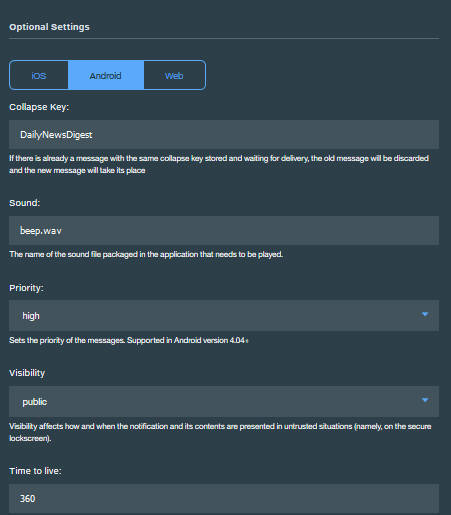

---

copyright:
 years: 2015, 2017

---

{:new_window: target="_blank"}
{:shortdesc: .shortdesc}
{:screen:.screen}
{:codeblock:.codeblock}

# Enabling notifications for mobile devices
{: #c_enable_push-notifications}
Last updated: 12 April 2017
{: .last-updated}

Ensure that you have gone through [Configuring credentials for a notification provider](t__main_push_config_provider.html).

This section describes how to enable your client applications - mobile, web browser applications and also Chrome Apps and Extensions to receive push notifications, how to create basic notifications, get and initialize the SDK or plug-in, and how to register your device or browser to receive push notifications. You can also enable your mobile and web browser applications to receive push notifications by using the [REST API](t_restapi.html).

**Note**: For device, browser, Chrome Apps and Extensions registrations, the {{site.data.keyword.mobilepushshort}} service maintains a unique reference to tokens issued from notification providers -
APNs for Apple or FCM for Google. The tokens can be invalidated by the {{site.data.keyword.mobilepushshort}} service notification provider for several reasons. 

For example, during uninstalling an app on the device. In such a scenario, when a notification is attempted to be delivered based on the providers response that the device is invalidated, the {{site.data.keyword.mobilepushshort}} service will remove the device or web browser registrations. This in turn would restrain consequent attempts in sending notification to those invalidated devices.


## Enabling Android applications to receive push notifications
{: #tag_based_notifications}


You can enable Android applications to receive push notifications to your devices. Android Studio is a prerequisite and is the recommended method to build Android projects. Basic knowledge of Android Studio is essential.

### Installing the client Push SDK with Gradle
{: #android_install}

This section describes how to install and use the client Push SDK to further develop your Android applications.

You can add {{site.data.keyword.Bluemix}} Mobile Services Push SDK using [Gradle ](http://developer.android.com/tools/building/configuring-gradle.html){: new_window}, which automatically downloads artifacts from repositories and makes them available to your Android application. Ensure that you correctly set up [Android Studio ](https://developer.android.com/tools/studio/index.html) and Android Studio SDK. 

After creating and opening your mobile application, complete the following steps using Android Studio.

1. Add dependencies to your Module level **build.gradle** file. 	

	- Add the following dependency to include the Bluemix™ Mobile services Push client SDK and the Google play services SDK to your compile scope dependencies.
	```
	com.ibm.mobilefirstplatform.clientsdk.android:push:3.+
	```
    	{: codeblock}
	
	- Add the following dependencies to import statements that are required for code snippets.
	```
	import com.ibm.mobilefirstplatform.clientsdk.android.core.api.BMSClient;
	import com.ibm.mobilefirstplatform.clientsdk.android.push.api.MFPPush;
	import com.ibm.mobilefirstplatform.clientsdk.android.push.api.MFPPushException;
	import com.ibm.mobilefirstplatform.clientsdk.android.push.api.MFPPushResponseListener;
	import com.ibm.mobilefirstplatform.clientsdk.android.push.api.MFPPushNotificationListener;
	import com.ibm.mobilefirstplatform.clientsdk.android.push.api.MFPSimplePushNotification;
	```
    	{: codeblock}

	- Add the following dependency to your Module level **build.gradle** file at the end.
	```
		apply plugin: 'com.google.gms.google-services'
	```
		{: codeblock}
3. Add the following dependencies to your Project level **build.gradle** file.
```
dependencies {
    classpath 'com.android.tools.build:gradle:2.2.3'
    classpath 'com.google.gms:google-services:3.0.0'
}
``` 
    {: codeblock}
5. In the **AndroidManifest.xml** file, add the following permissions. To view a sample manifest, see [Android helloPush Sample Application ](https://github.com/ibm-bluemix-mobile-services/bms-samples-android-hellopush/blob/master/helloPush/app/src/main/AndroidManifest.xml){: new_window}. To view a sample Gradle file, see [Sample Build Gradle file ](https://github.com/ibm-bluemix-mobile-services/bms-samples-android-hellopush/blob/master/helloPush/app/build.gradle){: new_window}.
```
	<uses-permission android:name="android.permission.INTERNET"/>
	<uses-permission android:name="android.permission.GET_ACCOUNTS" />
	<uses-permission android:name="android.permission.USE_CREDENTIALS" />
	<uses-permission android:name="android.permission.WRITE_EXTERNAL_STORAGE" />
	<uses-permission android:name="android.permission.ACCESS_WIFI_STATE"/>
```
	{: codeblock}
 Learn about [Android permissions ](http://developer.android.com/guide/topics/security/permissions.html){: new_window} here.

4. Add the notification intent settings for the activity. This setting starts the application when the user clicks the received notification from the notification area.
```
	<intent-filter>
		<action android:name="Your_Android_Package_Name.IBMPushNotification"/>
		<category  android:name="android.intent.category.DEFAULT"/>
	</intent-filter>
```
	{: codeblock}
**Note**: Replace *Your_Android_Package_Name* in the previous action with the application package name used in your application.

5. Add the Firebase Cloud Messaging (FCM) or Google Cloud Messaging (GCM) intent service and intent filters for the RECEIVE and REGISTRATION event notifications.
```
	<service android:name="com.ibm.mobilefirstplatform.clientsdk.android.push.api.MFPPushIntentService"
    	android:exported="true" >
    	<intent-filter>
    	    <action android:name="com.google.firebase.MESSAGING_EVENT" />
    </intent-filter>
	</service>
	<service
    android:name="com.ibm.mobilefirstplatform.clientsdk.android.push.api.MFPPush"
    android:exported="true" >
    <intent-filter>
        <action android:name="com.google.firebase.INSTANCE_ID_EVENT" />
    </intent-filter>
	</service>
```
    {: codeblock}

6. {{site.data.keyword.mobilepushshort}} service supports retrieval of  individual notifications from the notification tray. For notifications accessed from the notification tray, you are provided with a handle only to the notification that is being clicked. All notifications are displayed when the application is openend normally. Update your **AndroidManifest.xml** file with the following snippet to use this functionality:

```
	<activity android:name="
	com.ibm.mobilefirstplatform.clientsdk.android.push.api.MFPPushNotificationHandler"
	android:theme="@android:style/Theme.NoDisplay"/>
```
    {: codeblock}

Ensure that you have gone through [Configuring credentials for a notification provider](t__main_push_config_provider.html) to setup the FCM project and obtain your credentials. Complete the following steps using the Firebase Cloud Messaging (FCM) console.

1. In the Firebase console, click the **Project Settings** icon.
    

3. Select **ADD APP** or **Add Firebase to your Android app icon** from the General tab on the Your apps pane.
    

4. In Add Firebase to your Android app window, add **com.ibm.mobilefirstplatform.clientsdk.android.push** as the Package Name. The App nickname field is optional. Click **ADD APP**. 
    

5. Include the package name of your application, by entering the package name in Add Firebase to your Android app window. The App nickname field is optional. Click **ADD APP**. 

	

6. The `google-services.json` file is generated. Copy the `google-services.json` file to your Android application module root directory. Note that the `google-service.json` file includes the added package names.

    

5. In Add Firebase to your Android app window, click **Continue** and then **Finish**. 

  

Build and run your application.

### Initializing the Push SDK for Android apps
{: #android_initialize}

A common place to put the initialization code is in the onCreate method of the main activity in your Android application. There are two components of the the SDK that need to be initialized. One is the core SDK and the other is the push SDK built on the core SDK.

#### Initializing the Core SDK
{: #initz_core_sdk}

```
// Initialize the SDK for Android
    BMSClient.getInstance().initialize(this, BMSClient.REGION_US_SOUTH);
```
    {: codeblock}

#### bluemixRegionSuffix
{: #bluemixRegionSuffix}

Specifies the location where the app is hosted. You can use one of the three values:

- BMSClient.REGION_US_SOUTH
- BMSClient.REGION_UK
- BMSClient.REGION_SYDNEY

#### Initialize the client Push SDK
{: #initiz_client_pushSDK}

```
//Initialize client Push SDK for Java
MFPPush push = MFPPush.getInstance();
push.initialize(getApplicationContext(), "appGUID", "clientSecret");
```
	{: codeblock}

#### AppGUID
{: #appguid_initialize_client_push_sdk}

This is the AppGUID key of the {{site.data.keyword.mobilepushshort}} service. This value is case-sensitive. Open the Push Notification dashboard and select the Configure tab. You can get this value from Mobile Options in the configure tab on the Push Notification service dashboard. 

### Registering Android devices
{: #android_register}

Use the `MFPPush.register()` API to register the device with {{site.data.keyword.mobilepushshort}} service. For registering for Android devices, add the Firebase Cloud Messaging (FCM) information in the Bluemix {{site.data.keyword.mobilepushshort}} service configuration dashboard. For more information, see [Configuring credentials for a notification provider](t__main_push_config_provider.html).

Copy the following code snippets to your Android mobile application.

```
	//Register Android devices
	push.registerDevice(new MFPPushResponseListener<String>() {
    	@Override
    	public void onSuccess(String response) {
    		//handle success here
    	}
		@Override
    	public void onFailure(MFPPushException ex) {
    		//handle failure here
		}
		});
```
	{: codeblock}


```
	//Handles the notification when it arrives
	MFPPushNotificationListener notificationListener = new MFPPushNotificationListener() {
    @Override
    public void onReceive (final MFPSimplePushNotification message){
		// Handle Push Notification
   		 }
		};
```
	{: codeblock}

### Receiving push notifications on Android devices
{: #android_receive}

1. To register the notificationListener object with Push Notifications service, use the `MFPPush.listen()` method. This method is typically called from the `onResume()` and `onPause` methods of the activity that is handling push notifications.
```
	@Override
	protected void onResume(){
   	super.onResume();
   	if(push != null) {
       push.listen(notificationListener);
   }
	}
```
	{: codeblock}
```
	@Override
	protected void onPause() {
    super.onPause();
    if (push != null) {
        push.hold();
    }
	}
```
	{: codeblock}

2. Build the project and run it on the device or emulator. When the onSuccess() method for the response listener in the register() method is invoked, it confirms that the device has successfully registered with {{site.data.keyword.mobilepushshort}} service and you can now send a push notification.
3. Verify that your devices have received your notification. If the application is in the foreground, the notification is handled by the `MFPPushNotificationListener`. If the application is in the background, a message is displayed in the notification bar.

### Monitoring push notifications on Android devices
{: #android_monitor}

To monitor the current status of the notification within the application, you can implement the  `com.ibm.mobilefirstplatform.clientsdk.android.push.api.MFPPushNotificationStatusListener` interface and define the method onStatusChange(String messageId, MFPPushNotificationStatus status). 

The `messageId` is the identifier of the message sent from the server.  `MFPPushNotificationStatus` defines the status of the notifications as values:

- RECEIVED - App has received the notification. 
- QUEUED - App queues the notification for invoking the notification listener. 
- OPENED - User opens the notification by clicking the notification in the tray or by launching it from app icon or when the app is in foreground. 
- DISMISSED - User clears/dismisses the notification in the tray.

You need to register the `com.ibm.mobilefirstplatform.clientsdk.android.push.api.MFPPushNotificationStatusListener` class with MFPPush.

```
	push.setNotificationStatusListener(new MFPPushNotificationStatusListener() {
	@Override
	public void onStatusChange(String messageId, MFPPushNotificationStatus status) {
		// Handle status change
	}
	});
```
    {: codeblock}


#### Listening to the DISMISSED status
{: #android_monitor_listen}

You can choose to listen to the DISMISSED status on either of the following conditions:

- When the app is active (running in foreground or background)

  Add the snippet to your `AndroidManifest.xml` file:

```
	<receiver android:name="com.ibm.mobilefirstplatform.clientsdk.android.push.api.MFPPushNotificationDismissHandler">
	<intent-filter>
	<action android:name="Your_Android_Package_Name.Cancel_IBMPushNotification"/>
	</intent-filter>
	</receiver>
```
	{: codeblock}

- When the app is both active (running in foreground or background) and not running (closed)

Extend the  `com.ibm.mobilefirstplatform.clientsdk.android.push.api.MFPPushNotificationDismissHandler` broadcast receiver and override the method `onReceive()`, where the `MFPPushNotificationStatusListener` should be registered before calling  method `onReceive()` of the base class.

```
	public class MyDismissHandler extends MFPPushNotificationDismissHandler {
	@Override
	public void onReceive(Context context, Intent intent) {
	MFPPush.getInstance().setNotificationStatusListener(new MFPPushNotificationStatusListener() {
	@Override
	public void onStatusChange(String messageId, MFPPushNotificationStatus status) {
	// Handle status change
	}
	});
	super.onReceive(context, intent);
	}
	}
```
    {: codeblock}


Add the following snippet to you `AndroidManifest.xml` file:

```
	<receiver android:name="Your_Android_Package_Name.Your_Handler">
	<intent-filter>
	<action android:name="Your_Android_Package_Name.Cancel_IBMPushNotification"/>
	</intent-filter>
	</receiver>
```
    {: codeblock}

### Sending basic Push Notifications
{: #send-basic-notification}

After you have developed your applications, you can send basic push notifications.

To send basic push notifications, complete the following steps:

1. Select **Send Notifications**, and compose a message by choosing a **Send to** option. The supported options are **Device by Tag**, **Device Id**, **User Id**, **Android devices**, **iOS devices**, **Web Notifications**, and **All Devices**.
**Note**: When you select the **All Devices** option, all devices subscribed to {{site.data.keyword.mobilepushshort}} will receive notifications.


2. In the **Message** field, compose your message. Choose to configure the optional settings as required.
3. Click **Send**.
3. Verify that your devices have received your notification.

The following screen shot shows an alert box handling a push
notification in the foreground on a Android device.


The following following screen shot shows a push notification in the background for Android.


### Optional Android settings for sending notifications
{: #send_otpional_setting}

You can further customize the {{site.data.keyword.mobilepushshort}} settings for sending notifications to Android devices. The following optional customization options are supported:


- Collapse Key:  Collapse keys are attached to notifications. If multiple notifications arrive sequentially with the same collapse key when the device is offline, they are collapsed. When a device comes online, it receives notifications from the FCM/GCM server, and displays only the latest notification bearing the same collapse key. If the collapse key is not set, both the new and old messages are stored for the future delivery.
- Sound: Indicates a sound clip to be played on the receipt of a notification. Supports default or the name of a sound resource that is	 bundled in the app.
- Icon: Specify the name of the icon to display for the notification. Ensure that you have packaged the icon in the `res/drawable` folder, with the client application.
- Priority: Specifies the options for assigning delivery priority to messages. A priority of `high` or `max` will result in heads-up notification, while `low` or `default` priority messages would not open network connections on a sleeping device. For messages with the option set to `min`, it will be a silent notification.
- Visibility: You can choose to set the notification visibility option to either `public` or `private`. The `private` option restricts public viewing and you can choose to enable it if your device is secure with a pin or pattern, and the notification setting is set to **Hide sensitive notification content**. When the visibility is set as `private`, a `redact` field must be mentioned. Only the content specified in the `redact` field will show up on a secure locked screen on the device. Choosing `public` would render the notifications to be freely read.
- Time to live: This value is set in seconds. If this parameter is not specified, the FCM/GCM server stores the message for four weeks and will try to deliver. The validity expires after four weeks. The possible value range is from 0 to 2,419,200 seconds.
- Delay when idle: Setting this value to `true` instructs the FCM/GCM server not to deliver the notification if the device is idle. Set this value to `false`, to ensure delivery of notification even if the device is idle.
- Sync: By setting this option to `true`, notifications across all your registered devices are in sync. If the user with a username has multiple devices with the same application installed, reading the notification on one device ensures deletion of notifications in the other devices. You need to ensure that you are registered with {{site.data.keyword.mobilepushshort}} service with userId for this option to work.
- Additional payload: Specifies the custom payload values for your notifications.


### Next steps
{: #next_steps_tag_based_notifications}

After you have successfully set up basic notifications, you can configure configure tag-based notifications and advanced options.

Add these push notifications service features to your app.
To use tag-based notifications, see [Tag-based Notifications](c_tag_basednotifications.html).
To use advanced notifications options, see [Enabling advanced push notifications](t_advance_badge_sound_payload.html).


## Enabling Cordova applications to receive push notifications
{: #cordova_enable}


Cordova is a platform for building hybrid applications with JavaScript, CSS, and HTML. The {{site.data.keyword.mobilepushshort}} service supports development of Cordova-based iOS and Android applications.

You can enable Cordova applications to receive push notifications to your devices.

### Installing the Cordova push plug-in
{: #cordova_install}

Install and use the client push plug-in to further develop your Cordova applications. This also installs the Cordova core plug-in, which initializes your connection to Bluemix.

1. Download the latest Android Studio SDK and Xcode versions.
1. Set up your emulator. For Android Studio, use an emulator that supports Google Play API.
1. Install the Git command-line tool. For Windows, make sure you select the **Run Git from the Window Command Prompt** option. For information about how to download and install this tool, see [Git ](https://git-scm.com/downloads){: new_window}.
1. Install the Node.js and Node Package Manager (NPM) tool. The NPM command-line tool is bundled with Node.js. For information about how to download and install Node.js, see [Node.js ](https://nodejs.org/en/download/){: new_window}.
1. From the command line, install the Cordova command-line tools by using the **npm install -g cordova** command. This is required to use the Cordova push plug-in. For information about how to install Cordova and set up your Cordova app, see [Cordova Apache ](https://cordova.apache.org/#getstarted){: new_window}. For more information, see the Cordova push plug-in [Readme file ](https://github.com/ibm-bluemix-mobile-services/bms-clientsdk-cordova-plugin-push){: new_window}.
1. Change to the folder that you want to create your Cordova app in and run the following command to create a Cordova application. If you have an existing Cordova app, go to step 3.
```cordova create your_app_name
cd your_app_name
```
	{: codeblock}
- Optional: You can edit the **config.xml** file and change the application name in the <name> element to a name that you choose, rather than the default HelloCordova name.

Ensure that you specify the correct Bundle ID. The following error messages might result in Xcode, if an incorrect Bundle ID is specified.

* The executable was signed with invalid entitlements.
* The entitlements specified in your application’s Code Signing Entitlements file do not match those specified in your provisioning profile. To fix this issue, specify the correct Bundle ID in Xcode or in your Cordova app **config.xml**  file.

1. Add the minimum supported API or the deployment target declaration to the config.xml file for your Cordova application. The minSdkVersion value must be higher than 15. The targetSdkVersion value must always reflect the latest Android SDK that is available from Google.
	
	* Android - With your editor, open the **config.xml** file and update the
`<platform name="android">` element with minimum and target SDK versions:

	```
	<platform name="android">
    	<preference name="android-minSdkVersion" value="15" />
    	<preference name="android-targetSdkVersion" value="23" />
    	<!-- add minimum and target Android API level declaration -->
	</platform> 
	```
    	{: codeblock}

   * iOS - Update the <platform name="ios"> element with a deployment target declaration:

	```
	<platform name="ios">
	    <preference name="deployment-target" value="8.0" />
	    <!-- add deployment target declaration -->
	</platform>
	```
		{: codeblock}

1. From the Cordova command-line interface (CLI), add your platforms: iOS, Android, or both by using the command:
```
cordova platform add ios
cordova platform add android
```
	{: codeblock}

1. From your Cordova application root directory, enter the following command to install the Cordova push plug-in: **cordova plugin add bms-push**. Depending on the platforms that you added, you might see:
```
Installing "bms-push" for android
Installing "bms-push" for ios
```
	{: codeblock}

1. From your-app-root-folder, verify that the Cordova core and push plug-in were installed successfully by using the following command: **cordova plugin list**. Depending on the platforms that you added, you might see:
```
bms-core <version> "BMSCore"
bms-push <version> "BMSPush" 
```
	{: codeblock}

1. Configure your iOS development environment.
2. Build and run your application with Xcode.
1. Download your Firebase `google-services.json` for android, and place them in the root folder of your Cordova project, in `[your-app-name]/platforms/android.
	1. Go to `[your-app-name]/platforms/android`.
	2. Open file `build.gradle` (Path : platform > android > build.gradle).
	3. Find `buildscript` text in `build.gradle` file.
	4. After the classpath line, add the line, classpath 'com.google.gms:google-services:3.0.0'
	5. Then find "dependencies". Select dependencies where you have text `compile` and where that dependencies is getting ended, just after that, add this line :apply plugin: 'com.google.gms.google-services'.
	6. Prepare and build your Cordova Android project.
		```
		cordova prepare android
		cordova build android
		```
			{: codeblock}
	**Note**: Before opening your project in Android Studio, build your Cordova application through the Cordova CLI. This will help avoid build errors.

### Initializing the Cordova plug-in
{: #cordova_initialize}

Before you can use the {{site.data.keyword.mobilepushshort}} service Cordova plug-in, you need to initialize it by passing the application route and application GUID. After initializing the plug-in, you can connect to the server app that you have created in the Bluemix dashboard. The Cordova plug-in is the wrapper for the Android and iOS client SDKs to enable a Cordova app to communicate with Bluemix services.

1. Initialize the BMSClient by copying and pasting the following code snippet into your main JavaScript file (typically located under the **www/js** directory).

```
onDeviceReady: function() {
	app.receivedEvent('deviceready');
	BMSClient.initialize("YOUR APP REGION");
	var category =  {};
	BMSPush.initialize(appGUID,clientSecret,category);
	var success = function(message) { console.log("Success: " + message); };
	var failure = function(message) { console.log("Error: " + message); };
	BMSPush.registerDevice({}, success, failure);
	var showNotification = function(notif)
	{
	alert(JSON.stringify(notif));
	};
	BMSPush.registerNotificationsCallback(showNotification);
    } 
```
	{: codeblock}

Pass in the region for your application. The following constants are provided:

```
REGION_US_SOUTH // ".ng.bluemix.net";
REGION_UK //".eu-gb.bluemix.net";
REGION_SYDNEY // ".au-syd.bluemix.net";
```

For example:

```
BMSClient.initialize(BMSClient.REGION_US_SOUTH);
```

**Note**: If you have created a Cordova app using the Cordova CLI, for example, Cordova create app-name command, put this Javascript code in the index.js file, after the app.receivedEvent function within the onDeviceReady: function() function to initialize the `BMSClient`. 


### Registering devices
{: #cordova_register}


To register a device with the {{site.data.keyword.mobilepushshort}} service, call the register method. Copy the following code snippet into your Cordova application to register a device.

```
var success = function(message) { console.log("Success: " + message); };
var failure = function(message) { console.log("Error: " + message); };
BMSPush.registerDevice({}, success, failure);
```
	{: codeblock}

The following JavaScript code snippet shows how to initialize your Bluemix Mobile Services client SDK, register a device with {{site.data.keyword.mobilepushshort}} service, and listen to push notifications. Include this code in your Javascript file.

Within the **onDeviceReady: function()**.

```
onDeviceReady: function() {
app.receivedEvent('deviceready');
BMSClient.initialize("YOUR APP REGION");
var success = function(message) { console.log("Success: " + message); };
var failure = function(message) { console.log("Error: " + message); };
BMSPush.registerDevice({}, success, failure); 
 var showNotification = function(notif)
 {
 alert(JSON.stringify(notif));
 };
BMSPush.registerNotificationsCallback(showNotification); 
```
	{: codeblock}

Add the following Swift code snippet to your application delegate class.

```
// Register the device token with Bluemix Push Notification Service
func application(application: UIApplication,
  didRegisterForRemoteNotificationsWithDeviceToken deviceToken: NSData) {
   CDVBMSPush.sharedInstance().didRegisterForRemoteNotificationsWithDeviceToken(deviceToken)
} 
// Handle error when failed to register device token with APNs
func application(application: UIApplication,
    didFailToRegisterForRemoteNotificationsWithError error: NSErrorPointer) {
    CDVBMSPush.sharedInstance().didReceiveRemoteNotificationWithNotification(error)
} 
```
	{: codeblock}

### Next steps
{: #cordova_register_next}

Build your project and then run your project by using the following commands:

#### Android
{: #android-next-steps}

```
cordova build android
```
	{: codeblock}

```
cordova run android
```
	{: codeblock}

#### iOS
{: #ios-next-steps}

```
cordova build ios
```
	{: codeblock}

```
cordova run ios
```
	{: codeblock}

### Receiving push notifications on devices
{: #cordova_receive}

Copy the following code snippet to receive push notifications on devices.

#### JavaScript
{: #jvscrpt}

Add the following JavaScript code snippet to the web part of your Cordova application.
```
var showNotification = function(notif) {
  alert(JSON.stringify(notif));
        };
        BMSPush.registerNotificationsCallback(showNotification); 
```
	{: codeblock}

#### Android notification properties
{: #And_notif}

The following section lists the Android notification properties:

* **message** - Push notification message
* **payload** - JSON object containing a notification payload


#### iOS notification properties
{: #ios_notif}

The following section lists the iOS notification properties:

* **message** - Push notification message
* **payload** - JSON object that contains a notification payload
action-loc-key - The string is used as a key to get a localized string in the current localization, to use for the appropriate button title, instead of `View`.
* **badge** - The number to display as the badge of the app icon. If this property is absent, the badge is not changed. To remove the badge, set the value of this property to 0.
* **sound** - The name of a sound file in the app bundle or in the Library/Sounds folder of the app data container.


Add the following Swift code snippets to your application delegate class.
```
// Handle receiving a remote notification
func application(application: UIApplication,
   didReceiveRemoteNotification userInfo: [NSObject : AnyObject],  fetchCompletionHandler completionHandler: ) {
   CDVBMSPush.sharedInstance().didReceiveRemoteNotificationWithNotification(userInfo)
}
```
	{: codeblock}

```
// Handle receiving a remote notification on launch
func application(application: UIApplication, didFinishLaunchingWithOptions launchOptions: [NSObject: AnyObject]?) -> Bool {
  let remoteNotif = launchOptions?[UIApplicationLaunchOptionsKey.remoteNotification] as? NSDictionary
  if remoteNotif != nil {
    CDVBMSPush.sharedInstance().didReceiveRemoteNotificationOnLaunchWithLaunchOptions(launchOptions)
  }
} 
```
	{: codeblock}

### Sending basic push notifications
{: #push-send-notifications}

After you have developed your applications, you can send basic push notifications.

To send basic push notifications, complete the steps:

1. Select **Send Notifications**, and compose a message by choosing a **Send to** option. The supported options are **Device by Tag**, **Device Id**, **User Id**, **Android devices**, **iOS devices**, **Web Notifications**, and **All Devices**.
**Note**: When you select the **All Devices** option, all devices subscribed to {{site.data.keyword.mobilepushshort}} will receive notifications.


2. In the **Message** field, compose your message. Choose to configure the optional settings as required.
3. Click **Send**.
3. Verify that your devices have received your notification.

The following screen shot shows an alert box handling a {{site.data.keyword.mobilepushshort}} in the foreground on an Android and iOS device.


   The following image shows {{site.data.keyword.mobilepushshort}} in the background for Android.


#### Next steps
{: #next_steps_basic_notifications}

After you have successfully set up basic notifications, you can configure configure tag-based notifications and advanced options.

Add the {{site.data.keyword.mobilepushshort}} service features to your app.
To use tag-based notifications, see [Tag-based Notifications](c_tag_basednotifications.html).
To use advanced notifications options, see [Enabling advanced push notifications](t_advance_badge_sound_payload.html).


## Enabling iOS applications to send push notifications
{: #enable-push-ios-notifications}

You can enable iOS applications to send {{site.data.keyword.mobilepushshort}} to your devices.


### Installing CocoaPods
{: #enable-push-ios-notifications-install}

For an existing Xcode project, you can set up the Bluemix Mobile services client SDK using the CocoaPods dependency management tool. An alternative is to install the SDK manually.

To view the Swift Push readme file, go to [Readme ](https://github.com/ibm-bluemix-mobile-services/bms-clientsdk-swift-push/tree/master){: new_window}.


1. Install CocoaPods by using the following command in your Mac terminal.
	```
		$ sudo gem install cocoapods
	```
	{: codeblock}
2. Enter the `pod init` command in the terminal to initialize CocoaPods. Ensure that you run the command from the directory where your Xcode project is. The `pod init` command creates a Podfile.  
3. In the generated Podfile, add the required SDK dependencies. Copy the following Podfile.
   
	```
		source 'https://github.com/CocoaPods/Specs.git'
		//Copy the following list as is and remove the dependencies you do not need.
		use_frameworks!
		target 'MyApp' do
		platform :ios, '8.0'
		pod 'BMSCore'
		pod 'BMSPush'
		pod 'BMSAnalyticsAPI' end
	```
		{: codeblock}

3. From the terminal, go to your project folder and install the dependencies with the `pod update` command.

The command installs your dependencies and creates a new Xcode workspace.  
**Note**: Ensure that you always open the new Xcode workspace, instead of the original Xcode project file:
```
  $ open App.xcworkspace
```
	{: codeblock}

The workspace contains your original project and Pods project that contains your dependencies. To modify the Bluemix mobile services source folder, you can find it in your Pods project, under `Pods/yourImportedSourceFolder`, for example: `Pods/BMSPush`.

### Adding frameworks using Carthage
{: #carthage}

Add frameworks to your project using [Carthage ](https://github.com/Carthage/Carthage#if-youre-building-for-ios-tvos-or-watchos){: new_window}. Note that Carthage in Xcode8 is not supported.

1. Add `BMSPush` frameworks to your Cartfile:
	```
	github "github "ibm-bluemix-mobile-services/bms-clientsdk-swift-push" ~> 1.0"
	```
	{: codeblock}
2. Run the `carthage update` command. When the build completes, drag `BMSPush.framework`, `BMSCore.framework` and `BMSAnalyticsAPI.framework` into your Xcode project.
3. Follow the instructions on the [Carthage ](https://github.com/Carthage/Carthage#if-youre-building-for-ios-tvos-or-watchos){: new_window} site to complete the integration.

### Setting up the iOS SDK
{: #ios-sdk}

Set up the iOS SDK, add the following code to the **AppDelegate.swift** file in your application. Note that this also registers with the APNs.  
```
  func application(_ application: UIApplication,
  didFinishLaunchingWithOptions launchOptions: [NSObject: AnyObject]?) -> Bool 
   {  
   BMSPushClient.sharedInstance.initializeWithAppGUID(appGUID: "APP-GUID-HERE", clientSecret:"CLIENT-SECRET-HERE")
  }
```
    {: codeblock}

### Using imported frameworks and source folders
{: #using-imported-frameworks}

Reference the SDK in your code. Ensure that the following prerequisites are in place.

- iOS 8.0 or greater	
- Xcode 7

Write `#import` directives for the relevant headers, for example:
```
	 //swift
 	 import BMSCore
	 import BMSPush
```
		{: codeblock}

To read the Swift Push readme file, see [Readme ](https://github.com/ibm-bluemix-mobile-services/bms-clientsdk-swift-push/tree/master){: new_window}.

**Note**: Updating your Pods project using the CocoaPods commands `pod install` or `pod update` might override the Bluemix Mobile services source folders. If you want to retain your customized versions of the original files, ensure that they are backed up before you issue one of these commands.


### Build Settings
{: #build-settings}

Go to **Xcode > Build Settings > Build Options and Set Enable Bitcode** to **No**.

**Attention**: As of iOS 9, changes to the App Transport Security (ATS) feature might affect the way you handle the authentication process. The following blog posts describe more information about the changes: [ATS and Bitcode in iOS 9 ](https://developer.ibm.com/mobilefirstplatform/2015/09/09/ats-and-bitcode-in-ios9/){: new_window} and [Connect your iOS 9 app to Bluemix today ](https://developer.ibm.com/bluemix/2015/09/16/connect-your-ios-9-app-to-bluemix/){: new_window}.

### Initializing Push SDK for iOS apps
{: #enable-push-ios-notifications-initialize}

A common place to put the initialization code is in the application delegate for the iOS application. Click the **Mobile Options** link in your Push Dashboard to get the application route and GUID.

#### Initializing the Core SDK
{: #Initializing-the-core-sdk}

To initialize the Core SDK for Swift with IBM Bluemix GUID, route, and region, use the following code snippet.
```
	let myBMSClient = BMSClient.sharedInstance
	myBMSClient.initialize(bluemixRegion: "Location where your app is hosted.") 
```
	{: codeblock}

#### Route, GUID, and Bluemix region
{: #route-guid-bluemix-region}


- **appRoute**: Specifies the route that is assigned to the server application that you created on Bluemix.


- **GUID**: Specifies the unique key that is assigned to the application that you created on Bluemix. This value is case-sensitive.


- **bluemixRegionSuffix**: Specifies the location where the app is hosted. The `bluemixRegion` parameter specifies which Bluemix deployment you are using. You can set this value with a `BMSClient.REGION` static property and use one of three values:

	- BMSClient.Region.usSouth 
	- BMSClient.Region.unitedKingdom
	- BMSClient.Region.sydney


- **AppGUID**: Specifies the unique AppGUID key that is assigned to the {{site.data.keyword.mobilepushshort}} service that you created on Bluemix.

#### Initializing the client Push SDK
{: #initializing-the-client-Push-SDK}

```
	let push = BMSPushClient.sharedInstance
	push.initializeWithAppGUID("appGUID", clientSecret:"clientSecret")
```
	{: codeblock}


### Registering iOS applications and devices
{: #enable-push-ios-notifications-register}

An application must register with APNs to receive remote notifications, after installation on a device. After the device token generated by APNs is received by the app, it must be passed back to the {{site.data.keyword.mobilepushshort}} service.

To register iOS applications and devices, you need to:

1. Create a back-end application.
2. Pass the token to {{site.data.keyword.mobilepushshort}}.


#### Create a back-end application
{: #create-a-backend-app}

Create a back-end application in the Boilerplates section Bluemix® catalog, which automatically binds the {{site.data.keyword.mobilepushshort}} service to this application. If you have already created a back-end app, ensure that you bind the app to the {{site.data.keyword.mobilepushshort}} service.


#### Passing tokens to Push Notifications
{: #pass-token-push-notifications}

After the token is received from APNs, pass the token to {{site.data.keyword.mobilepushshort}} as part of the `registerWithDeviceToken` method.

```
  func application (_application: UIApplication, didRegisterForRemoteNotificationsWithDeviceToken deviceToken: Data){
   let push =  BMSPushClient.sharedInstance
   push.registerWithDeviceToken(deviceToken) { (response, statusCode, error) -> Void in
      if error.isEmpty {
           print( "Response during device registration : \(response)")
           print( "status code during device registration : \(statusCode)")
      }
       else{
           print( "Error during device registration \(error) ")
           print( "Error during device registration \n  - status code: \(statusCode) \n Error :\(error) \n")
       }
   }
  }
```
	{: codeblock}


### Receiving push notifications on iOS devices
{: #enable-push-ios-notifications-receiving}

To receive push notifications on iOS devices, add the following Swift method to the application delegate of your application.

```
   func application(_ application: UIApplication, didReceiveRemoteNotification userInfo: [AnyHashable : Any], fetchCompletionHandler completionHandler: @escaping (UIBackgroundFetchResult) -> Void) 
  { //UserInfo dictionary will contain data sent from the server }
```
	{: codeblock}

### Monitoring push notifications on iOS devices
{: #ios-monitoring}


You can monitor the count and current status of the push notifications that have been sent. To enable monitoring, add either of the following Swift method to the application delegate of your application based on the event.


- Send notification status when the app is opened by clicking the notification.
	```
		func application(_ application: UIApplication, didReceiveRemoteNotification userInfo: [AnyHashable : Any]) { 					let push =  BMSPushClient.sharedInstance
				let respJson = (userInfo as NSDictionary).value(forKey: "payload") as! String
				let data = respJson.data(using: String.Encoding.utf8)
				let jsonResponse:NSDictionary = try! JSONSerialization.jsonObject(with: data! , options: JSONSerialization.ReadingOptions.allowFragments) as! NSDictionary
		 		let messageId:String = jsonResponse.value(forKey: "nid") as! String
		    	push.sendMessageDeliveryStatus(messageId: messageId) { (res, ss, ee) in
    		  print("Send message status to the Push server")
    	 }
		}
	```
			{: codeblock}


- Send notification status when the app is in background mode.
	```
		func application(_ application: UIApplication, didReceiveRemoteNotification userInfo: [AnyHashable : Any], fetchCompletionHandler completionHandler: @escaping (UIBackgroundFetchResult) -> Void) {
	 	let payLoad = ((((userInfo as NSDictionary).value(forKey: "aps") as! NSDictionary).value(forKey: "alert") as! NSDictionary).value(forKey: "body") as! NSString)
	 	 	let push =  BMSPushClient.sharedInstance
			let respJson = (userInfo as NSDictionary).value(forKey: "payload") as! String
	 	let data = respJson.data(using: String.Encoding.utf8)
	 	let jsonResponse:NSDictionary = try! JSONSerialization.jsonObject(with: data! , options: JSONSerialization.ReadingOptions.allowFragments) as! NSDictionary
	 	let messageId:String = jsonResponse.value(forKey: "nid") as! String
		push.sendMessageDeliveryStatus(messageId: messageId) { (res, ss, ee) in
       completionHandler(UIBackgroundFetchResult.newData)
	}
	}
	```
			{: codeblock}


### Sending basic push notifications
{: #send}

After you have developed your applications, you can send basic push notifications.

To send basic push notifications, complete the steps:

1. Select **Send Notifications**, and compose a message by choosing a **Send to** option. The supported options are **Device by Tag**, **Device Id**, **User Id**, **Android devices**, **iOS devices**, **Web Notifications**, and **All Devices**.  
**Note**: When you select the **All Devices** option, all devices subscribed to {{site.data.keyword.mobilepushshort}} will receive notifications.


2. In the **Message** field, compose your message. Choose to configure the optional settings as required.
3. Click **Send**.
3. Verify that your devices have received your notification.

The following image shows an alert box handling a {{site.data.keyword.mobilepushshort}} an iOS device.

 

#### Optional settings for sending notifications
{: #send_ios_otpional_setting}

You can further customize the {{site.data.keyword.mobilepushshort}} settings for sending notifications to iOS devices. The following optional customization options are supported.

- **Badge**:  Indicates the number that is displayed on the application badge. The default value is zero (0), and this would not display a badge. 
- **Sound**: Indicates a sound clip to be played on the receipt of a notification. Supports default or the name of a sound resource bundled in the app.
- **Additional payload**: Specifies the custom payload values for your notifications.

### Enabling interactive notifications
{: #enb_snd_ios_otpional}

You can now enrich your iOS notifications with more details like adding an image,  map or a response button through enabling interactive notifications. This provides more context to customers, along with the ability to take immediate action without leaving the current context.  

To enable interactive notifications, use the code:


- To define the button action
	```
		let actionOne = BMSPushNotificationAction(identifierName: "ACCEPT", buttonTitle: "Accept", isAuthenticationRequired: false, defineActivationMode: UIUserNotificationActivationMode.background)
		let actionTwo = BMSPushNotificationAction(identifierName: "DECLINE", buttonTitle: "Decline", isAuthenticationRequired: false, defineActivationMode: UIUserNotificationActivationMode.background)
	```
		{: codeblock}


- To define category for the buttons
	```
		let category = BMSPushNotificationActionCategory(identifierName: "category", buttonActions: [actionOne, actionTwo])
	```
		{: codeblock}


- To update the registration to include buttons
	```
		Pass the defined category into iOS BMSPushClientOptions
		let notificationOptions = BMSPushClientOptions(categoryName: [category])
		let push = BMSPushClient.sharedInstance
		push.initializeWithAppGUID(appGUID: "APP-GUID-HERE", clientSecret:"CLIENT-SECRET-HERE", options: notificationOptions)
	```
		{: codeblock}

To send an interactive notification, complete the steps:

1. In the Compose section, for the Send To drop-down list, select **iOS Devices**.
2. Enter the notification message that you might want to sent.
3. In Optional Settings Section, select **Mobile** and click **iOS**.
4. In the Type drop-down list, select **Mixed**.
5. In Category field, specify the notification type that you have defined in your app. 

 

#### Next steps
{: #next_steps_02}

After you have successfully set up basic notifications, you can configure configure tag-based notifications and advanced options.

Add these Push Notifications Service features to your app.
To use tag-based notifications, see [Tag-based Notifications](c_tag_basednotifications.html).
To use advanced notifications options, see [Enabling advanced push notifications](t_advance_badge_sound_payload.html).
