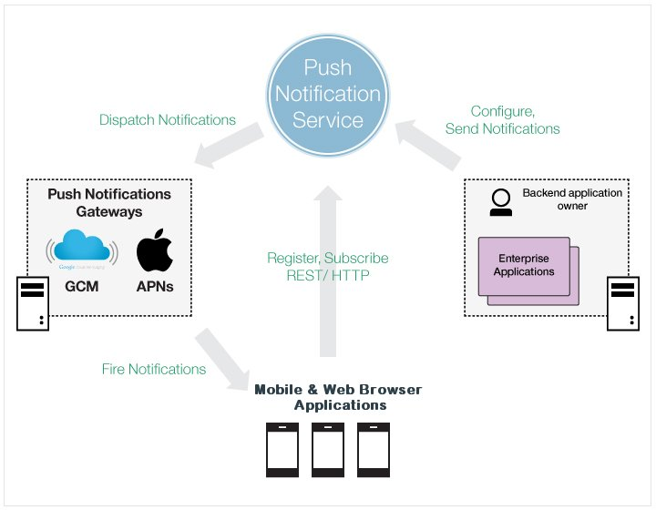

---

copyright:
 years: 2015, 2016

---

# About Push Notifications
{: #overview-push}

Push Notifications is a service that you can use to send notifications to iOS and Android device. Notifications can be targeted to all application users or to a specific set of users and devices using tags. You can administer devices, tags, and subscriptions. You can also use an SDK (software development kit) and Representational State Transfer (REST) application program interface (APIs) to further develop your client applications. For information about Push dedicated service, see [Dedicated Services](../../dedicated/index.html). 

## Push notification service process
{: #overview_push_process}

Mobile clients can subscribe and register for the Push Notification Service. On startup, mobile applications register and subscribe themselves to the Push Notification Service. The notifications are dispatched to the Apple Push Notification Service (APNs) or Google Cloud Messaging (GCM) server and then sent to registered mobile clients.

###Mobile applications

On startup, mobile applications register and subscribe themselves to the Push Notification Service to receive notifications.

###Backend applications

Backend applications can be on premises or in a public cloud. Backend applications use the Push Notification Service to send context-sensitive notifications to mobile users. The backend applications are not required to maintain and manage mobile devices and user information for sending push notifications. Instead, backend applications can use the Push Notification Service.

###App backend owner

The role that created the mobile backend application that bundles an instance of the Push Notification Service. This person configures and sets up the Push Notification Service to suit the backend applications that use the Push Notification Service and mobile applications that are the target of push notifications.

###Push Notification Service

The Push Notification Service manages all the information that is related to the devices that register for notifications. The service keeps your applications transparent to the technology details of sending notifications to these heterogeneous mobile platforms, handling all of this within.

###Gateways

Mobile device platform-specific cloud services such as Google Cloud Messaging (GCM) or Apple Push Notification Service (APNs) use the Push Notification Service to dispatch notifications to the mobile applications.

## Push notification types
{: #overview-push-types}

###Broadcast

When a mobile application registers itself with the Push Notification Service, it can start receiving broadcasts. Broadcast notifications are notification messages that are targeted to all the devices that have the application installed and configured for the Push Notification Service. Broadcast notifications are enabled by default with any application that is enabled for push notifications. Any application that is enabled for Push Notification Service has a predefined subscription to the Push.ALL tag, which is used by server to broadcast notification messages to all the devices. To send a broadcast notification that uses the REST Push API, ensure that the "target" is an empty JSON file when posting to the messages resource.

###Tag-based notifications

Tag notifications are notification messages that are targeted to all the devices that are subscribed to a particular tag. Tags-based notifications allow segmentation of notifications based on subject areas or topics. Notification recipients can choose to receive notifications only if it is about a subject or topic that is of interest. Therefore, tags-based notification provides a means to segment recipients. This feature enables the ability to define tags and then send and receive messages by tags. A message is targeted to only the devices that are subscribed to a tag. You must first create the tags for the application, set up the tag subscriptions and then initiate the tag-based notifications. To send a Tag-based notification that uses the REST API, ensure that the "tagNames" are provided when posting to the message resource.

###Unicast notifications

Unicast notifications are notification messages that are targeted to a particular device . Unicast notifications do not require any additional setup and are enabled by default when the application is enabled for push notifications. To send a Unicast notification that uses the REST API, make sure that the deviceIds are provided when posting to a message resource.

###Platform-based notifications

Notifications can be targeted to reach a particular device platform. For example, a notification can be sent to all the Android users only. To send a platform-based notification that uses the REST API, make sure that the targeted platforms are provided when posting to a message resource. Specify the platforms as an array. The supported platforms are as follows:
* A (Apple)
* G (Google)
