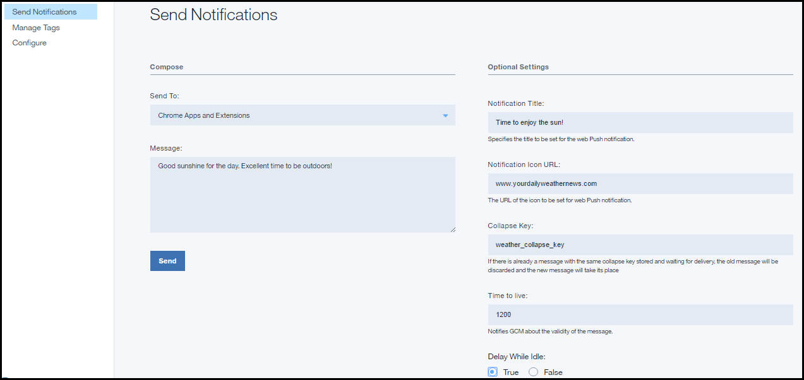

---

copyright:
 years: 2015, 2017

---

{:new_window: target="_blank"}
{:shortdesc: .shortdesc}
{:screen:.screen}
{:codeblock:.codeblock}

# Enabling Chrome Apps and Extensions to receive push notifications
{: #web_notifications}
Last updated: 12 April 2017
{: .last-updated}

You can enable Google Chrome Apps and Extensions to receive  {{site.data.keyword.mobilepushshort}}. Ensure that you have gone through [Configuring credentials for a notification provider](t__main_push_config_provider.html) before proceeding with the steps.

## Installing client SDK for Push Notifications
{: #web_install}

This topic describes how to install and use the client JavaScript Push SDK to further develop your Chrome Apps and Extensions.

### Initializing in Google Chrome Apps and Extensions
{: #initialize_google_extn_app}

For installing the Javascript SDK in Chrome Apps and Extensions, complete the steps:

Download the `BMSPushSDK.js` and `manifest_Chrome_Ext.json` (For chrome Extensions) or `manifest_Chrome_App.json` (for Chrome Apps) from the [Bluemix Web push SDK ](https://codeload.github.com/ibm-bluemix-mobile-services/bms-clientsdk-javascript-webpush/zip/master){: new_window}.


- For Chrome Apps, configure the manifest file:
 1. In the `manifest_Chrome_App.json` file, provide the name, description, and icons.
 2. Add the `BMSPushSDK.js` in the `app.background.scripts`.
 3. Change the `manifest_Chrome_App.json` to `manifest.json`.

- For Chrome Extensions, configure the manifest file:
 1. In the `manifest_Chrome_Ext.json` file provide name, description, and icons.
 2. Add the `BMSPushSDK.js` in the `background.scripts`.
 3. Change the `manifest_Chrome_Ext.json` to `manifest.json`.

In the `background.js` file add the following to receive push notifications 
```
chrome.gcm.onMessage.addListener(BMSPushBackground.onMessageReceived)
chrome.notifications.onClicked.addListener(BMSPushBackground.notification_onClicked);
chrome.notifications.onButtonClicked.addListener(BMSPushBackground.notifiation_buttonClicked); 
```
	{: codeblock}


### Initializing the Push SDK 
{: #web_initialize}

Initialse the push SDK with Bluemix {{site.data.keyword.mobilepushshort}} service `app GUID` and `app Region`.  

To get your app GUID, select the **Configuration** option in the navigation pane for your initialized push services and click **Mobile Options**. Modify the code snippet to use your Bluemix push notifications service appGUID parameter.

The `App Region` specifies the location where the {{site.data.keyword.mobilepushshort}} service is hosted. You can use one of the three values:

 - For US Dallas:	 `.ng.bluemix.net`
 - For UK:			 `.eu-gb.bluemix.net`
 - For Sydney:		 `.au-syd.bluemix.net`

```
 var bmsPush = new BMSPush();
 function callback(response) {
 alert(response.response)
 }
  var initParams = {
  "appGUID":"push app GUID",
  "appRegion":"Region where service hosted",
   "clientSecret":"clientSecret of your push service"
    }
  bmsPush.initialize(params, callback)
```
	{: codeblock}

### Registering the Chrome Apps and Extensions
{: #web_register}

Use the `register()` API to register the device with {{site.data.keyword.mobilepushshort}} service. For registering from Google Chrome, add the Firebase Cloud Messaging (FCM) API Key and Web Site URL in the Bluemix {{site.data.keyword.mobilepushshort}} service web configuration dashboard. For more information, see [Configuring credentials for a notification provider](t__main_push_config_provider.html). 

For registering from Mozilla Firefox, add website URL in the Bluemix {{site.data.keyword.mobilepushshort}} service web configuration dashboard under Firefox setup.

Use the following code snippet to register in Bluemix {{site.data.keyword.mobilepushshort}} service.
```
var bmsPush = new BMSPush();
function callback(response) {
     alert(response.response)
  }
  var initParams = {
  "appGUID":"push app GUID",
  "appRegion":"Region where service hosted",
  "clientSecret":"clientSecret of your push service"
  }
  bmsPush.initialize(params, callback)
  bmsPush.register(function(response) {
    alert(response.response)
  })
```
    {: codeblock}


## Sending basic notifications to Chrome Apps and Extensions 
{: #web_extensions_notifications}

After you have developed your applications, you can send a push notification. 

1. Select **Send Notifications**, and compose a message by choosing **Web Notifications** as the **Send To** option. 
2. Type the message that needs to be delivered in the **Message** field.
3. You can choose to provide optional settings:
  - **Notification Title**: This is the text that would be displayed as message alert heading.
  - **Notification Icon URL**: If your message needs to be delivered with an app notification icon, provide the link to your icon in the field.
  - **Collapse key**: Collapse keys are attached to notifications. If multiple notifications arrive sequentially with the same collapse key when the device is offline, they are collapsed. When a device comes online, it receives notifications from the FCM/GCM server, and displays only the latest notification bearing the same collapse key. If the collapse key is not set, both the new and old messages are stored for the future delivery.
  - **Time to live**: This value is set in seconds. If this parameter is not specified, the FCM/GCM server stores the message for four weeks and will try to deliver. The validity expires after four weeks. The possible value range is from 0 to 2,419,200 seconds.
  - **Delay when idle**: Setting this value to `true` instructs the FCM/GCM server not to deliver the notification if the device is idle. Set this value to `false`, to ensure delivery of notification even if the device is idle.
  - **Additional payload**: Specifies the custom payload values for your notifications.

The following image shows the Chrome Apps and Extensions notifications option in the dashboard.

  
  
### Next steps
{: #next_steps_tags}

After you have successfully set up basic notifications, you can choose to configure tag-based notifications and advanced options.

Add these {{site.data.keyword.mobilepushshort}} service features to your app. To use tag-based notifications, see [Tag-based Notifications](c_tag_basednotifications.html). To use advanced notifications options, see [Advanced notifications](t_advance_badge_sound_payload.html).


