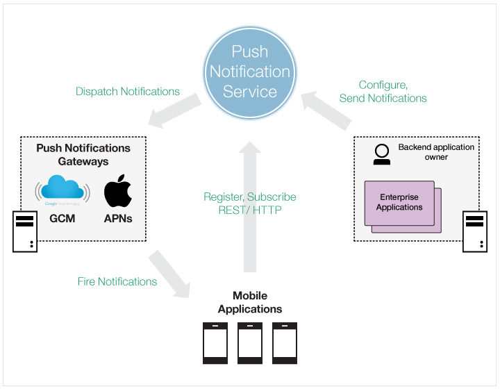

---

copyright:
 years: 2015, 2017

---

{:new_window: target="_blank"}
{:shortdesc: .shortdesc}
{:screen:.screen}
{:codeblock:.codeblock}

# Informationen zu {{site.data.keyword.mobilepushshort}}
{: #overview-push}
Letzte Aktualisierung: 18. Januar 2017
{: .last-updated}

Mit dem IBM Service {{site.data.keyword.mobilepushshort}} können Sie Benachrichtigungen an Geräte und Plattformen senden. Benachrichtigungen können zielgruppenspezifisch an alle Anwendungsbenutzer und an bestimmte Benutzergruppen und Geräte mithilfe von Tags gesendet werden. Sie können Geräte, Tags und Subskriptionen verwalten.  

Zum Erstellen eines gebundenen oder nicht gebundenen Service können Sie eine der folgenden Optionen verwenden:

- Durch Erstellen einer Bluemix-Anwendung mithilfe der Boilerplate 'MobileFirst Services Starter' aus dem Katalog. Diese Option erstellt einen Push-Benachrichtigungsservice, der an eine Bluemix-Back-End-Anwendung gebunden ist.
- Durch Erstellen eines nicht gebundenen Push-Benachrichtigungsservice direkt aus dem Mobile-Katalog. Sie können die Anwendung später binden oder als nicht gebundene Anwendung verwenden. 
- Mit dem [Mobile-Dashboard ](https://console.ng.bluemix.net/docs/mobile/services.html){: new_window}.

Beachten Sie, dass auf der Registerkarte zur Überwachung von Push-Benachrichtigungen keine Analysedaten angezeigt werden.

Der {{site.data.keyword.mobilepushshort}}-Service ist nun OpenWhisk-fähig. Weitere Informationen finden Sie unter [OpenWhisk](/docs/openwhisk/index.html).

## Prozess für den {{site.data.keyword.mobilepushshort}}-Service
{: #overview_push_process}

Mobile Clients, Web-Browser-Clients und Google Chrome-Apps und Erweiterungen können den {{site.data.keyword.mobilepushshort}}-Service subskribieren und sich bei ihm registrieren. Beim Start registrieren sich die Clientanwendungen beim {{site.data.keyword.mobilepushshort}}-Service und subskribieren ihn. Die Benachrichtigungen werden dem Server von Apple Push Notification Service (APNs) oder von Google Cloud Messaging (GCM) zugeteilt und anschließend an registrierte mobile oder Browser-Clients gesendet.

###Mobile Anwendungen und Browseranwendungen
{: mobile-applications}

Beim Start registrieren sich Clientanwendungen beim {{site.data.keyword.mobilepushshort}}-Service und subskribieren ihn, um Benachrichtigungen empfangen zu können.

###Back-End-Anwendungen
{: backend-applications}

Back-End-Anwendungen können sich vor Ort oder in einer öffentlichen Cloud befinden. Back-End-Anwendungen verwenden den {{site.data.keyword.mobilepushshort}}-Service zum Senden kontextabhängiger Benachrichtigungen an Benutzer von mobilen Geräten und Browseranwendungen. Die Back-End-Anwendungen sind für die Verwaltung und Wartung von mobilen Geräten, Browseragenten und von Benutzerinformationen zum Senden von Push-Benachrichtigungen nicht erforderlich. Stattdessen können Back-End-Anwendungen den {{site.data.keyword.mobilepushshort}}-Service verwenden, der Sie verwaltet und wartet.

###Eigner der Back-End-App
{: app-backend-owner}

Der Eigner der Back-End-App erstellt die mobile Back-End-Anwendung, die eine Instanz des {{site.data.keyword.mobilepushshort}}-Service bündelt. Der Eigner der Back-End-App konfiguriert außerdem den {{site.data.keyword.mobilepushshort}}-Service und richtet ihn so ein, dass er sich für die Back-End-Anwendungen eignet, die den Service verwenden, sowie für mobile Anwendungen und Browseranwendungen, die als Ziel für Push-Nachrichten fungieren.

###{{site.data.keyword.mobilepushshort}}-Service
{: push-notification-service}

Der {{site.data.keyword.mobilepushshort}}-Service ist für die Verwaltung aller Informationen im Zusammenhang mit mobilen Geräten und Web-Browser-Clients zuständig, die für Benachrichtigungen registriert sind. Der Service sorgt dafür, dass Ihre Anwendungen transparent gegenüber den Technologiedetails beim Senden von Benachrichtigungen an heterogene mobile Plattformen und Browserplattformen bleiben, und verarbeitet dies alles innerhalb seiner Tätigkeit.

###Gateways
{: gateways}

Plattformspezifische Cloud-Services für Push-Benachrichtigungen wie FCM/GCM oder Apple Push Notification Service (APNs), die vom IBM {{site.data.keyword.mobilepushshort}}-Service verwendet werden, um Benachrichtigungen an mobile und Browseranwendungen zu verteilen.

###Sicherheit von Push-Benachrichtigungen
{: push-security}

{{site.data.keyword.mobilepushshort}}-APIs sind durch zwei geheime Schlüssel geschützt.

- Der geheime Schlüssel **appSecret** schützt APIs, die normalerweise von Back-End-Anwendungen wie der API zum Senden von Push-Benachrichtigungen oder der API zum Konfigurieren von Einstellungen aufgerufen werden.
- Der geheime Schlüssel **clientSecret** schützt APIs, die normalerweise von mobilen Clientanwendungen aufgerufen werden. Es gibt im Zusammenhang mit der Registrierung von Geräten nur eine API mit zugeordneter Benutzer-ID, die diesen geheimen Clientschlüssel erfordert. Keine der anderen APIs, die von mobilen Clients aufgerufen werden, erfordert den geheimen Clientschlüssel. 

Die geheimen Schlüssel 'appSecret' und 'clientSecret' werden jeder Serviceinstanz beim Binden einer Anwendung mit dem {{site.data.keyword.mobilepushshort}}-Service zugeordnet. Weitere Informationen dazu, auf welche Weise und für welche APIs die geheimen Schlüssel übergeben werden sollen, finden Sie in der Dokumentation für [REST-APIs ](https://mobile.{DomainName}/imfpush/).

**Hinweis**: Frühere Anwendungen mussten den geheimen Clientschlüssel (clientSecret) nur bei der Registrierung oder Aktualisierung von Geräten mit dem Feld für die Benutzer-ID (userId) übergeben. Alle anderen APIs, die von mobilen oder Browserclients aufgerufen wurden, benötigten den geheimen Clientschlüssel nicht. Diese früheren Anwendungen können den geheimen Clientschlüssel auch weiterhin optional für Geräteregistrierungen oder Aktualisierungsaufrufe verwenden. Es wird jedoch dringend empfohlen, dass die Prüfung des geheimen Clientschlüssels für alle Aufrufe der Client-API zwingend durchgeführt wird. Um dies in vorhandenen Anwendungen durchzusetzen, wurde eine neue API mit dem Namen 'verifyClientSecret' veröffentlicht.  Für neue Anwendungen wird die Überprüfung des geheimen Clientschlüssels bei allen Aufrufen der Client-API erzwungen. Dieses Verhalten kann auch durch die API 'verifyClientSecret' nicht verändert werden.

Standardmäßig wird die Verifizierung des geheimen Clientschlüssels nur bei neuen Apps erzwungen. Sowohl vorhandene als auch neue Apps können die Verifizierung des geheimen Clientschlüssels mithilfe der REST-API 'verifyClientSecret' aktivieren oder inaktivieren. Es wird empfohlen, die Verifizierung des geheimen Clientschlüssels zu erzwingen, um zu verhindern, dass Benutzer mit Kenntnis der Anwendungs-ID und der Geräte-ID Zugang zu Geräten erhalten.

Stellen Sie sicher, dass der geheime Clientschlüsel vertraulich behandelt wird und zu keinem Zeitpunkt in der mobilen App fest codiert ist. Es gibt verschiedene Muster für die Anwendungsinitialisierung, mit denen der geheime Clientschlüssel zur Anwendungslaufzeit dynamisch extrahiert werden kann. Das Ablaufdiagramm stellt solche möglichen Muster dar.
 

## Typen von Push-Benachrichtigungen
{: #overview-push-types}

###Broadcast
{: broadcast}

Wenn sich eine Clientanwendung beim {{site.data.keyword.mobilepushshort}}-Service registriert, kann sie Rundsendungen (Broadcasts) empfangen. Broadcast-Benachrichtigungen sind Benachrichtigungen mit all jenen Anwendungsinstanzen als Ziel, die in verschiedenen Mobilgeräten oder Browsern installiert oder als Instanzen von Chrome-Apps oder Erweiterungen implementiert sind und für den {{site.data.keyword.mobilepushshort}}-Service konfiguriert wurden. Broadcast-Benachrichtigungen sind standardmäßig für jede beliebige Anwendung aktiviert, die Push-Benachrichtigungen empfangen kann. Alle Anwendungen, die für den {{site.data.keyword.mobilepushshort}}-Service aktiviert sind, verfügen über eine vordefinierte Subskription für den Tag 'Push.ALL', der vom Server zum Übertragen von Broadcast-Benachrichtigungen an alle Geräte verwendet wird. Zum Senden einer Broadcast-Benachrichtigung mithilfe der REST-API von Push müssen Sie während der Übergabe an die Ressource der Nachrichten sicherstellen, dass als 'Ziel' eine leere JSON-Datei angegeben ist.

###Tagbasierte Benachrichtigungen
{: tag-based-notifications}

Tag-Benachrichtigungen sind Benachrichtigungen, die all diejenigen Geräte zum Ziel haben, die einen bestimmten Tag subskribiert haben. Tagbasierte Benachrichtigungen ermöglichen die Segmentierung von Benachrichtigungen auf der Basis von Subjektbereichen oder Themen. Benachrichtigungsempfänger können wählen, dass sie Benachrichtigungen nur empfangen, wenn deren Inhalt ein Thema hat, das von Interesse ist. Daher bieten tagbasierte Benachrichtigungen die Möglichkeit, Empfänger zu segmentieren. Diese Funktion ermöglicht es, dass Tags definiert werden und anschließend Nachrichten geordnet nach Tags gesendet und empfangen werden. Eine Nachricht wird zielgruppenspezifisch nur an die Instanzen einer Clientanwendung (in Mobilgeräten, Browsern oder als App oder Erweiterungen) gesendet, die den Tag subskribiert haben. Sie müssen zunächst Tags für die Anwendung erstellen, die Tagsubskriptionen einrichten und anschließend die tagbasierten Benachrichtigungen starten. Zum Senden einer tagbasierten Benachrichtigung mithilfe der REST-API müssen Sie sicherstellen, dass während der Übergabe an die Ressource der Nachricht die Tagnamen ('tagNames') angegeben werden.

###Unicast-Benachrichtigungen
{: unicast-notifications}

Unicast-Benachrichtigungen sind Nachrichten, die ein bestimmtes Gerät oder einen bestimmten Benutzer zum Ziel haben. Unicast-Benachrichtigungen, die auf Geräte abzielen, benötigen keine zusätzliche Konfiguration und werden standardmäßig aktiviert, wenn die Anwendung für Push-Benachrichtigungen aktiviert wird.

Unicast-Benachrichtigungen an spezifische Benutzer erfordern zum Zeitpunkt der Registrierung des mobilen Clientgeräts oder Web-Browsers oder von Chrome-Apps und Erweiterungen bei {{site.data.keyword.mobilepushshort}} die Zuordnung einer Benutzer-ID zum Gerät.   

Normalerweise führt eine Clientanwendung zuerst einen Authentifizierungszyklus aus, bei dem der Benutzer der mobilen App bei einem Authentifizierungsservice wie [Mobile Client Access](docs/services/mobileaccess/index.html) authentifiziert wird. Nach der erfolgreichen Authentifizierung wird die ID des authentifizierten Benutzers dann an die API für Push-Geräteregistrierungen übergeben. 
Zum Senden einer Unicast-Benachrichtigung über die REST-API müssen Sie sicherstellen, dass während der Übergabe an die Ressource der Nachricht die Geräte- oder Benutzer-IDs ('deviceId' bzw. 'userId') angegeben werden.

###Plattformbasierte Benachrichtigungen
{: platform-based-notifications}

Benachrichtigungen können zielgruppenspezifisch an eine bestimmte Geräteplattform gerichtet werden. Eine Benachrichtigung kann beispielsweise nur an alle Android-Benutzer oder an alle Google Chrome-Benutzer gesendet werden. Stellen Sie zum Senden einer plattformbasierten Benachrichtigung mithilfe der REST-API sicher, dass die Zielplattformen während der Übergabe an eine Nachrichtenressource bereitgestellt werden. Geben Sie die Plattformen als Array an. Folgende Plattformen werden unterstützt:
* A (Apple)
* G (Google)
* WEB_CHROME (Google Chrome-Browser Web Push)
* WEB_FIREFOX (Mozilla Firefox-Browser Web Push)
* WEB_SAFARI (Safari-Browser Web Push)
* APPEXT_CHROME (Google Chrome-Apps & Erweiterungen)

## Größe von {{site.data.keyword.mobilepushshort}}-Nachrichten
{: #push-message-size}

Die Größe der {{site.data.keyword.mobilepushshort}}-Nachrichtennutzdaten hängt von den Einschränkungen ab, die durch die Gateways (FCM/GCM, APNs) und Clientplattformen festgelegt sind. 

### iOS und Safari
{: ios-message-size}

Ab iOS 8 beträgt die zulässige maximale Größe 2 Kilobyte. Der Push Notification-Service für Apple sendet keine Benachrichtigungen, die dieses Limit überschreiten.

###Android, Firefox-Browser, Chrome-Browser und Chrome Apps & Erweiterungen
{: android-message-size}

Es gibt eine Einschränkung von 4 Kilobyte als maximal zulässige Nachrichtennutzdatengröße.  
