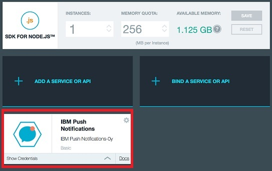

---

copyright:
 years: 2015, 2016

---

# Push-Serviceinstanz erstellen
{: #create-push-instance}

Um mit {{site.data.keyword.IBM}} {{site.data.keyword.mobilepushshort}} arbeiten zu können, müssen Sie zunächst eine {{site.data.keyword.Bluemix}}-Anwendung erstellen (z. B. eine Node.js-App). Anschließend erstellen Sie eine Instanz des Push-Service {{site.data.keyword.mobilepushfull}}, die an diese Bluemix-Anwendung gebunden werden muss. Zu diesem Zweck können Sie auch den Abschnitt 'Boilerplate' im Bluemix-Katalog aufrufen und auf 'MobileFirst Services Starter' klicken.

**Hinweis**: Wenn Sie Organisationen konfiguriert haben, um Ihre Umgebung zu verwalten, wählen Sie die Organisation aus, in der Sie die Laufzeit und die Services für Ihre mobile App erstellen möchten.

1. Wenn Sie nicht über eine Bluemix-Anwendung verfügen, müssen Sie eine erstellen (z. B. eine Node.js-App). Um eine Bluemix-Anwendung zu erstellen, rufen Sie das Bluemix-Dashboard auf und klicken Sie auf **Anwendung erstellen**.
	
	**Hinweis**: Wenn Sie bereits über eine Anwendung verfügen, fahren Sie mit Schritt 7 fort, um einen Service hinzuzufügen.

1. Klicken Sie unter **Eigene Anwendungsvorlage auswählen** auf **WEB**.

3. Wählen Sie im Bereich **Ausgangspunkt auswählen** die Option **SDK for Node.js** aus und klicken Sie auf **Weiter**. 

4. Wählen Sie im Pulldown-Menü **Bereich** den Bereich
Ihrer Organisation aus.

	
1. Geben Sie in das Feld **Name** den Namen für Ihre App ein und
in das Feld 'Host' den Namen des Hosts.

1. Wählen Sie im Pulldown-Menü **Ausgewählter Plan** einen Plan aus
und klicken Sie anschließend auf die Schaltfläche **ERSTELLEN**. Warten Sie,
bis die Anwendung bereitgestellt ist.

1. Klicken Sie auf den Link **Übersicht**.
1. Klicken Sie auf **Service hinzufügen**. Die Anzeige 'Katalog' wird geöffnet.

1. Wählen Sie **IBM Push Notifications:** und anschließend im Pulldown-Menü **Bereich** Ihre Organisation aus.

	
1. Geben Sie in das Feld **Service** den Push Notifications Service-Name ein.

1. Wählen Sie unter **Ausgewählter Plan** einen Plan aus und
klicken Sie auf die Schaltfläche **ERSTELLEN**.

1. Klicken Sie auf **Ja**, um die Anwendung erneut bereitzustellen.

	

1. Klicken Sie auf **Push-Benachrichtigungen**, um das Dashboard für Push-Benachrichtigungen anzuzeigen.
