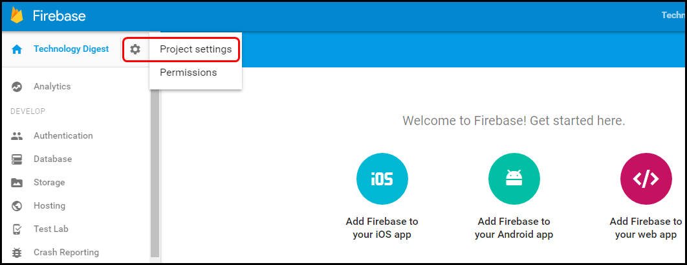
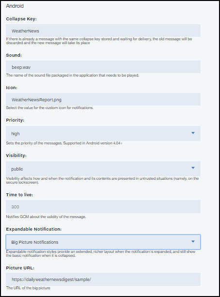

---

copyright:
 years: 2015, 2017

---

{:new_window: target="_blank"}
{:shortdesc: .shortdesc}
{:screen:.screen}
{:codeblock:.codeblock}

# Habilitación de notificaciones para dispositivos móviles
{: #c_enable_push-notifications}
Última actualización: 12 de abril de 2017
{: .last-updated}

Asegúrese de haber [configurado credenciales para un proveedor de notificaciones](t__main_push_config_provider.html).

Esta sección describe cómo habilitar las aplicaciones cliente (aplicaciones móviles y de navegador web y también apps y extensiones de Chrome) para recibir notificaciones push, cómo crear notificaciones básicas, cómo obtener e inicializar el SDK o el plug-in, y cómo registrar el dispositivo o navegador para recibir notificaciones push. También puede habilitar las aplicaciones móviles y de navegador web para recibir notificaciones push utilizando la [API REST](t_restapi.html).

**Nota**: Para los registros de extensiones y apps de navegador o dispositivo Chrome, el servicio {{site.data.keyword.mobilepushshort}} mantiene una referencia única a las señales emitidas a partir de proveedores de notificaciones -
APNs para Apple o FCM para Google. Las señales las puede invalidar el proveedor de notificación del servicio {{site.data.keyword.mobilepushshort}} por diversos motivos. 

Por ejemplo, durante la desinstalación de una app en el dispositivo. En tal caso, cuando se intenta entregar una notificación en función de la respuesta de los proveedores que ha invalidado el dispositivo, el servicio {{site.data.keyword.mobilepushshort}} eliminará los registros de dispositivos o navegadores web. Esto a su vez podría restringir los intentos consecuentes al enviar notificación a los dispositivos invalidados.


## Habilitación de aplicaciones Android para recibir notificaciones push
{: #tag_based_notifications}


Puede habilitar las aplicaciones de Android para recibir notificaciones push en sus dispositivos. Android Studio es un requisito previo y es el método recomendado para crear proyectos de Android. Es esencial tener conocimientos básicos de Android Studio.

### Instalación del SDK Push del cliente con Gradle
{: #android_install}

En esta sección se describe cómo instalar y utilizar el SDK Push del cliente para seguir desarrollando sus aplicaciones Android.

Puede añadir el SDK push de servicios móviles de {{site.data.keyword.Bluemix}} mediante [Gradle ](http://developer.android.com/tools/building/configuring-gradle.html){: new_window}, que descarga automáticamente los artefactos de repositorios y los pone a disponibilidad de la aplicación Android. Asegúrese de configurar correctamente [Android Studio ](https://developer.android.com/tools/studio/index.html) y el SDK de Android Studio.  

Después de crear y abrir la aplicación para móvil, siga estos pasos utilizando Android Studio.

1. Añada dependencias al archivo **build.gradle** a nivel de módulo. 	

	- Añada la siguiente dependencia para incluir el SDK de cliente push de Bluemix™ Mobile Services y el SDK de Google Play Services a las dependencias de ámbito de compilación.
	```
	com.ibm.mobilefirstplatform.clientsdk.android:push:3.+
	```
    	{: codeblock}
	
	- Añada las siguientes dependencias para importar las sentencias necesarias para el fragmento de código.
	```
	import com.ibm.mobilefirstplatform.clientsdk.android.core.api.BMSClient;
	import com.ibm.mobilefirstplatform.clientsdk.android.push.api.MFPPush;
	import com.ibm.mobilefirstplatform.clientsdk.android.push.api.MFPPushException;
	import com.ibm.mobilefirstplatform.clientsdk.android.push.api.MFPPushResponseListener;
	import com.ibm.mobilefirstplatform.clientsdk.android.push.api.MFPPushNotificationListener;
	import com.ibm.mobilefirstplatform.clientsdk.android.push.api.MFPSimplePushNotification;
	```
    	{: codeblock}

	- Añada la siguiente dependencia al archivo **build.gradle** a nivel de módulo.
	```
		apply plugin: 'com.google.gms.google-services'
	```
		{: codeblock}
3. Añada las siguientes dependencias al archivo **build.gradle** a nivel de proyecto.
```
dependencies {
    classpath 'com.android.tools.build:gradle:2.2.3'
    classpath 'com.google.gms:google-services:3.0.0'
}
``` 
    {: codeblock}
5. En el archivo **AndroidManifest.xml**, añada los permisos siguientes. Para ver un manifiesto de ejemplo, consulte la [Aplicación de ejemplo helloPush de Android ](https://github.com/ibm-bluemix-mobile-services/bms-samples-android-hellopush/blob/master/helloPush/app/src/main/AndroidManifest.xml){: new_window}. Para ver un archivo de ejemplo de Gradle, consulte el [Archivo de compilación de ejemplo de Gradle ](https://github.com/ibm-bluemix-mobile-services/bms-samples-android-hellopush/blob/master/helloPush/app/build.gradle){: new_window}.
```
	<uses-permission android:name="android.permission.INTERNET"/>
	<uses-permission android:name="android.permission.GET_ACCOUNTS" />
	<uses-permission android:name="android.permission.USE_CREDENTIALS" />
	<uses-permission android:name="android.permission.WRITE_EXTERNAL_STORAGE" />
	<uses-permission android:name="android.permission.ACCESS_WIFI_STATE"/>
```
	{: codeblock}
Aquí encontrará más información sobre los [permisos de Android ](http://developer.android.com/guide/topics/security/permissions.html){: new_window}.

4. Añade los valores de intención de notificación para la actividad. Este valor inicia la aplicación cuando el usuario pulsa la notificación recibida desde el área de notificación.
```
	<intent-filter>
	<action android:name="Your_Android_Package_Name.IBMPushNotification"/>
	<category  android:name="android.intent.category.DEFAULT"/>
	</intent-filter>
```
	{: codeblock}
**Nota**: sustituya *Your_Android_Package_Name* en la acción anterior por el nombre del paquete de aplicaciones utilizado en la aplicación.

5. Añada el servicio de intento de Firebase Cloud Messaging (FCM) o Google Cloud Messaging (GCM) y los filtros de intento para las notificaciones de sucesos RECEIVE y REGISTRATION.
```
	<service android:name="com.ibm.mobilefirstplatform.clientsdk.android.push.api.MFPPushIntentService"
    android:exported="true" >
    	<intent-filter>
        <action android:name="com.google.firebase.MESSAGING_EVENT" />
    </intent-filter>
	</service>
<service
    android:name="com.ibm.mobilefirstplatform.clientsdk.android.push.api.MFPPush"
    android:exported="true" >
    <intent-filter>
        <action android:name="com.google.firebase.INSTANCE_ID_EVENT" />
    </intent-filter>
	</service>
```
    {: codeblock}

6. El servicio de {{site.data.keyword.mobilepushshort}} da soporte a la recuperación de notificaciones individuales desde la bandeja de notificaciones. Para las notificaciones a las que se accede desde la bandeja de notificaciones, se le proporcionará un controlador sólo para la notificación que se ha pulsado. Todas las notificaciones se mostrarán cuando la aplicación se abra normalmente. Actualice el archivo **AndroidManifest.xml** con el siguiente fragmento de código para utilizar esta funcionalidad:

```
	<activity android:name="
com.ibm.mobilefirstplatform.clientsdk.android.push.api.MFPPushNotificationHandler"
android:theme="@android:style/Theme.NoDisplay"/>
```
    {: codeblock}

Asegúrese de haber [configurado credenciales para un proveedor de notificaciones](t__main_push_config_provider.html) para configurar el proyecto FCM y obtener las credenciales. Siga estos pasos en la consola de Firebase Cloud Messaging (FCM).

1. En la consola de Firebase, pulse el icono **Configuración del proyecto**.
    

3. Seleccione **AÑADIR APP** o el **icono Añadir Firebase a la app Android** en el separador General del panel Sus apps.
    

4. En la ventana Añadir Firebase a la app Android, añada **com.ibm.mobilefirstplatform.clientsdk.android.push** como Nombre de paquete. El campo Apodo de app es opcional. Pulse **AÑADIR APP**. 
    

5. Incluya el nombre de paquete de la aplicación, especificando el nombre de paquete en la ventana Añadir Firebase a la app Android. El campo Apodo de app es opcional. Pulse **AÑADIR APP**. 

	

6. Se generará el archivo `google-services.json`. Copie el archivo `google-services.json` al directorio raíz del módulo de aplicación de Android. Tenga en cuenta que el archivo `google-service.json` incluye los nombres de paquete añadidos.

    

5. En la ventana Añadir Firebase a la app Android, pulse **Continuar** y, a continuación, **Finalizar**. 

  

Cree y ejecute la aplicación.

### Inicialización del SDK push para apps Android
{: #android_initialize}

Un lugar común para colocar el código de inicialización se encuentra en el método onCreate de la actividad principal en su aplicación Android. Hay dos componentes del SDK que deben inicializarse. Uno es el SDK principal y el otro es el SDK push creado en el SDK principal.

#### Inicialización del SDK principal
{: #initz_core_sdk}

```
// Inicializar el SDK para Android
    BMSClient.getInstance().initialize(this, BMSClient.REGION_US_SOUTH);
```
    {: codeblock}

#### bluemixRegionSuffix
{: #bluemixRegionSuffix}

Especifica la ubicación en la que se aloja la app. Puede utilizar uno de estos tres valores:

- BMSClient.REGION_US_SOUTH
- BMSClient.REGION_UK
- BMSClient.REGION_SYDNEY

#### Inicializar el SDK push del cliente
{: #initiz_client_pushSDK}

```
//Inicializar SDK de cliente Push para Java
MFPPush push = MFPPush.getInstance();
push.initialize(getApplicationContext(), "appGUID", "clientSecret");
```
	{: codeblock}

#### AppGUID
{: #appguid_initialize_client_push_sdk}

Esta es la clave AppGUID del servicio {{site.data.keyword.mobilepushshort}}. Este valor distingue entre mayúsculas y minúsculas. Abra el panel de control Notificación Push y seleccione el separador Configurar. Puede obtener este valor en Opciones móviles, en el separador Configurar del panel de control Servicio de notificaciones Push. 

### Registro de dispositivos Android
{: #android_register}

Utilice la API `MFPPush.register()` para registrar el dispositivo con el servicio {{site.data.keyword.mobilepushshort}}. Para el registro con dispositivos Android, añada información de Firebase Cloud Messaging (FCM) en el panel de control de configuración del servicio {{site.data.keyword.mobilepushshort}} de Bluemix. Para obtener más información, consulte [Configuración de credenciales para un proveedor de notificaciones](t__main_push_config_provider.html).

Copie los siguientes fragmentos de código en la aplicación para móviles de Android.

```
	//Registre dispositivos Android
	push.registerDevice(new MFPPushResponseListener<String>() {
    	@Override
    	public void onSuccess(String response) {
    		//maneje el éxito aquí
	    }
		@Override
    public void onFailure(MFPPushException ex) {
    		//maneje la anomalía aquí
	    }
		});
```
	{: codeblock}


```
	//Maneja la notificación cuando llega
	MFPPushNotificationListener notificationListener = new MFPPushNotificationListener() {
    @Override
	    public void onReceive (final MFPSimplePushNotification message){
	      // Manejar la notificación push
	    }
		};
```
	{: codeblock}

### Recepción de notificaciones push en dispositivos Android
{: #android_receive}

1. Para registrar el objeto notificationListener con el servicio de notificaciones push, utilice el método `MFPPush.listen()`. Se suele llamar a este método desde los métodos `onResume()` y `onPause` de la actividad que gestiona las notificaciones push.
```
	@Override
	protected void onResume(){
	   super.onResume();
	   if(push != null) {
       push.listen(notificationListener);
	   }
	}
```
	{: codeblock}
```
	@Override
protected void onPause() {
    super.onPause();
    if (push != null) {
        push.hold();
    }
	}
```
	{: codeblock}

2. Cree el proyecto y ejecútelo en el dispositivo o en el emulador. Cuando se invoque el método onSuccess() para la escucha de respuestas en el método register(), confirmará que el dispositivo se ha registrado correctamente con el servicio {{site.data.keyword.mobilepushshort}} y que ya puede enviar una notificación push. 
3. Verifique que los dispositivos hayan recibido la notificación. Si la aplicación se encuentra en segundo plano, la notificación se manejará mediante el `MFPPushNotificationListener`. Si la aplicación se encuentra en segundo plano, se mostrará un mensaje en la barra de notificaciones.

### Supervisión de las notificaciones push en dispositivos Android
{: #android_monitor}

Para supervisar el estado actual de la notificación en la aplicación, puede implementar la interfaz `com.ibm.mobilefirstplatform.clientsdk.android.push.api.MFPPushNotificationStatusListener` y definir el método onStatusChange(String messageId, MFPPushNotificationStatus status). 

El `messageId` es el identificador del mensaje enviado desde el servidor.  `MFPPushNotificationStatus` define el estado de las notificaciones como valores:

- RECEIVED: La app ha recibido la notificación. 
- QUEUED: La app pone en cola la notificación para invocar la escucha de notificación. 
- OPENED: El usuario abre la notificación pulsando la notificación en la bandeja o iniciándola desde el icono de la app o cuando la app está en primer plano. 
- DISMISSED: El usuario borra/descarta la notificación de la bandeja.

Debe registrar la clase `com.ibm.mobilefirstplatform.clientsdk.android.push.api.MFPPushNotificationStatusListener` con MFPPush.

```
	push.setNotificationStatusListener(new MFPPushNotificationStatusListener() {
	@Override
public void onStatusChange(String messageId, MFPPushNotificationStatus status) {
		// Handle status change
}
	});
```
    {: codeblock}


#### Escucha del estado DISMISSED
{: #android_monitor_listen}

Puede elegir escuchar en el estado DISMISSED en cualquiera de las siguientes condiciones:

- Cuando la app está activa (se ejecuta en primer o segundo plano)

  Añada el fragmento de código al archivo `AndroidManifest.xml`:

```
	<receiver android:name="com.ibm.mobilefirstplatform.clientsdk.android.push.api.MFPPushNotificationDismissHandler">
<intent-filter>
<action android:name="Your_Android_Package_Name.Cancel_IBMPushNotification"/>
	</intent-filter>
	</receiver>
```
	{: codeblock}

- Cuando la app está activa (se ejecuta en primer o segundo plano) y no se ejecuta (cerrada)

Extienda el receptor de difusión general `com.ibm.mobilefirstplatform.clientsdk.android.push.api.MFPPushNotificationDismissHandler` y modifique el método `onReceive()`, donde `MFPPushNotificationStatusListener` debe estar registrado antes de llamar al método `onReceive()` de la clase base. 

```
	public class MyDismissHandler extends MFPPushNotificationDismissHandler {
	@Override
public void onReceive(Context context, Intent intent) {
	MFPPush.getInstance().setNotificationStatusListener(new MFPPushNotificationStatusListener() {
	@Override
public void onStatusChange(String messageId, MFPPushNotificationStatus status) {
	// Handle status change
}
	});
super.onReceive(context, intent);
}
	}
```
    {: codeblock}


Añada el fragmento de código siguiente al archivo `AndroidManifest.xml`:

```
	<receiver android:name="Your_Android_Package_Name.Your_Handler">
<intent-filter>
<action android:name="Your_Android_Package_Name.Cancel_IBMPushNotification"/>
	</intent-filter>
	</receiver>
```
    {: codeblock}

### Envío de notificaciones push básicas
{: #send-basic-notification}

Una vez que haya desarrollado sus aplicaciones, puede enviar notificaciones push básicas.

Para enviar notificaciones push básicas, siga estos pasos:

1. Seleccione **Enviar notificaciones** y para redactar un mensaje seleccione la opción **Enviar a**. Las opciones admitidas son **Dispositivo por etiqueta**, **ID de dispositivo**, **ID de usuario**, **Dispositivos Android**, **Dispositivos iOS**, **Notificaciones web** y **Todos los dispositivos**.
**Nota**: Cuando seleccione la opción **Todos los dispositivos**, todos los dispositivos suscritos a {{site.data.keyword.mobilepushshort}} recibirán notificaciones.


2. En el campo **Mensaje**, redacte el mensaje. Elija configurar los valores opcionales según sea necesario.
3. Pulse **Enviar**.
3. Verifique que los dispositivos hayan recibido la notificación.

La captura de pantalla siguiente muestra un recuadro de alerta que maneja una notificación push
en el primer plano en un dispositivo Android.


La captura de pantalla siguiente muestra una notificación push en segundo plano para Android.


### Valores opcionales de Android para el envío de notificaciones
{: #send_otpional_setting}

Puede personalizar aún más los valores de {{site.data.keyword.mobilepushshort}} para el envío de notificaciones a dispositivos Android. Se admiten las siguientes opciones de personalización:



- Contraer clave: las claves contraídas se adjuntan a las notificaciones. Si llegan varias notificaciones de forma secuencias con la misma clave contraída cuando el dispositivo está desconectado, estas se contraerán. Cuando el dispositivo vuelva a conectarse, recibirá las notificaciones del servidor FCM/GCM y mostrará solo la última notificación transportada con la misma clave contraída. Si no se establece esta clave contraída, se almacenarán los mensajes nuevos y antiguos para entregarlos más adelante.
- Sonido: indica un fragmento de sonido que se reproducirá al recibir una notificación. Da soporte a la opción predeterminada o al nombre de un recurso de sonido incorporado en la app.
- Icono: Especifique el nombre del icono que se mostrará para la notificación. Asegúrese de haber empaquetado el icono en la carpeta `res/drawable` con la aplicación cliente.
- Prioridad: especifica las opciones para asignar la prioridad de entrega a los mensajes. Una prioridad `high` o `max` dará como resultado una notificación de aviso, mientras que los mensajes con prioridad `low` o `default` no establecerán conexiones de red en un dispositivo en modo suspendido. Para los mensajes con la opción definida en `min`, se enviará una notificación silenciosa.
- Visibilidad: puede optar por definir la opción de visibilidad de notificación como `public` o `private`. La opción `private` limita la visualización pública y puede habilitarla si el dispositivo está protegido mediante pin o un patrón y si el valor de notificación está establecido en **Ocultar contenido confidencial de notificación**. Cuando la visibilidad está establecida en `private`, debe mencionarse algún campo de `redacción`. Solo se mostrará el contenido especificado en el campo de `redacción` en la pantalla segura bloqueada del dispositivo. Si se elige `public` se entregarán notificaciones que se pueden leer libremente.
- Tiempo de duración: este valor se establece en segundos. Si no se especifica este parámetro, el servidor FCM/GCM almacenará el mensaje cuatro semanas e intentará entregarlo. La validez caduca transcurridas cuatro semanas. El intervalo de valores posible es de 0 a 2.419.200 segundos.
- Retrasar cuando esté desocupado: si está establecido en `true`, el servidor FCM/GCM no entregará la notificación cuando el dispositivo esté desocupado. Establezca este valor en `false` para garantizar que se entregan notificaciones aunque el dispositivo esté desocupado.
- Sinc: si esta opción se establece en `true`, se sincronizan las notificaciones de todos los dispositivos registrados. Si un usuario dispone de varios dispositivos con la misma aplicación instalada, al leer la notificación en un dispositivo se suprimirán las notificaciones del resto de los dispositivos. Debe asegurarse que está registrado al servicio {{site.data.keyword.mobilepushshort}} con userId para que esta opción funcione.
- Carga útil adicional: permite especificar valores personalizados de carga útil para las notificaciones.


### Pasos siguientes
{: #next_steps_tag_based_notifications}

Una vez que haya configurado correctamente las notificaciones básicas, puede configurar las notificaciones basadas en código y las opciones avanzadas.

Añada estas características del servicio de notificaciones push a su app.
Para utilizar notificaciones basadas en código, consulte [Notificaciones basadas en código](c_tag_basednotifications.html).
Para utilizar opciones de notificaciones avanzadas, consulte [Habilitación de notificaciones push avanzadas](t_advance_badge_sound_payload.html).


## Habilitación de aplicaciones Cordova para recibir notificaciones push
{: #cordova_enable}


Cordova es una plataforma para crear aplicaciones híbridas con JavaScript, CSS y HTML. El servicio de {{site.data.keyword.mobilepushshort}} da soporte al desarrollo de aplicaciones para iOS y Android basadas en Cordova.

Puede habilitar las aplicaciones de Cordova para recibir notificaciones push en sus dispositivos.

### Instalación del plug-in push de Cordova
{: #cordova_install}

Instale y utilice el plug-in push del cliente para seguir desarrollando sus aplicaciones Cordova. Esto también instala el plug-in Core de Cordova, que inicializa la conexión a Bluemix.

1. Descargue las versiones más recientes de Android Studio SDK y Xcode.
1. Configure el emulador. Para Android Studio, utilice un emulador que dé soporte a la API de Google Play.
1. Instale la herramienta de línea de mandatos de Git. Para Windows, asegúrese de que selecciona la opción **Ejecutar Git desde la ventana del indicador de mandatos**. Para obtener información sobre cómo descargar e instalar esta herramienta, consulte [Git ](https://git-scm.com/downloads){: new_window}.
1. Instale la herramienta Node.js y NPM (Node Package Manager). La herramienta de línea de mandatos NPM está empaquetada con Node.js. Para obtener información sobre cómo descargar e instalar Node.js, consulte [Node.js ](https://nodejs.org/en/download/){: new_window}.
1. Desde la línea de mandatos, instale las herramientas de línea de mandatos de Cordova mediante el mandato **npm install -g cordova**. Esto es necesario para utilizar el plug-in push de Cordova. Para obtener información sobre cómo instalar Cordova y configurar la app de Cordova, consulte [Cordova Apache ](https://cordova.apache.org/#getstarted){: new_window}. Para obtener más información, consulte [archivo Readme ](https://github.com/ibm-bluemix-mobile-services/bms-clientsdk-cordova-plugin-push){: new_window} del plug-in de push de Cordova.
1. Vaya a la carpeta en la que desea crear la app de Cordova y ejecute el mandato siguiente para crear una aplicación de Cordova. Si ya tiene una app de Cordova, vaya al paso 3.
```cordova create your_app_name
cd your_app_name
```
	{: codeblock}
- Opcional: Puede editar el archivo **config.xml** y cambiar el nombre de la aplicación en el elemento <name> a uno de su elección, en lugar del nombre HelloCordova predeterminado.

Asegúrese de que especifica el ID de paquete correcto. Los siguientes mensajes de error se pueden dar en Xcode, si se especifica un ID de paquete incorrecto.

* El ejecutable se ha firmado con titularidades no válidas.
* Las titularidades especificadas en el archivo Titularidades de firmado de código de la aplicación no coinciden con las especificadas en el perfil de suministro. Para solucionar este problema, especifique el ID de paquete correcto en Xcode o en el archivo **config.xml** de la app de Cordova.

1. Añada la API soportada mínima o la declaración de destino del despliegue al archivo config.xml para la aplicación de Cordova. El valor de minSdkVersion debe ser superior a 15. El valor targetSdkVersion siempre debe reflejar el SDK de Android más reciente disponible desde Google.
	
	* Android: Con el editor, abra el archivo **config.xml** y actualice el elemento
`<platform name="android">` con versiones SDK de destino y mínimas:

	```
	<platform name="android">
    	<preference name="android-minSdkVersion" value="15" />
    	<preference name="android-targetSdkVersion" value="23" />
    	<!-- add minimum and target Android API level declaration -->
	</platform> 
	```
    	{: codeblock}

   * iOS: Actualice el elemento <platform name="ios"> con una declaración de destino de despliegue:

	```
	<platform name="ios">
	    <preference name="deployment-target" value="8.0" />
	    <!-- add deployment target declaration -->
	</platform>
	```
		{: codeblock}

1. Desde la interfaz de línea de mandatos (CLI) de Cordova, añada las plataformas iOS, Android o ambas utilizando el siguiente mandato:
```
cordova platform add ios
	cordova platform add android
```
	{: codeblock}

1. Desde el directorio raíz de la aplicación de Cordova, especifique el mandato siguiente para instalar el plug-in push de Cordova: **cordova plugin add bms-push**. En función de las plataformas añadidas, podría ver:
```
Installing "bms-push" for android
Installing "bms-push" for ios
```
	{: codeblock}

1. Desde your-app-root-folder, verifique que los plug-ins Core y Push de Cordova se hayan instalado correctamente; para ello, utilice el mandato **cordova plugin list**. En función de las plataformas añadidas, podría ver:
```
bms-core <version> "BMSCore"
bms-push <version> "BMSPush" 
```
	{: codeblock}

1. Configure su entorno de desarrollo de iOS.
2. Cree y ejecute la aplicación con Xcode.
1. Descargue `google-services.json` de Firebase para android y colóquelos en la carpeta raíz del proyecto Cordova, en `[your-app-name]/platforms/android.
	1. Vaya a `[your-app-name]/platforms/android`.
	2. Abra el archivo `build.gradle` (Vía de acceso : plataforma > android > build.gradle).
	3. Busque el texto `buildscript` en el archivo `build.gradle`.
	4. Después de la línea classpath, añada la línea classpath 'com.google.gms:google-services:3.0.0'
	5. Busque "dependencies". Seleccione las dependencias que contengan el texto `compile` y el fin de dichas dependencias; después de las mismas, añada esta línea:apply plugin: 'com.google.gms.google-services'.
	6. Prepare y compile el proyecto Cordova Android.
		```
		cordova prepare android
		cordova build android
		```
			{: codeblock}
	**Nota**: Antes de abrir el proyecto en Android Studio, cree la aplicación de Cordova mediante la CLI de Cordova. De esta forma no se producirán errores de compilación.

### Inicialización del plug-in de Cordova
{: #cordova_initialize}

Para poder utilizar el plug-in de Cordova del servicio {{site.data.keyword.mobilepushshort}}, debe inicializarlo
pasando la ruta de la aplicación y el GUID de aplicaciones. Tras inicializar el plug-in, puede conectarse a la app del servidor que ha creado en el panel de control de Bluemix. El plug-in de Cordova es el continente para los
SDK de cliente de iOS y Android para habilitar a una app de Cordova a comunicarse con los servicios de Bluemix.

1. Inicialice el BMSClient copiando y pegando el siguiente fragmento de código en el archivo JavaScript principal (normalmente ubicado en el directorio **www/js**).

```
onDeviceReady: function() {
	app.receivedEvent('deviceready');
	BMSClient.initialize("YOUR APP REGION");
	var category =  {};
	BMSPush.initialize(appGUID,clientSecret,category);
	var success = function(message) { console.log("Success: " + message); };
	var failure = function(message) { console.log("Error: " + message); };
	BMSPush.registerDevice({}, success, failure);
	var showNotification = function(notif)
	{
	alert(JSON.stringify(notif));
	};
	BMSPush.registerNotificationsCallback(showNotification);
    } 
```
	{: codeblock}

Pase la región para la aplicación. Se proporcionan las siguientes constantes:

```
REGION_US_SOUTH // ".ng.bluemix.net";
REGION_UK //".eu-gb.bluemix.net";
REGION_SYDNEY // ".au-syd.bluemix.net";
```

Por ejemplo:

```
BMSClient.initialize(BMSClient.REGION_US_SOUTH);
```

**Nota**: Si ha creado una app de Cordova utilizando la CLI de Cordova, por ejemplo, el mandato Cordova create app-name, coloque este código Javascript en el archivo index.js, después de que la función app.receivedEvent dentro de la función onDeviceReady: function() inicialice el `BMSClient`. 


### Registro de dispositivos
{: #cordova_register}


Para registrar un dispositivo con el servicio {{site.data.keyword.mobilepushshort}}, llame el método de registro. Copie el siguiente fragmento de código en la aplicación de Cordova para registrar un dispositivo.

```
var success = function(message) { console.log("Success: " + message); };
var failure = function(message) { console.log("Error: " + message); };
BMSPush.registerDevice({}, success, failure);
```
	{: codeblock}

En el siguiente fragmento de código JavaScript se muestra cómo inicializar el SDK del cliente de Bluemix Mobile Services, cómo registrar un dispositivo con el servicio {{site.data.keyword.mobilepushshort}} y cómo escuchar las notificaciones push. Incluya este código en el archivo Javascript.

Dentro de la **onDeviceReady: function()**.

```
onDeviceReady: function() {
app.receivedEvent('deviceready');
BMSClient.initialize("YOUR APP REGION");
var success = function(message) { console.log("Success: " + message); };
var failure = function(message) { console.log("Error: " + message); };
BMSPush.registerDevice({}, success, failure); 
 var showNotification = function(notif)
 {
 alert(JSON.stringify(notif));
 };
BMSPush.registerNotificationsCallback(showNotification); 
```
	{: codeblock}

Añada el siguiente fragmento de código de Swift a la clase de delegado de la aplicación.

```
// Registre la señal del dispositivo con Bluemix Push Notification Service
func application(application: UIApplication,
  didRegisterForRemoteNotificationsWithDeviceToken deviceToken: NSData) {
   CDVBMSPush.sharedInstance().didRegisterForRemoteNotificationsWithDeviceToken(deviceToken)
} 
// Maneje el error cuando no haya podido registrar la señal del dispositivo con APNs
func application(application: UIApplication,
    didFailToRegisterForRemoteNotificationsWithError error: NSErrorPointer) {
    CDVBMSPush.sharedInstance().didReceiveRemoteNotificationWithNotification(error)
} 
```
	{: codeblock}

### Pasos siguientes
{: #cordova_register_next}

Cree el proyecto y, a continuación, ejecute el proyecto utilizando los mandatos siguientes:

#### Android
{: #android-next-steps}

```
cordova build android
```
	{: codeblock}

```
cordova run android
```
	{: codeblock}

#### iOS
{: #ios-next-steps}

```
cordova build ios
```
	{: codeblock}

```
cordova run ios
```
	{: codeblock}

### Recepción de notificaciones push en dispositivos
{: #cordova_receive}

Copie el siguiente fragmento de código para recibir notificaciones push en los dispositivos.

#### JavaScript
{: #jvscrpt}

Añada el siguiente fragmento de código JavaScript a la parte web de la aplicación de Cordova.
```
var showNotification = function(notif) {
  alert(JSON.stringify(notif));
        };
        BMSPush.registerNotificationsCallback(showNotification); 
```
	{: codeblock}

#### Propiedades de notificación de Android
{: #And_notif}

En la sección siguiente se listan las propiedades de notificación de Android:

* **message** - mensaje de notificación de Push
* **payload** - objeto JSON que contiene una carga útil de notificación


#### Propiedades de notificación de iOS
{: #ios_notif}

En la sección siguiente se listan las propiedades de notificación de iOS:

* **message** - mensaje de notificación de Push
* **payload** - objeto JSON que contiene una carga útil de notificación
action-loc-key - la serie se utiliza como clave para obtener una serie localizada en la localización actual para que la utilice el título del botón adecuado, en lugar de `Vista`.
* **badge** - El número que se mostrará como el identificador del icono de app. Si falta esta propiedad, el identificador no se modificará. Para eliminar el identificador, establezca el valor de esta propiedad en 0.
* **sound** - El nombre de un archivo de sonido del paquete de la app de la carpeta Biblioteca/Sonidos del contenedor de datos de la app.


Añada los siguientes fragmentos de código de Swift a la clase de delegado de la aplicación.
```
// Maneje la recepción de una notificación remota
func application(application: UIApplication,
   didReceiveRemoteNotification userInfo: [NSObject : AnyObject],  fetchCompletionHandler completionHandler: ) {
   CDVBMSPush.sharedInstance().didReceiveRemoteNotificationWithNotification(userInfo)
}
```
	{: codeblock}

```
// Maneje la recepción de una notificación remota al iniciar
func application(application: UIApplication, didFinishLaunchingWithOptions launchOptions: [NSObject: AnyObject]?) -> Bool {
  let remoteNotif = launchOptions?[UIApplicationLaunchOptionsKey.remoteNotification] as? NSDictionary
  if remoteNotif != nil {
    CDVBMSPush.sharedInstance().didReceiveRemoteNotificationOnLaunchWithLaunchOptions(launchOptions)
  }
} 
```
	{: codeblock}

### Envío de notificaciones push básicas
{: #push-send-notifications}

Una vez que haya desarrollado sus aplicaciones, puede enviar notificaciones push básicas.

Para ello, realice estos pasos:

1. Seleccione **Enviar notificaciones** y para redactar un mensaje seleccione la opción **Enviar a**. Las opciones admitidas son **Dispositivo por etiqueta**, **ID de dispositivo**, **ID de usuario**, **Dispositivos Android**, **Dispositivos iOS**, **Notificaciones web** y **Todos los dispositivos**.
**Nota**: Cuando seleccione la opción **Todos los dispositivos**, todos los dispositivos suscritos a {{site.data.keyword.mobilepushshort}} recibirán notificaciones.


2. En el campo **Mensaje**, redacte el mensaje. Elija configurar los valores opcionales según sea necesario.
3. Pulse **Enviar**.
3. Verifique que los dispositivos hayan recibido la notificación.

En la captura de pantalla siguiente se muestra un recuadro de alerta en el que se maneja una {{site.data.keyword.mobilepushshort}}
en el primer plano en un dispositivo Android e iOS.


   En la siguiente imagen se muestra una {{site.data.keyword.mobilepushshort}} en segundo plano para Android.


#### Pasos siguientes
{: #next_steps_basic_notifications}

Una vez que haya configurado correctamente las notificaciones básicas, puede configurar las notificaciones basadas en código y las opciones avanzadas.

Añada las características del servicio {{site.data.keyword.mobilepushshort}} a su app.
Para utilizar notificaciones basadas en código, consulte [Notificaciones basadas en código](c_tag_basednotifications.html).
Para utilizar opciones de notificaciones avanzadas, consulte [Habilitación de notificaciones push avanzadas](t_advance_badge_sound_payload.html).


## Habilitación de aplicaciones iOS para que envíen notificaciones push
{: #enable-push-ios-notifications}

Puede habilitar aplicaciones iOS para enviar {{site.data.keyword.mobilepushshort}} a sus dispositivos.


### Instalación de CocoaPods
{: #enable-push-ios-notifications-install}

Para un proyecto Xcode existente, puede configurar el SDK del cliente de Bluemix Mobile Services mediante la herramienta de gestión de dependencias de CocoaPods. Una alternativa es instalar el SDK manualmente.

Para ver el archivo readme de Push de Swift, vaya a [Readme ](https://github.com/ibm-bluemix-mobile-services/bms-clientsdk-swift-push/tree/master){: new_window}.


1. Instale CocoaPods utilizando el siguiente mandato en su terminal Mac.
	```
		$ sudo gem install cocoapods
	```
	{: codeblock}
2. Especifique el mandato `pod init` en el terminal para inicializar CocoaPods. Asegúrese de ejecutar el mandato desde el directorio en el que se encuentra el proyecto Xcode. El mandato `pod init` crea un Podfile.  
3. En el Podfile generado, añada las dependencias de SDK necesarias. Copie el siguiente Podfile.
   
	```
		source 'https://github.com/CocoaPods/Specs.git'
	// Copy the following list as is and remove the dependencies you do not need.
		use_frameworks!
		target 'MyApp' do
	    platform :ios, '8.0'
		pod 'BMSCore'
	    pod 'BMSPush'
      pod 'BMSAnalyticsAPI'
	end
	```
		{: codeblock}

3. Desde el terminal, vaya a la carpeta del proyecto e instale las dependencias con el mandato `pod update`.

El mandato instala las dependencias y crea un nuevo espacio de trabajo Xcode.  
**Nota**: Asegúrese de abrir siempre el nuevo espacio de trabajo de Xcode, en lugar del archivo de proyecto Xcode original:
```
  $ open App.xcworkspace
```
	{: codeblock}

El espacio de trabajo contiene el proyecto original y el proyecto Pods que contiene las dependencias. Para modificar una carpeta fuente de Bluemix mobile services, puede encontrarla en el proyecto Pods, en `Pods/yourImportedSourceFolder`, por ejemplo: `Pods/BMSPush`.

### Adición de infraestructuras mediante Carthage
{: #carthage}

Añada infraestructuras al proyecto utilizando [Carthage ](https://github.com/Carthage/Carthage#if-youre-building-for-ios-tvos-or-watchos){: new_window}. Tenga en cuenta que Carthage en Xcode8 no está soportado.

1. Añada infraestructuras `BMSPush` a Cartfile:
	```
	github "github "ibm-bluemix-mobile-services/bms-clientsdk-swift-push" ~> 1.0"
	```
	{: codeblock}
2. Ejecute el mandato `carthage update`. Cuando la compilación finalice, arrastre `BMSPush.framework`, `BMSCore.framework` y `BMSAnalyticsAPI.framework` al proyecto Xcode.
3. Siga las instrucciones del sitio de [Carthage ](https://github.com/Carthage/Carthage#if-youre-building-for-ios-tvos-or-watchos){: new_window} para llevar a cabo la integración.

### Configuración del SDK de iOS
{: #ios-sdk}

Configure el SDK de iOS, añada el código siguiente al archivo **AppDelegate.swift** de su aplicación. Tenga en cuenta que también se registra con APNs.  
```
  func application(_ application: UIApplication,
  didFinishLaunchingWithOptions launchOptions: [NSObject: AnyObject]?) -> Bool
   {  
   BMSPushClient.sharedInstance.initializeWithAppGUID(appGUID: "APP-GUID-HERE", clientSecret:"CLIENT-SECRET-HERE")
  }
```
    {: codeblock}

### Utilización de infraestructuras importadas y carpetas fuente
{: #using-imported-frameworks}

Haga referencia al SDK del código. Asegúrese de que se cumplen los requisitos previos siguientes.

- iOS 8.0 o superior	
- Xcode 7

Escriba directivas `#import` para las cabeceras relevantes, por
ejemplo:
```
	 //swift
import BMSCore
import BMSPush
```
		{: codeblock}

Para leer el archivo readme de Push de Swift, consulte [Readme ](https://github.com/ibm-bluemix-mobile-services/bms-clientsdk-swift-push/tree/master){: new_window}.

**Nota**: La actualización del proyecto Pods utilizando los mandatos CocoaPods `pod install` o `pod update` puede alterar temporalmente las carpetas fuente de Bluemix Mobile services. Si desea conservar las versiones personalizadas
de los archivos originales, asegúrese de que se les ha hecho la copia de seguridad antes de emitir uno de estos
mandatos.


### Crear configuración
{: #build-settings}

Vaya a **Xcode > Crear configuración > Opciones de creación y Establecer la habilitación de Bitcode** en **No**.

**Atención**: A partir de iOS 9, los cambios a la característica de App Transport Security (ATS) pueden afectar a la forma de manejar el proceso de autenticación. En las siguientes publicaciones del blog se ofrece más información sobre los cambios: [ATS y Bitcode en iOS 9 ](https://developer.ibm.com/mobilefirstplatform/2015/09/09/ats-and-bitcode-in-ios9/){: new_window} y [Conecte su app iOS 9 a Bluemix hoy mismo ](https://developer.ibm.com/bluemix/2015/09/16/connect-your-ios-9-app-to-bluemix/){: new_window}.

### Inicialización de SDK Push para apps iOS
{: #enable-push-ios-notifications-initialize}

Un lugar común para colocar el código de inicialización se encuentra en el delegado de aplicación para la aplicación iOS. Pulse el enlace **Opciones móviles** en el panel de control Push para obtener la ruta y el GUID de la aplicación.

#### Inicialización del SDK principal
{: #Initializing-the-core-sdk}

Para inicializar el SDK principal para Swift con el GUID, la ruta y la región de IBM Bluemix, utilice el siguiente fragmento de código.  
```
	let myBMSClient = BMSClient.sharedInstance
	myBMSClient.initialize(bluemixRegion: "Location where your app is hosted.")
```
	{: codeblock}

#### Ruta, GUID, y región Bluemix
{: #route-guid-bluemix-region}


- **appRoute**: especifica la ruta que se asigna a la aplicación de servidor que ha creado en Bluemix.


- **GUID**: especifica la clave exclusiva asignada a la aplicación que ha creado en Bluemix. Este valor distingue entre mayúsculas y minúsculas.


- **bluemixRegionSuffix**: especifica la ubicación en la que se aloja la app. El parámetro `bluemixRegion` especifica qué despliegue de Bluemix está utilizando. Puede establecer este valor con una propiedad estática `BMSClient.REGION` y utilizar uno de estos tres valores:

	- BMSClient.Region.usSouth 
	- BMSClient.Region.unitedKingdom
	- BMSClient.Region.sydney


- **AppGUID**: especifica la clave AppGUID exclusiva asignada al servicio {{site.data.keyword.mobilepushshort}} que ha creado en Bluemix.

#### Inicialización del SDK Push del cliente
{: #initializing-the-client-Push-SDK}

```
	let push = BMSPushClient.sharedInstance
	push.initializeWithAppGUID("appGUID", clientSecret:"clientSecret")
```
	{: codeblock}


### Registro de dispositivos y aplicaciones iOS
{: #enable-push-ios-notifications-register}

Se debe registrar una aplicación en APNs para recibir notificaciones remotas, después de instalarse en un dispositivo. Después de que la app reciba la señal de dispositivo que APNs ha generado, debe volver a pasarse al servicio {{site.data.keyword.mobilepushshort}}.

Para registrar las aplicaciones y los dispositivos de iOS, tiene que:

1. Crear una aplicación de fondo.
2. Pasar la señal a {{site.data.keyword.mobilepushshort}}.


#### Crear una aplicación de fondo
{: #create-a-backend-app}

Cree una aplicación de fondo en el catálogo Bluemix® de la sección de Contenedores modelo, que enlaza automáticamente el servicio {{site.data.keyword.mobilepushshort}} a esta aplicación. Si ya ha creado una app de fondo, asegúrese de enlazarla al servicio {{site.data.keyword.mobilepushshort}}.


#### Cómo pasar señales a notificaciones push
{: #pass-token-push-notifications}

Una vez que APNs haya enviado la señal, pásela a {{site.data.keyword.mobilepushshort}} como parte del método `registerWithDeviceToken`.

```
  func application (_application: UIApplication, didRegisterForRemoteNotificationsWithDeviceToken deviceToken: Data){
   let push =  BMSPushClient.sharedInstance
   push.registerWithDeviceToken(deviceToken) { (response, statusCode, error) -> Void in
      if error.isEmpty {
           print( "Response during device registration : \(response)")
            print( "status code during device registration : \(statusCode)")
        }
       else{
            print( "Error during device registration \(error) ")
           print( "Error during device registration \n  - status code: \(statusCode) \n Error :\(error) \n")
        }
   }
  }
```
	{: codeblock}


### Recepción de notificaciones push en dispositivos iOS
{: #enable-push-ios-notifications-receiving}

Para recibir notificaciones push en dispositivos iOS, añada el método Swift siguiente a la aplicación delegada de la aplicación.

```
   func application(_ application: UIApplication, didReceiveRemoteNotification userInfo: [AnyHashable : Any], fetchCompletionHandler completionHandler: @escaping (UIBackgroundFetchResult) -> Void)
  { //El diccionario UserInfo contendrá datos que ha enviado el servidor }
```
	{: codeblock}

### Supervisión de notificaciones push en dispositivos iOS
{: #ios-monitoring}


Puede supervisar la cuenta y el estado actual de las notificaciones push que ha enviado. Para habilitar la supervisión, añada uno de los métodos Swift siguientes a la aplicación delegada de la aplicación en función del suceso.


- Enviar estado de notificación cuando la app se abre pulsando la notificación. 
	```
		func application(_ application: UIApplication, didReceiveRemoteNotification userInfo: [AnyHashable : Any]) { 					let push =  BMSPushClient.sharedInstance
				let respJson = (userInfo as NSDictionary).value(forKey: "payload") as! String
 	let data = respJson.data(using: String.Encoding.utf8)
				let jsonResponse:NSDictionary = try! JSONSerialization.jsonObject(with: data! , options: JSONSerialization.ReadingOptions.allowFragments) as! NSDictionary
 	let messageId:String = jsonResponse.value(forKey: "nid") as! String
		    	push.sendMessageDeliveryStatus(messageId: messageId) { (res, ss, ee) in
    		  print("Send message status to the Push server")
    	 }
		}
	```
			{: codeblock}


- Enviar estado de notificación cuando la app esté en modalidad de fondo. 	
	```
		func application(_ application: UIApplication, didReceiveRemoteNotification userInfo: [AnyHashable : Any], fetchCompletionHandler completionHandler: @escaping (UIBackgroundFetchResult) -> Void) {
	 	let payLoad = ((((userInfo as NSDictionary).value(forKey: "aps") as! NSDictionary).value(forKey: "alert") as! NSDictionary).value(forKey: "body") as! NSString)
	 	 	let push =  BMSPushClient.sharedInstance
			let respJson = (userInfo as NSDictionary).value(forKey: "payload") as! String
 	let data = respJson.data(using: String.Encoding.utf8)
	 	let jsonResponse:NSDictionary = try! JSONSerialization.jsonObject(with: data! , options: JSONSerialization.ReadingOptions.allowFragments) as! NSDictionary
 	let messageId:String = jsonResponse.value(forKey: "nid") as! String
		push.sendMessageDeliveryStatus(messageId: messageId) { (res, ss, ee) in
       completionHandler(UIBackgroundFetchResult.newData)
	}
	}
	```
			{: codeblock}


### Envío de notificaciones push básicas
{: #send}

Una vez que haya desarrollado sus aplicaciones, puede enviar notificaciones push básicas.

Para ello, realice estos pasos:

1. Seleccione **Enviar notificaciones** y para redactar un mensaje seleccione la opción **Enviar a**. Las opciones admitidas son **Dispositivo por etiqueta**, **ID de dispositivo**, **ID de usuario**, **Dispositivos Android**, **Dispositivos iOS**, **Notificaciones web** y **Todos los dispositivos**.  
**Nota**: Cuando seleccione la opción **Todos los dispositivos**, todos los dispositivos suscritos a {{site.data.keyword.mobilepushshort}} recibirán notificaciones.


2. En el campo **Mensaje**, redacte el mensaje. Elija configurar los valores opcionales según sea necesario.
3. Pulse **Enviar**.
3. Verifique que los dispositivos hayan recibido la notificación.

En la captura de pantalla siguiente se muestra un recuadro de alerta en el que se maneja una {{site.data.keyword.mobilepushshort}} en un dispositivo iOS.

 

#### Valores opcionales para el envío de notificaciones
{: #send_ios_otpional_setting}

Puede personalizar aún más los valores de {{site.data.keyword.mobilepushshort}} para el envío de notificaciones a dispositivos iOS. Se admiten las siguientes opciones de personalización.

- **Identificador**: Indica el número que se muestra en el identificador de la aplicación. El valor predeterminado es cero (0), que no mostraría un identificador. 
- **Sonido**: indica un fragmento de sonido que se reproducirá al recibir una notificación. Da soporte a la opción predeterminada o al nombre de un recurso de sonido incorporado en la app.
- **Carga útil adicional**: permite especificar valores personalizados de carga útil para las notificaciones.

### Habilitación de notificaciones interactivas
{: #enb_snd_ios_otpional}

Ahora puede enriquecer sus notificaciones de iOS con más detalles como la adición de una imagen, mapa o un botón de respuesta mediante la habilitación de notificaciones interactivas. Ello proporciona más contexto a los clientes, junto con la capacidad para realizar una acción inmediata sin abandonar el contexto actual.  

Para habilitar las notificaciones interactivas, utilice este código: 


- Para definir la acción del botón
	```
		let actionOne = BMSPushNotificationAction(identifierName: "ACCEPT", buttonTitle: "Accept", isAuthenticationRequired: false, defineActivationMode: UIUserNotificationActivationMode.background)
 let actionTwo = BMSPushNotificationAction(identifierName: "DECLINE", buttonTitle: "Decline", isAuthenticationRequired: false, defineActivationMode: UIUserNotificationActivationMode.background)
	```
		{: codeblock}


- Para definir la categoría para los botones
	```
		let category = BMSPushNotificationActionCategory(identifierName: "category", buttonActions: [actionOne, actionTwo])
	```
		{: codeblock}


- Para actualizar el registro para que incluya botones
	```
		Pass the defined category into iOS BMSPushClientOptions
		let notificationOptions = BMSPushClientOptions(categoryName: [category])
		let push = BMSPushClient.sharedInstance
		push.initializeWithAppGUID(appGUID: "APP-GUID-HERE", clientSecret:"CLIENT-SECRET-HERE", options: notificationOptions)
	```
		{: codeblock}

Para enviar una notificación interactiva, realice estos pasos:

1. En la sección Componer, para la lista desplegable Enviar a, seleccione **Dispositivos iOS**.
2. Introduzca el mensaje de notificación que puede desear enviar.
3. En la sección Valores opcionales, seleccione **Móvil** y pulse **iOS**.
4. En la lista desplegable Tipo, seleccione **Mixto**.
5. En el campo Categoría, especifique el tipo de notificación que ha definido en la app. 

 

#### Pasos siguientes
{: #next_steps_02}

Una vez que haya configurado correctamente las notificaciones básicas, puede configurar las notificaciones basadas en código y las opciones avanzadas.

Añada estas características del servicio de notificaciones push a su app.
Para utilizar notificaciones basadas en código, consulte [Notificaciones basadas en código](c_tag_basednotifications.html).
Para utilizar opciones de notificaciones avanzadas, consulte [Habilitación de notificaciones push avanzadas](t_advance_badge_sound_payload.html).
