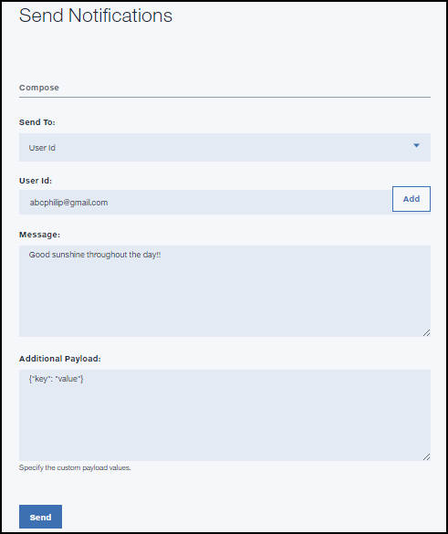

---

copyright:
 years: 2015, 2017

---

{:new_window: target="_blank"}
{:shortdesc: .shortdesc}
{:screen:.screen}
{:codeblock:.codeblock}

# Habilitación de notificaciones basadas en usuarios
{: #user_based_notifications}
Última actualización: 28 de febrero de 2017
{: .last-updated}

Las {{site.data.keyword.mobilepushshort}} basadas en ID de usuario están pensadas para los usuarios de apps móviles con mensajes personalizados. Con las notificaciones basadas en usuarios, puede elegir notificar a individuos específicos según sus preferencias.

## Dispositivo de registro con ID de usuario
{: #register_device_wh_userid}

Para habilitar las notificaciones push destinadas por ID de usuario, asegúrese de registrar el dispositivo con un campo de ID de usuario definido.     

El ID de usuario puede ser cualquier serie que proporcione la aplicación a la API de registro del dispositivo. Normalmente, las aplicaciones móviles primero ejecutan un ciclo de autenticación en el que el usuario de la app móvil se autentica en un servicio de autenticación, como por ejemplo [{{site.data.keyword.amafull}} ](https://console.ng.bluemix.net/docs/services/mobileaccess/index.html){: new_window}. Si la autenticación es correcta, el ID de usuario autenticado se pasa a la API de registro del dispositivo push. 

Para registrarse para la notificación basada en userID, complete los pasos siguientes:

### Android
{: #android-register}

Inicialice la clase MFPPush con las claves `AppGUID` y `clientSecret` del servicio {{site.data.keyword.mobilepushshort}}.
```
// Inicialice el servicio de Notificaciones Push
push = MFPPush.getInstance();
push.initialize(getApplicationContext(),"AppGUID", "clientSecret");
```
	{: codeblock}


- **AppGUID**: Esta es la clave AppGUID del servicio {{site.data.keyword.mobilepushshort}}.
- **clientSecret**: Esta es la clave clientSecret del servicio {{site.data.keyword.mobilepushshort}}.

  Utilice la API **registerDeviceWithUserId** para registrar el dispositivo para {{site.data.keyword.mobilepushshort}}.

```
// Registre el dispositivo en Notificaciones Push
push.registerDeviceWithUserId("userId",new MFPPushResponseListener<String>() {
		@Override
		public void onSuccess(String response) {
		Log.d("Device is registered with Push Service.");}
		@Override
    public void onFailure(MFPPushException ex) {
		  Log.d("Error registering with Push Service...\n"
        + "Push notifications will not be received.");
		}
		});
```
	{: codeblock}

- **userId**: Pase el valor de userId exclusivo para registrarse para {{site.data.keyword.mobilepushshort}}.

**Nota:** para habilitar las {{site.data.keyword.mobilepushshort}} de destino según UserId, asegúrese de que registra el dispositivo con un userId y que también pasa el 'clientSecret' que está asignado cuando se suministran los servicios {{site.data.keyword.mobilepushshort}}. El registro del dispositivo no funcionará si no se proporciona un clientSecret válido.

### Cordova
{: #cordova_register}

Utilice las siguientes API para registrarse para las {{site.data.keyword.mobilepushshort}} basadas en UserId.

```
// Registre el dispositivo para la Notificación Push con UserId
var options = {"userId": "Your User Id value"};
BMSPush.registerDevice(options,success, failure); 
```
	{: codeblock}


- **userId**: Pase el valor de userId exclusivo para registrarse para {{site.data.keyword.mobilepushshort}}.


### Swift
{: #swift-register}

```
// Initialize the BMSPushClient
let push =  BMSPushClient.sharedInstance
push.initializeWithAppGUID("appGUID", clientSecret:"clientSecret")
```
	{: codeblock}


- **AppGUID**: Esta es la clave AppGUID del servicio {{site.data.keyword.mobilepushshort}}.
- **clientSecret**: Esta es la clave clientSecret del servicio {{site.data.keyword.mobilepushshort}}.

Utilice la API **registerWithUserId** para registrar el dispositivo para {{site.data.keyword.mobilepushshort}}.

```
// Registre el dispositivo en el servicio de Notificaciones Push
push.registerWithDeviceToken("deviceToken", WithUserId: "userId")  { (response, statusCode, error) -> Void in
if error.isEmpty {
  print( "Response during device registration : \(response)")
        print( "status code during device registration : \(statusCode)")
    } else {
  print( "Error during device registration \(error) ")
    }
  }
```
	{: codeblock}

- **userId**: Pase el valor de userId exclusivo para registrarse para {{site.data.keyword.mobilepushshort}}.

### Google Chrome, Safari y Mozilla Firefox
{: #web-register}

Utilice las API siguientes para registrarse para las notificaciones basadas en userID. Inicialice el SDK con `app GUID`, `app Region` y `Client Secret`.

```
var bmsPush = new BMSPush();
var params = {
    "appGUID":"push app GUID",
    "appRegion":"App Region",
    "clientSecret":"Push Client Secret" 
    }
  bmsPush.initialize(params, function(response){
          alert(response.response)
    })
```
	{: codeblock}
  
Una vez inicializado correctamente, registre la aplicación web con userID.

```
bmsPush.registerWithUserId("UserId", function(response) {
 alert(response.response)
  })
```
	{: codeblock}

### Apps y extensiones de Google Chrome
{: #web-register-new}

Utilice las API siguientes para registrarse para las notificaciones basadas en userID. Inicialice el SDK con `app GUID`, `app Region` y `Client Secret`.

```
var bmsPush = new BMSPush();
var params = {
    "appGUID":"push app GUID",
    "appRegion":"App Region",
    "clientSecret":"Push Client Secret" 
    }
  bmsPush.initialize(params, function(response){
          alert(response.response)
    })
```
	{: codeblock}
  
Tras la correcta inicialización, debe registrar la aplicación web con el userId.

```
bmsPush.registerWithUserId("UserId", function(response) {
 alert(response.response)
  })
```
	{: codeblock}

## Uso de notificaciones basadas en userId
{: #using_userid}

Las notificaciones basadas en userID son mensajes de notificación que están pensados para un usuario específico. Muchos dispositivos pueden registrarse con un usuario. Los pasos siguientes describen cómo enviar notificaciones basadas en el ID de usuario.

1. Desde el panel de control **Notificación Push**, seleccione la opción **Enviar notificaciones**.
1. Seleccione **UserId** en la lista de opciones **Enviar a**.
1. En el campo **ID de usuario**, busque el ID del usuario que desea utilizar y, a continuación, pulse **+Añadir**.
1. En el campo **Mensaje**, escriba el texto que desea enviar en la notificación.
1. Pulse **Enviar**.


## Sincronización del inicio y cierre de sesión de un usuario 
{: #sync_login_logout}

Puede elegir el envío de notificaciones únicamente si el usuario ha iniciado la sesión. 

Por ejemplo, piense en un dispositivo compartido por los miembros de una familia o por un equipo de trabajo, y habrá necesidad de dirigirse a determinados usuarios. En tal caso práctico, habría una secuencia de inicio y cierre de sesión de usuario. Este mecanismo de autenticación permite que la aplicación efectúe un seguimiento de la identidad del usuario de la aplicación en cuestión. De esta manera, se garantiza que las notificaciones destinadas a un usuario específico lleguen siempre únicamente a dicho usuario. Después de iniciar sesión, invoque la API de registro de dispositivos pasando el ID de usuario del usuario conectado. De la misma manera, antes de cerrar la sesión, invoque la API de eliminación de registro de dispositivos. La secuenciación de estas API push con el inicio y el cierre de sesión garantizará que las notificaciones destinadas a un determinado usuario se envíen únicamente a dicho usuario.
