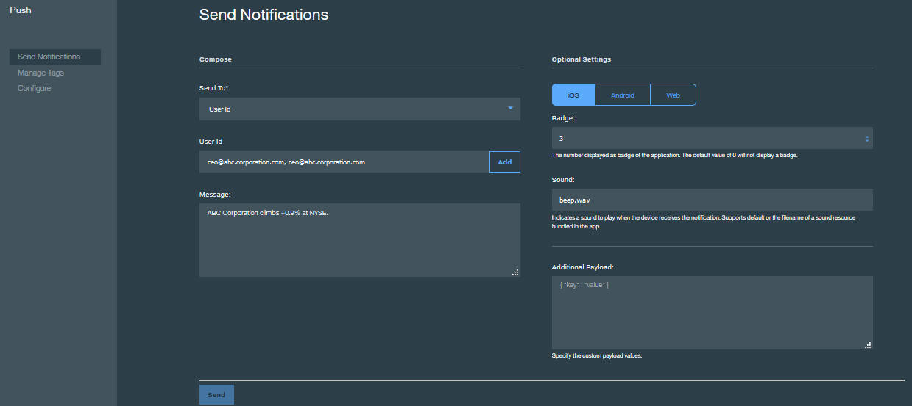

---

copyright:
 years: 2015, 2017

---

{:new_window: target="_blank"}
{:shortdesc: .shortdesc}
{:screen:.screen}
{:codeblock:.codeblock}

# Activation des notifications utilisateur
{: #user_based_notifications}
Dernière mise à jour : 28 février 2017
{: .last-updated}

Les notifications de type {{site.data.keyword.mobilepushshort}} basées sur les utilisateurs sont envoyées vers les utilisateurs d'applications mobiles avec des messages personnalisés. Avec ce type de notifications, vous pouvez choisir de notifier certains individus spécifiques en fonction de leurs préférences.

## Enregistrement de l'appareil avec l'ID utilisateur
{: #register_device_wh_userid}

Pour activer les notifications push ciblées par ID utilisateur, prenez soin d'enregistrer l'appareil avec une zone ID utilisateur définie.     

L'ID utilisateur peut être toute chaîne fournie par l'application à l'API d'enregistrement d'appareil. Généralement, une application mobile exécute d'abord un cycle d'authentification au cours duquel l'utilisateur de l'application mobile s'authentifie auprès d'un service d'authentification tel que [{{site.data.keyword.amafull}} ](https://console.ng.bluemix.net/docs/services/mobileaccess/index.html){: new_window}. Si l'authentification aboutit, l'ID de l'utilisateur authentifié est transféré vers l'API d'enregistrement d'appareil Push. 

Pour procéder à un enregistrement pour une notification à base d'ID utilisateur, procédez comme suit :

### Android
{: #android-register}

Initialisez la classe MFPPush avec l'identificateur `AppGUID` et la clé `clientSecret` du service {{site.data.keyword.mobilepushshort}}.
```
// Initialisation du service de notifications Push
push = MFPPush.getInstance();
push.initialize(getApplicationContext(),"AppGUID", "clientSecret");
```
	{: codeblock}


- **AppGUID** : clé AppGUID du service {{site.data.keyword.mobilepushshort}}.
- **clientSecret** : clé clientSecret du service {{site.data.keyword.mobilepushshort}}.

  Utilisez l'API **registerDeviceWithUserId** pour enregistrer l'appareil pour {{site.data.keyword.mobilepushshort}}.

```
// Enregistrement de l'appareil auprès du service de notifications Push
push.registerDeviceWithUserId("userId",new MFPPushResponseListener<String>() {
		@Override
		public void onSuccess(String response) {
		Log.d("Device is registered with Push Service.");}
		@Override
    public void onFailure(MFPPushException ex) {
		  Log.d("Error registering with Push Service...\n"
        + "Push notifications will not be received.");
		}
		});
```
	{: codeblock}

- **userId** : passe la valeur userId unique pour l'enregistrement de {{site.data.keyword.mobilepushshort}}.

**Remarque : ** pour activer les notifications de type {{site.data.keyword.mobilepushshort}} ciblées par ID utilisateur, prenez soin d'enregistrer l'appareil avec un ID utilisateur et passez aussi la valeur confidentielle clientSecret qui est allouée quand les services {{site.data.keyword.mobilepushshort}} sont provisionnés. L'enregistrement de l'appareil échouera en l'absence d'une valeur clientSecret valide.

### Cordova
{: #cordova_register}

Utilisez les API suivantes pour l'enregistrement des notifications de type {{site.data.keyword.mobilepushshort}} à base d'ID utilisateur.

```
// Enregistrement de l'appareil pour notification push avec l'ID utilisateur
var options = {"userId": "Your User Id value"};
BMSPush.registerDevice(options,success, failure); 
```
	{: codeblock}


- **userId** : passe la valeur userId unique pour l'enregistrement de {{site.data.keyword.mobilepushshort}}.


### Swift
{: #swift-register}

```
// Initialize the BMSPushClient
let push =  BMSPushClient.sharedInstance
push.initializeWithAppGUID("appGUID", clientSecret:"clientSecret")
```
	{: codeblock}


- **AppGUID** : clé AppGUID du service {{site.data.keyword.mobilepushshort}}.
- **clientSecret** : clé clientSecret du service {{site.data.keyword.mobilepushshort}}.

Utilisez l'API **registerWithUserId** pour enregistrer l'appareil pour {{site.data.keyword.mobilepushshort}}.

```
// Enregistrement de l'appareil auprès du service de notifications Push
push.registerWithDeviceToken("deviceToken", WithUserId: "userId")  { (response, statusCode, error) -> Void in
if error.isEmpty {
  print( "Response during device registration : \(response)")
        print( "status code during device registration : \(statusCode)")
    } else {
  print( "Error during device registration \(error) ")
    }
  }
```
	{: codeblock}

- **userId** : passe la valeur userId unique pour l'enregistrement de {{site.data.keyword.mobilepushshort}}.

### Google Chrome, Safari et Mozilla Firefox
{: #web-register}

Utilisez les API suivantes pour l'enregistrement des notifications basées sur des balises. Initialisez le logiciel SDK avec les services `appGUID`, `appRegion` et `clientSecret`.

```
var bmsPush = new BMSPush();
var params = {
    "appGUID":"push app GUID",
    "appRegion":"App Region",
    "clientSecret":"Push Client Secret" 
    }
  bmsPush.initialize(params, function(response){
          alert(response.response)
    })
```
	{: codeblock}
  
Une fois l'initialisation terminée, enregistrez l'application Web avec l'ID utilisateur.

```
bmsPush.registerWithUserId("UserId", function(response) {
 alert(response.response)
  })
```
	{: codeblock}

### Applications et extensions Google Chrome
{: #web-register-new}

Utilisez les API suivantes pour l'enregistrement des notifications basées sur des balises. Initialisez le logiciel SDK avec les services `appGUID`, `appRegion` et `clientSecret`.

```
var bmsPush = new BMSPush();
var params = {
    "appGUID":"push app GUID",
    "appRegion":"App Region",
    "clientSecret":"Push Client Secret" 
    }
  bmsPush.initialize(params, function(response){
          alert(response.response)
    })
```
	{: codeblock}
  
Après la réussite de l'initialisation, vous devez enregistrer l'application Web avec l'userId.

```
bmsPush.registerWithUserId("UserId", function(response) {
 alert(response.response)
  })
```
	{: codeblock}

## Utilisation des notifications basées sur un ID utilisateur
{: #using_userid}

Les notifications basées sur un ID utilisateur sont des messages de notification qui sont ciblés vers un utilisateur spécifique. Plusieurs appareils différents peuvent être enregistrés avec un seul et même utilisateur. La procédure suivante décrit comment envoyer des notifications à base d'ID utilisateur.

1. Dans le tableau de bord **Notifications push**, sélectionnez l'option **Envoyer des notifications**.
1. Sélectionnez **ID utilisateur** dans la liste des options **Envoyer à**.
1. Dans la zone **ID utilisateur**, recherchez l'ID utilisateur dont vous voulez vous servir puis cliquez sur **+Ajouter**.
1. Dans la zone **Message**, entrez le texte que vous voulez envoyer dans votre notification.
1. Cliquez sur **Envoyer**.


## Synchronisation de la connexion et de la déconnexion utilisateur 
{: #sync_login_logout}

Vous pouvez choisir de n'envoyer des notifications que si l'utilisateur est connecté. 

Supposez par exemple qu'un appareil est partagé par les membres d'une même famille ou par une équipe au travail et qu'il est nécessaire de s'adresser uniquement à certains de ces utilisateurs. Dans un tel cas, il y aura une séquence de connexion/déconnexion. Ce mécanisme d'authentification permet à l'application d'effectuer un suivi de l'identité de l'utilisateur actuel de l'application, ce qui garantit que les notifications envoyées à un utilisateur spécifique ne sont toujours reçues que par cet utilisateur uniquement. Une fois la connexion effectuée, invoquez l'API d'enregistrement d'appareil en passant l'ID utilisateur de l'utilisateur connecté. De la même façon, avant de vous déconnecter, appelez l'API de désenregistrement de l'appareil. Le séquencement de ces API Push avec les opérations de connexion et de déconnexion garantit que les notifications destinées à un utilisateur spécifique ne sont envoyées qu'à cet utilisateur uniquement.
