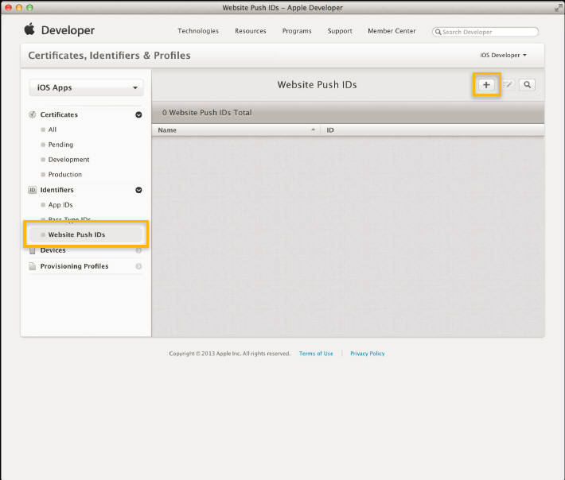

---

copyright:
 years: 2015, 2017

---

{:new_window: target="_blank"}
{:shortdesc: .shortdesc}
{:screen:.screen}
{:codeblock:.codeblock}

# Configuration des données d'identification pour un fournisseur de notification
{: #create-push-credentials}
Dernière mise à jour : 12 avril 2017
{: .last-updated}

Pour configurer le service {{site.data.keyword.mobilepushshort}}, procurez-vous les données d'identification auprès de votre fournisseur de notifications push, qui peut être le service FCM (Firebase Cloud Messaging) ou le service APN (Apple Push Notification), pour les appareils mobiles. 

Vous pouvez configurer {{site.data.keyword.mobilepushshort}} à l'aide du tableau de bord **IBM Bluemix Services** ou des [API REST ](https://mobile.{DomainName}/imfpush/){: new_window}.

## Configuration des données d'identification pour le service FCM
{: #create-push-enable-gcm}

FCM (Firebase Cloud Messaging) est la passerelle utilisée pour distribuer les notifications push aux périphériques Android et Google
Chrome. FCM est la nouvelle version de GCM (Google Cloud Messaging). Pour configurer le service {{site.data.keyword.mobilepushshort}} sur le tableau de
bord, vous devez obtenir vos données d'identification FCM. Prenez soin d'utiliser les configurations FCM pour les nouvelles applications. Les appli existantes continueraient à fonctionner avec les configurations GCM.

### Obtention de votre ID d'émetteur et de la clé d'API
{: #android-senderid-apikey}

La clé d'API est stockée de façon sécurisée et utilisée par le service {{site.data.keyword.mobilepushshort}} pour la connexion au serveur FCM. L'ID d'émetteur (numéro de projet) est utilisé par le logiciel SDK Android et le logiciel SDK JS pour Google Chrome et Mozilla Firefox côté client. 

Pour configurer FCM, générez la clé d'API et l'ID d'émetteur en procédant comme suit :

1. Accédez à la [Console Firebase](https://console.firebase.google.com/?pli=1){: new_window}.
2. Sélectionnez **Créer un projet**. 
3. Dans la fenêtre Créer un projet, fournissez un nom de projet, choisissez un pays/région puis cliquez sur **Créer un projet**.
3. Dans le panneau de navigation, cliquez sur l'icône des paramètres et sélectionnez **Paramètres du projet**.
4. Choisissez l'onglet Cloud Messaging pour générer la clé de serveur de l'API et l'ID de l'expéditeur.

### Configuration du service Push Notifications pour les applications Android et pour les applications et extensions Google Chrome
{: #setup-push-android}

**Remarque :** vous aurez besoin de votre clé d'API FCM/GCM et de votre ID d'émetteur (numéro de projet).

1. Ouvrez votre tableau de bord Bluemix puis cliquez sur l'instance de service {{site.data.keyword.mobilepushfull}} que vous avez créée pour ouvrir le tableau de bord. Le tableau de bord Push s'affiche. Pour configurer un service {{site.data.keyword.mobilepushshort}}  non lié pour Android, sélectionnez l'icône relative au service {{site.data.keyword.mobilepushshort}} non lié pour ouvrir le tableau de bord du service {{site.data.keyword.mobilepushshort}}. 

2. Cliquez sur le bouton **Configurer Push** pour configurer les données d'identification FCM/GCM pour les applications Android et pour les applications et extensions Google Chrome.
3. Sur la page **Configuration**, pour Android, accédez à l'onglet **Mobile** et configurez l'ID d'émetteur (numéro de projet CGM) et la clé d'API. Pour les applications et extensions Google Chrome, accédez à l'onglet **Web** et configurez l'ID d'émetteur (numéro de projet FCM/GCM) et la clé d'API de façon appropriée.
4. Cliquez sur **Sauvegarder**.
5. Etapes suivantes. [Activation des notifications pour Android](c_enable_push.html) ou [Activation des notifications pour les applications et extensions Google Chrome](c_web_extensions.html).

## Configuration des données d'identification pour le service APNS
{: #create-push-credentials-apns}

Apple Push Notification Service (APNS) permet aux développeurs d'applications d'envoyer des notifications distantes depuis l'instance de service {{site.data.keyword.mobilepushshort}} dans Bluemix (le fournisseur) à des applications et des appareils iOS. Les messages sont envoyés à une application cible sur l'appareil. 

Procurez-vous des données d'identification APNS et configurez-les. Les certificats APNS sont gérés de façon sécurisée par le service {{site.data.keyword.mobilepushshort}} et utilisés pour la connexion au serveur APNS en tant que fournisseur.

<!-- 1. Obtain an [Apple Developers ](https://developer.apple.com/){: new_window} account.-->

<!--2. [Register an App ID](#create-push-credentials-apns-register)
3. [Create a development and distribution APNs SSL certificate](#create-push-credentials-apns-ssl)
4. [Create a development provisioning profile](#create-push-credentials-dev-profile)
5. [Create a store distribution provisioning profile](#create-push-credentials-apns-distribute_profile)
6. [Creating .p12 push certificate file for Bluemix push](#create-p12-push-certificate-file-for-Bluemix-push)
7. [Set up APNs on the Push Dashboard](#create-push-credentials-apns-dashboard)
-->

### Enregistrement d'un ID d'appli
{: #create-push-credentials-apns-register}

L'ID d'application (l'identificateur de bundle) est un identificateur unique identifiant une application spécifique. Chaque application requiert un ID d'application. Les services tels que le service {{site.data.keyword.mobilepushshort}} sont configurés avec l'ID d'application.

1. Vérifiez que vous disposez bien d'un compte [Apple Developers ](https://developer.apple.com/){: new_window}.
2. Accédez au portail [Apple Developer ](https://developer.apple.com){: new_window}, cliquez sur **Member Center**, puis sélectionnez **Certificates, Identifiers & Profiles**.
3. Accédez à la section **Registering App IDs** dans la bibliothèque [Apple Developer Library ](https://developer.apple.com/library/mac/documentation/IDEs/Conceptual/AppDistributionGuide/MaintainingProfiles/MaintainingProfiles.html#//apple_ref/doc/uid/TP40012582-CH30-SW991){: new_window}, et suivez les instructions d'enregistrement de l'ID d'application.

Lorsque vous enregistrez un ID d'application, sélectionnez les options suivantes :

* Push Notifications

* Suffixe d'ID explicite

4. Création d'un certificat SSL APNS pour le développement et la distribution

### Création d'un certificat SSL APNS pour le développement et la distribution
{: #create-push-credentials-apns-ssl}

Pour pouvoir obtenir un certificat APNS, vous devez d'abord générer une demande de signature de certificat et la soumettre à Apple, l'autorité de certification. La demande de signature de certificat contient des informations qui identifient votre société, ainsi que votre clé publique et votre clé privée que vous utilisez pour signer vos notifications push Apple. Ensuite, générez le certificat SSL dans le portail des développeurs iOS. Le certificat, avec sa clé publique et sa clé privée, est stocké dans Keychain Access.

<!-- ###Before you begin -->
<!-- {: before-you-begin-certificate} -->

<!--[Register an App ID](#create-push-credentials-apns-register)-->

Vous pouvez utiliser APNS dans deux modes : 

* Mode bac à sable pour le développement et le test.
* Mode production lors de la distribution des applications via l'App Store (ou d'autres mécanismes de distribution d'entreprise).

Vous devez vous procurer des certificats distincts pour vos environnements de développement et de distribution. Les certificats sont associés à un ID d'application pour l'application qui est le destinataire des notifications distantes. Pour la production, vous pouvez créer jusqu'à deux certificats. Bluemix utilise les certificats afin d'établir une connexion SSL à APNS.

<!-- Create a development and distribution SSL certificate. -->

1. Accédez au site Web [Apple Developer ](https://developer.apple.com){: new_window}, cliquez sur **Member Center**, puis sélectionnez **Certificates, Identifiers & Profiles**.
2. Dans la zone **Identifiers**, cliquez sur **App IDs**.
3. Dans la liste des ID d'application, sélectionnez votre ID d'application <!--newly created--> puis choisissez **Settings**.
4. Dans la zone **Push Notifications**, créez un certificat SSL de développement, puis un certificat SSL de production.

	

5. Quand l'écran **About Creating a Certificate Signing Request (CSR)** s'affiche, démarrez l'application **Keychain Access** sur votre Mac afin de créer une demande de signature de certificat.
6. Dans le menu, sélectionnez **Keychain Access > Certificate Assistant > Request a Certificate From a Certificate Authority…** 
7. Dans **Certificate Information**, entrez l'adresse électronique qui est associée à votre compte App Developer et un nom usuel. Attribuez un nom significatif qui permet d'identifier s'il s'agit d'un certificat pour le développement (bac à sable) ou pour la distribution (production), *certificat_apns_bacAsable* ou *certificat_apns_production*, par exemple.
8. Sélectionnez **Save to disk** pour télécharger le fichier `.certSigningRequest` sur votre bureau puis cliquez s ur **Continue**.
9. Dans l'option de menu **Save As**, attribuez un nom au fichier `.certSigningRequest` puis cliquez sur **Save**.
10. Cliquez sur **Done**. A présent, vous possédez une demande de signature de certificat.
11. Revenez à la fenêtre **About Creating a Certificate Signing Request (CSR)** puis cliquez sur **Continue**. 
12. Dans l'écran **Generate**, cliquez sur **Choose File...** et sélectionnez le fichier de demande de signature de certificat que vous avez sauvegardé sur votre bureau. Ensuite, cliquez sur **Generate**.
	
13. Lorsque votre certificat est prêt, cliquez sur **Done**.
14. Sur l'écran **Push Notifications**, cliquez sur **Download** pour télécharger votre certificat, puis cliquez sur **Done**. 
	
15. Sur votre Mac, accédez à **Keychain Access > My Certificates** et localisez le certificat que vous venez d'installer. Cliquez deux fois sur le certificat pour l'installer dans Keychain Access.
16. Sélectionnez le certificat et la clé privée puis sélectionnez **Export** pour convertir le certificat au format d'échange d'informations personnelles (format .`.p12`).
	
17. Dans la zone **Save As**, donnez au certificat un nom parlant, `certificat_p12.apns_bacAsable` ou `certificat_p12.apns_production`, par exemple, puis cliquez sur **Save**.
	
18. Dans la zone **Enter a password**, entrez un mot de passe pour protéger les éléments exportés, puis cliquez sur **OK**. Vous pouvez utiliser ce mot de passe pour configurer vos paramètres APNS dans le tableau de bord Push.{: #step18}
	
19. **Key Access.app** vous invite à exporter votre clé depuis l'écran **Keychain**. Entrez le mot de passe administrateur pour votre Mac afin de permettre au système d'exporter ces éléments puis sélectionnez l'option **Always Allow**. Un certificat `.p12` est généré sur votre bureau.

### Création d'un profil de mise à disposition pour le développement
{: #create-push-credentials-dev-profile}

Le profil de mise à disposition est utilisé conjointement avec l'ID d'application pour déterminer quels sont les appareils qui peuvent installer et exécuter votre application et quels sont les services auxquels votre application peut accéder. Pour chaque ID d'application, vous créez deux profils de mise à disposition : un pour le développement et un pour la distribution. Xcode utilise le profil de mise à disposition pour le développement afin de déterminer quels sont les développeurs qui sont autorisés à construire l'application et quels sont les appareils qui peuvent être testés avec l'application.

Prenez soin d'enregistrer un ID d'application, de l'activer pour le service {{site.data.keyword.mobilepushshort}} et de le configurer pour utiliser un certificat SSL APNS à des fins de développement et de production.

Créez un profil de mise à disposition pour le développement, comme suit :

1. Accédez au portail [Apple Developer ](https://developer.apple.com){: new_window}, cliquez sur **Member Center**, puis sélectionnez **Certificates, Identifiers & Profiles**.
2. Accédez à la bibliothèque [Mac Developer Library ](https://developer.apple.com/library/mac/documentation/IDEs/Conceptual/AppDistributionGuide/MaintainingProfiles/MaintainingProfiles.html#//apple_ref/doc/uid/TP40012582-CH30-SW62site){: new_window}, défilez jusqu'à la section **Creating Development Provisioning Profiles** et suivez les instructions de création d'un profil de développement.
**Remarque** : Lorsque vous configurez un profil de mise à disposition pour le développement, sélectionnez les options suivantes :
	* **iOS App Development**
	* **For iOS and watchOS apps **

### Création d'un profil de mise à disposition pour la distribution dans un magasin
{: #create-push-credentials-apns-distribute_profile}

Utilisez le profil de mise à disposition dans un magasin afin de soumettre votre application pour la distribution dans l'App Store.

1. Accédez au portail [Apple Developer ](https://developer.apple.com){: new_window}, cliquez sur **Member Center**, puis sélectionnez **Certificates, Identifiers & Profiles**.
2. Cliquez deux fois sur le profil de mise à disposition téléchargé afin de l'installer dans Xcode.

### Configuration du service APNS (Apple Push Notification Service) sur le tableau de bord Push Notifications
{: #create-push-credentials-apns-dashboard}

Afin d'utiliser le service {{site.data.keyword.mobilepushshort}} pour envoyer des notifications, téléchargez les certificats SSL requis pour Apple Push Notification Service (APNS). Vous pouvez également utiliser l'API REST pour télécharger un certificat APNS.

<!-- Get your development and production APNs SSL certificate and the password associated with each type of certificate. For information, see Creating and configuring push credentials for APNs.-->

Les certificats requis pour un APNS sont des certificats `.p12`. Ils contiennent la clé privée et les certificats SSL requis pour construire et publier votre application. Vous devez générer les certificats depuis le Member Center du site Web Apple Developer (pour lequel un compte Apple Developer valide est requis). Des certificats distincts sont requis pour l'environnement de développement (bac à sable) et l'environnement de production (distribution).

**Remarque** : une fois le fichier `.cer` dans votre accès à la chaîne de certificats, exportez-le sur votre ordinateur pour créer un certificat `.p12`.

Pour plus d'information sur l'utilisation du service APNS, reportez-vous au manuel [iOS Developer Library: Local and Push Notification Programming Guide ](https://developer.apple.com/library/ios/documentation/NetworkingInternet/Conceptual/RemoteNotificationsPG/Chapters/ProvisioningDevelopment.html#//apple_ref/doc/uid/TP40008194-CH104-SW4){: new_window}.

Pour configurer des APN sur le tableau de bord des services de notification push, procédez comme suit :

1. Sélectionnez **Configurer** sur le tableau de bord des services de notifications push.
2. Sélectionnez l'option **Mobile** pour mettre à jour les informations dans le formulaire **Données d'identification push APNS**.
3. Sélectionnez **Bac à sable** (développement) ou **Production** (distribution) selon le cas, puis téléchargez le certificat `p.12` que vous avez créé à l'[étape](#step18) précédente.
  
3. Dans la zone **Mot de passe**, entrez le mot de passe qui est associé au fichier de certificat `.p12`, puis cliquez sur **Sauvegarde**.

Une fois les certificats téléchargés avec un mot de passe valide, vous pouvez commencer à envoyer des notifications.

## Configuration des données d'identification pour les navigateurs Web
{: #configure-credential-for-browsers}

Le service IBM {{site.data.keyword.mobilepushshort}} étend désormais les capacités d'envoi de notifications à votre navigateur. 

L'URL ou le nom de domaine de votre site Web sont requis par le service {{site.data.keyword.mobilepushshort}} pour identifier les demandes devant
être autorisées. Une instance de service {{site.data.keyword.mobilepushshort}} ne prend en charge qu'un seul nom de domaine à la fois. Par conséquent,
prenez soin de définir la même valeur pour Chrome, Firefox et Safari. 

Les navigateurs Chrome et Safari requièrent une configuration supplémentaire pour les notifications push sur le Web. Vous aurez besoin d'une clé d'API
FCM vu qu'un noeud final est utilisé pour distribuer des messages dans Chrome. 

### Configuration pour notification push Web sur Chrome et Firefox 
{: #config-chrome-firefox}

1. Dans le panneau du tableau de bord Push, sélectionnez **Configurer**.
2. Sélectionnez l'onglet Web.
	
3. Configurez la clé d'API FCM/GCM et l'URL de votre site Web qui sera enregistré pour recevoir les notifications push.
4. Cliquez sur **Sauvegarder**.
5. Etapes suivantes. [Activation des notifications pour les navigateurs Google Chrome et Mozilla Firefox](c_chrome_firefox_enable.html).

### Configuration pour notification push Web sur Safari 
{: #configure-safari}

La version prise en charge du service {{site.data.keyword.mobilepushshort}} sur Safari est la version 10.0. Vous devez générer un certificat via votre
compte Apple Developer avant de pouvoir configurer votre navigateur pour recevoir des notifications.

#### Génération d'un certificat
{: #certificate-generation}

Assurez-vous que vous disposez d'un compte Développeur Apple. Vous devez enregistrer un ID push du site web et générer un certificat afin de configurer votre navigateur Safari pour la réception des notifications. Les étapes suivantes vous aideront à démarrer.

1. Dans le centre des membres développeurs Apple, cliquez sur **Certificates, ID & Profiles**. 
2. Cliquez sur **Identifiers**, puis sur **Website Push IDs**.
3. Choisissez de créer une nouvelle entrée en sélectionnant l'icône plus.
  

4. Dans le panneau Register Website Push ID, indiquez une description et un identificateur d'ID Push de site Web appropriés. Il est recommandé d'utiliser un format de nom de domaine inverse, en commençant par `web`. Exemple : `web.com.example.dailyweatherreports`.
5. Enregistrez l'ID Push de site Web. Vous disposez à présent de votre ID Push de site Web 
6. Sélectionnez **Editer** pour créer un certificat à utiliser pour l'ID Push de site Web.
7. Dans la fenêtre Certificate Assistant de Certificate Information, indiquez votre ID de courrier électronique et un nom usuel. N'indiquez pas l'adresse de courrier électronique de l'autorité de certification.
8. Cliquez sur **Save to disk** et sélectionnez **Continue**.
9. Choisissez d'enregistrer le certificat dans un dossier approprié.
10. Sélectionnez la demande `.certSigningRequest` créée sur le disque à l'invite par l'assistant de générer le certificat. Prenez soin de télécharger le certificat push de site Web créé au format `.cer`.
11. Ouvrez le certificat dans l'outil KeyChain Access. Cliquez sur le bouton droit de la souris et exportez-le en tant que certificat p12. Notez le mot de passe fourni lors de la génération du certificat p12.

#### Configuration pour notifications
{: #configuration-notification}
 
Après avoir généré le certificat, vous devez configurer le service pour envoyer des notifications à Safari. 

Procédez comme suit :

1. Dans le tableau de bord du service Push Notifications, **cliquez sur Configurer**. 
2. Sélectionnez l'onglet Web. 
3. Dans la section Safari Push, mettez à jour le formulaire avec les informations requises. 
	- **Nom du site web **: nom que vous avez indiqué dans le centre de notification.
	- **ID push du site web **: mettez à jour cette zone avec la chaîne de domaine inverse pour votre ID push de site Web. Par exemple, web.com.example.www.
	- **URL du site Web **: indiquez l'URL du site Web à abonner pour les notifications push. Par exemple, https://www.example.com.
	- **Domaines autorisés **: ce paramètre est facultatif. Il s'agit de la liste des sites Web qui réclament une permission de l'utilisateur. Vérifiez que les URL sont des valeurs séparées par des virgules. Notez que la valeur de l'URL de site Web sera utilisée si cette liste n'est pas fournie. 
	- **Chaîne de format de l'URL **: URL à résoudre lors d'un clic sur la notification. Par exemple, ["https://www.example.com"]. L'URL doit utiliser le schéma http ou https.
	- **Certificat push web Safari **: téléchargez le certificat .p12 et fournissez le mot de passe.
4. Cliquez sur **Sauvegarder**.	

	

Vous avez effectué la configuration pour envoyer des notifications push au navigateur Safari.
