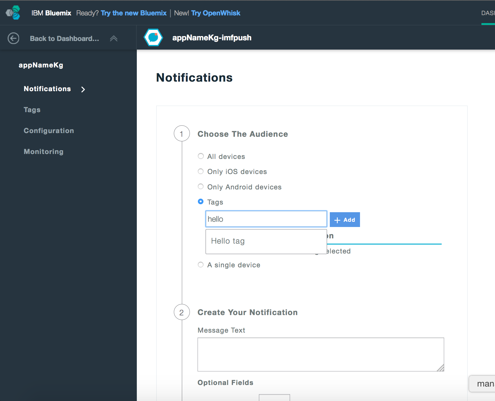

---

copyright:
 years: 2015, 2016

---

# Installation du logiciel SDK Push du client à l'aide de Gradle
{: #android_install}

Cette section explique comment installer et utiliser le logiciel SDK Push du client afin de développer davantage vos applications Android.

Le logiciel SDK Push de Bluemix Mobile Services peut être ajouté à l'aide de Gradle. Gradle télécharge automatiquement des artefacts depuis des référentiels et les met à la disposition de votre application Android. Assurez-vous de configurer correctement Android Studio et le logiciel SDK Android Studio. Pour plus d'informations sur la configuration de votre système,
voir [Android Studio Overview](https://developer.android.com/tools/studio/index.html). Pour plus d'informations sur Gradle, voir [Configuring Gradle Builds](http://developer.android.com/tools/building/configuring-gradle.html).

1. Dans Android Studio, après avoir créé et ouvert une application mobile, ouvrez le fichier **build.gradle** de votre application. Ensuite, ajoutez les dépendances suivantes à votre application mobile. Ces instructions d'importation sont requises pour les fragments de code :

	```
	import com.ibm.mobilefirstplatform.clientsdk.android.core.api.BMSClient;
	import com.ibm.mobilefirstplatform.clientsdk.android.push.api.MFPPush;
	import com.ibm.mobilefirstplatform.clientsdk.android.push.api.MFPPushException;
	import com.ibm.mobilefirstplatform.clientsdk.android.push.api.MFPPushResponseListener;
	import com.ibm.mobilefirstplatform.clientsdk.android.push.api.MFPPushNotificationListener;
	import com.ibm.mobilefirstplatform.clientsdk.android.push.api.MFPSimplePushNotification;
	```


1. Ajoutez les dépendances ci-après à votre application mobile. Les lignes suivantes ajoutent le logiciel SDK Push du client Bluemix Mobile Services et le logiciel SDK des services Google Play à vos dépendances de compilation :

	```
	dependencies {
	  compile 'com.ibm.mobilefirstplatform.clientsdk.android:push:1.+'
	  compile 'com.google.android.gms:play-services:7.8.0'
	}  
	```
1. Dans le fichier **AndroidManifest.xml**, ajoutez les droits ci-dessous. Pour afficher un exemple de manifeste, voir le [modèle d'application Android helloPush](https://github.com/ibm-bluemix-mobile-services/bms-samples-android-hellopush/blob/master/helloPush/app/src/main/AndroidManifest.xml). Pour afficher un exemple de fichier Gradle, voir l'[exemple de fichier de génération Gradle](https://github.com/ibm-bluemix-mobile-services/bms-samples-android-hellopush/blob/master/helloPush/app/build.gradle).

	```
	<uses-permission android:name="android.permission.INTERNET"/>
	<uses-permission android:name="com.ibm.clientsdk.android.app.permission.C2D_MESSAGE" />
	<uses-permission android:name="com.google.android.c2dm.permission.RECEIVE" />
	<uses-permission android:name="android.permission.WAKE_LOCK" />
	<uses-permission android:name="android.permission.GET_ACCOUNTS" />
	<uses-permission android:name="android.permission.USE_CREDENTIALS" />
	<uses-permission android:name="android.permission.WRITE_EXTERNAL_STORAGE" />
	<uses-permission android:name="android.permission.ACCESS_WIFI_STATE"/>
	```

	Vous trouverez davantage d'informations sur les [droits Android](http://developer.android.com/guide/topics/security/permissions.html) ici.

1. Ajoutez les paramètres d'intention de notification pour l'activité. Ce paramètre démarre l'application lorsque l'utilisateur clique sur la
notification reçue dans la zone de notification.

	```
	<intent-filter>  
		<action android:name="<Your_Android_Package_Name.IBMPushNotification"/>   
		<category  android:name="android.intent.category.DEFAULT"/>
	</intent-filter>
	```
	**Remarque** : Remplacez *Your_Android_Package_Name* dans l'action ci-dessus par le nom du package d'applications utilisé dans votre application.

1. Ajoutez le service d'intention Google Cloud Messaging (GCM) et des filtres d'intention pour les notifications d'événements RECEIVE.

	```
	service android:name="com.ibm.mobilefirstplatform.clientsdk.android.push.api.MFPPushIntentService" />

	<receiver
	    android:name="com.ibm.mobilefirstplatform.clientsdk.android.push.internal.MFPPushBroadcastReceiver"
	    android:permission="com.google.android.c2dm.permission.SEND">
	    <intent-filter>
	        <action android:name="com.google.android.c2dm.intent.RECEIVE" />

	        <category android:name="com.ibm.mobilefirstplatform.clientsdk.android.app" />
	    </intent-filter>
	    <intent-filter>
	        <action android:name="android.intent.action.BOOT_COMPLETED" />

	        <category android:name="com.ibm.mobilefirstplatform.clientsdk.android.app" />
	    </intent-filter>
	</receiver>
	```


# Initialisation du logiciel SDK Push pour les applis Android
{: #android_initialize}

Le code d'initialisation se trouve généralement dans la méthode onCreate de l'activité principale de votre application Android.

Cliquez sur le lien **Options pour application mobile** dans le tableau de bord de votre application Bluemix pour obtenir la route et l'identificateur global unique de l'application. Utilisez ces valeurs pour vos paramètres de route et d'identificateur global unique d'application. Modifiez le fragment de code pour qu'il utilise les paramètres appRoute et appGUID de votre appli Bluemix.


##Initialisation du logiciel SDK de base

```
// Initialize the SDK for Java (Android) with IBM Bluemix AppGUID and route
BMSClient.getInstance().initialize(getApplicationContext(), "applicationRoute","applicationGUID", bluemixRegion:"Location where your app Hosted");
```


**appRoute**

Spécifie la route qui a été affectée à l'application serveur que vous avez créée dans Bluemix.

**AppGUID**

Spécifie la clé unique qui a été affectée à l'application que vous avez créée dans Bluemix. Cette
valeur est sensible à la casse.

**bluemixRegionSuffix**

Indique l'emplacement où l'application est hébergée. Vous pouvez utiliser l'une des trois valeurs suivantes :

- BMSClient.REGION_US_SOUTH
- BMSClient.REGION_UK
- BMSClient.REGION_SYDNEY

##Initialisation du logiciel SDK Push du client

```
//Initialize client Push SDK for Java
MFPPush push = MFPPush.getInstance();
push.initialize(getApplicationContext());
```


# Enregistrement d'appareils Android
{: #android_register}

Utilisez l'API `IMFPush.register()` pour enregistrer l'appareil auprès d'un service de notifications push. Pour enregistrer des appareils Android, vous devez entrer au préalable des informations GCM (Google Cloud Messaging) dans le tableau de bord de configuration du service Push Bluemix. Pour plus d'informations, voir [Configuration de données d'identification pour Google Cloud Messaging](t_push_provider_android.html).

Copiez et collez les fragments de code suivants dans votre application mobile Android :

```
	//Enregistrement d'appareils Android
	push.register(new MFPPushResponseListener<String>() {
	    @Override
	    public void onSuccess(String deviceId) {
	           //Traitement de réussite
	    }
	    @Override
	    public void onFailure(MFPPushException ex) {
	    //Traitement d'échec éventuel
	    }
	});
```

```
	//Traitement de la notification à son arrivée
	MFPPushNotificationListener notificationListener = new MFPPushNotificationListener() {
	    @Override
	    public void onReceive (final MFPSimplePushNotification message){
	      // Traitement de la notification push
	    }
	};
```


# Réception de notifications push sur des appareils Android
{: #android_receive}

Pour enregistrer l'objet notificationListener auprès de Push, appelez la méthode **MFPPush.listen()**. En général, elle est appelée depuis la
méthode **onResume()** de l'activité qui traite les notifications push.

1. Pour enregistrer l'objet notificationListener auprès de Push, appelez la méthode **listen()**. En général, elle est appelée depuis la
méthode **onResume()** de l'activité qui traite les notifications push.

	```
	@Override
	protected void onResume(){
	   super.onResume();
	   if(push != null) {
	       push.listen(notificationListener);
	   }
	}
	```
2. Générez le projet et exécutez-le sur l'appareil ou l'émulateur. Lorsque la méthode onSuccess() pour le programme d'écoute des réponses dans la méthode register() est appelée, cela signifie que l'appareil a été enregistré auprès de Push. A ce stade, vous pouvez envoyer un message comme décrit dans la rubrique Envoi de notifications push de base.
3. Vérifiez que vos appareils ont reçu votre notification. Si l'application se trouve au premier-plan, la notification est traitée par **MFPPushNotificationListener**. Si elle se trouve en arrière-plan, un message est affiché dans la barre de notification.


# Envoi de notifications push de base

{: #push-send-notifications}

Une fois que vous avez développé vos applications, vous pouvez envoyer des notifications push de base (sans utiliser de balise, de badge, de
contenu supplémentaire ou de fichier son).


Envoi de notifications push de base.

1. Dans **Sélectionner les utilisateurs concernés**, sélectionnez l'une des options suivantes : **Tous les terminaux**, ou par plateforme : **Les appareils iOS uniquement** ou **Les appareils Android uniquement**.

	**Remarque** : Lorsque vous sélectionnez l'option **Tous les terminaux**, tous les appareils qui ont été abonnés à des notifications push reçoivent votre notification.

	

2. Dans la zone **Créez votre notification**, entrez votre message, puis cliquez sur **Envoyer**.
3. Vérifiez que vos appareils ont reçu votre notification.

	La capture d'écran suivante présente une boîte d'alerte relative à une notification push s'exécutant au premier plan sur un appareil Android et iOS.
	

	

	La capture d'écran suivante présente une notification push qui s'exécute en arrière-plan sur un appareil Android.
	


# Etapes suivantes
{: #next_steps_tags}

Une fois que vous avez configuré les notifications de base, vous pouvez configurer des notifications basées sur des balises et des options
avancées.

Ajoutez ces fonctions du service de notifications push à votre application.
Pour utiliser des notifications basées sur les balises, voir [Notifications basées sur les balises](c_tag_basednotifications.html).
Pour utiliser des options de notification avancées, voir [Notifications push avancées](t_advance_notifications.html).
