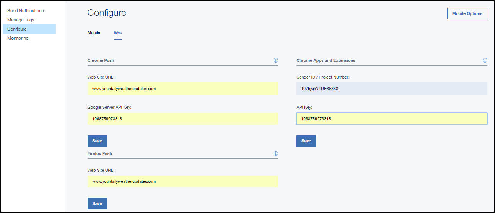

---

copyright:
 years: 2015, 2017

---

{:new_window: target="_blank"}
{:shortdesc: .shortdesc}
{:screen:.screen}
{:codeblock:.codeblock}

# Configurazione delle credenziali per un provider di notifica
{: #create-push-credentials}
Ultimo aggiornamento: 12 aprile 2017
{: .last-updated}

Per configurare il servizio {{site.data.keyword.mobilepushshort}}, ottieni le credenziali richieste dal tuo provider di notifiche di push: FCM (Firebase Cloud Messaging) o APNs (Apple Push Notification service) per i dispositivi mobili. 

Puoi configurare {{site.data.keyword.mobilepushshort}} utilizzando il Dashboard **IBM Bluemix Services** o mediante le [API REST ](https://mobile.{DomainName}/imfpush/){: new_window}.

## Configurazione delle credenziali per FCM
{: #create-push-enable-gcm}

FCM (Firebase Cloud Messaging) è il gateway utilizzato per consegnare le notifiche di push ai dispositivi Android e a Google Chrome. FCM è la nuova versione di GCM (Google Cloud Messaging). Per configurare il servizio {{site.data.keyword.mobilepushshort}} sul dashboard, devi ottenere le tue credenziali FCM. Assicurati di utilizzare le configurazioni FCM per le nuove applicazioni. Le applicazioni esistenti continueranno a funzionare con le configurazioni GCM.

### Come ottenere il tuo ID mittente e la chiave API
{: #android-senderid-apikey}

La chiave API è archiviata in modo protetto e utilizzata dal servizio {{site.data.keyword.mobilepushshort}} per stabilire una connessione al server FCM e l'ID mittente (numero progetto) viene utilizzato dall'SDK Android e dall'SDK JS per Google Chrome e Mozilla Firefox sul lato client. 

Per configurare FCM, generare la chiave API e l'ID mittente, completa la seguente procedura:

1. Visita il sito [Firebase Console ](https://console.firebase.google.com/?pli=1){: new_window}.
2. Seleziona **Create new project**. 
3. Nella finestra Create a project, fornisci un nome progetto, scegli una regione/paese e fai clic su **Create project**.
3. Nel pannello di navigazione, fai clic sull'icona delle impostazioni e seleziona **Project settings**.
4. Scegli la scheda Cloud Messaging per generare la chiave API server e un ID mittente.

### Configurazione del servizio Push Notification per Android e per le estensioni e le applicazioni Chrome
{: #setup-push-android}

**Nota:** ti serviranno i tuoi chiave API FCM/GCM e ID mittente (numero progetto).

1. Apri il tuo dashboard Bluemix e fai quindi clic sull'istanza del servizio {{site.data.keyword.mobilepushfull}} che hai creato, per aprire il dashboard. Viene visualizzato il dashboard Push. Per configurare un servizio {{site.data.keyword.mobilepushshort}} senza binding per Android, selezione l'icona del servizio {{site.data.keyword.mobilepushshort}} senza binding per aprire il dashboard del servizio {{site.data.keyword.mobilepushshort}}. 

2. Fai clic sul pulsante **Setup Push** per configurare le credenziali FCM/GCM per le applicazioni Android e per le estensioni e applicazioni Google Chrome.
3. Nella pagina **Configuration**, per Android, vai alla scheda **Mobile** e configura l'ID mittente (numero progetto GCM) e la chiave API. Per le estensioni e applicazioni Google Chrome, vai alla scheda **Web** e configura l'ID mittente (numero progetto FCM/GCM) e la chiave API in modo appropriato.
4. Fai clic su **Save**.
5. Fasi successive. [Abilitazione delle notifiche per Android](c_enable_push.html) o [Abilitazione delle notifiche per le estensioni & applicazioni Google Chrome](c_web_extensions.html).

## Configurazione delle credenziali per APNs
{: #create-push-credentials-apns}

Il servizio APNS (Apple Push Notification Service) consente agli sviluppatori dell'applicazione di inviare notifiche remote dall'istanza del servizio {{site.data.keyword.mobilepushshort}} su Bluemix (il provider) alle applicazioni e ai dispositivi iOS. I messaggi sono inviati a un'applicazione di destinazione sul dispositivo. 

Ottieni e
        configura le tue credenziali APNS. I certificati APNS sono gestiti in modo sicuro dal servizio {{site.data.keyword.mobilepushshort}} e utilizzati per stabilire una connessione al server APNs come un provider.

<!-- 1. Obtain an [Apple Developers ](https://developer.apple.com/){: new_window} account.-->

<!--2. [Register an App ID](#create-push-credentials-apns-register)
3. [Create a development and distribution APNs SSL certificate](#create-push-credentials-apns-ssl)
4. [Create a development provisioning profile](#create-push-credentials-dev-profile)
5. [Create a store distribution provisioning profile](#create-push-credentials-apns-distribute_profile)
6. [Creating .p12 push certificate file for Bluemix push](#create-p12-push-certificate-file-for-Bluemix-push)
7. [Set up APNs on the Push Dashboard](#create-push-credentials-apns-dashboard)
-->

### Registrazione di un ID applicazione
{: #create-push-credentials-apns-register}

L'ID applicazione (l'identificativo del bundle) è un identificativo univoco che identifica una specifica
             applicazione. Ogni applicazione richiede un ID applicazione. I servizi come {{site.data.keyword.mobilepushshort}} sono configurati sull'ID applicazione.

1. Assicurati di disporre di un account [Apple Developers ](https://developer.apple.com/){: new_window}.
2. Vai al portale [Apple Developer ](https://developer.apple.com){: new_window}, fai clic su **Member Center** e seleziona **Certificates, Identifiers & Profiles**.
3. Vai alla sezione **Registering App IDs** nella [Apple Developer Library ](https://developer.apple.com/library/mac/documentation/IDEs/Conceptual/AppDistributionGuide/MaintainingProfiles/MaintainingProfiles.html#//apple_ref/doc/uid/TP40012582-CH30-SW991){: new_window} e segui le istruzioni per registrare l'ID applicazione.

Quando registri un ID applicazione, seleziona le seguenti opzioni:

* Push Notifications

* Explicit ID Suffix

4. Crea un certificato SSL di APNS di sviluppo e distribuzione.

### Crea un certificato SSL di APNS di sviluppo e distribuzione
{: #create-push-credentials-apns-ssl}

Prima di ottenere un certificato APNs, devi generare una CSR (certificate signing request) e inoltrarla ad Apple, l'autorità di certificazione (CA). La CSR contiene informazioni che identificano la tua società e la tua chiave pubblica e privata che usi per firmare le tue notifiche di push Apple. Genera quindi il certificato SSL
            nel portale per sviluppatori iOS. Il certificato, insieme alla sua chiave pubblica e a quella privata,
             viene archiviato in Keychain Access.

<!-- ###Before you begin -->
<!-- {: before-you-begin-certificate} -->

<!--[Register an App ID](#create-push-credentials-apns-register)-->

Puoi utilizzare le APNs in due modi: 

* Modalità sandbox per lo sviluppo e il test.
* Modalità produzione quando si distribuiscono le applicazioni tramite l'App Store (o altri meccanismi di distribuzione aziendali).

Devi ottenere dei certificati separati per gli ambienti di sviluppo e
                    distribuzione. I certificati sono associati a un ID applicazione per l'applicazione
                    destinataria delle notifiche remote. per la produzione, è possibile creare fino a
                    due certificati. Bluemix utilizza i certificati per stabilire una connessione SSL
                    con APNS.

<!-- Create a development and distribution SSL certificate. -->

1. Vai al sito web [Apple Developer ](https://developer.apple.com){: new_window}, fai clic su **Member Center** e seleziona **Certificates, Identifiers & Profiles**.
2. Nell'area **Identifiers**, fai clic su **App
                            IDs**.
3. Dall'elenco di ID applicazione, seleziona il tuo ID applicazione <!--newly created--> e seleziona quindi **Settings**.
4. Nell'area **Push Notifications**, crea un certificato SSL di sviluppo e quindi
                        un certificato SSL di produzione.

	

5. Quando viene visualizzata la **schermata About Creating a Certificate Signing Request (CSR)**, avvia l'applicazione **Keychain Access** nel tuo Mac per creare una CSR (Certificate Signing Request).
6. Dal menu, seleziona **Keychain Access > Certificate Assistant > Request a Certificate From a Certificate Authority…** 
7. In **Certificate Information**, immetti l'indirizzo email che è associato al tuo account di sviluppatore di applicazioni e un nome comune. Fornisci un nome significativo che ti aiuta a identificare se si tratta di un certificato per lo sviluppo (sandbox) o la distribuzione (produzione); ad esempio, *sandbox-apns-certificate* o *production-apns-certificate*.
8. Seleziona **Save to disk** per scaricare il file `.certSigningRequest` sul tuo desktop e fai quindi clic su **Continue**.
9. Nell'opzione del menu **Save As**, denomina il file `.certSigningRequest` e fai clic su **Save**.
10. Fai clic su **Done**. Ora hai una CSR.
11. Ritorna nella finestra **About Creating a Certificate Siging Request (CSR)** e fai clic su **Continue**. 
12. Dalla schermata **Generate**, fai clic su **Choose
                            File ... **e seleziona il file CSR che avevi salvato sul tuo
                        desktop. Fai quindi clic su **Generate**.
	
13. Quando il tuo certificato è pronto, fai clic su **Done**.
14. Sulla schermata **Push Notifications**, fai clic su **Download** per scaricare il tuo certificato e fai quindi clic su **Done**. 
	
15. Sul tuo Mac, vai a **Keychain Access > My Certificates**, e individua il certificato appena installato. Fai doppio clic sul certificato per installarlo in Keychain Access.
16. Seleziona il certificato (certificate) e la chiave privata (private key) e seleziona quindi **Export** per convertire il certificato nel formato Personal Information Exchange (formato `.p12`).
	
17. Nel campo **Save As**, dai al certificato un nome significativo. Ad esempio, `sandbox_apns.p12_certifcate` o `production_apns.p12` e fai quindi clic su **Save**.
	
18. Nel campo **Enter a password**, immetti una password per proteggere gli elementi esportati e fai quindi clic su **OK**. Puoi utilizzare questa password per configurare le tue impostazioni APNS sul dashboard Push.{: #step18}
	
19. **Key Access.app** ti chiede di esportare la tua chiave dalla schermata **Keychain**. Immetti la tua password amministrativa per il tuo Mac per consentire al tuo sistema di esportare questi elementi e seleziona quindi l'opzione **Always Allow**. Sul tuo desktop viene generato un certificato `.p12`.

### Creazione di profilo di provisioning di sviluppo
{: #create-push-credentials-dev-profile}

Il profilo di provisioning utilizza l'ID applicazione per determinare quali sono
            i dispositivi su cui può essere installata ed eseguita la tua applicazione e quali sono
            i servizi a cui la tua applicazione può accedere. Per ogni ID applicazione, crei
            due profili di provisioning: uno per lo sviluppo e l'altro per la distribuzione. Xcode utilizza il profilo di provisioning di sviluppo per determinare quali sono
            gli sviluppatori a cui è consentito creare l'applicazione e quali sono i dispositivi
            di cui è consentita l'esecuzione di test sull'applicazione.

Assicurati di aver registrato un ID applicazione, di averlo abilitato per il servizio {{site.data.keyword.mobilepushshort}} e di averlo configurato per utilizzare un certificato SSL APNs di sviluppo e produzione.

Crea un profilo di provisioning di sviluppo nel seguente modo:

1. Vai al portale [Apple Developer ](https://developer.apple.com){: new_window}, fai clic su **Member Center** e seleziona **Certificates, Identifiers & Profiles**.
2. Vai alla [Mac Developer Library ](https://developer.apple.com/library/mac/documentation/IDEs/Conceptual/AppDistributionGuide/MaintainingProfiles/MaintainingProfiles.html#//apple_ref/doc/uid/TP40012582-CH30-SW62site){: new_window} , scorri fino alla sezione **Creating Development Provisioning Profiles** e segui le istruzioni per creare un profilo di sviluppo.
**Nota**: quando configuri un profilo di provisioning di sviluppo, seleziona le seguenti opzioni:
	* **iOS App Development**
	* **For iOS and watchOS apps **

### Creazione di un profilo di provisioning di distribuzione di archivio
{: #create-push-credentials-apns-distribute_profile}

Utilizza il profilo di provisioning di archivio per inoltrare la tua applicazione per la distribuzione all'App Store.

1. Vai al portale [Apple Developer ](https://developer.apple.com){: new_window}, fai clic su **Member Center** e seleziona **Certificates, Identifiers & Profiles**.
2. Fai doppio clic sul file di provisioning scaricato per installarlo in Xcode.

### Configurazione APNS sul dashboard Notifica di push
{: #create-push-credentials-apns-dashboard}

Per utilizzare il servizio {{site.data.keyword.mobilepushshort}} per inviare notifiche, carica i certificati SSL richiesti per APNS (Apple Push Notification Service). Puoi inoltre utilizzare l'API REST per caricare un certificato APNS.

<!-- Get your development and production APNs SSL certificate and the password associated with each type of certificate. For information, see Creating and configuring push credentials for APNs.-->

I certificati richiesti per APNs sono i certificati `.p12`. Questi certificati contengono i certificati di chiave privata e SSL richiesti per creare e pubblicare la tua applicazione. Devi generare i certificati dal Member Center del sito Web Apple
                    Developer (per il quale è richiesto un account Apple Developer
                valido). Sono richiesti dei certificati separati per l'ambiente di sviluppo (sandbox) e
                    l'ambiente di produzione (distribuzione).

**Nota**: dopo che il file `.cer` è presente nel tuo accesso alla catena di chiavi, eseguine l'esportazione sul tuo computer per creare un certificato `.p12`.

Per ulteriori informazioni sull'utilizzo di APNs, vedi [iOS Developer Library: Local and Push Notification Programming Guide ](https://developer.apple.com/library/ios/documentation/NetworkingInternet/Conceptual/RemoteNotificationsPG/Chapters/ProvisioningDevelopment.html#//apple_ref/doc/uid/TP40008194-CH104-SW4){: new_window}.

Per configurare APNS sul dashboard dei servizi Push Notification, completa la procedura:

1. Seleziona **Configure** nel dashboard dei servizi Push Notification.
2. Scegli l'opzione **Mobile** per aggiornare le informazioni nel formato **APNs Push Credentials**.
3. Seleziona **Sandbox** (sviluppo) o **Production** (distribuzione) come appropriato e e quindi carica il certificato `p.12` che hai creato utilizzando il precedente [passo](#step18).
  
3. Nel campo **Password**, immetti la password associata al file di certificato `.p12` e quindi fai clic su **Save**.

Dopo che i certificati sono
                     stati caricati correttamente con una password valida, puoi iniziare a inviare notifiche.

## Configurazione delle credenziali per i browser Web
{: #configure-credential-for-browsers}

Il servizio IBM {{site.data.keyword.mobilepushshort}} ora estende le funzionalità per inviare le notifiche al tuo browser. 

L'URL o il nome dominio del tuo sito Web è richiesto dal servizio {{site.data.keyword.mobilepushshort}} per identificare le richieste che devono essere consentite. Un'istanza del servizio {{site.data.keyword.mobilepushshort}} supporta un solo nome dominio alla volta. Pertanto, assicurati che sia impostato lo stesso valore per Chrome, Firefox e Safari. 

I browser Chrome e Safari richiedono una configurazione aggiuntiva per il push web. Avrai bisogno di una chiave API FCM in quanto viene utilizzato un endpoint FCM per consegnare i messaggi in Chrome. 

### Configurazione del push web per Chrome e Firefox 
{: #config-chrome-firefox}

1. Nel pannello del dashboard Push, seleziona **Configure**.
2. Seleziona la scheda Web.
	
3. Configura la chiave API FCM/GCM e l'URL del tuo sito web che sarà registrato per ricevere le notifiche push.
4. Fai clic su **Save**.
5. Fasi successive. [Abilitazione delle notifiche per i browser Google Chrome e Mozilla Firefox](c_chrome_firefox_enable.html).

### Configurazione del push web per Safari 
{: #configure-safari}

La versione supportata per il servizio {{site.data.keyword.mobilepushshort}} su Safari è la 10.0. Prima di poter configurare il tuo browser per la ricezione delle notifiche, devi generare un certificato tramite il tuo account Apple Developer.

#### Generazione di un certificato
{: #certificate-generation}

Assicurati di disporre in un account Apple Developer. Hai bisogno di registrare un ID push sito web e generare un certificato per configurare il tuo browser Safari per ricevere le notifiche. La seguente procedura ti aiuterà ad iniziare.

1. Nel Apple Developer Member center, fai clic su **Certificates, ID & Profiles**. 
2. Fai clic su **Identifiers** e quindi su **Website Push IDs**.
3. Scegli di creare una nuova voce selezionando l'icona più.
  

4. Nel pannello Register Website Push ID, fornisci un ID identificativo e una descrizione Website Push ID appropriati. Ti raccomandiamo che sia nel formato del nome a dominio inverso e che inizi con `web`. Ad esempio: `web.com.example.dailyweatherreports`.
5. Registra l'ID push sito web. Ora hai un ID push sito web. 
6. Seleziona **Edit** per creare un certificato da utilizzare per l'ID push sito web.
7. Nella finestra Certificate Assistant per Certificate Information, fornisci il tuo indirizzo email e un nome comune. Lascia l'indirizzo email Certificate Authority vuoto.
8. Fai clic su **Save to disk** e seleziona **Continue**.
9. Scegli di salvare il certificato in una cartella appropriata.
10. Scegli il `.certSigningRequest` creato sul disco quando ti viene richiesto nella procedura guidata di creazione del certificato. Assicurati di scaricare il certificato di push sito web creato nel formato `.cer`.
11. Apri il certificato nello strumento KeyChain Access. Fai clic con il tasto destro del mouse ed esportalo come certificato p12. Annota la password fornita durante la generazione del certificato p12.

#### Configurazione per le notifiche
{: #configuration-notification}
 
Dopo aver generato il certificato, puoi configurare il servizio per l'invio di notifiche a Safari. 

Completa la procedura:

1. Nel dashboard del servizio Push Notifications, fai clic su **Configure**. 
2. Seleziona la scheda Web. 
3. Nella sezione Safari Push, aggiorna il modulo con le informazioni richieste. 
	- **Website Name**: il nome che hai fornito nel centro di notifica.
	- **Website Push ID**: aggiorna con la stringa reverse-domain per il tuo ID push sito web. Ad esempio, web.com.example.www.
	- **Website URL**: fornisci l'URL del sito web da sottoscrivere alle notifiche di push. Ad esempio, https://www.example.com.
	- **Allowed Domains**: parametro facoltativo. Indica l'elenco di siti web che richiedono l'autorizzazione dall'utente. Assicurati che gli URL siano valori separati da virgola. Se non si fornisce questo valore, verrà utilizzato quello specificato in Website URL. 
	- **URL Format String**: l'URL da risolvere quando si fa clic sulla notifica. Ad esempio, ["https://www.example.com"]. Assicurati che l'URL utilizzi lo schema http o https.
	- **Safari web push certificate**: carica il certificato .p12 e fornisci la password.
4. Fai clic su **Save**.	

	

Il servizio è ora configurato per l'invio di notifiche di push al browser Safari.
